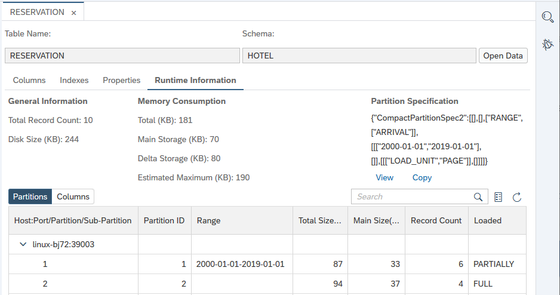
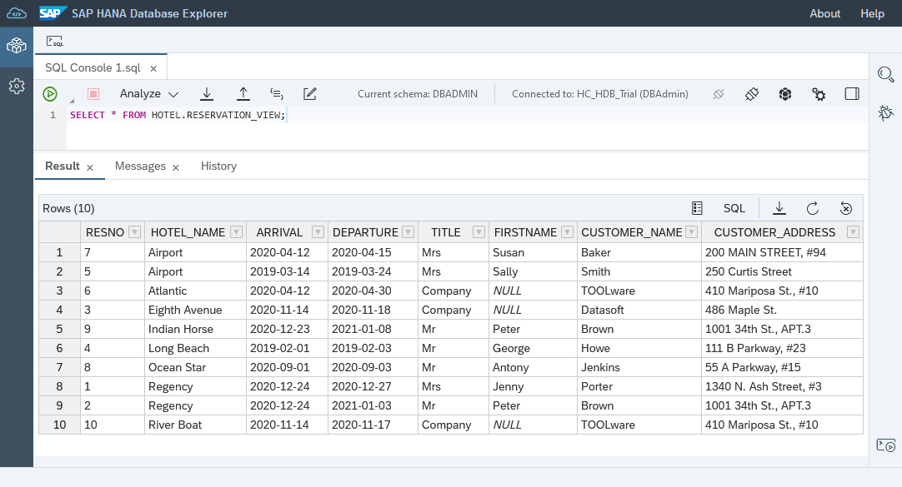

## Prerequisites
  - An SAP HANA database such as SAP HANA Cloud trial or the SAP HANA, express edition that includes the SAP HANA database explorer

## Details
### You will learn
  - How to create tables and import data using insert statements
  - How to create views, functions, and stored procedures

The following steps will create sample objects for a hotel database using create and insert statements.  The next tutorial will demonstrate some of the ways these objects can be exported or imported.

---

[ACCORDION-BEGIN [Step 1: ](Create a user and schema)]

1. In the SAP HANA database explorer, select the previously created SAP HANA Cockpit or SAP HANA database and open a SQL console.  Do not use the HDI container.

    

2. Create two users.

    ```SQL
    CREATE USER USER1 PASSWORD Password1 no force_first_password_change;
    CREATE USER USER2 PASSWORD Password2 no force_first_password_change;
    ```

    > With SAP HANA Cloud, HANA database, if the DBAdmin user has privileges on more than one USERGROUP, then it must be specified which USERGROUP USER1 and USER2 will be added to as shown below.

    >```SQL
    CREATE USER USER1 PASSWORD Password1 no force_first_password_change SET USERGROUP DEFAULT;
    CREATE USER USER2 PASSWORD Password2 no force_first_password_change SET USERGROUP DEFAULT;
    >```

    >---

    For additional detail on creating users see [CREATE USER Statement (Access Control)](https://help.sap.com/viewer/c1d3f60099654ecfb3fe36ac93c121bb/latest/en-US/20d5ddb075191014b594f7b11ff08ee2.html). Note that the user USER1 will be used in tutorial 5 and tutorial 7 of this tutorial group.

3. The list of users can be seen by executing the following statement:

    ```SQL
    SELECT USER_NAME FROM USERS;
    ```

4. Create a schema named `HOTEL`.  A schema provides a way to group database objects together.  Privileges can be assigned to users directly (commented line below) or a better practice is to assign users to a role that has a set of privileges which is shown in the next step.

    ```SQL
    CREATE SCHEMA HOTEL;
    --GRANT ALL PRIVILEGES ON SCHEMA HOTEL TO USER1;
    ```

    >The following statement deletes the schema and objects it contains if you wish to remove the schema after completing the tutorials.
    >
    >```SQL
    DROP SCHEMA HOTEL CASCADE;
    >```

    For additional details see [CREATE SCHEMA Statement](https://help.sap.com/viewer/c1d3f60099654ecfb3fe36ac93c121bb/cloud/en-US/20d4ecad7519101497d192700ce5f3df.html).

5.  Create two roles, assign privileges to the roles, and assign users to the roles.

    ```SQL
    CREATE ROLE HOTEL_ADMIN;
    CREATE ROLE HOTEL_READER;

    GRANT ALL PRIVILEGES ON SCHEMA HOTEL TO HOTEL_ADMIN;
    GRANT SELECT ON SCHEMA HOTEL TO HOTEL_READER;

    GRANT HOTEL_ADMIN TO USER1;
    GRANT HOTEL_READER TO USER2;
    ```

    >An example follows showing the privileges.

    >```SQL
    CREATE TABLE HOTEL.TEST(
      myValue VARCHAR(50)
    );
    >
    --USER1 has all privileges on the HOTEL schema
    CONNECT USER1 PASSWORD Password1;
    INSERT INTO HOTEL.TEST VALUES('Value1'); --succeeds
    SELECT * FROM HOTEL.TEST; --succeeds
    >
    --USER2 can only select
    CONNECT USER2 PASSWORD Password2;
    SELECT * FROM HOTEL.MAINTENANCE; --succeeds
    INSERT INTO HOTEL.TEST VALUES('Value2'); --fails
    CONNECT DBADMIN PASSWORD myPassword;
    >
    --Remove the unused table, role and user
    DROP TABLE HOTEL.TEST;
    DROP ROLE HOTEL_READER;
    DROP USER USER2;
    >```

    For additional details see [CREATE Role Statement](https://help.sap.com/viewer/c1d3f60099654ecfb3fe36ac93c121bb/latest/en-US/20d4a23b75191014a182b123906d5b16.html) and [Managing SAP HANA Users](https://help.sap.com/viewer/f9c5015e72e04fffa14d7d4f7267d897/latest/en-US/ed7af17e5ae14de694d9bee5f35098f4.html).  Users and roles can also be managed in the SAP HANA Cloud Cockpit.

    

[DONE]
[ACCORDION-END]

[ACCORDION-BEGIN [Step 2: ](Create and populate tables)]
1. Create tables that represent a basic hotel administration system by running the SQL statements below:

    ```SQL
    CREATE COLUMN TABLE HOTEL.HOTEL(
      hno INTEGER PRIMARY KEY,
      name VARCHAR(50) NOT NULL,
      address VARCHAR(40) NOT NULL,
      city VARCHAR(30) NOT NULL,
      state VARCHAR(2) NOT NULL,
      zip VARCHAR(6)
    );
    CREATE COLUMN TABLE HOTEL.ROOM(
      hno INTEGER,
      type VARCHAR(6),
      free NUMERIC(3),
      price NUMERIC(6, 2),
      PRIMARY KEY (hno, type),
      FOREIGN KEY (hno) REFERENCES HOTEL.HOTEL
    );
    CREATE COLUMN TABLE HOTEL.CUSTOMER(
      cno INTEGER PRIMARY KEY,
      title VARCHAR(7),
      firstname VARCHAR(20),
      name VARCHAR(40) NOT NULL,
      address VARCHAR(40) NOT NULL,
      zip VARCHAR(6)
    );
    CREATE COLUMN TABLE HOTEL.RESERVATION(
      resno INTEGER NOT NULL GENERATED BY DEFAULT AS IDENTITY,
      rno INTEGER NOT NULL,
      cno INTEGER,
      hno INTEGER,
      type VARCHAR(6),
      arrival DATE NOT NULL,
      departure DATE NOT NULL,
      PRIMARY KEY (
        "RESNO", "ARRIVAL"
      ),
      FOREIGN KEY(hno) REFERENCES HOTEL.HOTEL,
      FOREIGN KEY(cno) REFERENCES HOTEL.CUSTOMER
    );
    CREATE COLUMN TABLE HOTEL.MAINTENANCE(
      mno INTEGER PRIMARY KEY,
      hno INTEGER,
      description VARCHAR(100),
      date_performed DATE,
      performed_by VARCHAR(40)
    );
    ```

    > To find the newly created tables in the database browser, select the Tables folder and set the schema to **HOTEL**.  If needed, the contents of the database browser can be updated by pressing the refresh button.
    >
    >


2. Execute the following SQL statements to add data into the tables in the `HOTEL` schema.

    ```SQL
    INSERT INTO HOTEL.HOTEL VALUES(10, 'Congress', '155 Beechwood St.', 'Seattle', 'WA', '20005');
    INSERT INTO HOTEL.HOTEL VALUES(11, 'Regency', '477 17th Avenue', 'Seattle', 'WA', '20037');
    INSERT INTO HOTEL.HOTEL VALUES(12, 'Long Island', '1499 Grove Street', 'Long Island', 'NY', '11788');
    INSERT INTO HOTEL.HOTEL VALUES(13, 'Empire State', '65 Yellowstone Dr.', 'Albany', 'NY', '12203');
    INSERT INTO HOTEL.HOTEL VALUES(14, 'Midtown', '12 Barnard St.', 'New York', 'NY', '10019');
    INSERT INTO HOTEL.HOTEL VALUES(15, 'Eighth Avenue', '112 8th Avenue', 'New York', 'NY', '10019');
    INSERT INTO HOTEL.HOTEL VALUES(16, 'Lake Michigan', '354 OAK Terrace', 'Chicago', 'IL', '60601');
    INSERT INTO HOTEL.HOTEL VALUES(17, 'Airport', '650 C Parkway', 'Rosemont', 'IL', '60018');
    INSERT INTO HOTEL.HOTEL VALUES(18, 'Sunshine', '200 Yellowstone Dr.', 'Clearwater', 'FL', '33575');
    INSERT INTO HOTEL.HOTEL VALUES(19, 'Beach', '1980 34th St.', 'Daytona Beach', 'FL', '32018');
    INSERT INTO HOTEL.HOTEL VALUES(20, 'Atlantic', '111 78th St.', 'Deerfield Beach', 'FL', '33441');
    INSERT INTO HOTEL.HOTEL VALUES(21, 'Long Beach', '35 Broadway', 'Long Beach', 'CA', '90804');
    INSERT INTO HOTEL.HOTEL VALUES(22, 'Indian Horse', '16 MAIN STREET', 'Palm Springs', 'CA', '92262');
    INSERT INTO HOTEL.HOTEL VALUES(23, 'Star', '13 Beechwood Place', 'Hollywood', 'CA', '90029');
    INSERT INTO HOTEL.HOTEL VALUES(24, 'River Boat', '788 MAIN STREET', 'New Orleans', 'LA', '70112');
    INSERT INTO HOTEL.HOTEL VALUES(25, 'Ocean Star', '45 Pacific Avenue', 'Atlantic City', 'NJ', '08401');
    INSERT INTO HOTEL.HOTEL VALUES(26, 'Bella Ciente', '1407 Marshall Ave', 'Longview', 'TX', '75601');

    INSERT INTO HOTEL.ROOM VALUES(10, 'single', 20, 135.00);
    INSERT INTO HOTEL.ROOM VALUES(10, 'double', 45, 200.00);
    INSERT INTO HOTEL.ROOM VALUES(12, 'single', 10, 70.00);
    INSERT INTO HOTEL.ROOM VALUES(12, 'double', 13, 100.00);
    INSERT INTO HOTEL.ROOM VALUES(13, 'single', 12, 45.00);
    INSERT INTO HOTEL.ROOM VALUES(13, 'double', 15, 80.00);
    INSERT INTO HOTEL.ROOM VALUES(14, 'single', 20, 85.00);
    INSERT INTO HOTEL.ROOM VALUES(14, 'double', 35, 140.00);
    INSERT INTO HOTEL.ROOM VALUES(15, 'single', 50, 105.00);
    INSERT INTO HOTEL.ROOM VALUES(15, 'double', 230, 180.00);
    INSERT INTO HOTEL.ROOM VALUES(15, 'suite', 12, 500.00);
    INSERT INTO HOTEL.ROOM VALUES(16, 'single', 10, 120.00);
    INSERT INTO HOTEL.ROOM VALUES(16, 'double', 39, 200.00);
    INSERT INTO HOTEL.ROOM VALUES(16, 'suite', 20, 500.00);
    INSERT INTO HOTEL.ROOM VALUES(17, 'single', 4, 115.00);
    INSERT INTO HOTEL.ROOM VALUES(17, 'double', 11, 180.00);
    INSERT INTO HOTEL.ROOM VALUES(18, 'single', 15, 90.00);
    INSERT INTO HOTEL.ROOM VALUES(18, 'double', 19, 150.00);
    INSERT INTO HOTEL.ROOM VALUES(18, 'suite', 5, 400.00);
    INSERT INTO HOTEL.ROOM VALUES(19, 'single', 45, 90.00);
    INSERT INTO HOTEL.ROOM VALUES(19, 'double', 145, 150.00);
    INSERT INTO HOTEL.ROOM VALUES(19, 'suite', 60, 300.00);
    INSERT INTO HOTEL.ROOM VALUES(20, 'single', 11, 60.00);
    INSERT INTO HOTEL.ROOM VALUES(20, 'double', 24, 100.00);
    INSERT INTO HOTEL.ROOM VALUES(21, 'single', 2, 70.00);
    INSERT INTO HOTEL.ROOM VALUES(21, 'double', 10, 130.00);
    INSERT INTO HOTEL.ROOM VALUES(22, 'single', 34, 80.00);
    INSERT INTO HOTEL.ROOM VALUES(22, 'double', 78, 140.00);
    INSERT INTO HOTEL.ROOM VALUES(22, 'suite', 55, 350.00);
    INSERT INTO HOTEL.ROOM VALUES(23, 'single', 89, 160.00);
    INSERT INTO HOTEL.ROOM VALUES(23, 'double', 300, 270.00);
    INSERT INTO HOTEL.ROOM VALUES(23, 'suite', 100, 700.00);
    INSERT INTO HOTEL.ROOM VALUES(24, 'single', 10, 125.00);
    INSERT INTO HOTEL.ROOM VALUES(24, 'double', 9, 200.00);
    INSERT INTO HOTEL.ROOM VALUES(24, 'suite', 78, 600.00);
    INSERT INTO HOTEL.ROOM VALUES(25, 'single', 44, 100.00);
    INSERT INTO HOTEL.ROOM VALUES(25, 'double', 115, 190.00);
    INSERT INTO HOTEL.ROOM VALUES(25, 'suite', 6, 450.00);

    INSERT INTO HOTEL.CUSTOMER VALUES(1000, 'Mrs', 'Jenny', 'Porter', '1340 N. Ash Street, #3', '10580');
    INSERT INTO HOTEL.CUSTOMER VALUES(1001, 'Mr', 'Peter', 'Brown', '1001 34th St., APT.3', '48226');
    INSERT INTO HOTEL.CUSTOMER VALUES(1002, 'Company', NULL, 'Datasoft', '486 Maple St.', '90018');
    INSERT INTO HOTEL.CUSTOMER VALUES(1003, 'Mrs', 'Rose', 'Brian', '500 Yellowstone Drive, #2', '75243');
    INSERT INTO HOTEL.CUSTOMER VALUES(1004, 'Mrs', 'Mary', 'Griffith', '3401 Elder Lane', '20005');
    INSERT INTO HOTEL.CUSTOMER VALUES(1005, 'Mr', 'Martin', 'Randolph', '340 MAIN STREET, #7', '60615');
    INSERT INTO HOTEL.CUSTOMER VALUES(1006, 'Mrs', 'Sally', 'Smith', '250 Curtis Street', '75243');
    INSERT INTO HOTEL.CUSTOMER VALUES(1007, 'Mr', 'Mike', 'Jackson', '133 BROADWAY APT. 1', '45211');
    INSERT INTO HOTEL.CUSTOMER VALUES(1008, 'Mrs', 'Rita', 'Doe', '2000 Humboldt St., #6', '97213');
    INSERT INTO HOTEL.CUSTOMER VALUES(1009, 'Mr', 'George', 'Howe', '111 B Parkway, #23', '75243');
    INSERT INTO HOTEL.CUSTOMER VALUES(1010, 'Mr', 'Frank', 'Miller', '27 5th St., 76', '95054');
    INSERT INTO HOTEL.CUSTOMER VALUES(1011, 'Mrs', 'Susan', 'Baker', '200 MAIN STREET, #94', '90018');
    INSERT INTO HOTEL.CUSTOMER VALUES(1012, 'Mr', 'Joseph', 'Peters', '700 S. Ash St., APT.12', '92714');
    INSERT INTO HOTEL.CUSTOMER VALUES(1013, 'Company', NULL, 'TOOLware', '410 Mariposa St., #10', '20019');
    INSERT INTO HOTEL.CUSTOMER VALUES(1014, 'Mr', 'Antony', 'Jenkins', '55 A Parkway, #15', '20903');

    INSERT INTO HOTEL.RESERVATION VALUES(1, 100, 1000, 11, 'single', '2020-12-24', '2020-12-27');
    INSERT INTO HOTEL.RESERVATION VALUES(2, 110, 1001, 11, 'double', '2020-12-24', '2021-01-03');
    INSERT INTO HOTEL.RESERVATION VALUES(3, 120, 1002, 15, 'suite', '2020-11-14', '2020-11-18');
    INSERT INTO HOTEL.RESERVATION VALUES(4, 130, 1009, 21, 'single', '2019-02-01', '2019-02-03');
    INSERT INTO HOTEL.RESERVATION VALUES(5, 150, 1006, 17, 'double', '2019-03-14', '2019-03-24');
    INSERT INTO HOTEL.RESERVATION VALUES(6, 140, 1013, 20, 'double', '2020-04-12', '2020-04-30');
    INSERT INTO HOTEL.RESERVATION VALUES(7, 160, 1011, 17, 'single', '2020-04-12', '2020-04-15');
    INSERT INTO HOTEL.RESERVATION VALUES(8, 170, 1014, 25, 'suite', '2020-09-01', '2020-09-03');
    INSERT INTO HOTEL.RESERVATION VALUES(9, 180, 1001, 22, 'double', '2020-12-23', '2021-01-08');
    INSERT INTO HOTEL.RESERVATION VALUES(10, 190, 1013, 24, 'double', '2020-11-14', '2020-11-17');

    INSERT INTO HOTEL.MAINTENANCE VALUES(10, 24, 'Replace pool liner and pump', '2019-03-21', 'Discount Pool Supplies');
    INSERT INTO HOTEL.MAINTENANCE VALUES(11, 25, 'Renovate the bar area.  Replace TV and speakers', '2020-11-29', 'TV and Audio Superstore');
    INSERT INTO HOTEL.MAINTENANCE VALUES(12, 26, 'Roof repair due to storm', null, null);
    ```

    For additional details see [CREATE Table statement](https://help.sap.com/viewer/c1d3f60099654ecfb3fe36ac93c121bb/cloud/en-US/20d58a5f75191014b2fe92141b7df228.html) and [Insert Statement](https://help.sap.com/viewer/c1d3f60099654ecfb3fe36ac93c121bb/cloud/en-US/20f7f70975191014a76da70c9181720e.html).

    >Note that the identifiers such as table names are automatically upper cased unless they are within "".  
    >
    ```SQL
    SELECT * FROM HoTeL.RoOm;  --succeeds
    SELECT * FROM "HoTeL"."RoOm"; --fails
    SELECT * FROM "HOTEL"."ROOM"; --succeeds
    ```

    >For further details, consult [Identifiers and case sensitivity](https://help.sap.com/viewer/c1d3f60099654ecfb3fe36ac93c121bb/latest/en-US/209f5020751910148fd8fe88aa4d79d9.html?q=case#loio209f5020751910148fd8fe88aa4d79d9__identifiers_case).

[DONE]
[ACCORDION-END]


[ACCORDION-BEGIN [Step 3: ](Create a partition)]

Partitions can be created to divide the data in a large table into smaller parts.  

1. Execute the following SQL statement to create one partition that contains older reservations and one that contains reservations made in 2019 or later.  

    ```SQL
    alter table HOTEL.RESERVATION partition by range(ARRIVAL)
    ((
        partition '2000-01-01' <= VALUES < '2019-01-01',
        partition others
    ));
    ```

    In the example in this section, older reservation data will be stored on disk rather than in memory.  Other reasons for partitioning include load balancing across multiple hosts and the 2 billion row size limit on a non-partitioned table.  For more details see [Table Partitioning](https://help.sap.com/viewer/f9c5015e72e04fffa14d7d4f7267d897/cloud/en-US/c2ea130bbb571014b024ffeda5090764.html) and [SAP Note: 2044468 - FAQ: SAP HANA Partitioning](https://launchpad.support.sap.com/#/notes/2044468).

2. Execute the following SQL to make the partition containing older reservations  loadable from disk using [Native Storage Extensions (NSE)](https://help.sap.com/viewer/f9c5015e72e04fffa14d7d4f7267d897/cloud/en-US/786c621dd35e4534a2f955bf2f04a2e2.html).

    ```SQL
    alter table HOTEL.RESERVATION ALTER PARTITION 1 PAGE LOADABLE;
    ```

    The partition information can be seen in the **Runtime Information** tab of the reservation table, which can be shown by right-clicking on the reservation table and choosing **Open**.

    

    The following select statement shows the load unit type of columns in the schema HOTEL.

    ```SQL
    SELECT TABLE_NAME, PART_ID, COLUMN_NAME, LOAD_UNIT FROM M_CS_COLUMNS where schema_Name = 'HOTEL';
    ```

    

    Notice above that the partition 1 (containing older reservations) is page loadable and partition 2 (containing recent reservations) is column loadable.  

For further information see [Reduce the Memory Footprint Using Page-Loadable Columns](https://help.sap.com/viewer/f9c5015e72e04fffa14d7d4f7267d897/cloud/en-US/786c621dd35e4534a2f955bf2f04a2e2.html) and SAP Note: [2799997 - FAQ: SAP HANA Native Storage Extension (NSE)](https://launchpad.support.sap.com/#/notes/2799997).  

Another option for data that is accessed less frequently is the SAP HANA Data Lake.  Additional information on when to use Native Store Extensions and Data Lake can be found at [Introduction to SAP HANA Cloud - Storage Options](https://help.sap.com/viewer/db19c7071e5f4101837e23f06e576495/cloud/en-US/7a27607b08ba46d5b253365e703b1c1a.html#loio7a27607b08ba46d5b253365e703b1c1a__section_storage_options).


[DONE]
[ACCORDION-END]

[ACCORDION-BEGIN [Step 4: ](Create views)]    

1. Views can be created to combine columns from multiple tables into one view or to provide access to certain columns of a table.  Executing the following SQL statements creates a view that displays all information from the reservation table. The joins allow for more information about the customer and hotel to be displayed.

    ```SQL
    CREATE OR REPLACE VIEW HOTEL.RESERVATION_VIEW AS
    	SELECT
    		R.RESNO,
    		H.NAME AS HOTEL_NAME,
        R.ARRIVAL,
        R.DEPARTURE,
    		CUS.TITLE,
    		CUS.FIRSTNAME,
    		CUS.NAME AS CUSTOMER_NAME,
    		CUS.ADDRESS AS CUSTOMER_ADDRESS
    	FROM HOTEL.RESERVATION R
    		LEFT JOIN HOTEL.HOTEL H ON H.HNO = R.HNO
    		LEFT JOIN HOTEL.CUSTOMER CUS ON CUS.CNO = R.CNO
      ORDER BY H.NAME, R.ARRIVAL DESC;
    ```

2. The result of querying `RESERVATION_VIEW` can be seen below.

    ```SQL
    SELECT * FROM HOTEL.RESERVATION_VIEW;
    ```

    

3. The following view displays information about hotel rooms.

    ```SQL
    CREATE OR REPLACE VIEW HOTEL.HOTEL_ROOMS_VIEW AS
    	SELECT
    		H.NAME AS HOTEL_NAME,
    		R.TYPE,
    		R.FREE,
    		R.PRICE
    	FROM HOTEL.ROOM R
    		LEFT JOIN HOTEL.HOTEL H ON R.HNO = H.HNO
            ORDER BY H.NAME;
    ```

    > To find the newly created views in the database browser, select the **Views** folder.
    >
    > 

4. The result of calling `HOTEL_ROOMS_VIEW` can be seen below.

    ```SQL
    SELECT * FROM HOTEL.HOTEL_ROOMS_VIEW;
    ```

    

    For additional details see [CREATE VIEW Statement (Data Definition)](https://help.sap.com/viewer/c1d3f60099654ecfb3fe36ac93c121bb/cloud/en-US/fd3e0d24c7794cb5968d53cacf4ddb6d.html).

[DONE]
[ACCORDION-END]

[ACCORDION-BEGIN [Step 5: ](Create functions and stored procedures)]

1. User-created functions can be useful in saving a set of commands that return a value. They can also be used in other statements. Functions and procedures can also make use of control statements such as if else and loops.  

    Execute the following SQL to create a function that calculates the average price of a specific room type.

    ```SQL
    CREATE OR REPLACE FUNCTION HOTEL.AVERAGE_PRICE(room_type CHAR(6))
    RETURNS avg_price NUMERIC(6, 2)
    AS
    BEGIN
        DECLARE EXIT HANDLER FOR SQLEXCEPTION avg_price := '-1';
        SELECT TO_DECIMAL(ROUND(sum(PRICE)/COUNT(*), 2, ROUND_HALF_UP)) INTO avg_price FROM HOTEL.ROOM WHERE TYPE = :room_type GROUP BY TYPE;
    END;
    ```

    > To find the newly created function in the database browser, select the **Functions** folder.
    >
    > 

2. An example of how to use the `Average_Price` function is shown below:

    ```SQL
    SELECT HOTEL.AVERAGE_PRICE('single') from dummy;
    ```

    

    For additional details see [User-Defined Functions](https://help.sap.com/viewer/d1cb63c8dd8e4c35a0f18aef632687f0/cloud/en-US/765815cd7d214ed38c190dc2f570fe39.html).

3. Stored procedures can be used to save SQL statements.  They can contain control statements and can have parameters.  The following stored procedure generates and inserts reservations into the `HOTEL.RESERVATION` table. In order to run, a parameter must be entered that identifies the number of reservations to insert.

    ```SQL
    CREATE OR REPLACE PROCEDURE HOTEL.RESERVATION_GENERATOR(
        IN numToGenerate INTEGER
    )
    	LANGUAGE SQLSCRIPT AS
    BEGIN
    	USING SQLSCRIPT_PRINT AS PRTLIB;
    	DECLARE val INT :=0;
    	DECLARE stmt VARCHAR(256) := '';
    	DECLARE rno INT :=0;
    	DECLARE cno INT :=0;
    	DECLARE hno INT :=0;
    	DECLARE roomType STRING := '';
    	DECLARE arriveDate DATE := null;
    	DECLARE arriveDateString STRING := '';
    	DECLARE departDate DATE := null;
    	DECLARE departDateString STRING := '';
    	DECLARE randomDaysFromCurrent INT :=0;
    	DECLARE randomLengthOfStay INT :=0;
    	DECLARE rType INT :=0;
    	DECLARE EXIT HANDLER FOR SQL_ERROR_CODE 301
    	SELECT ::SQL_ERROR_CODE, ::SQL_ERROR_MESSAGE FROM DUMMY;
    	WHILE (val < numToGenerate) DO
    		-- generate random room number from 100-300
    		rno := FLOOR(RAND_SECURE() * 201) + 100;
    		-- generate random customer number from 1000-1014
    		cno := FLOOR(RAND_SECURE() * 15) + 1000;
    		-- generate random hotel number from 10-26
    		hno := FLOOR(RAND_SECURE() * 17) + 10;
    		-- generate random number from 1-3 to determine room type
    		rType := FLOOR(RAND_SECURE() * 3) + 1;
    		IF (rType = 1) THEN
    			roomType := '''single''';
    		ELSEIF (rType = 2) THEN
    			roomType := '''double''';
    		ELSEIF (rType = 3) THEN
    			roomType := '''suite''';
    		END IF;

            -- generate random number of days to be used for arrival date.  
    		-- date range is one year in the past to one year in the future
    		randomDaysFromCurrent := FLOOR(RAND_SECURE() * 730) + 1 - 365;
    		arriveDate := ADD_DAYS( TO_DATE( CURRENT_DATE, 'YYYY-MM-DD' ), randomDaysFromCurrent );
    		arriveDateString := '''' || TO_VARCHAR( arriveDate, 'YYYY-MM-DD' ) || '''';
    		-- generate a random number of days to stay
    		randomLengthOfStay := FLOOR(RAND_SECURE() * 7) + 1;
    		departDate := ADD_DAYS( arriveDate, randomLengthOfStay );
    		departDateString := '''' || TO_VARCHAR( departDate, 'YYYY-MM-DD' ) || '''';

            -- Reservations Columns: RNO, CNO, HNO, Type, Arrival, Departure
    		stmt := 'INSERT INTO HOTEL.RESERVATION (RNO, CNO, HNO, TYPE, ARRIVAL, DEPARTURE) VALUES(' || rno || ',' || cno || ',' || hno || ',' || roomType || ',' || arriveDateString || ',' || departDateString || ');';
    		PRTLIB:PRINT_LINE(stmt);
    		EXEC(stmt);
    		val := val + 1;
    	END WHILE;
      PRTLIB:PRINT_LINE('Rows inserted: ' || val);
    END;
    ```

4. To run this procedure, execute the SQL statement below.

    ```SQL
    CALL HOTEL.RESERVATION_GENERATOR(NUMTOGENERATE => 100);
    ```

    

    Once the procedure has been successfully executed, notice that dates both in the past and future are generated.  

    Another way to run this procedure is to generate a CALL statement using the UI. Right-click the procedure name and select **Generate CALL Statement With UI**.  

    

    The parameters are listed in the parameters tab and once they are manually filled in or loaded from a file, the procedure can be called.

    For additional details see [Procedures](https://help.sap.com/viewer/d1cb63c8dd8e4c35a0f18aef632687f0/cloud/en-US/d43d91578c3b42b3bacfd89aacf0d62f.html).


    >Procedures can also be scheduled in SAP HANA Cloud.  An example follows.  For additional details see [Scheduling Administrative Tasks](https://help.sap.com/viewer/f9c5015e72e04fffa14d7d4f7267d897/latest/en-US/be4c214b87e54a08bd8047f6149645ec.html).
    >
    ```SQL
       SELECT current_date, current_time FROM dummy;  --be sure to schedule an event in the future
       CREATE SCHEDULER JOB GEN_RESERVATIONS_JOB CRON '2021 12 23 * 14 25 0' ENABLE PROCEDURE "HOTEL"."RESERVATION_GENERATOR" PARAMETERS numtogenerate=10;
       SELECT * FROM M_SCHEDULER_JOBS WHERE SCHEDULER_JOB_NAME = 'GEN_RESERVATIONS_JOB';
    ```


Congratulations! You have now created tables and inserted data, as well as created partitions, views, functions, and stored procedures.  

[VALIDATE_1]
[ACCORDION-END]
