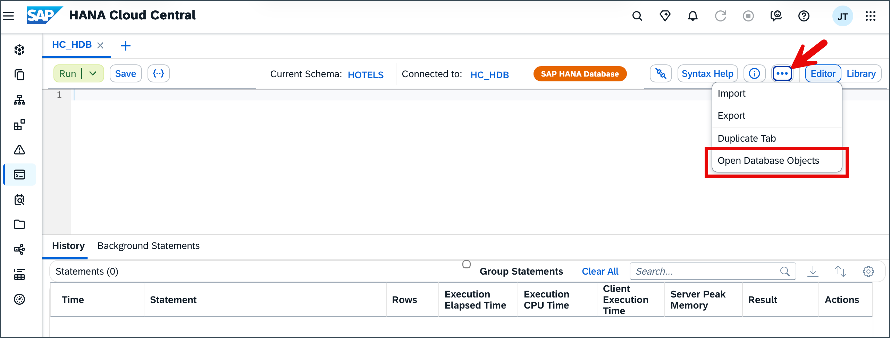
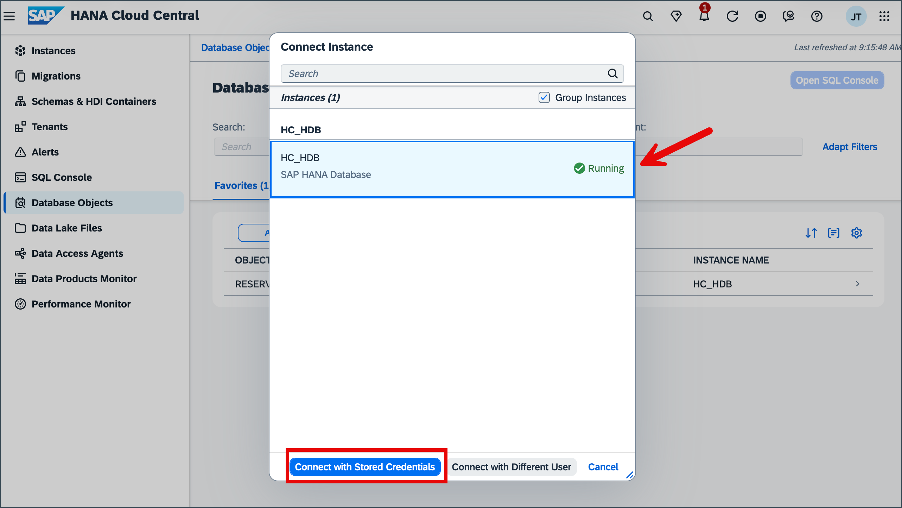
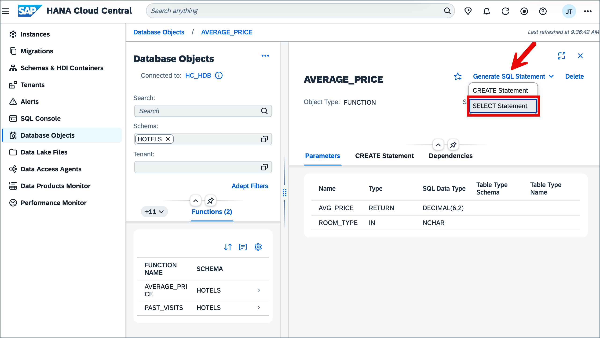
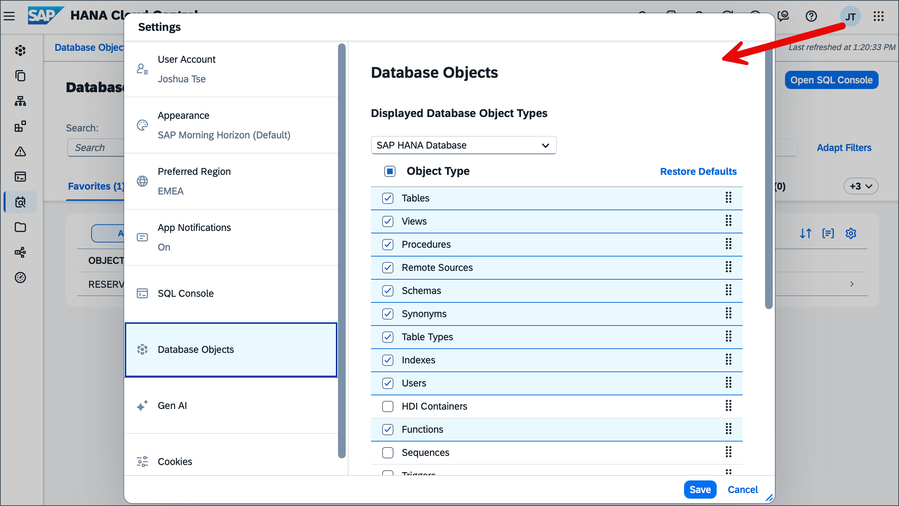

--- 
parser: v2 
auto_validation: true 
time: 10 
tags: [ tutorial>beginner, software-product-function>sap-hana-cloud--sap-hana-database, software-product-function>sap-hana-cloud--data-lake] 
primary_tag: software-product>sap-hana-cloud 
--- 

# Browse and Explore Catalog Objects with the Database Objects App

<!-- description --> Dive into using the database objects app to explore and inspect schema objects in an SAP HANA Cloud, SAP HANA database or data lake Relational Engine.  

## Prerequisites

- An SAP HANA Cloud database such as SAP HANA Cloud free tier
- You have completed the first 3 tutorials in this group

## You will learn

- How to filter for specific tables and schemas within an instance
- How to inspect and explore objects in an SAP HANA Cloud database
- How to generate SQL Statements

---

### Introduction

The database objects app is a built-in tool in SAP HANA Cloud Central that enables you to search, view metadata, and generate SQL for catalog objects.

### Filters and navigation  

1. Ensure that your database instance is running before attempting to open the Database Objects app. Once it is active, you can access the app directly by selecting its icon from the left‑hand navigation panel on the Instances page.

    
    
    You can also open the Database Objects app through the SQL Console. Make sure you are connected to the correct database, then click the three‑dot menu in the top‑right corner and select Open Database Objects.

    

2. Upon opening database objects, click “Select an Instance” at the top of the page to choose the database you want to work with. You can browse the list or use the search field to quickly find your instance.

    
    
         

    Once selected, the **Schema** and **Search** filter are both available to use. Select the **Schema** filter and search for the HOTELS schema.  

    

    You can also directly search for the schema or any other objects directly in the **Search** filter. In this case after searching navigate to the **Schemas** tab directly to view the metadata for the HOTELS schema. This data includes ownership, privileges and create time.  

    

### Explore tables

Information for tables includes columns, indexes, properties, runtime information and SQL CREATE Statements.  

1. Select the **Tables** tab to view all associated tables of the HOTELS schema.  

    The page now displays all tables in the schema HOTELS and their table type.

    

2. Select the **RESERVATION** table to explore it further.  

    Click the full screen icon on the top right of the screen to maximize the page and view all tabs.

    

    By default you should see the column details for the table.  

    

3. Explore the **Runtime Information** tab, where further information about the table can be found. This information includes the total number of rows, disk size, partitions and memory consumption for the table, as well as individual columns. 

    

4. Examine the other tabs, such as **CREATE Statements**, where SQL code to generate the table can be found.  

    

5. Select the Generate SQL Statement dropdown to see the three ways to have SQL generated for the table.  

    

### Explore functions and procedures

1. To display functions in the Database Objects app, go to settings using your profile icon and turn on the functions object type.

    

2. Open the **Functions** tab and select AVERAGE_PRICE to examine it further.  

    

    Select the Generate SQL Statement dropdown and click SELECT Statement to navigate to the SQL Console.

    
    
    Input *'suite'* in the single quotes of the SELECT statement to get the average price for suites.

    

3. Navigate back to the Database Objects app and open the **Procedure** tab. Select RESERVATION_GENERATOR to examine it further.  

    

4. Click Generate SQL and select the CALL statement to get SQL that runs the stored procedure.

    

To learn more about exploring database instances in Database Explorer refer to the [Browse Schema with the Database Browser in SAP HANA Database Explorer Tutorial](hana-dbx-browse)

### Additional features

1. Select the **Recent** tab to view all the recent objects you opened.  

    

2. Navigate to an object and click the star icon on the top right of the screen to favorite it. Allows for easy access to the object through the **Favorites** tab.  

    

    Once selected as a favorite. Navigate to the **Favorites** tab to see it. 

    

3. Click All/Selected Instance toggle to filter favorites.

    

4. Navigate to HANA Cloud Central settings to customize preferences for the Database Objects App. 

    

### Knowledge check

Congratulations! You have now successfully navigated the Database Objects app and learned about the various features and tools available to you right from SAP HANA Cloud Central.

To learn how to create multi‑model artifacts like knowledge graphs, property graphs, and document stores using the Database Objects app, you can also explore the tutorial [Try Out Multi‑Model Functionality with the SAP HANA Database Explorer and Database Objects App](hana-dbx-multi-model).
