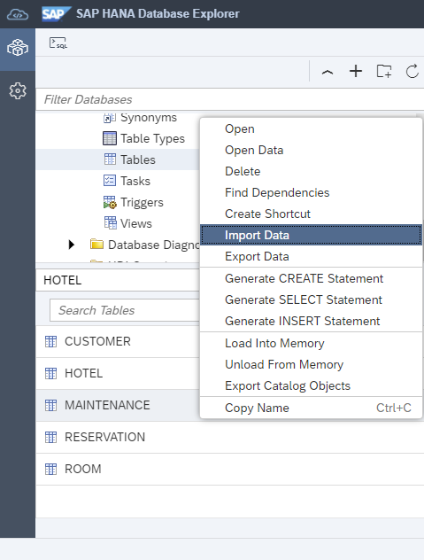
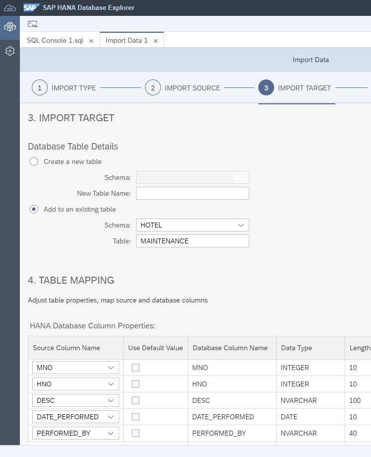
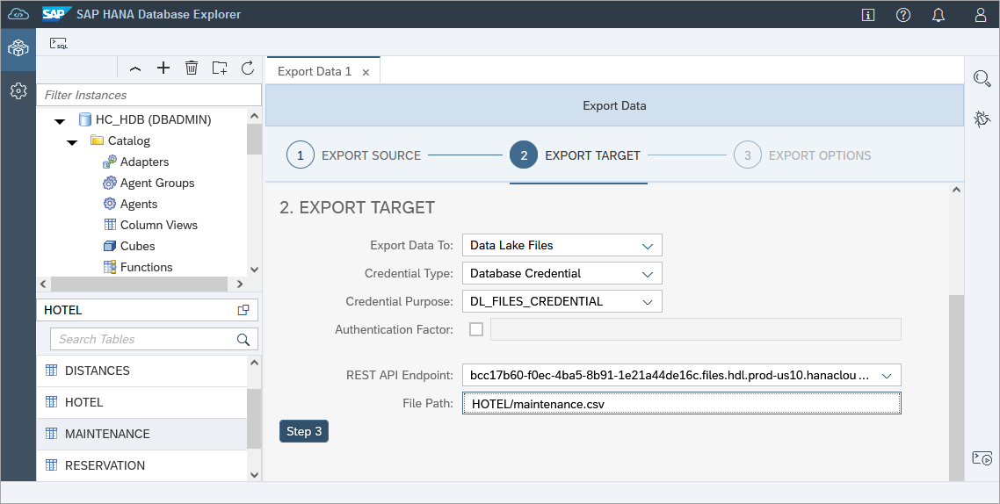
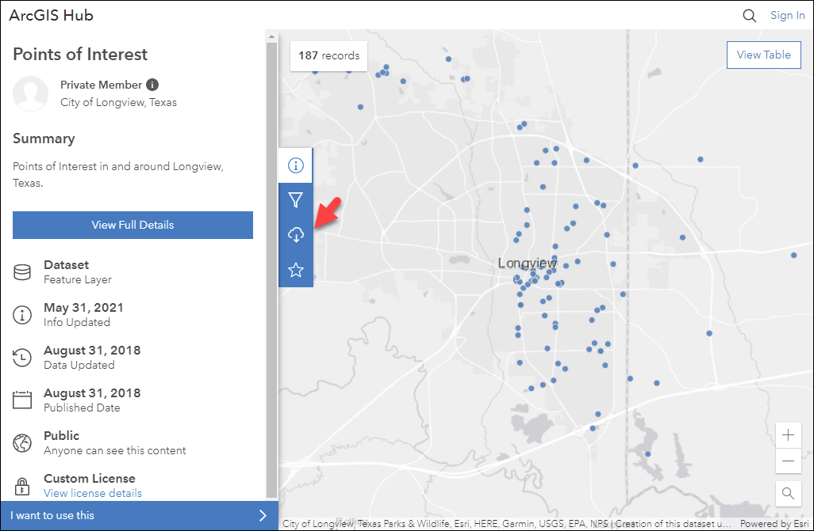
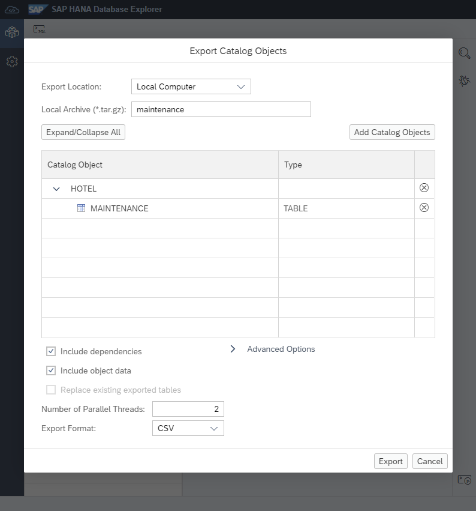
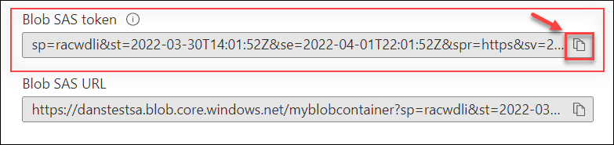
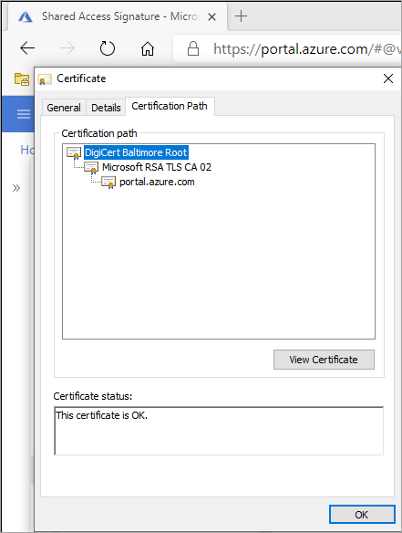

## Prerequisites
  - An SAP HANA database such as SAP HANA Cloud trial or the SAP HANA, express edition that includes the SAP HANA database explorer
  - You have completed the first 3 tutorials in this group.

## Details
### You will learn
  - How to export and import data using the export and import data wizards, SQL statements export into and import from, and the download option in the SQL console results tab
  - How to import `ESRI shapefiles` using the import data wizard
  - How to export and import schema objects using export and import catalog wizards and the SQL statements export and import
  - How to use cloud storage providers as a target when exporting or importing

The following steps will demonstrate a few ways to export and import data such as the contents of tables or views as well how to export and import database schema.  

---

[ACCORDION-BEGIN [Step 1: ](Export and import data)]

The following tables list the different options available in the SAP HANA database explorer to export and import data from a single table or view.  Step 3 will cover import and export of catalog objects which can include the SQL to recreate the object as well as additional objects such as functions and procedures.

Methods to export tables or views

| Method  | Version       | Target                 | Format(s)      |
| ------- | -------------|------------------------| ----------------|
| Export from SQL Console | All | local computer         | CSV      |
| [Export data wizard](https://help.sap.com/viewer/a2cea64fa3ac4f90a52405d07600047b/cloud/en-US/97e8ec0306eb4a12a4fd72de8bdd6a62.html)   | SAP HANA Cloud, HANA database  | S3, Azure, Alibaba OSS | CSV, Parquet    |
| [Export into statement](https://help.sap.com/viewer/c1d3f60099654ecfb3fe36ac93c121bb/latest/en-US/6a6f59bbfbb64ade84d83d7f87789753.html)  | SAP HANA Cloud, HANA database  | S3, Azure, Alibaba OSS | CSV, Parquet    |  
| [Export into statement](https://help.sap.com/viewer/4fe29514fd584807ac9f2a04f6754767/latest/en-US/6a6f59bbfbb64ade84d83d7f87789753.html)  | SAP HANA on-premise  | SAP HANA file system    | CSV |

Methods to import into tables

| Method  | Version       | Source          | Format(s)       | Notes |
| ------- | -------------|------------------------| ----------------| ------------|
| [Import data wizard](https://help.sap.com/viewer/a2cea64fa3ac4f90a52405d07600047b/cloud/en-US/ee0e1389fde345fa8ccf937f19c99c30.html)   | All    | local computer         | CSV             | 1 GB max, 2 MB per row in SAP HANA Cloud, HANA database; 200 MB max SAP HANA on-premise |
| [Import data wizard](https://help.sap.com/viewer/a2cea64fa3ac4f90a52405d07600047b/cloud/en-US/ee0e1389fde345fa8ccf937f19c99c30.html)   | SAP HANA Cloud, HANA database    | S3, Azure, Alibaba OSS | CSV, Parquet    | |
| [Import data wizard](https://help.sap.com/viewer/a2cea64fa3ac4f90a52405d07600047b/cloud/en-US/ee0e1389fde345fa8ccf937f19c99c30.html)    | SAP HANA Cloud, HANA database   | local computer         | `ESRI shapefiles` |  |
| [Import data wizard](https://help.sap.com/viewer/e8d0ddfb84094942a9f90288cd6c05d3/latest/en-US/ee0e1389fde345fa8ccf937f19c99c30.html)   | SAP HANA on-premise    | SAP HANA file system         | CSV             | Target table can be created |
| [Import from statement](https://help.sap.com/viewer/c1d3f60099654ecfb3fe36ac93c121bb/latest/en-US/20f712e175191014907393741fadcb97.html) | SAP HANA Cloud, HANA database | S3, Azure, Alibaba OSS | CSV, Parquet    | |
| [Import from statement](https://help.sap.com/viewer/4fe29514fd584807ac9f2a04f6754767/latest/en-US/20f712e175191014907393741fadcb97.html) | SAP HANA on-premise  | SAP HANA file system    | CSV |  |
| [Insert into table name select from statement](https://help.sap.com/viewer/c1d3f60099654ecfb3fe36ac93c121bb/latest/en-US/20f7f70975191014a76da70c9181720e.html) | All  | local or remote tables  | select statement |  |

> Export and import using cloud storage from Amazon, Microsoft Azure and Alibaba Cloud is covered in the final step of this tutorial.

The following steps will attempt to demonstrate some of these options.

1. Enter the SQL statement below.

    ```SQL
    SELECT * FROM HOTEL.MAINTENANCE;
    ```

    Left-click on the download toolbar item.

    

    Choose **Download**.

    

    >Note, there is a setting that controls the number of results displayed which may need to be adjusted for tables with larger results.

    >

2. Enter the SQL statement below to delete the rows in the table.  They will be added back in the next step.

    ```SQL
    DELETE FROM HOTEL.MAINTENANCE;
    ```

3. Right-click on the maintenance table and choose **Import Data**.  

    

    Browse to the previously downloaded CSV file and complete the wizard.

    

    Note that header row in the `data.csv` file is used to set the initial values of the source column to database column mappings.

    

    After completing the wizard, the contents of the maintenance table should now be the same as it was before the previously executed delete statement.


[DONE]
[ACCORDION-END]

[ACCORDION-BEGIN [Step 2: ](Use additional export and import options (optional))]

1. With SAP HANA Cloud, an export data wizard is available.  

    

    It can be used to export data to cloud storage providers such as Amazon S3, Microsoft Azure, and Alibaba Cloud OSS.  Additionally, the SAP BTP offers an [object store](https://help.sap.com/viewer/product/ObjectStore/Cloud/en-US).  A detailed example of the setup and usage of a cloud storage provider will be provided in Step 5 of this tutorial.

    

    The wizard makes use of the export into statement.  An example is shown below:

    ```SQL
    EXPORT INTO PARQUET FILE 'azure://danstestsa:sp=racwdl&st=2021-01-09T13:00:46Z&se=2021-01-10T13:00:46Z&sv=2019-12-12&sr=c&sig=TP%2BVYhcvSPDc4DZxcls6vN%2BCLHDNagedbei2IuEZsWU%3D@myblobcontainer/maintenance.parquet' FROM HOTEL.MAINTENANCE;
    ```

2. The import data wizard has a corresponding option to import from cloud storage providers.

    

    The wizard makes use of the import from statement.  An example is shown below:

    ```SQL
    DELETE FROM HOTEL.MAINTENANCE;
    IMPORT FROM PARQUET FILE 'azure://danstestsa:sp=racwdl&st=2021-01-09T13:00:46Z&se=2021-01-10T13:00:46Z&sv=2019-12-12&sr=c&sig=TP%2BVYhcvSPDc4DZxcls6vN%2BCLHDNagedbei2IuEZsWU%3D@myblobcontainer/maintenance.parquet' INTO HOTEL.MAINTENANCE WITH ERROR LOG 'error_log.txt' FAIL ON INVALID DATA;
    ```

3. With SAP HANA, express edition, the following statements can be executed to export and import from a directory on the SAP HANA file system assuming that the directory exists and the user `hxeadm` has permission to access it.

    ```SQL
    EXPORT INTO '/tmp/export/maintenance.csv' FROM HOTEL.MAINTENANCE WITH COLUMN LIST IN FIRST ROW;
    DELETE FROM HOTEL.MAINTENANCE;
    ALTER SYSTEM ALTER CONFIGURATION ('indexserver.ini', 'system') set ('import_export', 'csv_import_path_filter') = '/tmp/export' WITH RECONFIGURE;
    IMPORT FROM CSV FILE '/tmp/export/maintenance.csv' INTO HOTEL.MAINTENANCE WITH COLUMN LIST IN FIRST ROW ERROR LOG 'error_log.txt' FAIL ON INVALID DATA;
    ```

[DONE]
[ACCORDION-END]

[ACCORDION-BEGIN [Step 3: ](Import ESRI shapefiles (optional))]

This step will import an `ESRI shapefile` containing points of interest near the `Bella Ciente` hotel in the city of `Longview` Texas.  A search can then be performed to return the 3 closest golf courses to the hotel.

>The import option for `ESRI shapefiles` is available in the SAP HANA database explorer SP 13 or in the SAP HANA database explorer included with SAP HANA Cloud.

1. At the [ARCGIS Hub](https://hub.arcgis.com/search), search for **`Points of Interest in and around Longview, Texas`**.

    

    >There may be a delay before the search results are returned.

    Scroll through the results and choose the selection below.

    

2. Choose to download the data as a `shapefile`.

    


3. Start the import data wizard, choose **Import ESRI Shapefiles** and select the `LongViewPOI.zip` file.

    

4. Choose to import the `ESRI shapefile` into the schema **HOTEL**.  

    Within the downloaded `ESRI shapefile`, there is a file named `Points_of_Interest.prj`.  This file mentions the spatial reference system used by this `ESRI shapefile`.  Specify **WGS 84** as the spatial reference system.

    

    Additional details on spatial reference systems can be found at [SAP HANA Spatial Reference for SAP HANA Cloud](https://help.sap.com/viewer/bc9e455fe75541b8a248b4c09b086cf5/latest/en-US/7a2ea357787c101488ecd1b725836f07.html).

5. The following statements rename the imported table and then show the 3 closest golf courses to the `Bella Cliente` hotel.

    ```SQL
    RENAME TABLE "HOTEL"."Points_of_Interest" TO HOTEL.POI_LONGVIEW;
    SELECT TOP 3 NAME, ADDRESS, LINKED_URL, /* Bella Ciente location */ NEW ST_Point('POINT (-94.71868866754436 32.504451132677)', 4326).ST_Distance(NEW ST_Point(SHAPE.ST_AsWKT(), 4326), 'kilometer') * 0.621371 as dist from HOTEL.POI_LONGVIEW WHERE FCODE = 'GOLF COURSE' order by dist;
    ```

    

    For additional details, see [ST_Point Type](https://help.sap.com/viewer/bc9e455fe75541b8a248b4c09b086cf5/latest/en-US/7a29e653787c1014813b997510a8cc06.html) and [ST_Distance Method](https://help.sap.com/viewer/bc9e455fe75541b8a248b4c09b086cf5/latest/en-US/7a182aa3787c101481f996e3d419c720.html).

    The latitude and longitude used in the query can be obtained for a given address via context menu for a marker in Google Maps.

    


[DONE]
[ACCORDION-END]

[ACCORDION-BEGIN [Step 4: ](Export and import schema or catalog objects)]

The following tables list the different options available in the SAP HANA database explorer to export and import catalog objects.

Methods to export catalog objects

| Method                  | Version | Target                             | Format(s)                             | Limitations |
| ------------------------|---------|-------------------------------|---------------------------------------|-------------|
| [Export catalog wizard](https://help.sap.com/viewer/a2cea64fa3ac4f90a52405d07600047b/cloud/en-US/1f20a6c4364c4b0680596e74e4ba281d.html) | All | Local computer | CSV, Binary, \*Parquet | 2 GB max |
| [Export catalog wizard](https://help.sap.com/viewer/a2cea64fa3ac4f90a52405d07600047b/cloud/en-US/1f20a6c4364c4b0680596e74e4ba281d.html)  | SAP HANA Cloud, HANA database | S3, Azure, Alibaba OSS | CSV, Binary, Parquet | \*\* |
| [Export catalog wizard](https://help.sap.com/viewer/e8d0ddfb84094942a9f90288cd6c05d3/latest/en-US/1f20a6c4364c4b0680596e74e4ba281d.html)  | SAP HANA on-premise | SAP HANA file system | CSV, Binary | \*\* |
| [Export statement](https://help.sap.com/viewer/c1d3f60099654ecfb3fe36ac93c121bb/latest/en-US/20da0bec751910148e69c9668ea3ccb8.html) | SAP HANA Cloud, HANA database  | S3, Azure, Alibaba OSS                 | CSV, Binary, Parquet | ** |
| [Export statement](https://help.sap.com/viewer/4fe29514fd584807ac9f2a04f6754767/latest/en-US/20da0bec751910148e69c9668ea3ccb8.html) | SAP HANA on-premise     | HANA file system                 | CSV, Binary data | \*\* |


Methods to import catalog objects

| Method                  | Version | Source                             | Format(s)                             | Limitations |
| ------------------------|---------|-------------------------------|---------------------------------------|-------------|
| [Import catalog wizard](https://help.sap.com/viewer/a2cea64fa3ac4f90a52405d07600047b/cloud/en-US/80f63855e7854cd3a6144e0021b5f748.html) | All  | Local computer | CSV, Binary   | 2 GB max |
| [Import catalog wizard](https://help.sap.com/viewer/a2cea64fa3ac4f90a52405d07600047b/cloud/en-US/80f63855e7854cd3a6144e0021b5f748.html)  | SAP HANA Cloud, HANA database  | S3, Azure, Alibaba OSS  | CSV, Binary, Parquet                          | \*\* |
| [Import catalog wizard](https://help.sap.com/viewer/e8d0ddfb84094942a9f90288cd6c05d3/latest/en-US/80f63855e7854cd3a6144e0021b5f748.html)  | SAP HANA on-premise | SAP HANA file system | CSV, Binary                | 2 GB max per object,  \*\* |
| [Import statement](https://help.sap.com/viewer/c1d3f60099654ecfb3fe36ac93c121bb/latest/en-US/20f75ade751910148492a90e5e375b8f.html) | SAP HANA Cloud, HANA database | S3, Azure, Alibaba OSS                 | CSV, Binary,  Parquet                          | \*\* |
| [Import statement](https://help.sap.com/viewer/4fe29514fd584807ac9f2a04f6754767/latest/en-US/20f75ade751910148492a90e5e375b8f.html) | SAP HANA on-premise | SAP HANA file system       | CSV, Binary                        | \*\* |

> \* SAP HANA Cloud, HANA database only

> \*\* Max file size in archive is 8 GB (SAP Note [2907201](https://launchpad.support.sap.com/#/notes/2907201)).

> Export and import using cloud storage from Amazon, Microsoft Azure and Alibaba Cloud is covered in the final step of this tutorial.

Similar to the first section, the maintenance table will be exported and re-imported.  The export statement and the associated export catalog wizard have additional options, including the ability to include other schema objects such as functions and procedures as well as the option to include the SQL statements to recreate the objects.

1. Right-click on the maintenance table and choose **Export Catalog Objects**.  

    

    Choose **Local Computer** for the export location, provide a name for the Local Archive, select an export format and press **Export**.

    

    Examine the available export format options.

    

    Note that Binary Raw is the binary format for SAP HANA Cloud and Binary Data is the format option for SAP HANA as a Service and SAP HANA on-premise.

2. Examine the exported file.  Notice that it contains the SQL to recreate the table as well as the data of the table.

    

3. Enter the SQL statement below to drop the table.  It will be added back in the next step.

    ```SQL
    DROP TABLE HOTEL.MAINTENANCE;
    ```

3. Right-click on the tables folder and choose **Import Catalog**.  

    

    Browse to the previously downloaded .tar.gz file and complete the wizard.

    

    The contents of the maintenance table should now be the same as it was before the previously executed drop statement.

[DONE]
[ACCORDION-END]


[ACCORDION-BEGIN [Step : 5 ](Use cloud storage during export and import (optional))]

The following steps walk through the process of using Microsoft Azure storage service as a target for an export catalog  operation.  Similar steps can be used for other storage providers and the export data wizard.


1. Log in to the [Microsoft Azure Portal](https://portal.azure.com/).

2. Create a resource group.

    

3. Create a storage Service

    

4. Create a blob container.

    

5. Generate an API key.

    

    Specify that the permissions and the expiry time.

    

    Copy the generated query string and paste it into a text editor.  This will be used in step 7.

    

6. In the SAP HANA database explorer, add the certificate used by Microsoft to the HANA Cloud PSE.  

    ```SQL
    select * FROM PSES;
    create pse HTTPS;
    select * from CERTIFICATES;
    create certificate from '-----BEGIN CERTIFICATE-----MIIDdzCCAl+gAwIBAgIEAgAAuTANBgkqhkiG9w0BAQUFADBaMQswCQYDVQQGEwJJ
RTESMBAGA1UEChMJQmFsdGltb3JlMRMwEQYDVQQLEwpDeWJlclRydXN0MSIwIAYD
VQQDExlCYWx0aW1vcmUgQ3liZXJUcnVzdCBSb290MB4XDTAwMDUxMjE4NDYwMFoX
DTI1MDUxMjIzNTkwMFowWjELMAkGA1UEBhMCSUUxEjAQBgNVBAoTCUJhbHRpbW9y
ZTETMBEGA1UECxMKQ3liZXJUcnVzdDEiMCAGA1UEAxMZQmFsdGltb3JlIEN5YmVy
VHJ1c3QgUm9vdDCCASIwDQYJKoZIhvcNAQEBBQADggEPADCCAQoCggEBAKMEuyKr
mD1X6CZymrV51Cni4eiVgLGw41uOKymaZN+hXe2wCQVt2yguzmKiYv60iNoS6zjr
IZ3AQSsBUnuId9Mcj8e6uYi1agnnc+gRQKfRzMpijS3ljwumUNKoUMMo6vWrJYeK
mpYcqWe4PwzV9/lSEy/CG9VwcPCPwBLKBsua4dnKM3p31vjsufFoREJIE9LAwqSu
XmD+tqYF/LTdB1kC1FkYmGP1pWPgkAx9XbIGevOF6uvUA65ehD5f/xXtabz5OTZy
dc93Uk3zyZAsuT3lySNTPx8kmCFcB5kpvcY67Oduhjprl3RjM71oGDHweI12v/ye
jl0qhqdNkNwnGjkCAwEAAaNFMEMwHQYDVR0OBBYEFOWdWTCCR1jMrPoIVDaGezq1
BE3wMBIGA1UdEwEB/wQIMAYBAf8CAQMwDgYDVR0PAQH/BAQDAgEGMA0GCSqGSIb3
DQEBBQUAA4IBAQCFDF2O5G9RaEIFoN27TyclhAO992T9Ldcw46QQF+vaKSm2eT92
9hkTI7gQCvlYpNRhcL0EYWoSihfVCr3FvDB81ukMJY2GQE/szKN+OMY3EU/t3Wgx
jkzSswF07r51XgdIGn9w/xZchMB5hbgF/X++ZRGjD8ACtPhSNzkE1akxehi/oCr0
Epn3o0WC4zxe9Z2etciefC7IpJ5OCBRLbf1wbWsaY71k5h+3zvDyny67G7fyUIhz
ksLi4xaNmjICq44Y3ekQEe5+NauQrz4wlHrQMz2nZQ/1/I6eYs9HRCwBXbsdtTLS
R9I4LtD+gdwyah617jzV/OeBHRnDJELqYzmp-----END CERTIFICATE-----' COMMENT 'Azure';
    select CERTIFICATE_ID from CERTIFICATES where COMMENT = 'Azure';
    alter pse HTTPS add certificate <SELECTED_CERTIFICATE_ID>;
    set pse HTTPS purpose REMOTE SOURCE;
    ```

    Additional details can be found at [Certificate Management in SAP HANA Cloud](https://help.sap.com/viewer/c82f8d6a84c147f8b78bf6416dae7290/latest/en-US/1e6042c4402545f7a0574f7bc91fab25.html).

    The certificate string above is from the root certificate used for the Azure Portal.

    

7. Start the export catalog wizard and export the maintenance table to the storage service.

    The Azure Path is of the format:

    \<Storage Container Name>:<generated shared access string minus the leading?><@Storage Account>/\<File Name>

    An example string is shown below:

    `danstestsa:sp=racwdl&st=2021-01-09T13:00:46Z&se=2021-01-10T13:00:46Z&sv=2019-12-12&sr=c&sig=TP%2BVYhcvSPDc4DZxcls6vN%2BCLHDNagedbei2IuEZsWU%3D@myblobcontainer/maintenance`

    

    Pressing the Compose button shows the parsed Azure path.

    

    After the Export button is pressed, the results can be seen in the Azure Portal.

    

    The equivalent SQL statement is shown below:

    ```SQL
    EXPORT HOTEL.MAINTENANCE AS PARQUET INTO 'azure://danstestsa:sp=racwdl&st=2021-01-09T13:00:46Z&se=2021-01-10T13:00:46Z&sv=2019-12-12&sr=c&sig=TP%2BVYhcvSPDc4DZxcls6vN%2BCLHDNagedbei2IuEZsWU%3D@myblobcontainer/maintenance' WITH REPLACE;
    ```

8. Enter the SQL statement below to drop the table.  It will be added back in the next step.

    ```SQL
    DROP TABLE HOTEL.MAINTENANCE;
    ```

9. Import the table using the import catalog objects wizard.

    

    The contents of the maintenance table should now be the same as it was before the previously executed drop statement.

    The equivalent SQL statement is shown below:

    ```SQL
    IMPORT HOTEL.MAINTENANCE FROM 'azure://danstestsa:sp=racwdl&st=2021-01-09T13:00:46Z&se=2021-01-10T13:00:46Z&sv=2019-12-12&sr=c&sig=TP%2BVYhcvSPDc4DZxcls6vN%2BCLHDNagedbei2IuEZsWU%3D@myblobcontainer/maintenance' WITH REPLACE;
    ```

    For additional details see the topic [Importing and Exporting Data](https://help.sap.com/viewer/f9c5015e72e04fffa14d7d4f7267d897/latest/en-US/261937915fa5438ca545b8278b2979b7.html) in the SAP HANA Cloud Administration Guide.

Congratulations! You have imported and exported data and catalog objects as well as imported an `ESRI shapefile`.

[VALIDATE_1]
[ACCORDION-END]
