# Use the SAP HANA Database Explorer Extension
<!-- description --> Learn how the SAP HANA database explorer for Visual Studio Code extension can be used to connect to both SAP HANA Cloud and on-premise databases, general Visual Studio Code features, how to use the catalog browser, and how to execute SQL queries.  The SAP HANA database explorer for Visual Studio Code extension contains similar functionality to that in the web-based SAP HANA database explorer although not all functionality is available.


## Prerequisites
- An SAP HANA database such as SAP HANA Cloud (free tier or trial) or an on-premise SAP HANA database such as the SAP HANA, express edition
- You have completed the first 3 tutorials in this group

## You will learn
  - How to setup the Visual Studio Code SAP HANA database explorer extension
  - How to connect to an SAP HANA Cloud database, SAP HANA database and SAP HANA User store (to retrieve connection details)
  - How to explore and examine objects in an SAP HANA database

---

### Set up 

1.  If needed, download [Visual Studio Code](https://code.visualstudio.com/download) for your computer. 
    
     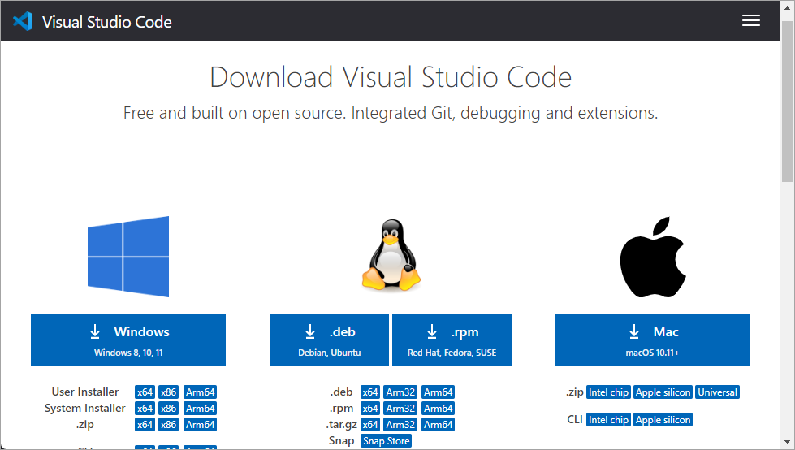

2. Open Visual Studio Code and install the [SAP HANA database explorer Visual Studio Code extension](https://marketplace.visualstudio.com/items?itemName=SAPSE.hana-database-explorer) from [https://marketplace.visualstudio.com/](Visual Studio Marketplace) by navigating to **Extensions** and searching for **SAP HANA Database Explorer**.

    >For more information about the latest features and version updates to the extension, you can refer to the **CHANGELOG** tab.

    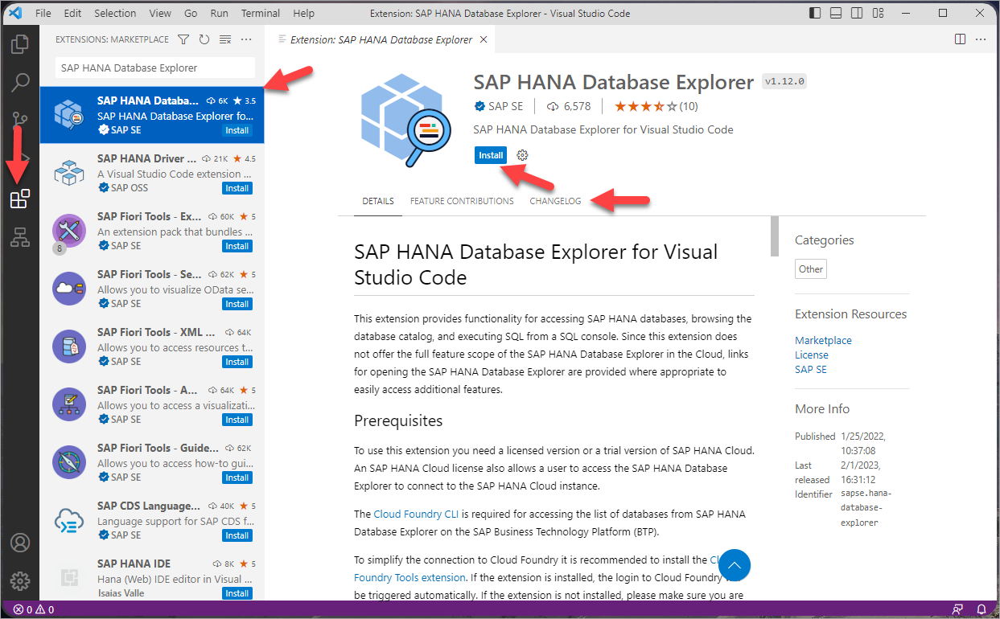

3. Open the extension from the new icon in the activity bar (left) and navigate to the **Database List**. 

    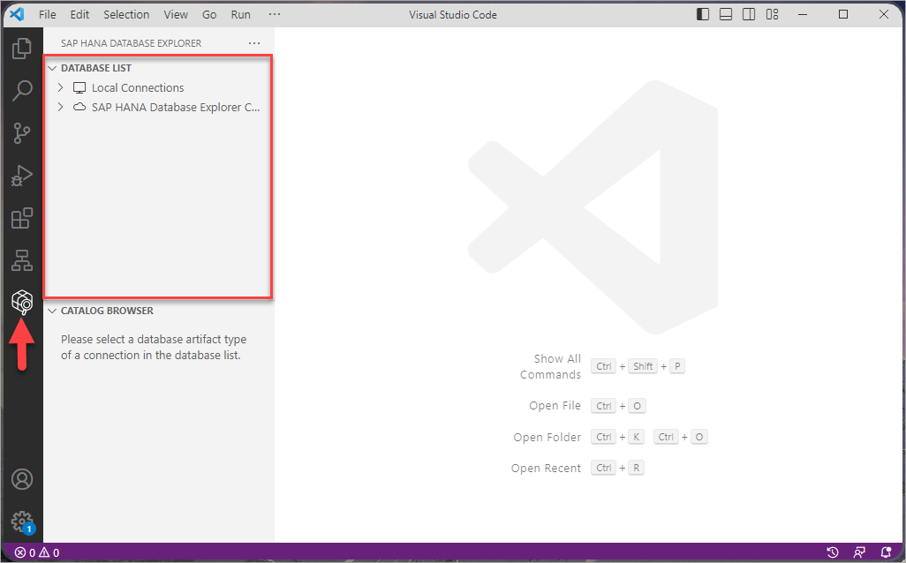

    There are two types of connections you can make with the extension. 
    
    * Local Connections are connections to an SAP HANA database (cloud or on-premise) added via the + icon.

    * SAP HANA Database Explorer Connections are database connections retrieved by logging into Cloud Foundry and querying for the set of connections that the web-based SAP HANA database explorer have created. 


### Add a local database connection  

The SAP HANA database explorer extension can connect to SAP HANA Cloud and on-premise databases as well as an SAP HANA User Store.  In this tutorial, a connection to an SAP HANA Cloud database will be made, but the steps to connect to the other types are very similar. Adding local connections do not require authentication to the SAP Business Technology Platform (BTP) or Cloud Foundry.

1. Hover over the **Database List** section and click the **+** button to **Add SAP HANA Database**.

    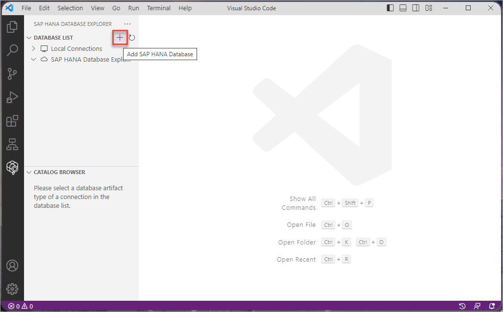

    A form to add a database will open.

2.  Select **SAP HANA Cloud** as your database type and enter values for the **Host**, **Port**, **User** and **Password**, such as USER1 and Password1.  You may also change the display name, as desired.
   
    This tutorial uses the HOTEL schema. Set the default schema value in the **Advanced Options** as shown below. Subsequent SQL consoles you open will now start with this schema value. 
    
    ```Advanced Options Field
    currentSchema=HOTEL;
    ```

    >Ensure that you connect the database securely using TLS/SSL by ticking the checkbox. If you do not check the Save Password checkbox, you will have to enter your password each time you start using the extension.

    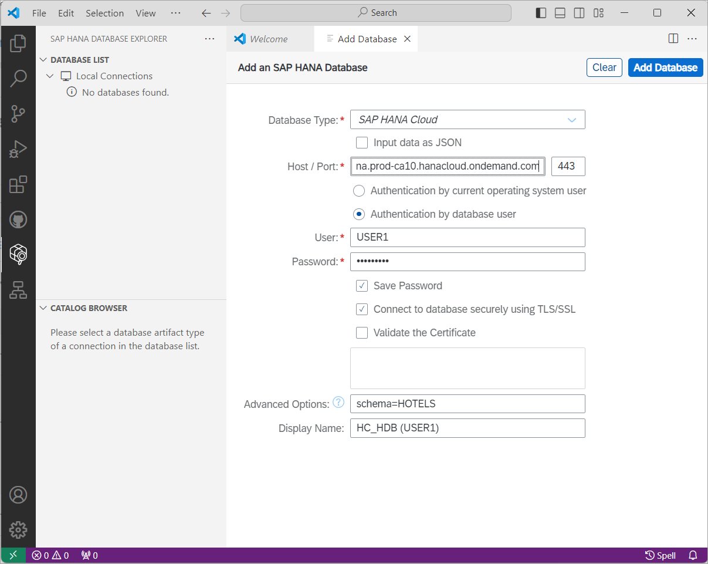

    A confirmation notification will appear in the bottom right corner if your database was added successfully. The database will also be listed under Local Connections in the Database List.

    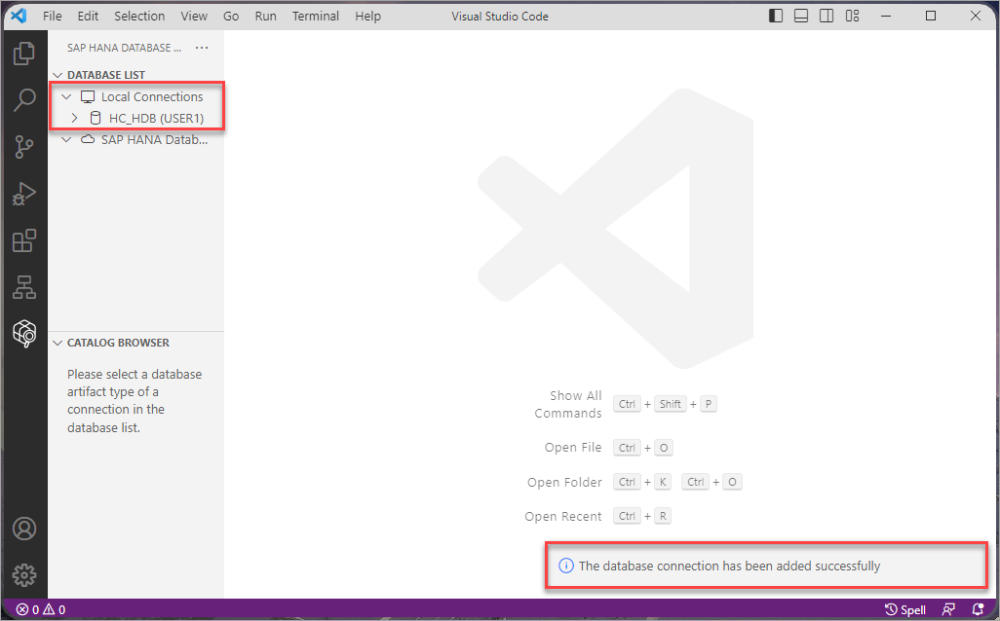

### Make connections through Cloud Foundry (Optional)

The SAP HANA database explorer extension also allows you to connect to the database connections you may have specified in the Cloud Foundry, web-based SAP HANA database explorer. These connections are managed by the web-based SAP HANA database explorer and cannot be edited in the extension. In order to complete this section of the tutorial, ensure that you have the [Cloud Foundry CLI](https://tools.hana.ondemand.com/#cloud) installed.

1. Open the terminal through Visual Studio Code by navigating to **Terminal** > **New Terminal** in the Visual Studio Code header bar. 
    
    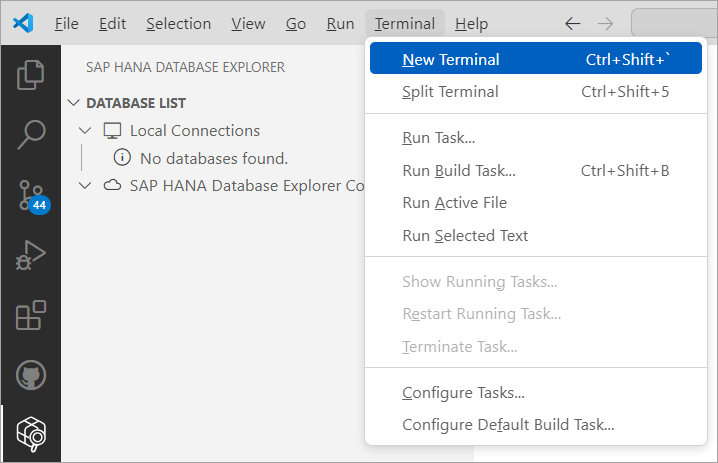

2. Login to Cloud Foundry with the following commands. 

    To login with email and password:
    ```Terminal 
    cf login 
    ```

    To login with single sign-on:
    ```Terminal 
    cf login --sso
    ```
    >Logging in with single sign-on will require you to click on the provided link, copy the code provided, and then paste the code in the terminal by right-clicking and clicking enter. 

    >For more login options:
    
    ```Terminal
    cf login -help
    ```

    Ensure that the **API Endpoint** is correct. Navigate to SAP BTP Cockpit, click on your sub-account, and click on the Cloud Foundry Environment tab, where your API Endpoint will be listed.

    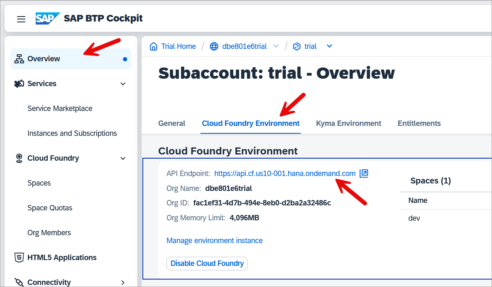

    If your API Endpoint is incorrect, change it with the following command.
    
    ```Terminal 
    cf login -a
    ```
    It is also important to verify that the URL is set correctly in the SAP HANA database explorer settings. 
    
    Click **File > Preferences > Settings**, search for **SAP HANA database explorer: URL**, and replace the region with the correct region for your sub-account (e.g. us10).

    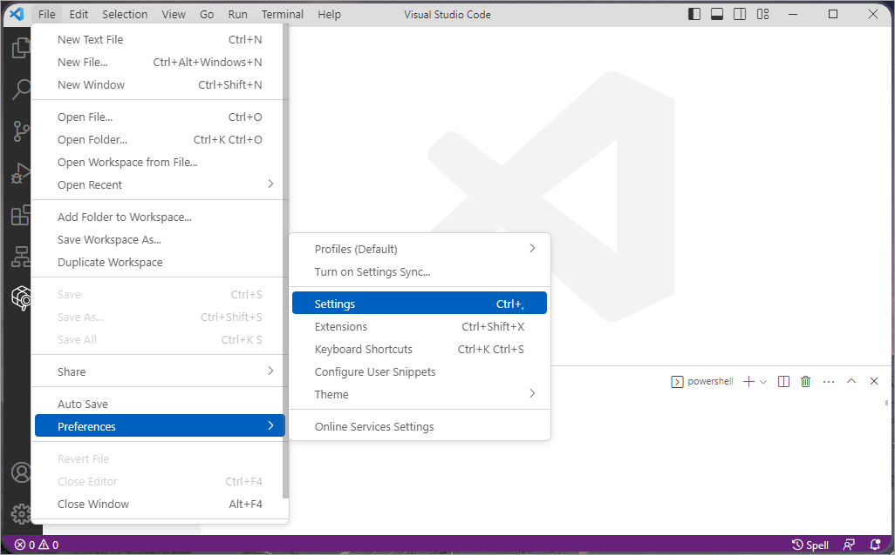

    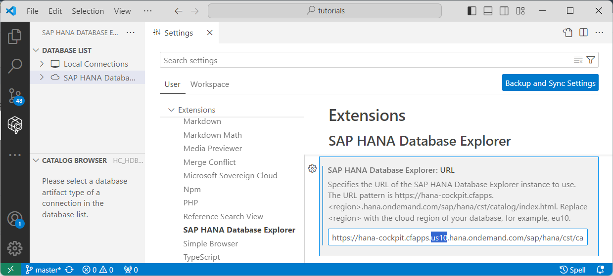

    Once logged in, you should see the database instances list from the web-based SAP HANA database explorer appear in your Database List. To open an SAP HANA SQL console in Visual Studio Code, hover over the connection and click the console icon. 

    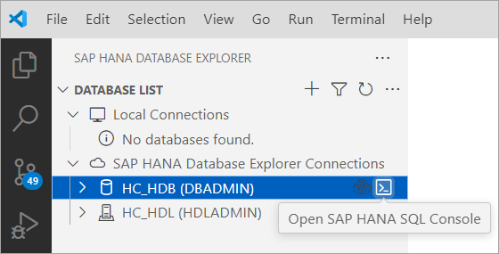

    To open the database in SAP HANA database explorer, click the stacked boxes icon.

    

    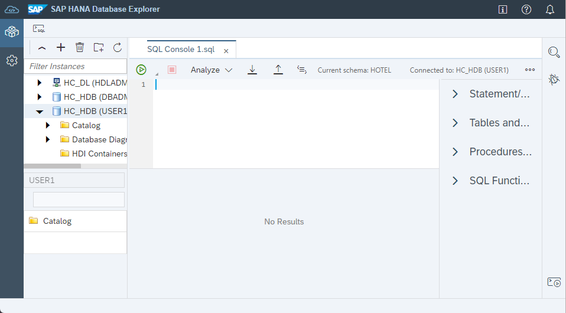

### Using the Database List and Catalog Browser

1. Select **Schemas** to open the list of schemas in the Catalog Browser. 

    As you can see, since the current Schema was set to HOTEL using advanced options when adding the database, this list is already filtered for you.  By hovering or clicking on the Catalog Browser section, you will see a filter icon and a refresh icon. 
    
2. Click on the filter icon. 

    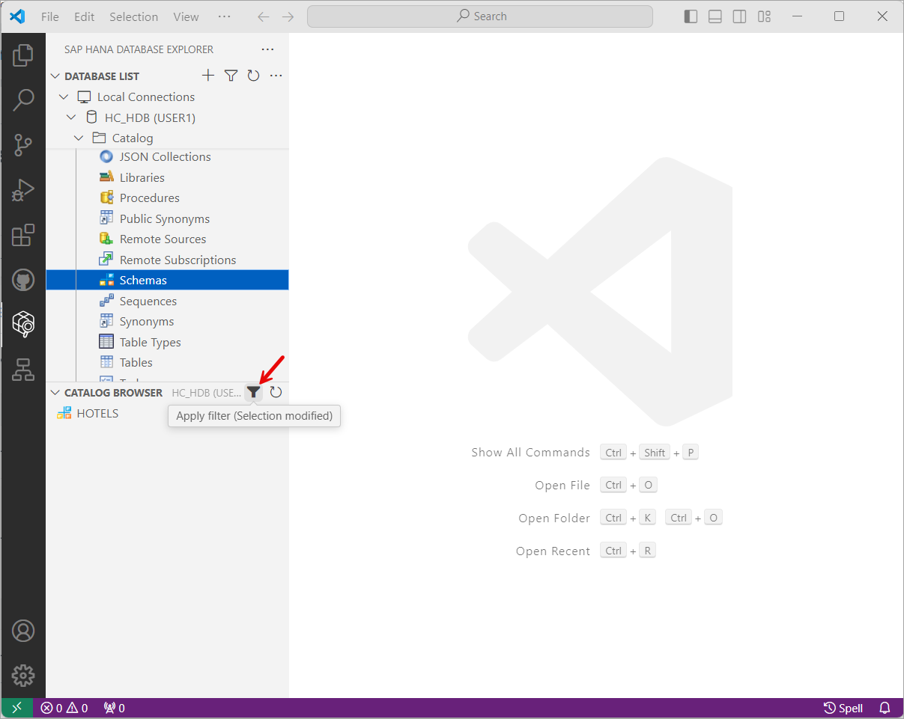

    This will open a list of all schemas. Selecting/deselecting all schemas will list all of the schemas in the Catalog Browser and show you all artifacts under the catalog if opened in the Catalog Browser. By selecting specific schemas, only the selected ones will be in the Catalog Browser, while also filtering other artifacts such as tables and procedures.

    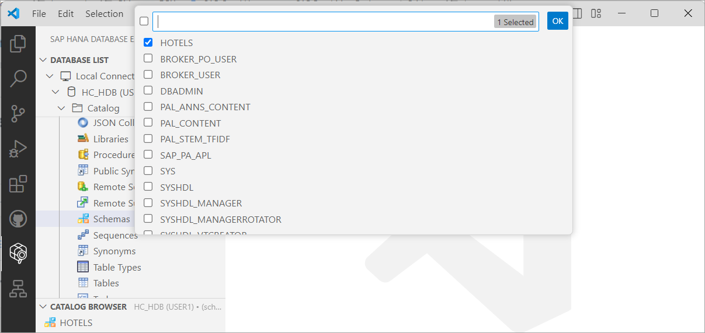 

3. Clicking OK will apply your filter selections. Keep the HOTEL filter selected and click OK. 


### Visual Studio Code features

Learn how to change settings and leverage features such as split editor, layout toggles, and the terminal.

1. If you would like to change the color theme of Visual Studio Code, one way to do that is through **File > Preferences > Themes > Color Theme**. From here, you can select from a light or dark color theme.

    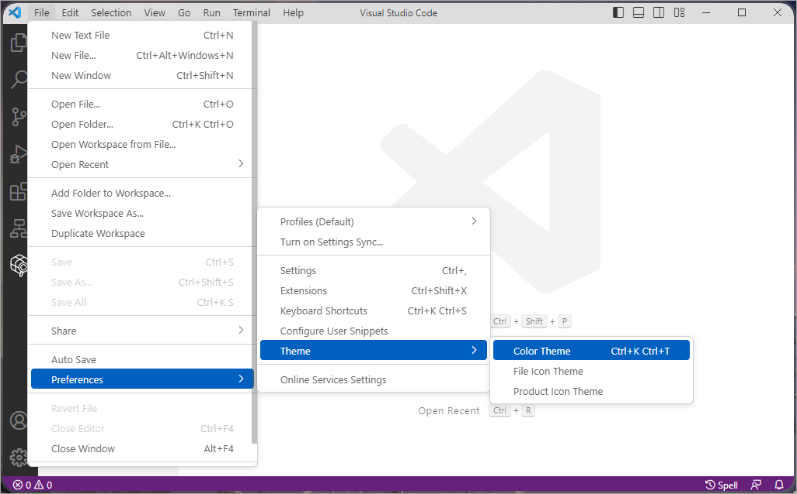

    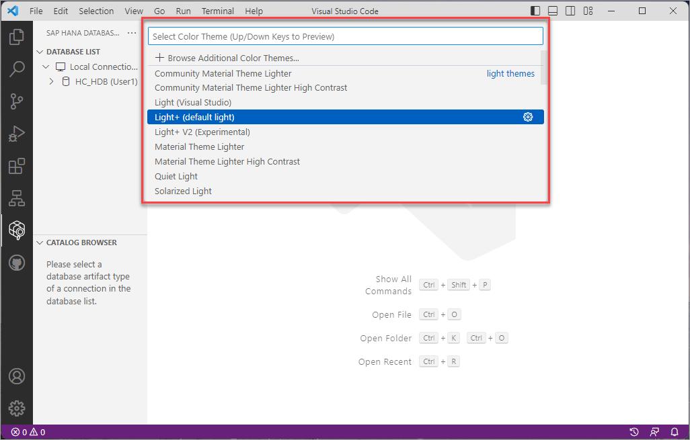

2. There are also other SAP HANA Cloud database explorer settings that you can set within the Visual Studio Code settings. If you open settings by clicking **Manage** > **Settings**, and search **Database Explorer**, a number of settings for the extension will appear in the list. There are two specific settings to point out that could be particularly useful.

    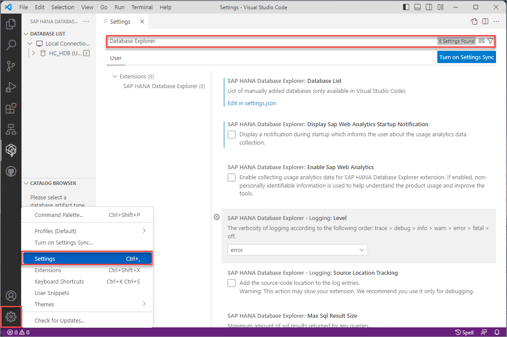

    - **Max Sql Result Size**: Here you can change the maximum amount of SQL results that you want to allow to be returned by any queries that you run. 

    - **Show Database Explorer Connections**: By selecting/deselecting this checkbox, you can show/hide the SAP HANA Database Explorer connections in your Database List. Note that this will not affect your local connections that are only available in Visual Studio Code.

    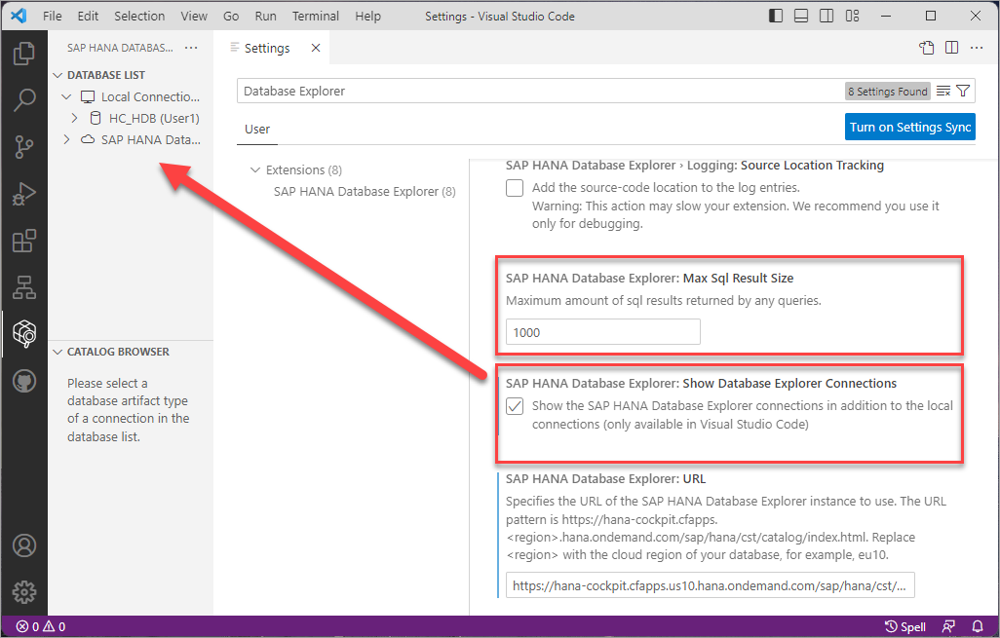

3. Visual Studio Code also has built-in functionality that allows you to split editors which can be very useful to customize your workspace. For example, if you are working on multiple tasks, or need to refer to a table while manipulating another one, this feature can allow you to work more efficiently. In a SQL console, run the following code.

    ```SQL
    SELECT * FROM CUSTOMER;
    ```

    Open another SQL console, click the split editor icon, and then drag one of the SQL console tabs into the new space to the right. 

    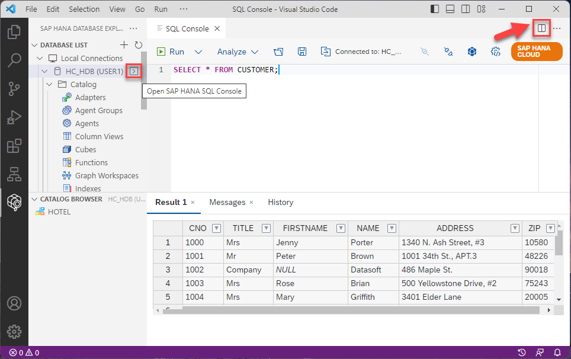


    As you can see in the CUSTOMER table, this includes both individual customers and company customers. You want to create a new table that consists only of company customers and insert the relevant information into the new table. To do so, run the following code in the empty SQL console and verify by comparing the table results that the necessary entries were made.

    ```SQL
    CREATE COLUMN TABLE CORPORATE_CUSTOMER(
        cno INTEGER PRIMARY KEY,
        company NVARCHAR(40) NOT NULL,
        address NVARCHAR(40) NOT NULL,
        zip NVARCHAR(6)
    );

    INSERT INTO CORPORATE_CUSTOMER (CNO, COMPANY, ADDRESS, ZIP) 
    SELECT CNO, NAME, ADDRESS, ZIP 
    FROM CUSTOMER 
    WHERE TITLE='Company';

    SELECT * FROM CORPORATE_CUSTOMER;
    ```
   

    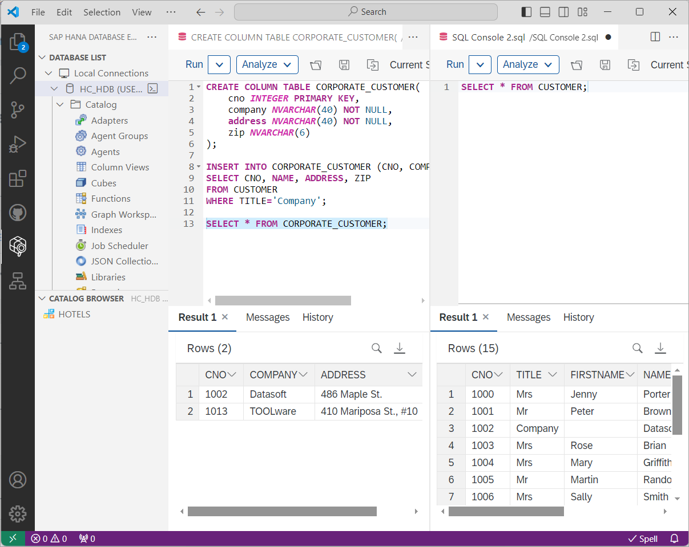

4. Additionally, Visual Studio Code has other features to help organize your workspace. The icons in the top right corners allow you to toggle (hide/show) different parts of the workspace which you can also do by resizing and snapping different areas. Click on the second icon to toggle the panel and use the Terminal to create a new file for your SQL code.

    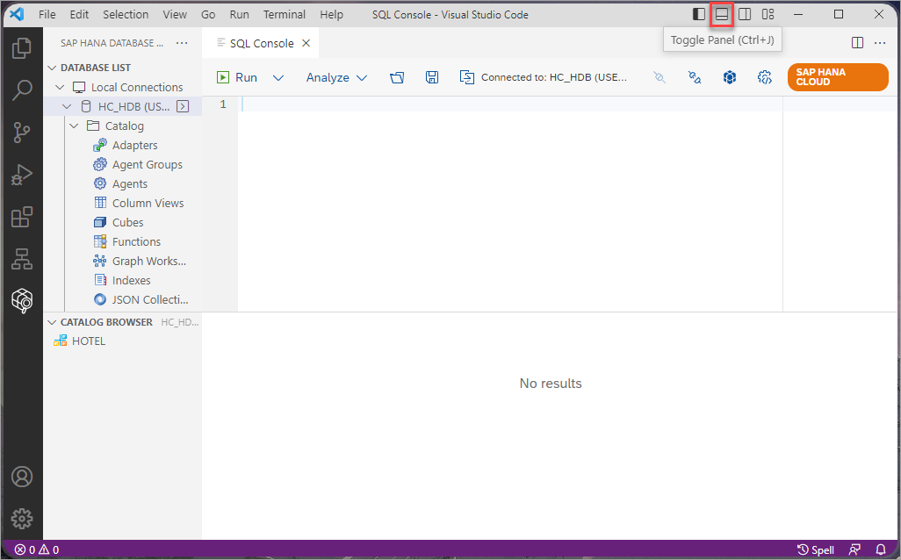

    ```Terminal
    notepad average_rating_function
    ```

    >Remember where you created this file, as you will need that location later.

    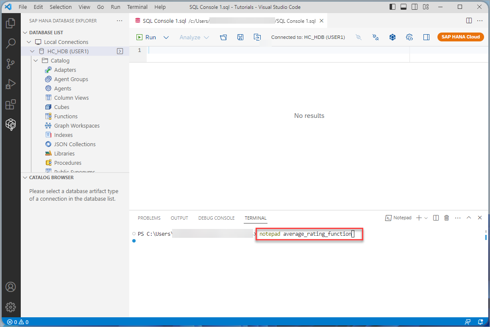

    Paste the following code into the file and save it as a SQL file by adding `.sql` to the file name. This function will return the average rating of a specific destination from the TOURIST_REVIEWS table. 
    
    ```SQL
    CREATE OR REPLACE FUNCTION AVERAGE_RATING(destination_id INT)
    RETURNS avg_rating INT
    AS
    BEGIN
        DECLARE EXIT HANDLER FOR SQLEXCEPTION avg_rating := '-1';
        SELECT TO_DECIMAL(ROUND(sum(DESTINATION_RATING)/COUNT(*), 2, ROUND_HALF_UP)) INTO avg_rating FROM TOURIST_REVIEWS WHERE destination_id =:destination_id GROUP BY destination_id;
    END;
    ```

### Import and export SQL code

The extension also allows you to import and export SQL files to and from your computer. In the web application, there is a statement library where a user can store SQL files, but with the extension, SQL files that are stored on the file system can also be incorporated into GIT so that file sharing for collaborative work is easier.

1. Clear your SQL console, or close the current one and open a new console. Click on the folder icon to import the file you created in the previous step and open it in Visual Studio Code.

    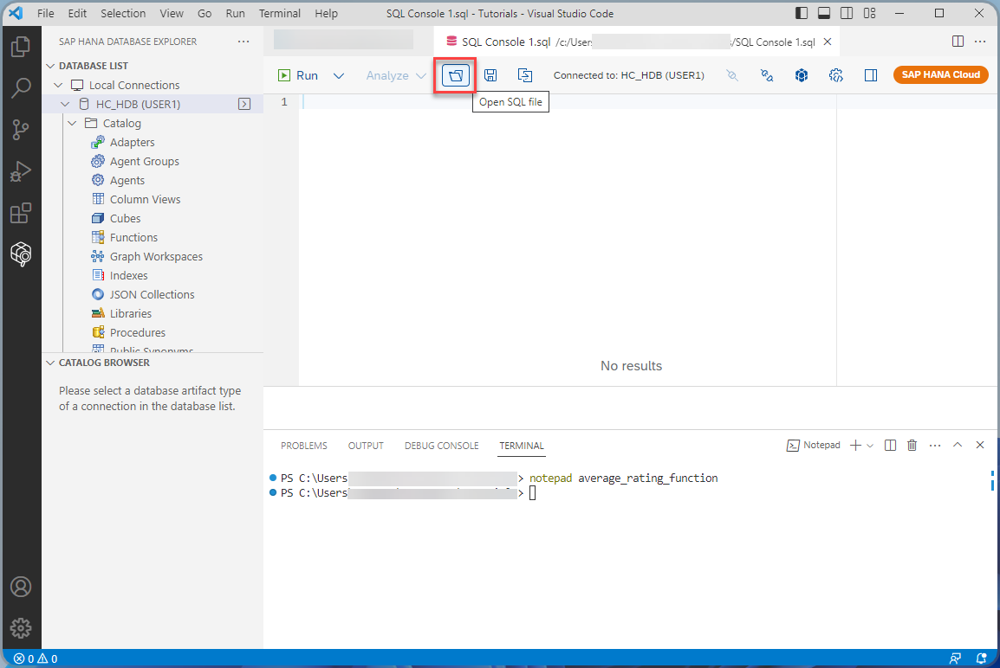

3. Edit the SQL in the editor by changing the INT in line 2 to FLOAT to change the function to return a more precise average.

    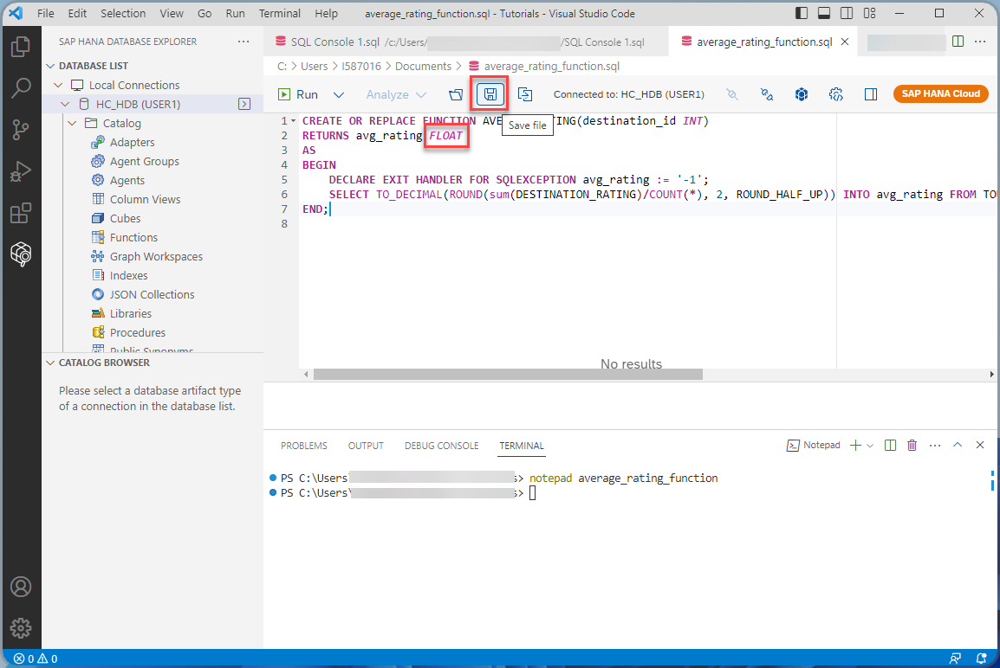

    Click the save icon to save your changes to the SQL file on your computer.

### Run SQL code

1. Open a new SQL console and use the newly created function with the following code. Click on the dropdown arrow beside Run to view the different Run options. Then, normally **Run** your code.

    ```SQL
    SELECT AVERAGE_RATING(1) FROM DUMMY;
    ```

    >Note how the Run options differ in the extension (left) from the web application (right).

    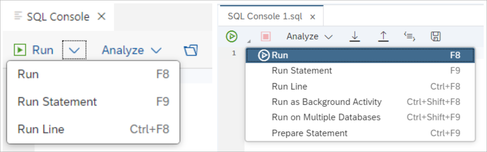

    The results of running your function are shown below.

    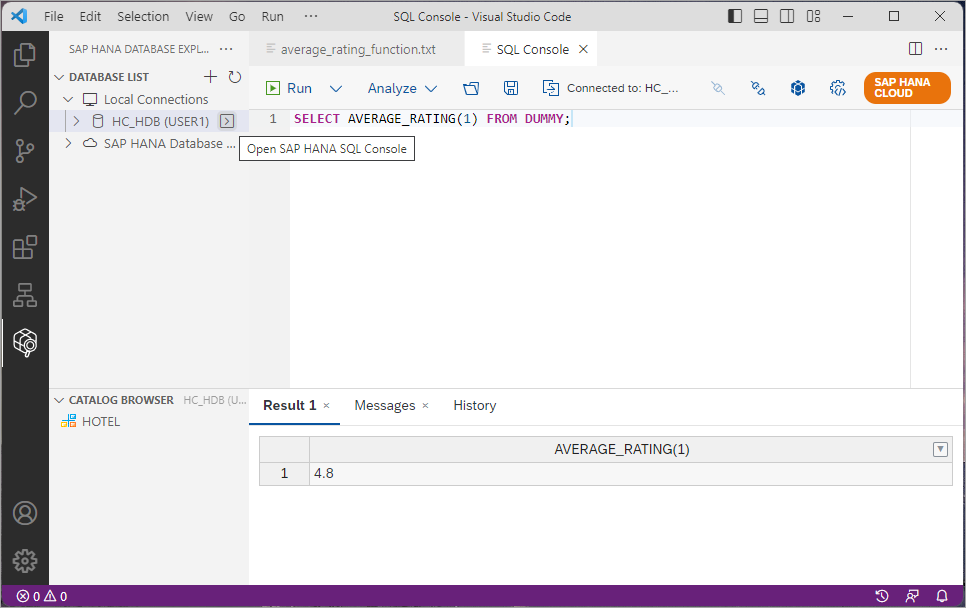

3. Click on the Messages tab to see more information such as execution time and memory usage of the SQL statement(s) that you ran. 

    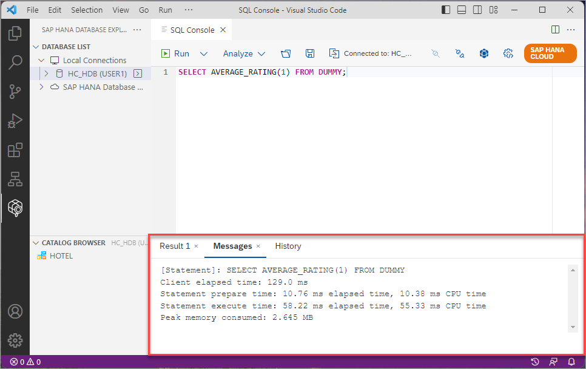

    If an error occurs, you will see an error message here as well.  

    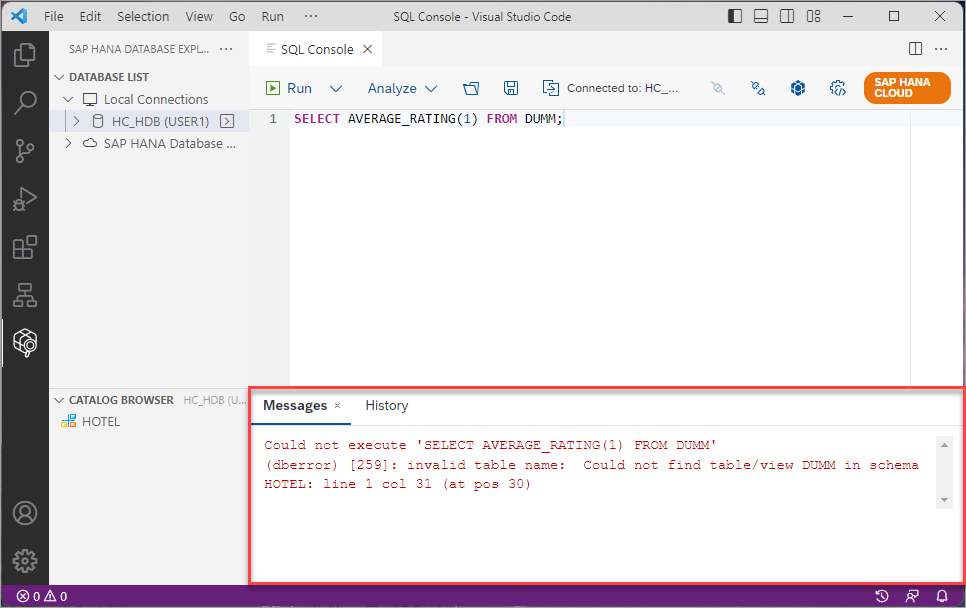

4. Clicking on the History tab will display a list of statements that you have run, along with information such as its runtime and result. You can also search through the history and paste queries into the SQL console by clicking on a statement.

    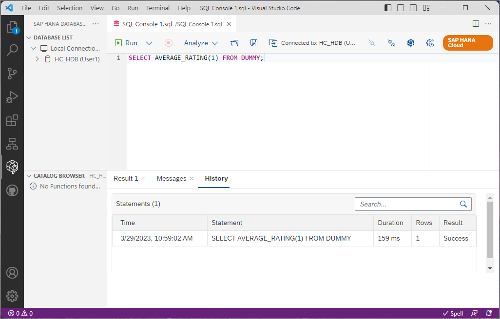

    > Note that certain capabilities (as listed) are only available in the web application of SAP HANA database explorer and are not currently available in the extension. A few examples are listed below: 
    >
    > * Execute SQL on multiple databases or as a background activity
    > * Global Search
    > * Debugging SQLScript 
    > * Graph Views
    > * Viewing diagnostic files in the Catalog Browser

### Knowledge check

Congratulations! You have now used the SAP HANA database explorer extension for Visual Studio Code to create tables and functions within an SAP HANA database and have become familiar with some of the features it provides.


