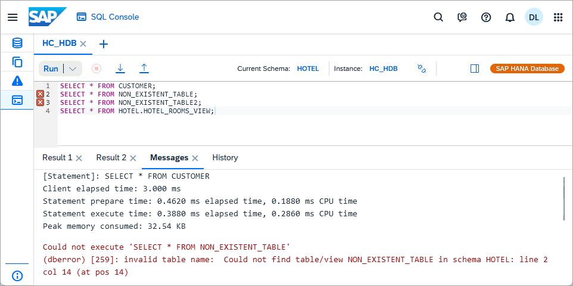
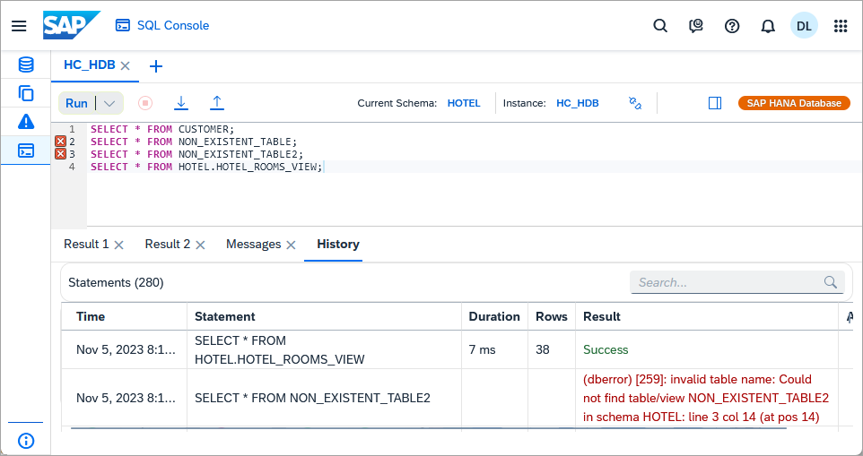

# Query Databases Using the SQL Console in SAP HANA Cloud Central
<!-- description --> Learn how the SQL console can be used within SAP HANA Cloud Central to quickly query a selected database.  

## Prerequisites
- An SAP HANA Cloud database
- You have completed [this](hana-dbx-create-schema) tutorial which creates a database schema for an SAP HANA Cloud, SAP HANA database.
- You have completed [this](hana-cloud-dl-clients-overview) tutorial which creates a database schema for an SAP HANA Cloud, data lake Relational Engine

## You will learn
  - How to open a SQL console, specify the credentials, and set the current schema
  - An overview of the functionality provided in the SQL console

---

### Open a SQL console
This step demonstrates how a SQL console can quickly be opened from within SAP HANA Cloud Central and how to change the SQL console's credentials and schema.

1.  In **SAP HANA Cloud Central**, open a SQL console by selecting **SQL Console** in the left pane.  Notice that the SQL console is not associated with a database when opened in this way.

    

    >Additional SQL consoles can also be opened by selecting the **+** icon.

2.  This time select **Instances**, select a database, and choose **Open SQL Console** from the actions menu.

    

    Notice that it is now connected to the instance named `HC_HDB`.

    

    >The currently connected user can be seen by executing the SQL statement below.

    >```SQL
    >SELECT CURRENT_USER FROM DUMMY;
    >```

3.  If you wish to connect to the database using a different set of credentials, select the **Connect this SQL console to a different instance** icon, select the current database and uncheck **Use cached credentials if possible**.

    

    The Enter Credentials dialog will then ask for the new credentials to be used.

    

    You can also use the following SQL to view and change the connected user.

    ```SQL
    CONNECT USER1 PASSWORD Password1;
    SELECT CURRENT_USER FROM DUMMY;
    ```

    

4.  The current schema can be set and viewed using the SQL statements below.

    ```SQL
    SET SCHEMA HOTEL;
    SELECT CURRENT_SCHEMA FROM DUMMY;
    ```

    

    For data lake Relational Engine instances, the current schema can be set and viewed as shown below.

    ```SQL
    SET SCHEMA HOTEL;
    SELECT CURRENT SCHEMA;
    ```

    


### Execute SQL
This step demonstrates how to execute a SQL query and view query results, messages, and history within a SQL console.  

1. Execute the following SQL statements.

    ```SQL
    SELECT * FROM CUSTOMER;
    SELECT * FROM HOTEL.HOTEL_ROOMS_VIEW;
    SELECT * FROM NON_EXISTENT_TABLE;
    ```

    

    Notice that two result tabs are shown, one for each SQL statement.

2. Place the cursor on line two and open the **Statement Help** panel.

    

    Notice that for SAP HANA Cloud, SAP HANA databases, links to the related documentation and details on the objects used in the SQL statement are shown.

3. Examine the **Messages** tab.

    

    Notice that details of the statements executed are shown including metrics information such as the amount of memory consumed.

4. Examine the **History** tab.

    

    Notice that the statements can be located using a search and that a selected item can be inserted back into the SQL console or copied.

    >The history is not persisted across browser reloads.

### A few things to note
The SQL console within SAP HANA Cloud Central appears similar to the one within the SAP HANA database explorer but there are some differences.

* Opening the SQL console within the SAP HANA Cloud Central can be done much quicker than opening the full SAP HANA database explorer.

* The SQL console that you access from within SAP HANA Cloud Central can only connect to databases that are within the same BTP subaccount as SAP HANA Cloud Central. 

* The SAP HANA database explorer has some additional functionality

    * Persistency of SQL tabs and their contents
    * SQL debugging
    * SQL parsing to detect potential errors
    * Code completion of schema objects
    * SQL formatting
    * SQL viewers for HTML, XML, JSON, binary, and spatial
    * Results can be downloaded in a CSV
    * Ability to run statements in the background
    * Ability to run statements against multiple instances
    * Generate SQL Analyzer file or explain plan
    * Statement library
    * SQL console settings

### Knowledge check

Congratulations! You have now used the SQL console in SAP HANA Cloud Central and have become familiar with some of the features it provides.
