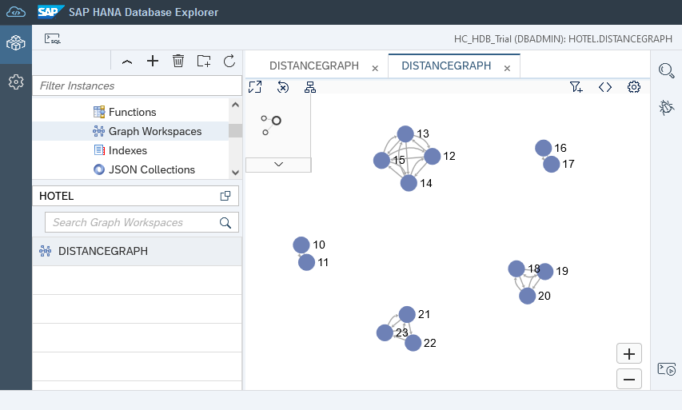
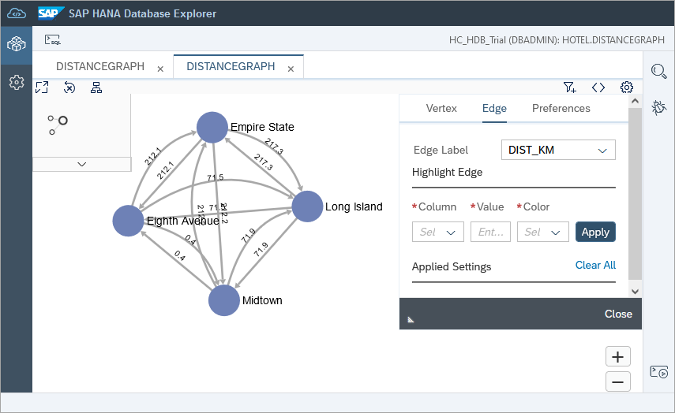
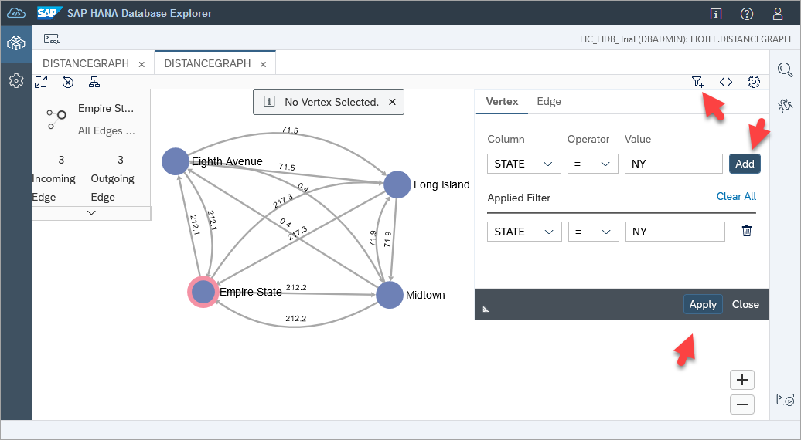
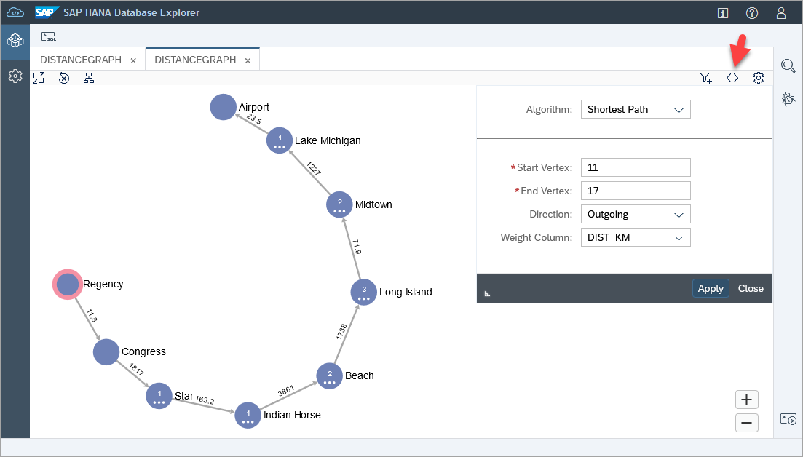
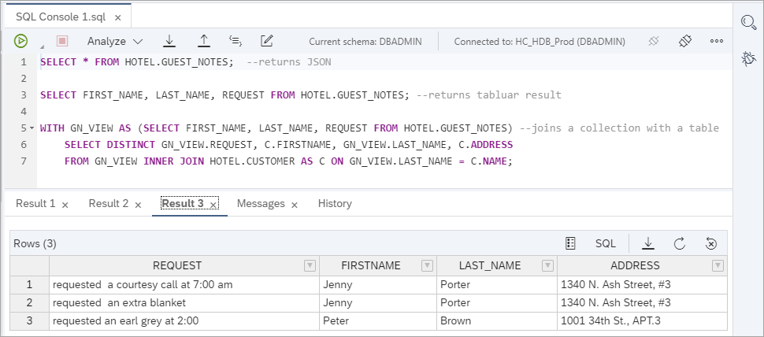
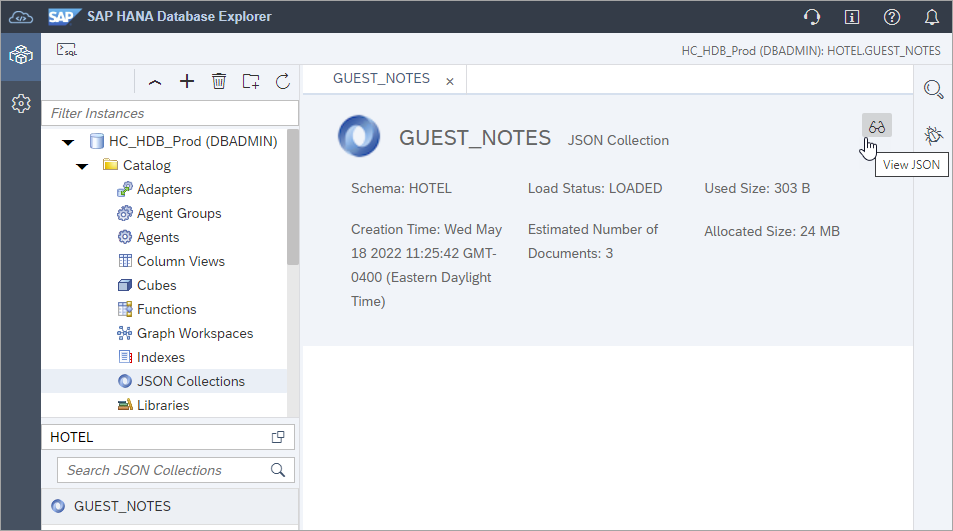

## Prerequisites
 - An SAP HANA database such as SAP HANA Cloud trial or the SAP HANA, express edition that includes the SAP HANA database explorer
- You have completed the first 3 tutorials in this group.

## Details
### You will learn
  - How to create a graph, a document store, and import spatial data.
  - How the SAP HANA database explorer can be used with multi-model data.

This tutorial is meant to be an introduction to this topic.  For a deeper dive on the topics of graph and spatial, see the tutorial groups [Introduction to SAP HANA Spatial Data Types](group.hana-aa-spatial-get-started) and [Smart Multi-Model Data Processing with SAP HANA Cloud](group.hana-cloud-smart-multi-model-data).

---

[ACCORDION-BEGIN [Step 1: ](Create a graph workspace)]

The following steps will create a graph workspace that can display the distance between hotels in a state.

1. Create a vertex table that represents distances between hotels by executing the following in the SQL Console.

    ```SQL
    CREATE COLUMN TABLE HOTEL.DISTANCES(
      DKEY INTEGER UNIQUE NOT NULL,
      HSOURCE INTEGER NOT NULL
        REFERENCES HOTEL.HOTEL(HNO),
      HTARGET INTEGER NOT NULL
        REFERENCES HOTEL.HOTEL(HNO),
      DIST_KM DOUBLE
    );
    ```

2. Populate the vertex table with distances between hotels that are in the same state.

    ```SQL
    --Washington
    INSERT INTO HOTEL.DISTANCES VALUES (1, 10, 11, 11.8);
    INSERT INTO HOTEL.DISTANCES VALUES (2, 11, 10, 11.8);

    --New York
    INSERT INTO HOTEL.DISTANCES VALUES (3, 12, 13, 217.3);
    INSERT INTO HOTEL.DISTANCES VALUES (4, 13, 12, 217.3);
    INSERT INTO HOTEL.DISTANCES VALUES (5, 12, 14, 71.9);
    INSERT INTO HOTEL.DISTANCES VALUES (6, 14, 12, 71.9);
    INSERT INTO HOTEL.DISTANCES VALUES (7, 12, 15, 71.5);
    INSERT INTO HOTEL.DISTANCES VALUES (8, 15, 12, 71.5);
    INSERT INTO HOTEL.DISTANCES VALUES (9, 13, 14, 212.2);
    INSERT INTO HOTEL.DISTANCES VALUES (10, 14, 13, 212.2);
    INSERT INTO HOTEL.DISTANCES VALUES (11, 13, 15, 212.1);
    INSERT INTO HOTEL.DISTANCES VALUES (12, 15, 13, 212.1);
    INSERT INTO HOTEL.DISTANCES VALUES (13, 14, 15, 0.4);
    INSERT INTO HOTEL.DISTANCES VALUES (14, 15, 14, 0.4);

    --Illinois
    INSERT INTO HOTEL.DISTANCES VALUES (15, 16, 17, 23.5);
    INSERT INTO HOTEL.DISTANCES VALUES (16, 17, 16, 23.5);

    --Florida
    INSERT INTO HOTEL.DISTANCES VALUES (17, 18, 19, 219.8);
    INSERT INTO HOTEL.DISTANCES VALUES (18, 19, 18, 219.8);
    INSERT INTO HOTEL.DISTANCES VALUES (19, 18, 20, 323.4);
    INSERT INTO HOTEL.DISTANCES VALUES (20, 20, 18, 323.4);
    INSERT INTO HOTEL.DISTANCES VALUES (21, 19, 20, 333.8);
    INSERT INTO HOTEL.DISTANCES VALUES (22, 20, 19, 333.8);

    --California
    INSERT INTO HOTEL.DISTANCES VALUES (23, 21, 22, 149.5);
    INSERT INTO HOTEL.DISTANCES VALUES (24, 22, 21, 149.5);
    INSERT INTO HOTEL.DISTANCES VALUES (25, 21, 23, 35.7);
    INSERT INTO HOTEL.DISTANCES VALUES (26, 23, 21, 35.7);
    INSERT INTO HOTEL.DISTANCES VALUES (27, 22, 23, 163.2);
    INSERT INTO HOTEL.DISTANCES VALUES (28, 23, 22, 163.2);
    ```

3. Create a graph workspace.

    ```SQL
    CREATE GRAPH WORKSPACE HOTEL.DISTANCEGRAPH
    EDGE TABLE HOTEL.DISTANCES
        SOURCE COLUMN HSOURCE
        TARGET COLUMN HTARGET
        KEY COLUMN DKEY
    VERTEX TABLE HOTEL.HOTEL
        KEY COLUMN HNO;
    ```

4. Navigate to graph workspaces, select the previously created graph workspace, and open it to view its properties.

    

For additional information, see [SAP HANA Cloud, SAP HANA Database Graph Reference](https://help.sap.com/viewer/11afa2e60a5f4192a381df30f94863f9/latest/en-US/30d1d8cfd5d0470dbaac2ebe20cefb8f.html).

[DONE]
[ACCORDION-END]

[ACCORDION-BEGIN [Step 2: ](Explore a graph using the graph viewer)]

1. Open the graph viewer.

    

    The graph viewer will open in a new tab as shown below.

    

2. Set the vertex and edge names using the graph viewer settings.

    Set the vertex label to `NAME`.

    

    Set the edge label to `DIST_KM`.

    

3. Optionally, adjust a few of the graph vertices to accommodate viewing by dragging and dropping graph vertices.

    

4. Apply a filter to vertices where `STATE` is NY and edges where `DIST_KM` is less than 100 using the graph viewer filter.  After specifying the filter, press the Add button and then apply it by pressing the Apply button.

    !

    >Between filtering, the graph will reset.

    !

5. Highlight the Long Island vertex using the graph viewer settings. The color used to highlight in the image below is #E5F5FC.

    

Additional graph examples include the [Greek Mythology Graph Example](https://help.sap.com/viewer/f381aa9c4b99457fb3c6b53a2fd29c02/2.0.04/en-US/071d7b7349f04e419507387c271dce8f.html) and [Open Flights](https://help.sap.com/viewer/11afa2e60a5f4192a381df30f94863f9/latest/en-US/071d7b7349f04e419507387c271dce8f.html).  Note that the company graph example does not currently display in the SAP HANA database explorer graph viewer as it does not at this time support the display of homogeneous graphs.


[DONE]
[ACCORDION-END]


[ACCORDION-BEGIN [Step 3: ](Use graph algorithms in the database explorer)]
A recent release of SAP HANA database explorer provides the ability to apply algorithms to the graph viewer. The shortest path algorithm can be used to provide the optimal route between two vertices. The nearest neighbor algorithm can be used to show only the vertices that are connected to a specified vertex.

The following steps will walk through using the shortest path algorithm to determine the optimal route from Airport Hotel in Rosemont, IL to Regency Hotel in Seattle, WA.

1. Execute the following in SQL to add a few connections between hotels in different states.

    ```SQL
    --Midtown New York to Lake Michigan Chicago
    INSERT INTO HOTEL.DISTANCES VALUES (29,14,16,1227);
    INSERT INTO HOTEL.DISTANCES VALUES (30,16,14,1227);

    --Long Island New York to Lake Michigan Chicago
    INSERT INTO HOTEL.DISTANCES VALUES (31,12,16,1357);
    INSERT INTO HOTEL.DISTANCES VALUES (32,16,12,1357);

    --Long Island New York to Beach Florida
    INSERT INTO HOTEL.DISTANCES VALUES (33,12,19,1738);
    INSERT INTO HOTEL.DISTANCES VALUES (34,19,12,1738);

    --Congress Seattle to Star California
    INSERT INTO HOTEL.DISTANCES VALUES (35,10,23,1817);
    INSERT INTO HOTEL.DISTANCES VALUES (36,23,10,1817);

    --Indian Horse California to Beach Florida
    INSERT INTO HOTEL.DISTANCES VALUES (37,22,19,3861);
    INSERT INTO HOTEL.DISTANCES VALUES (38,19,22,3861);

    --Atlantic Florida to Long Beach California
    INSERT INTO HOTEL.DISTANCES VALUES (39,20,21,4348);
    INSERT INTO HOTEL.DISTANCES VALUES (40,21,20,4348);
    ```

2. Navigate to the graph viewer, and select the algorithms tab. Update the Algorithm field to "Shortest Path".

3. Set the following parameters from the image below and select Apply:
    !

[DONE]
[ACCORDION-END]

[ACCORDION-BEGIN [Step 4: ](Create, populate, and query a JSON collection (optional))]

The following steps will demonstrate how to create a JSON collection that can be used to collect notes about customers staying at a hotel.

>Note that the creation of a JSON collection is not supported in the SAP HANA Cloud trial.

1. Enable the JSON document store.  

    For an SAP HANA Cloud database, in the creation wizard, enable the document store.  

    For an on-premise server, add the document service as described at [Enable the SAP HANA JSON Document Store](https://help.sap.com/viewer/3e48dd3ad36e41efbdf534a89fdf278f/latest/en-US/28334f8e631c447598d2591305b28660.html).

2. Create a collection named `GUEST_NOTES`.

    ```SQL
    CREATE COLLECTION HOTEL.GUEST_NOTES;
    ```

3. Insert some data.

    ```SQL
    INSERT INTO HOTEL.GUEST_NOTES VALUES ('{"FIRST_NAME": "Jenny", "LAST_NAME": "Porter", "REQUEST": "requested  a courtesy call at 7:00 am"}');
    INSERT INTO HOTEL.GUEST_NOTES VALUES ('{"FIRST_NAME": "Jenny", "LAST_NAME": "Porter", "REQUEST": "requested  an extra blanket"}');
    INSERT INTO HOTEL.GUEST_NOTES VALUES ('{"title": "Mr.", "FIRST_NAME": "Peter", "LAST_NAME": "Brown", "REQUEST": "requested an earl grey at 2:00"}');
    ```

    Notice that the structure of the Guest Notes does not need to be defined in advance.

4. The JSON data can be returned as a JSON document, in a tabular result, or can be joined with data from a table.

    ```SQL
    SELECT * FROM HOTEL.GUEST_NOTES;  --returns JSON

    SELECT FIRST_NAME, LAST_NAME, REQUEST FROM HOTEL.GUEST_NOTES; --returns tabluar result

    WITH GN_VIEW AS (SELECT FIRST_NAME, LAST_NAME, REQUEST FROM HOTEL.GUEST_NOTES) --joins a collection with a table
        SELECT DISTINCT GN_VIEW.REQUEST, C.FIRSTNAME, GN_VIEW.LAST_NAME, C.ADDRESS
        FROM GN_VIEW INNER JOIN HOTEL.CUSTOMER AS C ON GN_VIEW.LAST_NAME = C.NAME;
    ```

    

    For additional details see the [SELECT Statement](https://help.sap.com/viewer/f2d68919a1ad437fac08cc7d1584ff56/2021_2_QRC/en-US/991ab0d69db542e992a61b4b40f348e8.html) in the JSON Document Store guide.

5. The properties of the collection can also be viewed.

    

[DONE]
[ACCORDION-END]


[ACCORDION-BEGIN [Step 5: ](Import and view spatial data)]

This step will import an [`ESRI shapefile`](https://help.sap.com/viewer/bc9e455fe75541b8a248b4c09b086cf5/latest/en-US/b8dface938cd467bb5a224952ed9fcc8.html) containing points of interest near the `Bella Ciente` hotel in the city of `Longview` Texas.  A search can then be performed to return the 3 closest golf courses to the hotel.

>The import option for `ESRI shapefiles` is available in the SAP HANA database explorer included with SAP HANA Cloud or in the SAP HANA database explorer SP 13.

1. At the [ARCGIS Hub](https://hub.arcgis.com/search), search for **`Points of Interest in and around Longview, Texas`**.

    

    Scroll through the results and choose the selection below.

    

2. Choose to download the data as a `shapefile`.

    


3. Start the import data wizard.

    

    Choose **Import ESRI Shapefiles** and select the `LongViewPOI.zip` file.

    

4. Choose to import the `ESRI shapefile` into the schema **HOTEL**.  

    Within the downloaded `ESRI shapefile`, there is a file named `Points_of_Interest.prj`.  This file mentions the spatial reference system used by this `ESRI shapefile`.  Specify **WGS 84** as the spatial reference system.

    

5. Rename the imported table as it was created using mixed case.

    ```SQL
    RENAME TABLE "HOTEL"."Points_of_Interest" TO HOTEL.POI_LONGVIEW;
    ```

6. View the table.  Notice that the points of interest locations are stored in a column of type `ST_GEOMETRY`.

    

7. View the table data.

    ```SQL
    SELECT NAME, SHAPE.ST_ASWKT(), SHAPE FROM HOTEL.POI_LONGVIEW;
    ```

    Notice that the location data can be formatted in a more readable format using the methods `ST_AsText` or `ST_AsEText` which in addition shows the SRID.

    

    Additional details on spatial reference systems can be found at [SAP HANA Spatial Reference for SAP HANA Cloud](https://help.sap.com/viewer/bc9e455fe75541b8a248b4c09b086cf5/latest/en-US/7a2ea357787c101488ecd1b725836f07.html).

[DONE]
[ACCORDION-END]

[ACCORDION-BEGIN [Step 6: ](Use spatial functions in a query)]

1. The following statement shows the list of points of interest within 3 kilometers of the `Bella Cliente` hotel.

    ```SQL
    SELECT
        P.NAME,
        P.FCODE,
        P.ADDRESS,
        ROUND(H.LOCATION.ST_Distance(P.SHAPE, 'kilometer'), 2) as DISTANCE,
        P.LINKED_URL
    FROM HOTEL.HOTEL H, HOTEL.POI_LONGVIEW P
    WHERE
        H.HNO=26 /*Bella Cliente */ AND
        TO_BOOLEAN(H.LOCATION.ST_WithinDistance(NEW ST_Point(SHAPE.ST_AsWKT(), 4326), 3, 'kilometer')) = TRUE
    ORDER BY DISTANCE ASC;
    ```
    

    For additional details, see [ST_Point Type](https://help.sap.com/viewer/bc9e455fe75541b8a248b4c09b086cf5/latest/en-US/7a29e653787c1014813b997510a8cc06.html), [ST_Distance](https://help.sap.com/viewer/bc9e455fe75541b8a248b4c09b086cf5/latest/en-US/7a182aa3787c101481f996e3d419c720.html), and [ST_WithinDistance](https://help.sap.com/viewer/bc9e455fe75541b8a248b4c09b086cf5/latest/en-US/7a1cc028787c1014b4afe2c72ff94316.html).

    To view all access methods for spatial data, see [SAP HANA Spatial Reference for SAP HANA Cloud - Accessing and Manipulating Spatial Data](https://help.sap.com/viewer/bc9e455fe75541b8a248b4c09b086cf5/2020_04_QRC/en-US/7a2d11d7787c1014ac3a8663250814c2.html).

    >Note that the latitude and longitude for a location in Google Maps can be obtained for a given address via the marker's context menu.  

    >

    >It should also be noted that when a used in a ST_POINT, x is longitude and y is latitude so the above point would be represented as `NEW ST_Point('POINT (-94.71832 32.50459)', 4326)`.


[VALIDATE_1]
[ACCORDION-END]


---
