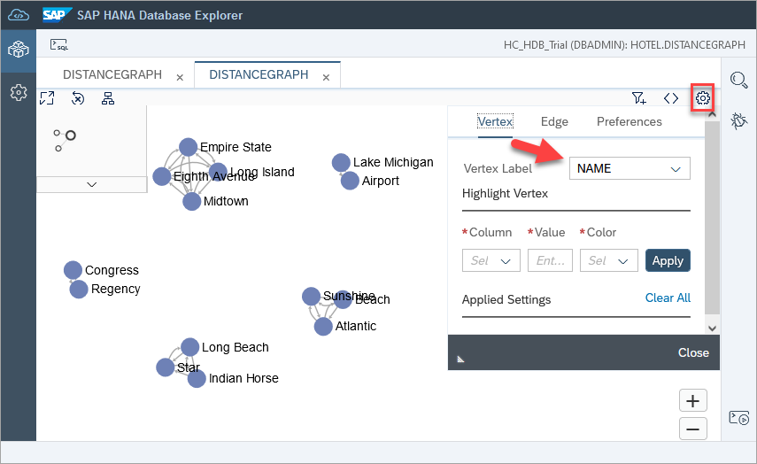
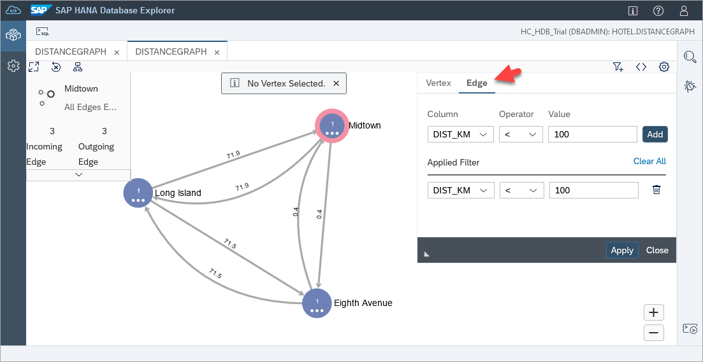
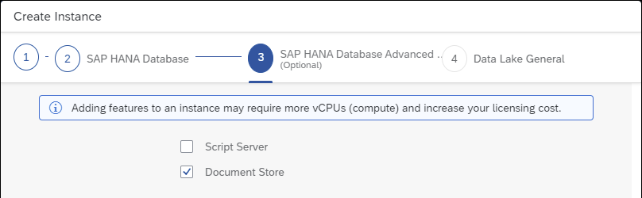
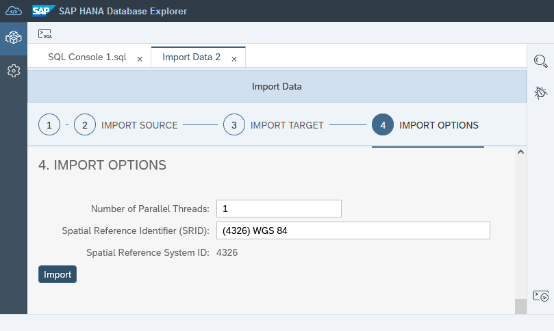
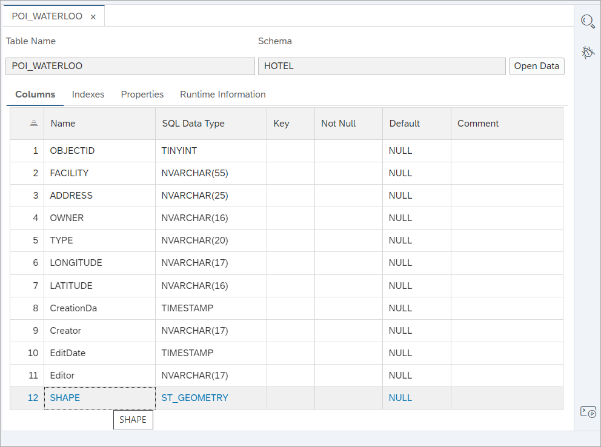
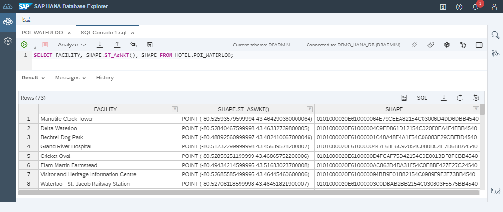
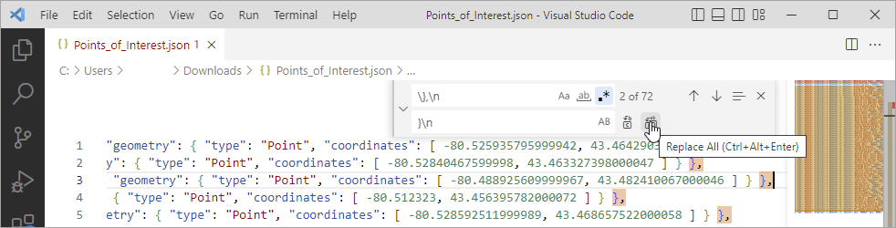
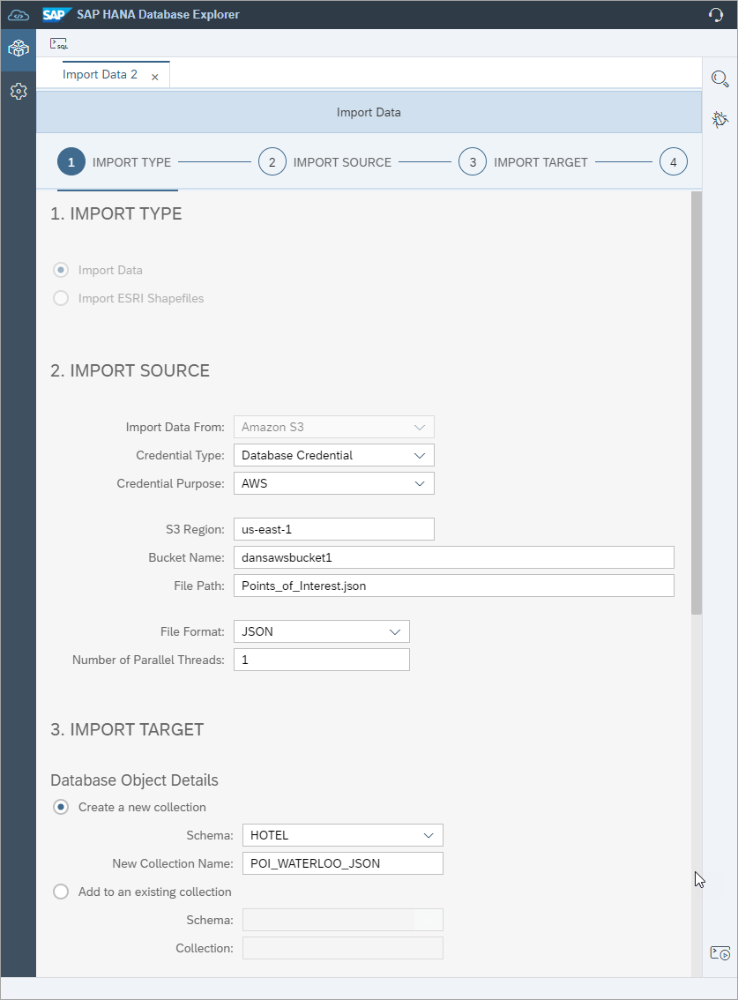
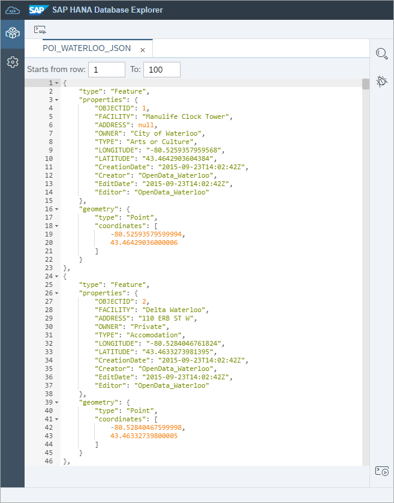
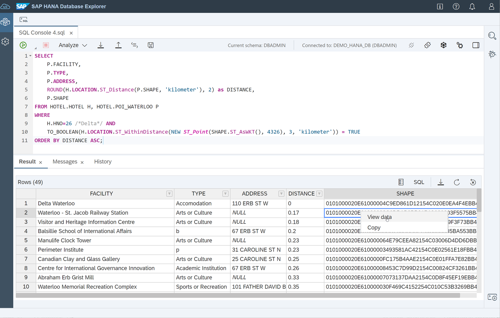

# Try Out Multi-Model Functionality with the SAP HANA Database Explorer
<!-- description --> Explore graph, JSON document store, and spatial capabilities in the SAP HANA database explorer.

## Prerequisites
 - An SAP HANA database such as SAP HANA Cloud trial or the SAP HANA, express edition that includes the SAP HANA database explorer
- You have completed the first 3 tutorials in this group.

## You will learn
  - How to create a graph, a document store, and import spatial data.
  - How the SAP HANA database explorer can be used with multi-model data.

## Intro
A graph can be used to show the connections between items such as the connections between airports or between people or groups in a social network.

SAP HANA provides the ability to store and perform queries on spatial data such as a point, a line segment, or a polygon.

This tutorial is meant to be an introduction to this topic.  For a deeper dive on the topics of graph and spatial, see the tutorial groups [Introduction to SAP HANA Spatial Data Types](group.hana-aa-spatial-get-started) and [Smart Multi-Model Data Processing with SAP HANA Cloud](group.hana-cloud-smart-multi-model-data).

---

### Create a graph workspace


The following steps will create a graph workspace that can display the distance between hotels in a state.

In SAP HANA, a graph is made up of a set of vertices and a set of edges. Vertices are stored in vertex tables, while edges are stored in edge tables. Vertex and edge tables are collectively denoted as graph tables.

1. Create a vertex table that represents distances between hotels by executing the following in the SQL console.

    ```SQL
    CREATE COLUMN TABLE DISTANCES(
      DKEY INTEGER UNIQUE NOT NULL,
      HSOURCE INTEGER NOT NULL
        REFERENCES HOTEL(HNO),
      HTARGET INTEGER NOT NULL
        REFERENCES HOTEL(HNO),
      DIST_KM DOUBLE
    );
    ```

2. Populate the vertex table with distances between hotels that are in the same state.

    ```SQL
    --Washington
    INSERT INTO DISTANCES VALUES (1, 10, 11, 11.8);
    INSERT INTO DISTANCES VALUES (2, 11, 10, 11.8);

    --New York
    INSERT INTO DISTANCES VALUES (3, 12, 13, 217.3);
    INSERT INTO DISTANCES VALUES (4, 13, 12, 217.3);
    INSERT INTO DISTANCES VALUES (5, 12, 14, 71.9);
    INSERT INTO DISTANCES VALUES (6, 14, 12, 71.9);
    INSERT INTO DISTANCES VALUES (7, 12, 15, 71.5);
    INSERT INTO DISTANCES VALUES (8, 15, 12, 71.5);
    INSERT INTO DISTANCES VALUES (9, 13, 14, 212.2);
    INSERT INTO DISTANCES VALUES (10, 14, 13, 212.2);
    INSERT INTO DISTANCES VALUES (11, 13, 15, 212.1);
    INSERT INTO DISTANCES VALUES (12, 15, 13, 212.1);
    INSERT INTO DISTANCES VALUES (13, 14, 15, 0.4);
    INSERT INTO DISTANCES VALUES (14, 15, 14, 0.4);

    --Illinois
    INSERT INTO DISTANCES VALUES (15, 16, 17, 23.5);
    INSERT INTO DISTANCES VALUES (16, 17, 16, 23.5);

    --Florida
    INSERT INTO DISTANCES VALUES (17, 18, 19, 219.8);
    INSERT INTO DISTANCES VALUES (18, 19, 18, 219.8);
    INSERT INTO DISTANCES VALUES (19, 18, 20, 323.4);
    INSERT INTO DISTANCES VALUES (20, 20, 18, 323.4);
    INSERT INTO DISTANCES VALUES (21, 19, 20, 333.8);
    INSERT INTO DISTANCES VALUES (22, 20, 19, 333.8);

    --California
    INSERT INTO DISTANCES VALUES (23, 21, 22, 149.5);
    INSERT INTO DISTANCES VALUES (24, 22, 21, 149.5);
    INSERT INTO DISTANCES VALUES (25, 21, 23, 35.7);
    INSERT INTO DISTANCES VALUES (26, 23, 21, 35.7);
    INSERT INTO DISTANCES VALUES (27, 22, 23, 163.2);
    INSERT INTO DISTANCES VALUES (28, 23, 22, 163.2);
    ```

3. Create a graph workspace.

    ```SQL
    CREATE GRAPH WORKSPACE DISTANCEGRAPH
    EDGE TABLE DISTANCES
        SOURCE COLUMN HSOURCE
        TARGET COLUMN HTARGET
        KEY COLUMN DKEY
    VERTEX TABLE HOTEL
        KEY COLUMN HNO;
    ```

4. Navigate to graph workspaces, select the previously created graph workspace, and open it to view its properties.

    

For additional information, see [SAP HANA Cloud, SAP HANA Database Graph Reference](https://help.sap.com/viewer/11afa2e60a5f4192a381df30f94863f9/latest/en-US/30d1d8cfd5d0470dbaac2ebe20cefb8f.html).


### Explore a graph using the graph viewer


1. Open the graph viewer.

    

    The graph viewer will open in a new tab as shown below.

    

2. Set the vertex and edge names using the graph viewer settings.

    Set the vertex label to `NAME`.

    

    Set the edge label to `DIST_KM`.

    

3. Optionally, adjust a few of the graph vertices to accommodate viewing by dragging and dropping graph vertices.

    

4. Apply a filter to vertices where `STATE` is NY.  After specifying the filter, press the Add button and then apply it by pressing the Apply button.

    

     Apply a filter to edges where `DIST_KM` is less than 100.

    

5. Highlight the Long Island vertex using the graph viewer settings. You may do so by selecting a colour. 

    

Additional graph examples include the [Greek Mythology Graph Example](https://help.sap.com/viewer/f381aa9c4b99457fb3c6b53a2fd29c02/2.0.04/en-US/071d7b7349f04e419507387c271dce8f.html) and [Open Flights](https://help.sap.com/viewer/11afa2e60a5f4192a381df30f94863f9/latest/en-US/071d7b7349f04e419507387c271dce8f.html).  The company graph example does not currently display in the SAP HANA database explorer graph viewer as it does not currently support the display of homogeneous graphs.


### Use graph algorithms in the SAP HANA database explorer

The shortest path algorithm can be used to provide the optimal route between two vertices. The nearest neighbor algorithm can be used to show only the vertices that are connected to a specified vertex.

The following steps will walk through using the shortest path algorithm to determine the optimal route from Airport Hotel in Rosemont, IL to Regency Hotel in Seattle, WA.

1. Execute the following in SQL to add a few connections between hotels in different states.

    ```SQL
    --Midtown New York to Lake Michigan Chicago
    INSERT INTO DISTANCES VALUES (29,14,16,1227);
    INSERT INTO DISTANCES VALUES (30,16,14,1227);

    --Long Island New York to Lake Michigan Chicago
    INSERT INTO DISTANCES VALUES (31,12,16,1357);
    INSERT INTO DISTANCES VALUES (32,16,12,1357);

    --Long Island New York to Beach Florida
    INSERT INTO DISTANCES VALUES (33,12,19,1738);
    INSERT INTO DISTANCES VALUES (34,19,12,1738);

    --Congress Seattle to Star California
    INSERT INTO DISTANCES VALUES (35,10,23,1817);
    INSERT INTO DISTANCES VALUES (36,23,10,1817);

    --Indian Horse California to Beach Florida
    INSERT INTO DISTANCES VALUES (37,22,19,3861);
    INSERT INTO DISTANCES VALUES (38,19,22,3861);

    --Atlantic Florida to Long Beach California
    INSERT INTO DISTANCES VALUES (39,20,21,4348);
    INSERT INTO DISTANCES VALUES (40,21,20,4348);
    ```

2. After removing the previously applied filters, navigate to the graph viewer, and select the algorithms tab. Update the Algorithm field to "Shortest Path", specify the values shown below, and click Apply.

    


### Create, populate, and query a JSON collection (optional)


SAP HANA provides the ability to store and query JSON data.  This can be useful if the schema of the data is often changed or if you wish to join data in SQL queries that comes from both SQL tables and JSON data.

The following steps will demonstrate how to create a JSON collection that can be used to collect notes about customers staying at a hotel.

>The creation of a JSON collection is not supported in the SAP HANA Cloud free tier or trial.

1. Enable the JSON document store.  

    For an SAP HANA Cloud database, in the creation wizard, or for an existing instance, the Manage Configuration dialog, enable the document store.  

    

    For an on-premise server, add the document service as described at [Enable the SAP HANA JSON Document Store](https://help.sap.com/viewer/3e48dd3ad36e41efbdf534a89fdf278f/latest/en-US/28334f8e631c447598d2591305b28660.html).

2. Create a collection named `GUEST_NOTES`.

    ```SQL
    CREATE COLLECTION GUEST_NOTES;
    ```

3. Insert some data.

    ```SQL
    INSERT INTO GUEST_NOTES VALUES ('{"FIRST_NAME": "Jenny", "LAST_NAME": "Porter", "REQUEST": "requested a courtesy call at 7:00 am"}');
    INSERT INTO GUEST_NOTES VALUES ('{"FIRST_NAME": "Jenny", "LAST_NAME": "Porter", "REQUEST": "requested an extra blanket"}');
    INSERT INTO GUEST_NOTES VALUES ('{"title": "Mr.", "FIRST_NAME": "Peter", "LAST_NAME": "Brown", "REQUEST": "requested an earl grey at 2:00"}');
    ```

    Notice that the structure of the Guest Notes does not need to be defined in advance.

    >JSON collections can also be populated using the import data wizard.  

4. The JSON data can be returned as a JSON document, in a tabular result, or can be joined with data from a table.

    ```SQL
    SELECT * FROM GUEST_NOTES;  --returns JSON

    SELECT FIRST_NAME, LAST_NAME, REQUEST FROM GUEST_NOTES; --returns tabular result

    WITH myJSON AS (SELECT GUEST_NOTES FROM GUEST_NOTES)
        SELECT '[' || STRING_AGG(TO_NVARCHAR(GUEST_NOTES), ',') || ']' FROM myJSON;  --returns all the results as one JSON document

    WITH GN_VIEW AS (SELECT FIRST_NAME, LAST_NAME, REQUEST FROM GUEST_NOTES) --joins a collection with a table
        SELECT DISTINCT GN_VIEW.REQUEST, C.FIRSTNAME, GN_VIEW.LAST_NAME, C.ADDRESS
        FROM GN_VIEW INNER JOIN CUSTOMER AS C ON GN_VIEW.LAST_NAME = C.NAME;
    ```

    

    For additional details see the [SELECT Statement](https://help.sap.com/viewer/f2d68919a1ad437fac08cc7d1584ff56/latest/en-US/991ab0d69db542e992a61b4b40f348e8.html) in the JSON Document Store guide.

5. The properties of the JSON collection can also be viewed.  

    

    Click on the glasses icon to view the JSON text.

    

### Import and view spatial data


This step will import an [`ESRI shapefile`](https://help.sap.com/viewer/bc9e455fe75541b8a248b4c09b086cf5/latest/en-US/b8dface938cd467bb5a224952ed9fcc8.html) or optionally a `GeoJSON` file containing points of interest in the city of Waterloo Ontario.  The `ESRI shapefile` import will result in a table while the JSON import will result in a JSON Collection.  In the following step, a search will be performed to return the closest points of interest to the Delta hotel located in Waterloo.

1. At the [ARCGIS Hub](https://hub.arcgis.com/search), search for **`Points of Interest in Waterloo`**.  Scroll through the results and choose the selection below.

    

2. Choose to download the data as a `shapefile`.  The final sub-steps provide some details on how a `GeoJSON` file can be imported.

    


3. To import a `shapefile`, start the import data wizard.

    


    Choose **Import ESRI Shapefiles** and select the `Points_of_Interest.zip` file.

    

    >If importing an `ESRI Shapefile` from a cloud storage provider, the file must be unzipped, and the object name would be `folder_name/shapefle_name_minus_the_shp_extension`.

4. Choose to import the `ESRI shapefile` into the schema **HOTEL**.  

    Within the downloaded `ESRI shapefile`, there is a file named `Points_of_Interest.prj`.  This file mentions the spatial reference system used by this `ESRI shapefile`.  Specify **WGS 84** as the spatial reference system.

    

    >By default, the database server adds the following [spatial reference systems](https://help.sap.com/viewer/bc9e455fe75541b8a248b4c09b086cf5/latest/en-US/7a2ea357787c101488ecd1b725836f07.html) to a new database. Additionally, the [`ST_SPATIAL_REFERENCE_SYSTEMS`](https://help.sap.com/viewer/c1d3f60099654ecfb3fe36ac93c121bb/cloudC/en-US/d23499bcd2951014ad38a3bd89faf03e.html) System View can be queried for available spatial reference systems.

5. Rename the imported table as it was created using mixed case.

    ```SQL
    RENAME TABLE "Points_of_Interest" TO POI_WATERLOO;
    ```

6. View the table.  Notice that the points of interest locations are stored in a column of type `ST_GEOMETRY`.

    

7. Select **Open Data** to view the raw data, and select **View Spatial Data** on the SHAPE column of a point of interest. You may choose to select one or multiple points of interest.

    

    The selected location(s) is shown on a map. You can view more details about the point of interest by clicking on a map marker.

    

    >The Leaflet map is not shown in on-premise installs of the SAP HANA database explorer.

8. Perform the below query.

    ```SQL
    SELECT FACILITY, SHAPE.ST_AsWKT(), SHAPE FROM POI_WATERLOO;
    ```

    Notice that the location data can be formatted in a more readable format using the methods `ST_AsWKT` or `ST_AsEWT` which in addition shows the SRID.

    

    Additional details on spatial reference systems can be found at [SAP HANA Spatial Reference for SAP HANA Cloud](https://help.sap.com/viewer/bc9e455fe75541b8a248b4c09b086cf5/latest/en-US/7a2ea357787c101488ecd1b725836f07.html).

9. Optionally follow the rest of the sub-steps to import a `GeoJSON` file as a JSON Collection.

    After downloading the file, rename the file to have a `.json` file extension, instead of `.geojson`.

10. Open the file in n Microsoft VS Code.

    Remove the extra metadata at the beginning and end so that the file only contains a JSON document on each line.

    Remove the commas at the end of each line.  Press Ctrl F and use a regular expression search and replace to search for `\},\n` and replace it with `}\n`.

    

    To see the required formatting for importing JSON documents, see [SAP HANA Database JSON Document Store Guide](https://help.sap.com/docs/HANA_CLOUD_DATABASE/f2d68919a1ad437fac08cc7d1584ff56/d2ee307ee64145b1867fbd95b0f1ba88.html?version=2021_2_QRC).

11. Upload the file to a cloud storage provider.

    See [Export and Import Data and Schema with SAP HANA Database Explorer](hana-dbx-export-import) for more information.

12. Start the import data wizard.

    

    Choose **Import Data** and provide the credentials to the storage bucket containing the JSON file.

13. Choose to import the JSON file into the schema **HOTEL** and name the collection **`POI_WATERLOO_JSON`**.

    

    Alternatively, a text-based import of the JSON file may be used:

    ```SQL
    CREATE COLLECTION POI_WATERLOO_JSON;
    IMPORT FROM JSON FILE 's3-us-east-1://dansawsbucket1/Points_of_Interest.json' INTO POI_WATERLOO_JSON WITH FAIL ON INVALID DATA CREDENTIAL 'AWS';
    ```

    After the import completes and the catalog is refreshed, a new JSON collection will appear.

    

    Click on the `glasses` icon to open the JSON document viewer.

    

14. The following SQL queries show a few examples of querying the imported JSON data including the last query which can be shown on the map viewer.

    ```SQL
    SELECT * FROM POI_WATERLOO_JSON;  --JSON data format. Can use the built-in viewer.

    SELECT "properties".FACILITY as name, "properties".TYPE as type, "geometry" as geometry FROM POI_WATERLOO_JSON;  --Can return data in column format.

    SELECT "properties".FACILITY as name, "properties".TYPE as type, JSON_VALUE("geometry", '$.coordinates[0]') as long, JSON_VALUE("geometry", '$.coordinates[1]') as lat FROM POI_WATERLOO_JSON; --Can return longitude and latitude

    SELECT "properties".FACILITY as name, "properties".TYPE as type, ST_GeomFromGeoJSON("geometry", 4326) as shape FROM POI_WATERLOO_JSON; --Can now be shown in the map viewer
    ```

    Additional details can be found at [JSON_VALUE Function](https://help.sap.com/docs/HANA_CLOUD_DATABASE/c1d3f60099654ecfb3fe36ac93c121bb/9355cb9e45a149c1a6ddb2bd2392d864.html) and [ST_GeomFromGeoJSON](https://help.sap.com/docs/HANA_CLOUD_DATABASE/bc9e455fe75541b8a248b4c09b086cf5/40771e89ed1641e88674b45adb2ef6a1.html).


### Use spatial functions in a query


1. The following statement shows the list of points of interest within 3 kilometers of the `Delta` hotel.

    ```SQL
    SELECT
        P.FACILITY,
        P.TYPE,
        P.ADDRESS,
        ROUND(H.LOCATION.ST_Distance(P.SHAPE, 'kilometer'), 2) as DISTANCE,
        P.SHAPE
    FROM HOTEL H, POI_WATERLOO P
    WHERE
        H.HNO=26 /*Delta*/ AND
        TO_BOOLEAN(H.LOCATION.ST_WithinDistance(NEW ST_Point(SHAPE.ST_AsWKT(), 4326), 3, 'kilometer')) = TRUE
    ORDER BY DISTANCE ASC;
    ```

    Each point can be viewed as shown below.

    

    

    Alternatively, all the points can be shown together.

    ```SQL
    SELECT
        ST_UnionAggr(P.SHAPE)
    FROM HOTEL H, POI_WATERLOO P
    WHERE
        H.HNO=26 /*Delta*/ AND
        TO_BOOLEAN(H.LOCATION.ST_WithinDistance(NEW ST_Point(SHAPE.ST_AsWKT(), 4326), 3, 'kilometer')) = TRUE;
    ```

    

    >The map may not display if the byte limit is exceeded. The byte limit can be changed in the SQL console settings.

    For additional details, see [ST_Point Type](https://help.sap.com/viewer/bc9e455fe75541b8a248b4c09b086cf5/latest/en-US/7a29e653787c1014813b997510a8cc06.html), [ST_Distance](https://help.sap.com/viewer/bc9e455fe75541b8a248b4c09b086cf5/latest/en-US/7a182aa3787c101481f996e3d419c720.html), [ST_WithinDistance](https://help.sap.com/viewer/bc9e455fe75541b8a248b4c09b086cf5/latest/en-US/7a1cc028787c1014b4afe2c72ff94316.html), and [ST_UnionAggr Method](https://help.sap.com/docs/HANA_CLOUD_DATABASE/bc9e455fe75541b8a248b4c09b086cf5/601aa9fb93e241af96faafcb8f01b12e.html).

    To view all access methods for spatial data, see [SAP HANA Spatial Reference for SAP HANA Cloud - Accessing and Manipulating Spatial Data](https://help.sap.com/viewer/bc9e455fe75541b8a248b4c09b086cf5/latest/en-US/7a2d11d7787c1014ac3a8663250814c2.html).

    >The latitude and longitude for a location in Google Maps can be obtained for a given address via the marker's context menu.  

    >

    >It should also be noted that when a used in a ST_POINT, x is longitude and y is latitude so the above point would be represented as `NEW ST_Point('POINT (-94.71832 32.50459)', 4326)`.

### Knowledge check

Congratulations! You have explored a few of the multi-model features in SAP HANA and are now familiar with graph workspaces, JSON collections, and spatial data when using the SAP HANA database explorer.


---
