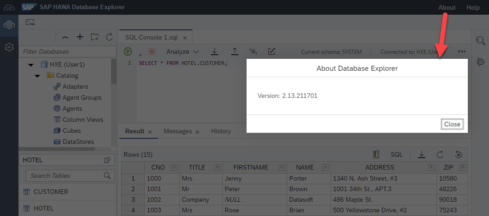
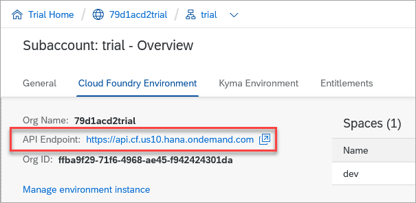
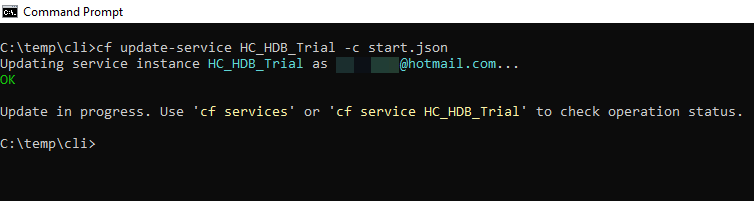

# SAP HANA Database Explorer Overview
<!-- description --> Learn about the SAP HANA database explorer and how to start using it with SAP HANA Cloud free tier, trial, SAP HANA, express edition, or SAP HANA Cloud Guided Experience.

## Prerequisites
 - A machine that can run SAP HANA, express edition if the other options are not used

## You will learn
  - About the features provided by the SAP HANA database explorer
  - Details about the version differences between the SAP HANA database explorer in SAP HANA Cloud and in an on-premise installation such as SAP HANA, express edition
  - How to get started with SAP HANA Cloud free tier, trial, SAP HANA, express edition, or SAP HANA Cloud Guided Experience
---


## Intro
> Access help from the SAP community or provide feedback on this tutorial by navigating to the "Feedback" link located on the top right of this page.

### SAP HANA database explorer overview

The SAP HANA database explorer is a web-based tool for browsing and working with SAP HANA database objects such as tables, views, functions, stored procedures, importing and exporting data, executing SQL statements, creating remote sources, working with multi-model data such as graph, spatial and JSON collections, debugging SQLScript, viewing trace files, and troubleshooting.  

It was previously named SAP HANA Runtime Tools (HRTT) and was introduced in SAP HANA 1.0 SPS 12. As it is web-based, individual users do not need to worry about installing the software or applying patches.  The SAP HANA Cloud version offers support for data lake Relational Engine connections, and as of March 14 2022, support was added for the data lake Files container.


> The following tools also provide the ability to execute SQL queries.

  * `hdbsql` is a text-based tool that can be used to query an SAP HANA database.  For additional details see [Use Clients to Query an SAP HANA Database](mission.hana-cloud-clients).

  * `dbisql` is a tool that can be used to query a data lake Relational Engine. For additional details see [Use Clients to Query Data Lake Relational Engine](group.hana-cloud-clients-data-lake).

  * [SAP HANA Database Explorer for Visual Studio Code](https://marketplace.visualstudio.com/items?itemName=SAPSE.hana-database-explorer&ssr=false#overview) is an extension for Visual Studio Code that offers a subset of the functionality in the SAP HANA database explorer.

The SAP HANA database explorer can be opened from multiple locations as shown below:

* From SAP HANA Cloud Central on either a SAP HANA or SAP data lake instance.

    

* From the SAP HANA cockpit  

    

* From the SAP Business Technology Platform (SAP BTP) Cockpit from an SAP HANA or Data Lake instance when the instances are deployed into a Cloud Foundry space.

    

* From the Business Application Studio in a SAP HANA Native Application development space

    

    The command palette or the SAP HANA Projects panel can be used to open the SAP HANA database explorer.

    

* From the SAP Web IDE for SAP HANA with the extension enabled

    

    >Once the SAP HANA database explorer extension is enabled, the SAP HANA database explorer can be shown by selecting the icon highlighted above.

The following are some related documentation links for SAP HANA and the SAP HANA database explorer.

|  Version     | Notes |
|  :------------- | :------------- |
|  [SAP HANA Platform 2.0](https://help.sap.com/viewer/product/SAP_HANA_PLATFORM/latest/en-US) | Released in November 2016. Current version is 2.0 SPS 06, which was released in December, 2021 |
|  [SAP HANA Platform 2.0, SAP HANA Database Explorer](https://help.sap.com/viewer/e8d0ddfb84094942a9f90288cd6c05d3/latest/en-US) | Current version is 2.15, which was released in October 2022 |
|  [SAP HANA Platform 2.0, SAP HANA Database Explorer What's New](https://help.sap.com/docs/SAP_HANA_COCKPIT/a1199348948f4579b6bc3b7153999749/b30dd56165f3407e8fbce88aaf2c9b27.html) | What's new since the previous on-premise release.  New features are released approximately twice per year |
|  [SAP Web IDE for SAP HANA](https://help.sap.com/viewer/product/SAPWEBIDE/SAPWEBIDE4HANA/en-US) | SAP Help documentation set |
|  [SAP HANA, express edition](https://help.sap.com/viewer/product/SAP_HANA,_EXPRESS_EDITION/latest/en-US)   | Released in September 2016.  Current version is 2.0 SPS 06 |
|  [SAP HANA, express edition, release notes for SPS 06, revision 61](https://www.sap.com/documents/2022/05/aca852e1-2a7e-0010-bca6-c68f7e60039b.html)  | The version of the Database Explorer (HRTT) for this release is  2.15 |
|  [SAP HANA Cloud](https://help.sap.com/viewer/product/HANA_CLOUD)   | Released in March 2020 with quarterly new releases |
|  [SAP HANA Cloud, SAP HANA Database Explorer](https://help.sap.com/viewer/a2cea64fa3ac4f90a52405d07600047b/cloud/en-US)   | New features are released as often as every two weeks. |
|  [SAP HANA Cloud, SAP HANA Database Explorer What's New](https://help.sap.com/whats-new/2495b34492334456a49084831c2bea4e?Category=SAP%20HANA%20Database%20Explorer&locale=en-US)   | What's New.  This link is also available from the Help menu in the database explorer. A filter can be applied to limit results to SAP HANA database explorer updates only. |


### Version information

The SAP HANA database explorer releases independently of SAP HANA.  New features appear first in SAP HANA Cloud and are available to the on-premise version if applicable, in a later release.  Features are also enabled based on the database being connected to.  For example, the option to export data or catalog objects to the SAP HANA database's file system is not supported in SAP HANA Cloud where users do not have access to the file system unlike an on-premise install of SAP HANA.

The screenshots below show the version of the SAP HANA database explorer in SAP HANA Cloud and on-premise.  

The image below shows the SAP HANA database explorer running in the SAP BTP.  


The image below shows the SAP HANA database explorer running in an on-premise installation.  



For the on-premise edition, only the currently released version receives patches.  For example, now that version 2.15.X has been released, there will no longer be fixes made to  the 2.14.X release.  For additional details see [SAP Note 2433181 - SAP HANA 2.0 Cockpit Revision and Maintenance Strategy](https://launchpad.support.sap.com/#/notes/2433181).

The SAP Software download links (requires an S-User ID to access) below are for the on-premise version of the SAP HANA Cockpit, the SAP Web IDE, and the SAP HANA database explorer.  These pages also contain links to release notes that describe fixes made to each release.

[SAP HANA Cockpit Download from SAP Software Downloads](https://launchpad.support.sap.com/#/softwarecenter/search/sap%2520hana%2520cockpit) (Includes the SAP HANA database explorer)

[SAP HANA Web IDE Download from SAP Software Downloads](https://launchpad.support.sap.com/#/softwarecenter/search/SAP%2520WEB%2520IDE%25202)

[SAP HANA Runtime Tools 2.0](https://launchpad.support.sap.com/#/softwarecenter/search/XSACHRTT) (Adds the SAP HANA database explorer to the SAP HANA Web IDE)


### SAP HANA Cloud free tier or trial

To complete the tutorials in this group, an SAP HANA instance is needed. Steps 3 and 6 in this tutorial provide two  different, free options that can be used to set up an SAP HANA instance.  Only one of these steps needs to be completed if you currently do not have access to an SAP HANA instance.  Alternatively, step 7 provides a quick and easy way to try out SAP HANA Cloud although you will be given access to a user with fewer permissions.  Trial is only available on the US10 landscape and is in a separate SAP BTP trial account whereas free tier is avialable in multiple production SAP BTP accounts and provides a seamless transition from a free tier to a paid plan.

Continue on to the next tutorial in this group once you have access to an SAP HANA instance.


>SAP HANA Cloud free tier or trial instances are shut down overnight and will need to be restarted before working with them the next day. Details on how to start or manage your free tier or trial instance can be viewed at [Provision an Instance of SAP HANA Cloud, SAP HANA Database](hana-cloud-mission-trial-2) or via the Cloud Foundry CLI in the next step.

>---

>In QRC 3 of 2022, a new version of the SAP HANA Cloud tools (SAP HANA Cloud Central, SAP HANA cockpit, and SAP HANA database explorer) was released.  SAP BTP provides multiple runtime environments such as Kyma and Cloud Foundry. When a HANA Cloud or data lake instance is created, it can be provisioned at the BTP subaccount or in a Cloud Foundry space.  The runtime environment label in SAP HANA Cloud Central or in the SAP BTP Cockpit indicates where the instance has been provisioned with the value of Other Environments indicating that it was provisioned at the SAP BTP subaccount.  Further details can be found at [SAP HANA Cloud goes multi-environment](https://blogs.sap.com/2022/09/21/sap-hana-cloud-goes-multi-environment-part-1-feature-overview/).

The instructions on how to setup a free SAP HANA Cloud free tier or trial within SAP BTP are well covered in several other sources listed below.  

  * [Help Thomas Get Started with SAP HANA](hana-trial-advanced-analytics) (Only the first 3 steps of this tutorial are needed for basic setup of SAP HANA Cloud.)

  * [Set Up Your SAP HANA Cloud, SAP HANA Database (free tier or trial) and Understand the Basics](group.hana-cloud-get-started-1-trial)

  * [SAP Learning Journey - Provisioning and Administration with SAP HANA Cloud](https://learning.sap.com/learning-journey/provisioning-and-administration-with-sap-hana-cloud)

  * [SAP Discovery Center - SAP HANA Cloud, SAP HANA Database Fundamentals](https://discovery-center.cloud.sap/protected/index.html#/missiondetail/3643/)

  For more information on the SAP BTP see the following:

  * <https://www.sap.com/products/business-technology-platform/products.html>

  * <https://developers.sap.com/topics/business-technology-platform.html>

  * <https://help.sap.com/viewer/product/BTP/Cloud/en-US>

### Manage SAP HANA Cloud using the BTP CLI (optional)

The Business Technology Platform Command Line Interface (BTP CLI) can be used with SAP HANA Cloud instances provisioned using the multi-environment tooling.  The multi-environment tooling provisions instances into the subaccount rather than into a Cloud Foundry space.


The BTP CLI provides the ability to manage an instance from the command line.  For information on installation, setup, and operations available with the BTP CLI, refer to the documentation [Account Administration Using the SAP BTP Command Line Interface (btp CLI)](https://help.sap.com/docs/BTP/65de2977205c403bbc107264b8eccf4b/7c6df2db6332419ea7a862191525377c.html).  The video [BTP Onboarding: BTP CLI](https://www.youtube.com/watch?v=eFOjC4OAp2w&list=PLkzo92owKnVw3l4fqcLoQalyFi9K4-UdY&index=5) from the SAP HANA Academy may also be of interest.

The following steps demonstrate how an instance can be started using the BTP CLI.

1. Download the latest version of the BTP CLI from [SAP Development Tools](https://tools.hana.ondemand.com/#cloud-cpcli). Follow the steps to extract the client executable from the tar.gz archive depending on your operating system.:
    - Windows: Extract the tar.gz archive with `tar -vxzf <tar.gz name>`
    - Linux: Use the terminal to extract the tar.gz archive with `tar -vxzf <tar.gz name>`
    - macOS: Open the `tar.gz` file with a double click

    Then add it to your PATH, open a new terminal, and run `btp`.

2. Once installation is successful, login using the BTP CLI.  You can find your global account subdomain in the BTP Cockpit.

    

    ```Shell
    btp login
    ```

    

    >Make sure that the region (such as eu10) in the CLI server URL matches the region of your SAP BTP Cockpit URL.

    >---

    >If you have single sign-on configured, you can use the --sso option.


3. Set your target subaccount where the desired instance is located.

    ```Shell
    btp target --subaccount <subaccount id>
    ```

    

4. The `hana` service can be started with a file named `start.json` with the below contents and the following command.

    ```JSON
    {
    	"data":
    	{
    		"serviceStopped":false
    	}
    }
    ```

    ```Shell
    btp update services/instance --name <instance name> --parameters start.json
    ```

    

    >SAP HANA Cloud Central provides an option in the actions menu to copy the JSON configuration of a running instance.  

    >


### Manage SAP HANA Cloud using the Cloud Foundry CLI (optional)

The Cloud Foundry Command Line Interface (cf CLI) provides users another option for managing their SAP HANA Cloud instances that are provisioned in Cloud Foundry spaces.


The software can be downloaded from the [Cloud Foundry Foundation](https://github.com/cloudfoundry/cli/releases) and is available for Windows, Linux, and macOS operating systems. The following steps will demonstrate how to start and manage an SAP HANA Cloud instance using the CLI.

1. Complete the installation process by following the guide [Installing the cf CLI](https://docs.cloudfoundry.org/cf-cli/install-go-cli.html).

2. Copy the API endpoint from your SAP HANA Cloud account. This information can be found on the Overview page of your SAP BTP Cockpit. The API endpoint is listed under the Cloud Foundry subheading. Save the API endpoint for use in the next step.

    

3. In your terminal, type the following command. Replace the API endpoint with the one you copied from the previous step:

    ```Shell
    cf api https://api.cf.XXXX.hana.ondemand.com
    ```
    You will be asked to login with the email and password on your SAP HANA Cloud account. Finally, you will be prompted to select your targeted space within your account. Additional details on logging in can be found at [Getting Started with the CF CLI](https://docs.cloudfoundry.org/cf-cli/getting-started.html#user-cups).

    

4. Next, view the list of services.

    ```Shell
    cf services
    ```

    

5. The `hana` service can be started with a file named `start.json` with the below contents and the following command.

    ```JSON
    {
    	"data":
    	{
    		"serviceStopped":false
    	}
    }
    ```

    ```Shell
    cf update-service HC_HDB_Trial -c start.json
    ```
    
    

For more information on the operations available with the Cloud Foundry CLI, refer to the documentation [Using the Cloud Foundry CLI with SAP HANA Cloud](https://help.sap.com/viewer/9ae9104a46f74a6583ce5182e7fb20cb/hanacloud/en-US/921f3e46247947779d69b8c85c9b9985.html).  

>SAP HANA Cloud Central provides an option in the actions menu to copy the JSON configuration of a running instance.  This can be used with the `cf create-service` command perhaps to create multiple instances of a database configured in the same way.

>

>---

>Another tool that can be used to manage an SAP HANA Cloud instance is the SAP Automation Pilot.  It provides commands for working with an SAP HANA Cloud instances as well as Cloud Foundry applications.  The below is an example command used to stop an SAP HANA Cloud instance.  

>

>The Automation Pilot also provides a scheduler and integration with SAP Alert Notification Service.  For further details see [Take Action Following a SAP HANA Cloud Database Alert with SAP Automation Pilot](hana-cloud-alerts-autopilot).

### SAP HANA, express edition

>This step only needs to be completed if you currently do not have access to an SAP HANA instance and did not setup an SAP HANA instance through the SAP HANA Cloud as explained in step 3.

An alternative option to using the SAP HANA Cloud free tier or trial is to use the SAP HANA, express edition.  SAP provides a free, streamlined version of SAP HANA that runs on developer laptops called [SAP HANA, express edition](https://www.sap.com/products/technology-platform/hana/express-trial.html).

SAP HANA runs on a few versions of Linux.  SAP HANA, express edition provides a binary install as well as virtual machine images that can be run on Microsoft Windows, macOS and Linux machines.  This is described in the [Getting Started with SAP HANA 2.0, express edition (Binary Installer Method)](https://help.sap.com/docs/SAP_HANA,_EXPRESS_EDITION/32c9e0c8afba4c87814e61d6a1141280) or [Getting Started with SAP HANA 2.0, express edition (Virtual Machine Method)](https://help.sap.com/docs/SAP_HANA,_EXPRESS_EDITION/8c3bbc4a904d42efac77c09da0bccf64).  The applications option adds XS Advanced, the SAP HANA cockpit, the SAP HANA database explorer, and the SAP HANA Web IDE for SAP HANA.


>The full install requires sufficient disk space and memory (32 GB).

Once installed, a useful starting point is the page below.  


It contains links to the SAP Web IDE for SAP HANA, SAP HANA cockpit, and the SAP HANA cockpit manager.

### SAP HANA Cloud Guided Experience
The SAP HANA Cloud Guided Experience provides a database user and password that has access to a specific schema free for 30 days.  The database user can be used with the SAP HANA cockpit and SAP HANA database explorer.  The provided database user can be used to create database objects within the provided schema but cannot create new schemas or users.  To register, open the SAP HANA Cloud product page and select Experience SAP HANA Cloud.


A set of guided tours is also available by clicking on the SAP logo in the bottom right. 


### Knowledge check

Congratulations!  You have configured an instance of SAP HANA, either through the SAP HANA Cloud free tier, trial, or SAP HANA, express edition. You've also learned how to start, stop, and manage an instance of SAP HANA Cloud via the Cloud Foundry Command Line Interface.

---
