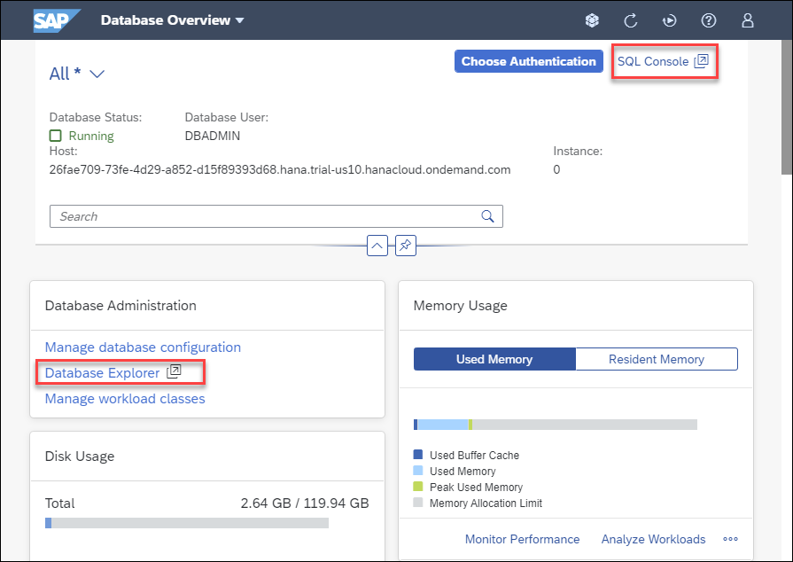
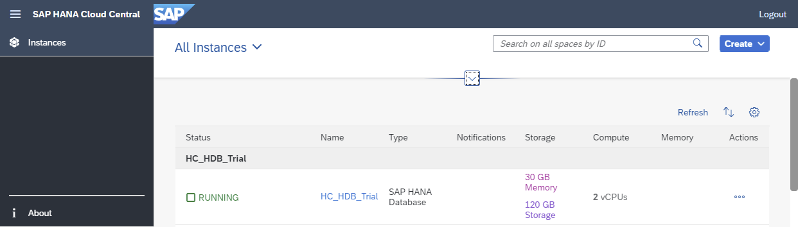

## Prerequisites
 - An SAP HANA database such as SAP HANA Cloud trial or the SAP HANA, express edition that includes the SAP HANA database explorer

## Details
### You will learn
  - About the features provided by the SAP HANA database explorer
  - Details about the version differences between the SAP HANA database explorer in SAP HANA Cloud and in an on-premise installation (SAP HANA, express edition)
  - How to get started with the SAP HANA Cloud trial or SAP HANA, express edition

---

[ACCORDION-BEGIN [Step 1: ](Database explorer overview)]

The SAP HANA database explorer  is a web-based tool for browsing and working with database objects such as tables, views, functions, stored procedures, debugging SQLScript, viewing trace files, and executing SQL statements. It was previously named SAP HANA Runtime Tools (HRTT) and was introduced in SAP HANA 1.0 SPS 12. As it is web-based, individual users do not need to worry about installing the software or applying patches.  

The SAP HANA database explorer can be opened from multiple locations as shown below:

* From the SAP Cloud Platform Cockpit  

    

* From the SAP HANA cockpit  

    

* From the SAP Web IDE for SAP HANA.  

    

    >Once the SAP HANA database explorer extension is enabled, the SAP HANA database explorer can be shown by selecting the icon highlighted above.

The following are some related documentation links for SAP HANA and the SAP HANA database explorer.

|  Version     | Notes
|  :------------- | :-------------
|  [SAP HANA Platform 2.0](https://help.sap.com/viewer/product/SAP_HANA_PLATFORM/latest/en-US) | Released in November 2016. Current version is 2.0 SPS 05, which was released on June 26, 2020
|  [SAP HANA Platform 2.0, SAP HANA Database Explorer](https://help.sap.com/viewer/e8d0ddfb84094942a9f90288cd6c05d3/latest/en-US) | Current version is 2.12, which was released in June 2020
|  [SAP HANA Platform 2.0, SAP HANA Database Explorer What's New](https://help.sap.com/viewer/e8d0ddfb84094942a9f90288cd6c05d3/latest/en-US/7534f22d5bbf44c3a0de259478ad043b.html) | What's new since the previous on-premise release.  New features are released approximately twice per year
|  [SAP Web IDE for SAP HANA](https://help.sap.com/viewer/product/SAPWEBIDE/SAPWEBIDE4HANA/en-US) | SAP Help documentation set
|  [SAP HANA, express edition](https://help.sap.com/viewer/product/SAP_HANA,_EXPRESS_EDITION/latest/en-US)   | Released in September 2016.  Current version is 2.0 SPS 04 Revision 45
|  [SAP HANA, express edition, release notes for SPS 04, revision 45](https://developers.sap.com/topics/sap-hana.html#pdf-asset=1eaee4fa-857d-0010-87a3-c30de2ffd8ff&page=1)  | Note that the version of the Database Explorer (HRTT) for this release is  2.11.64
|  [SAP HANA, express edition, release history](https://search.sap.com/search.html?t=%22SAP%20HANA%2C%20express%20edition%202.0%20SPS%200%25%20Revision%22&n=1&s=boost&src=defaultSourceGroup)   | Query showing previous releases
|  [SAP HANA Cloud](https://help.sap.com/viewer/product/HANA_CLOUD/cloud/en-US)   | Released in March 2020
|  [SAP HANA Cloud, SAP HANA Database Explorer Documentation](https://help.sap.com/viewer/a2cea64fa3ac4f90a52405d07600047b/cloud/en-US)   | Current version is 2.13.x
|  [SAP HANA Cloud, SAP HANA Database Explorer What's New](https://help.sap.com/viewer/a2cea64fa3ac4f90a52405d07600047b/cloud/en-US/7a0c586f5a4e442d976459e0f0a70c7a.html)   | What's new.  New features are released approximately every month or two  

[DONE]
[ACCORDION-END]

[ACCORDION-BEGIN [Step 2: ](Version information)]
The SAP HANA database explorer releases independently of SAP HANA.  New features appear first in SAP HANA Cloud and are available to the on-premise version in a later release.  As an example, when SAP HANA 2.0 SPS 05 was released on June 26 2020, SAP HANA database explorer version 2.12.20185 was available in both the on-premise and SAP HANA Cloud releases.  At the time when this was published in October 2020, the version available in HANA Cloud contains additional features that that are not yet available for an on-premise installation.

The screenshots below show the version of the SAP HANA database explorer in SAP HANA Cloud and on-premise.  

The image below shows the SAP HANA database explorer running in SAP HANA Cloud.  

The image below shows the SAP HANA database explorer running in an on-premise installation.  

For the on-premise edition, only the currently released version receives patches.  For example, now that version 2.12.X has been released, there will no longer be fixes made to  the 2.11.X release.  For additional details see [SAP Note 2433181 - SAP HANA 2.0 Cockpit Revision and Maintenance Strategy](https://launchpad.support.sap.com/#/notes/2433181).

The SAP Software download links (requires an S-User ID to access) below are for the on-premise version of the SAP HANA Cockpit, the SAP Web IDE, and the SAP HANA database explorer.  These pages also contain links to release notes that describe fixes made to each release.

[SAP HANA Cockpit Download from SAP Software Downloads](https://launchpad.support.sap.com/#/softwarecenter/search/sap%2520hana%2520cockpit) (Includes the SAP HANA database explorer)

[SAP HANA Web IDE Download from SAP Software Downloads](https://launchpad.support.sap.com/#/softwarecenter/search/SAP%2520WEB%2520IDE%25202)

[SAP HANA Runtime Tools 2.0](https://launchpad.support.sap.com/#/softwarecenter/search/XSACHRTT) (Adds the SAP HANA database explorer to the SAP HANA Web IDE)

[DONE]
[ACCORDION-END]

[ACCORDION-BEGIN [Step 3: ](SAP HANA Cloud trial)]

>To complete the tutorials in this group, an SAP HANA instance is needed. Step 3 and 4 in this tutorial provide two different, free, options that can be used to set up an SAP HANA instance.  Only one of these steps needs to be completed if you currently do not have access to an SAP HANA instance.

This step provides pointers on how to setup a free SAP HANA Cloud trial that can be used in subsequent tutorials.

To sign up for an SAP Cloud Platform trial account, complete [Get a Free Trial Account on SAP Cloud Platform](https://developers.sap.com/tutorials/hcp-create-trial-account.html).

Continue on to the next tutorial in this group once you have followed the first 2 or 3 articles in the [learning track](https://saphanajourney.com/hana-cloud/learning-track/getting-started-with-your-trial-of-sap-hana-cloud/) and have created an SAP HANA Cloud instance in the SAP Cloud Platform Cockpit.

!  

[DONE]
[ACCORDION-END]

[ACCORDION-BEGIN [Step 4: ](SAP HANA, express edition)]

>This step only needs to be completed if you currently do not have access to an SAP HANA Instance and did not setup an SAP HANA instance through the SAP HANA Cloud Trial as explained in the previous step.

An alternative option to using the SAP HANA Cloud trial is to use the SAP HANA, express edition.     

SAP provides a free, streamlined version of SAP HANA that runs on developer laptops called [SAP HANA, express edition](https://www.sap.com/cmp/td/sap-hana-express-edition.html).

SAP HANA runs on certain versions of Linux.  SAP HANA, express edition provides a binary install as well as virtual machine images that can be run on Microsoft Windows, macOS, and Linux machines.  This is described in the [SAP HANA, express edition](https://help.sap.com/viewer/product/SAP_HANA,_EXPRESS_EDITION/latest/en-US?task=implement_task) documentation under the implement section.  A database-only option and a database + XS Advanced Applications option are available. The database + XS Advanced Applications install includes the SAP HANA cockpit, the SAP HANA database explorer, and the SAP HANA Web IDE for SAP HANA.

>Database + XS Advanced Applications, requires sufficient disk space and memory (32 GB).

Once installed, a useful starting point is the page below.  

It contains links to the SAP Web IDE for SAP HANA, SAP HANA cockpit, the SAP HANA cockpit manager, and the SAP HANA database explorer.

[VALIDATE_1]
[ACCORDION-END]

---

Congratulations!  You have configured an instance of SAP HANA, either through the SAP HANA Cloud trial or SAP HANA, express edition.  

---
