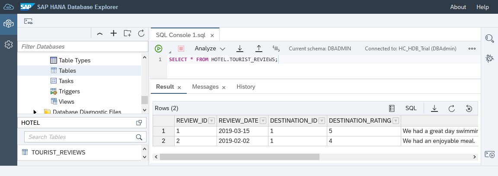
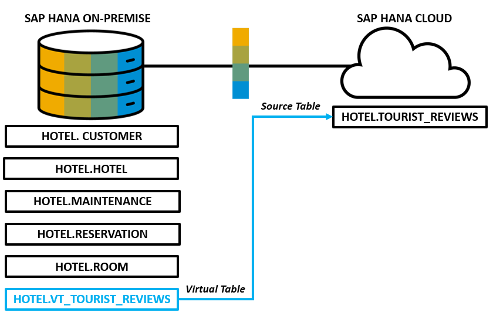
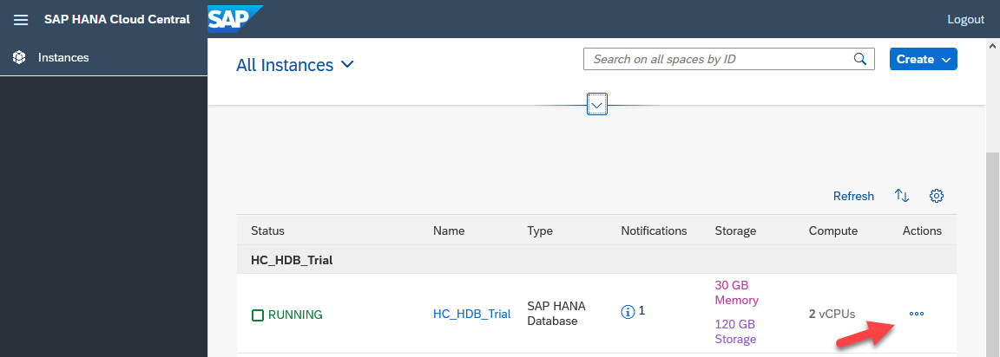
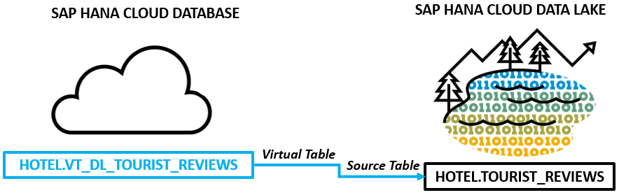
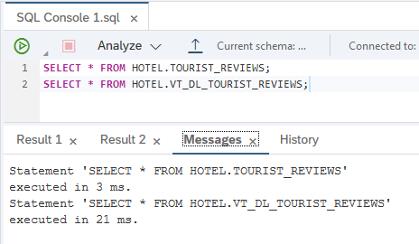
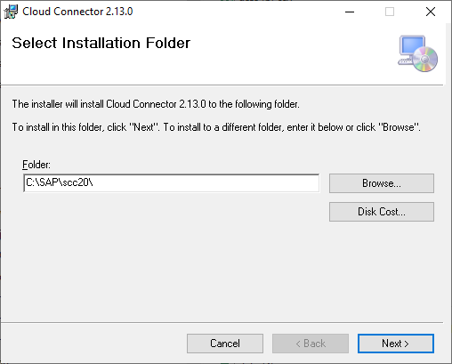
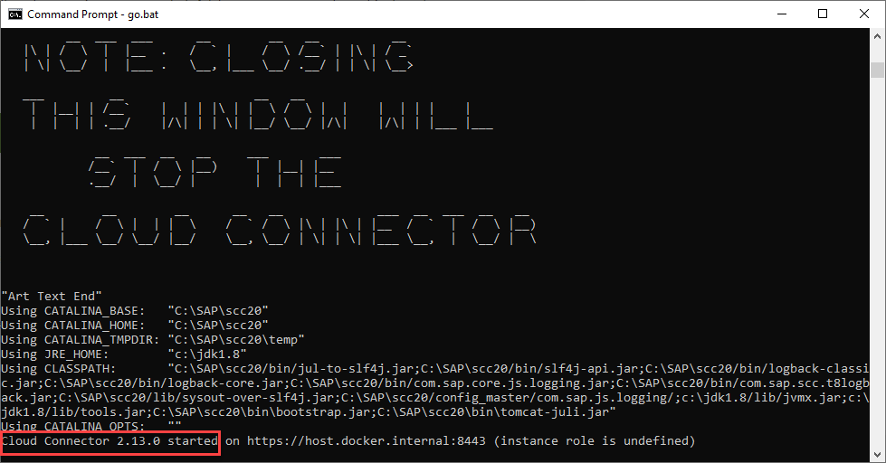
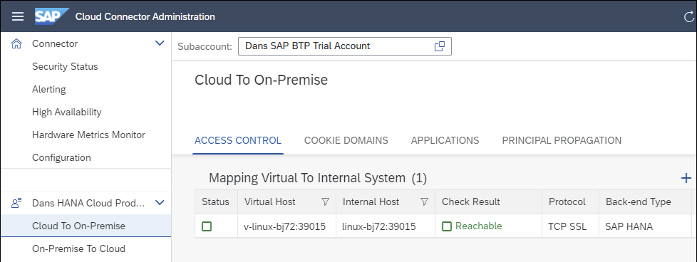
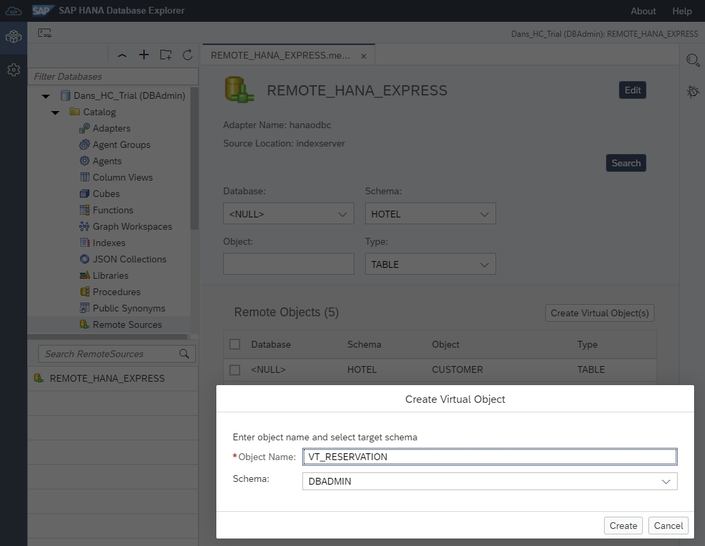

## Prerequisites
 - You have completed the first 3 tutorials in this group
 - Two SAP HANA databases and an SAP HANA Cloud, data lake instance
 - Step 3 requires a non trial SAP HANA Cloud instance

## Details
### You will learn
  - How to use SAP HANA smart data access (SDA) to create connections (remote sources) to other databases
  - How to create virtual tables from a remote source
  - How to setup the Cloud Connector to enable a remote source from SAP HANA Cloud to an on-premise SAP HANA database

Remote sources are connections to other databases.  Virtual tables use a remote source to create a local table that points to data stored in another database.  Federated queries make use of virtual and non virtual tables.

To illustrate these concepts, a table will be created in the remote database that contains fictitious review data from some of the top tourist sites near a given hotel.  There is likely a correlation between hotel stays and the desire for customers to visit nearby tourist attractions or restaurants.

For additional details on SAP HANA smart data access (SDA) and SAP HANA Smart Data Integration (SDI), consult [Connecting SAP HANA Cloud to Remote Data Sources](https://help.sap.com/viewer/db19c7071e5f4101837e23f06e576495/cloud/en-US/afa3769a2ecb407695908cfb4e3a9463.html) and [Data Access with SAP HANA Cloud](https://help.sap.com/viewer/f9c5015e72e04fffa14d7d4f7267d897/cloud/en-US/7791e61775f949d9989eafc443158cdb.html).

>Note that this tutorial requires more than one database to complete.  It is not necessary to complete this tutorial to continue to the next tutorial in this group.  

>Note that the SAP HANA Cloud trial is limited to creating one SAP HANA database per trial account.

The example in step 1 demonstrates connectivity from an on-premise, SAP HANA, express edition database to an SAP HANA Cloud database.  The example in step 2 demonstrates a connection from an SAP HANA Cloud database to an SAP HANA Cloud, data lake IQ.  The example in step 3 demonstrates connecting from SAP HANA Cloud, database via the Cloud Connector to an SAP HANA, express edition database.    


---

[ACCORDION-BEGIN [Step 1: ](Connect from SAP HANA, express edition to SAP HANA Cloud database)]

1. From the SAP HANA Cloud cockpit, open the SAP HANA database explorer and execute the following SQL statements to create the `tourist_reviews` table.

    >If needed, first create a schema and user.
    ```SQL
    CREATE SCHEMA HOTEL;
    CREATE USER USER1 PASSWORD Password1 no force_first_password_change;
    GRANT ALL PRIVILEGES ON SCHEMA HOTEL TO USER1;
    ```

    ```SQL
    CREATE COLUMN TABLE HOTEL.TOURIST_REVIEWS(
        review_id INTEGER GENERATED BY DEFAULT AS IDENTITY PRIMARY KEY,
        review_date DATE NOT NULL,
        destination_id INTEGER,
        destination_rating INTEGER,
        review VARCHAR(500) NOT NULL
    );

    INSERT INTO HOTEL.TOURIST_REVIEWS(review_date, destination_id, destination_rating, review) VALUES('2019-03-15', 1, 5, 'We had a great day swimming at the beach and exploring the beach front shops.  We will for sure be back next summer.');
    INSERT INTO HOTEL.TOURIST_REVIEWS(review_date, destination_id, destination_rating, review) VALUES('2019-02-02', 1, 4, 'We had an enjoyable meal.  The service and food was outstanding.  Would have liked to have slightly larger portions');
    ```

2. The result can be seen below.  

    ```SQL
    SELECT * FROM HOTEL.TOURIST_REVIEWS;
    ```

    


3. To create a remote source from SAP HANA, express edition to SAP HANA Cloud, open the SAP HANA database explorer from the SAP HANA, express edition.

     Right-click **Remote Sources** and select **Add Remote Source**.  

     

     Specify the server, port, extra adapter properties, and credentials (User1, Password1).

     

    Alternatively, in a SQL console, enter the SQL statement below after adjusting the `ServerNode`.  

    ```SQL
    CREATE REMOTE SOURCE REMOTE_HC_TRIAL ADAPTER "hanaodbc" CONFIGURATION 'ServerNode=XXXXXXXX-XXXX-XXXX-XXXX-XXXXXXXXXXXX.hana.trial-XXXX.hanacloud.ondemand.com:443;driver=libodbcHDB.so;dml_mode=readwrite;sslTrustStore="-----BEGIN CERTIFICATE-----MIIDrzCCApegAwIBAgIQCDvgVpBCRrGhdWrJWZHHSjANBgkqhkiG9w0BAQUFADBhMQswCQYDVQQGEwJVUzEVMBMGA1UEChMMRGlnaUNlcnQgSW5jMRkwFwYDVQQLExB3d3cuZGlnaWNlcnQuY29tMSAwHgYDVQQDExdEaWdpQ2VydCBHbG9iYWwgUm9vdCBDQTAeFw0wNjExMTAwMDAwMDBaFw0zMTExMTAwMDAwMDBaMGExCzAJBgNVBAYTAlVTMRUwEwYDVQQKEwxEaWdpQ2VydCBJbmMxGTAXBgNVBAsTEHd3dy5kaWdpY2VydC5jb20xIDAeBgNVBAMTF0RpZ2lDZXJ0IEdsb2JhbCBSb290IENBMIIBIjANBgkqhkiG9w0BAQEFAAOCAQ8AMIIBCgKCAQEA4jvhEXLeqKTTo1eqUKKPC3eQyaKl7hLOllsBCSDMAZOnTjC3U/dDxGkAV53ijSLdhwZAAIEJzs4bg7/fzTtxRuLWZscFs3YnFo97nh6Vfe63SKMI2tavegw5BmV/Sl0fvBf4q77uKNd0f3p4mVmFaG5cIzJLv07A6Fpt43C/dxC//AH2hdmoRBBYMql1GNXRor5H4idq9Joz+EkIYIvUX7Q6hL+hqkpMfT7PT19sdl6gSzeRntwi5m3OFBqOasv+zbMUZBfHWymeMr/y7vrTC0LUq7dBMtoM1O/4gdW7jVg/tRvoSSiicNoxBN33shbyTApOB6jtSj1etX+jkMOvJwIDAQABo2MwYTAOBgNVHQ8BAf8EBAMCAYYwDwYDVR0TAQH/BAUwAwEB/zAdBgNVHQ4EFgQUA95QNVbRTLtm8KPiGxvDl7I90VUwHwYDVR0jBBgwFoAUA95QNVbRTLtm8KPiGxvDl7I90VUwDQYJKoZIhvcNAQEFBQADggEBAMucN6pIExIK+t1EnE9SsPTfrgT1eXkIoyQY/EsrhMAtudXH/vTBH1jLuG2cenTnmCmrEbXjcKChzUyImZOMkXDiqw8cvpOp/2PV5Adg06O/nVsJ8dWO41P0jmP6P6fbtGbfYmbW0W5BjfIttep3Sp+dWOIrWcBAI+0tKIJFPnlUkiaY4IBIqDfv8NZ5YBberOgOzW6sRBc4L0na4UU+Krk2U886UAb3LujEV0lsYSEY1QSteDwsOoBrp+uvFRTp2InBuThs4pFsiv9kuXclVzDAGySj4dzp30d8tbQkCAUw7C29C79Fv1C5qfPrmAESrciIxpg0X40KPMbp1ZWVbd4=-----END CERTIFICATE-----"' WITH CREDENTIAL TYPE 'PASSWORD' USING 'user=User1;password=Password1';
    ```  

    > The ServerNode can be copied from SAP HANA Cloud Central by choosing **Actions > Copy > SQL Endpoint**.
    >
    > 

    >---

    >If the above command fails, one reason might be that an allowlist has been set on the SAP HANA Cloud instance.  This can be seen by choosing **Actions > Edit**.
    >
    >

    >---

    >The public root certificate of the certificate authority (CA) that signed the SAP HANA Cloud instance's server certificate is required in the `sslTrustStore` parameter.  For more information, see [Secure Communication Between SAP HANA Cloud and JDBC/ODBC Clients](https://help.sap.com/viewer/c82f8d6a84c147f8b78bf6416dae7290/cloud/en-US/dbd3d887bb571014bf05ca887f897b99.html).

4. After executing the create remote source SQL statement, the result can be seen in the **Remote Sources** folder, as shown below.  You may need to press the refresh button.

    

    Additional details can be found at [CREATE REMOTE SOURCE Statement](https://help.sap.com/viewer/c1d3f60099654ecfb3fe36ac93c121bb/cloud/en-US/20d48343751910149985a2c925e12190.html).

5. A virtual table named `vt_tourist_reviews` will be created in SAP HANA, express edition. This will enable access to the `tourist_reviews` table that was created in SAP HANA Cloud.   This can be visualized as follows:

    


    Open the SAP HANA database explorer from the SAP HANA, express edition.  If needed, create the HOTEL schema and a user who can access the schema.

    ```SQL
    CREATE USER USER1 PASSWORD Password1 no force_first_password_change;
    CREATE SCHEMA HOTEL;
    GRANT ALL PRIVILEGES ON SCHEMA HOTEL TO USER1;
    ```

6. Right-click the remote source named `REMOTE_HC_TRIAL` and choose **Open**.  

7. Set the **Schema** to be **`HOTEL`** and press the **Search** button.

    Check the `TOURIST_REVIEWS` checkbox and press the **Create Virtual Object(s)** button.

    

8. Set the **Object Name** to be `VT_TOURIST_REVIEWS` and the **Schema** to be **`HOTEL`**.

    Press the **Create** button.

    

    >Alternatively, the virtual table can also be created with the SQL statement below.
    >
    ```SQL
    CREATE VIRTUAL TABLE HOTEL.VT_TOURIST_REVIEWS AT "REMOTE_HC_TRIAL"."HC_HDB_Trial"."HOTEL"."TOURIST_REVIEWS";
    ```

9. Open the virtual table `VT_TOURIST_REVIEWS` and notice that its type is virtual.

    

10. Perform queries against the local tables and the remote table, and perform a federated query that contains both local and remote tables.

    ```SQL
    SELECT * FROM HOTEL.RESERVATION;
    SELECT * FROM HOTEL.CUSTOMER;
    SELECT * FROM HOTEL.VT_TOURIST_REVIEWS;
    SELECT C.NAME, TR.REVIEW, REVIEW_DATE
    FROM
	    HOTEL.RESERVATION AS R JOIN
	    HOTEL.VT_TOURIST_REVIEWS AS TR
	    ON TR.REVIEW_DATE = R.ARRIVAL JOIN
	    HOTEL.CUSTOMER AS C
      ON C.CNO = R.CNO;
    ```

    

    Notice the executed time is greater when the data is retrieved from a virtual table.

    

11. Add a new review.

    ```SQL
    INSERT INTO HOTEL.VT_TOURIST_REVIEWS(review_date, destination_id, destination_rating, review) VALUES('2020-08-21', 1, 5, 'The harbour cruise was fantastic.  It was great to see the city from a different viewpoint');
    SELECT * FROM HOTEL.VT_TOURIST_REVIEWS;
    ```    

    Notice that the virtual table is editable.


A benefit of a virtual table is that there is no data movement.  There is only one location where the data is persisted.  As seen above, this can lead to longer query times when accessing remote data.

[DONE]
[ACCORDION-END]

[ACCORDION-BEGIN [Step 2: ](Connect from SAP HANA Cloud to SAP HANA Cloud, data lake IQ)]

[SAP HANA Cloud, data lake](https://help.sap.com/viewer/product/SAP_HANA_DATA_LAKE/cloud/en-US) can be used to store large amounts of data that is not accessed frequently.  The following steps create the table `tourist_reviews` in SAP HANA Cloud, data lake IQ and access the table from the associated SAP HANA Cloud instance.

1. If needed, in SAP HANA Cloud Central, add an SAP HANA Cloud, data lake instance to your SAP HANA Cloud instance, by choosing **Actions > Add Data Lake**.

    

2. Open the database explorer connected to the data lake IQ.

    

3.  Execute the following SQL to create a table named `tourist_reviews` in the data lake IQ.

    ```SQL
    CREATE TABLE TOURIST_REVIEWS (
      REVIEW_ID INTEGER PRIMARY KEY,
      REVIEW_DATE DATE NOT NULL,
      DESTINATION_ID INTEGER,
      DESTINATION_RATING INTEGER,
      REVIEW VARCHAR(500) NOT NULL
    );

    INSERT INTO TOURIST_REVIEWS(REVIEW_ID, REVIEW_DATE, DESTINATION_ID, DESTINATION_RATING, REVIEW) VALUES(1, '2019-03-15', 1, 5, 'We had a great day swimming at the beach and exploring the beach front shops.  We will for sure be back next summer.');
    INSERT INTO TOURIST_REVIEWS(REVIEW_ID, REVIEW_DATE, DESTINATION_ID, DESTINATION_RATING, REVIEW) VALUES(2, '2019-02-02', 1, 4, 'We had an enjoyable meal.  The service and food was outstanding.  Would have liked to have slightly larger portions');
    ```

    

    For additional details consult [CREATE TABLE Statement for Data Lake IQ](https://help.sap.com/viewer/19b3964099384f178ad08f2d348232a9/latest/en-US/a619764084f21015b8039a8346dc622c.html).

4. In the SAP HANA database connection, create a remote source from the HANA database to the data lake IQ.  Be sure to replace the host and password values.

    ```SQL
    CREATE REMOTE SOURCE HC_DL_Trial
    	ADAPTER "IQODBC"
    		CONFIGURATION 'Driver=libdbodbc17_r.so;host=XXXXXXXX-XXXX-XXXX-XXXX-XXXXXXXXXXXX.iq.hdl.trial-XXXX.hanacloud.ondemand.com:443;ENC=TLS(tls_type=rsa;direct=yes)'
    			WITH CREDENTIAL TYPE 'PASSWORD'
    				USING 'user=HDLADMIN;password=myPassword1';
    ```

    

5. After pressing refresh, notice that under remote sources, there is a remote source `HC_DL_Trial`.

    

6. Right-click on **`HC_DL_TRIAL`** and choose **Open**.  Create a virtual table in SAP HANA Cloud named **`VT_DL_TOURIST_REVIEWS`** in the schema **HOTEL** that maps to the newly created table in SAP HANA Cloud, data lake IQ.

    

    This can be visualized as follows:

    

7. Query the local SAP HANA table and the equivalent SAP HANA Cloud, data lake IQ  table.

    ```SQL
    SELECT * FROM HOTEL.VT_DL_TOURIST_REVIEWS;
    ```

    

8. Add a new review.

    ```SQL
    INSERT INTO HOTEL.VT_DL_TOURIST_REVIEWS VALUES(3, '2020-08-21', 1, 5, 'The harbour cruise was fantastic.  It was great to see the city from a different viewpoint');
    SELECT * FROM HOTEL.VT_DL_TOURIST_REVIEWS;
    ```    

    Notice that the remote data source is updateable.  Data stored in an SAP HANA Cloud, data lake is stored on disk, which has cost advantages compared to memory storage. SAP HANA Cloud, data lake can also be used to store large amounts of data.

    > Note, another approach is to use container groups.  For additional details see [Data Lake IQ (HANA DB-Managed)](https://help.sap.com/viewer/a896c6a184f21015b5bcf4c7a967df07/latest/en-US/c87622a7c7a54f32be816faa3b64fa0f.html).  An example follows.
    >
    ```SQL
    CALL SYSHDL.CREATE_CONTAINER('HOTEL_CONTAINER', 'DBADMIN');
    CREATE VIRTUAL TABLE TOURIST_REVIEWS (
      REVIEW_ID INTEGER PRIMARY KEY,
      REVIEW_DATE DATE NOT NULL,
      DESTINATION_ID INTEGER,
      DESTINATION_RATING INTEGER,
      REVIEW VARCHAR(500) NOT NULL
    ) at "SYSHDL_HOTEL_CONTAINER_SOURCE"."<NULL>"."SYSHDL_HOTEL_CONTAINER"."TOURIST_REVIEWS" WITH REMOTE;
    INSERT INTO TOURIST_REVIEWS(REVIEW_ID, REVIEW_DATE, DESTINATION_ID, DESTINATION_RATING, REVIEW) VALUES(1, '2019-03-15', 1, 5, 'We had a great day swimming at the beach and exploring the beach front shops.  We will for sure be back next summer.');
    CALL SYSHDL_HOTEL_CONTAINER.REMOTE_EXECUTE('INSERT INTO TOURIST_REVIEWS VALUES(2, ''2019-02-02'', 1, 4, ''We had an enjoyable meal.  The service and food was outstanding.  Would have liked to have slightly larger portions'')');
    --GRANT SYSHDL_HOTEL_CONTAINER_ROLE TO USER1;
    --CONNECT USER1 PASSWORD Password1;
    SELECT * FROM SYSHDL_HOTEL_CONTAINER.TOURIST_REVIEWS;
    CALL SYSHDL_HOTEL_CONTAINER.REMOTE_EXECUTE('DROP TABLE SYSHDL_HOTEL_CONTAINER.TOURIST_REVIEWS;');
    --CONNECT DBADMIN PASSWORD Hana1234;
    CALL SYSHDL.DELETE_CONTAINER('HOTEL_CONTAINER');
    ```

[DONE]
[ACCORDION-END]

[ACCORDION-BEGIN [Step 3: ](Connect from SAP HANA Cloud to SAP HANA, express edition via the Cloud Connector (optional))]

The [Cloud Connector](https://help.sap.com/viewer/cca91383641e40ffbe03bdc78f00f681/Cloud/en-US/e6c7616abb5710148cfcf3e75d96d596.html#loioe6c7616abb5710148cfcf3e75d96d596__context) enables communication from the SAP BTP running in the public internet to securely connect to a configured on-premise system such as SAP HANA, express edition.

1. Enable the Cloud Connector connectivity in SAP HANA Cloud Central.

    

2.  [Download the Cloud Connector](https://tools.hana.ondemand.com/#cloud).  The software needs to run on a machine that can access your on-premise SAP HANA instance.  In this example, the Cloud Connector was installed on Windows and is accessing an SAP HANA, express edition database running in a VM on the same machine.  

    

3. As described at [Installation on Microsoft Windows OS](https://help.sap.com/viewer/cca91383641e40ffbe03bdc78f00f681/Cloud/en-US/204aaad4270245f3baa0c57c8ab1dd60.html), Java 8 is a requirement.  
The following commands were used to start the Cloud Connector.

    ```Shell (Microsoft Windows)
    set PATH=C:\Windows\System32;c:\jdk1.8\bin
    set JAVA_HOME=c:\jdk1.8
    cd C:\SAP\scc20
    go.bat
    ```

    

    >Note, it may take a while to start the Cloud Connector (3 minutes) and a line such as Cloud Connector 2.13.0 started will appear as shown above when it is started.

4. In a browser, open the URL <https://localhost:8443>.  

    The initial user name and password are Administrator and manage.

5. Configure the Cloud Connector to connect to the Cloud Foundry subaccount.     

    

    >The location ID is used when multiple Cloud Connectors are connected to the same subaccount

    >---

    >Note, if you are an SAP employee you may need to enter your password + a  time-based passcode as the password.


    The region and subaccount ID can be found in the SAP BTP cockpit.

    

    The screen below shows a successful connection.

    

    For additional details, see [Initial Configuration](https://help.sap.com/viewer/cca91383641e40ffbe03bdc78f00f681/Cloud/en-US/db9170a7d97610148537d5a84bf79ba2.html).

6. Configure the Cloud Connector to connect to the on-premise database.

    Select **Cloud To On-Premise** and press the **+** icon.

    Select **SAP HANA** for the back-end type.

    Select **TCP SSL** for the protocol.

    Specify the host and port for the SAP HANA, express database.

    The virtual name and port can be different.

    

7. From the SAP HANA Cloud cockpit, open the SAP HANA database explorer, then right-click **Remote Sources** and select **Add Remote Source**.  

    

    Specify the server, port, extra adapter properties, credentials (User1, Password1) and if a Location ID was specified in step 5, add `scc_location_id=<locationid>'` to the Extra Adapter Properties.

    

    Alternatively, in a SQL console, enter the SQL statement below after adjusting the `ServerNode`.  

    ```SQL
    CREATE REMOTE SOURCE REMOTE_HANA_EXPRESS
    	ADAPTER "hanaodbc"
    		CONFIGURATION 'ServerNode=v-linux-bj72:39015;use_haas_socks_proxy=true;driver=libodbcHDB.so;'
    			WITH CREDENTIAL TYPE 'PASSWORD'
    				USING 'user=User1;password=Password1';
    ```  

    Additional details can be found at [CREATE REMOTE SOURCE Statement](https://help.sap.com/viewer/c1d3f60099654ecfb3fe36ac93c121bb/cloud/en-US/20d48343751910149985a2c925e12190.html) and [Create an SAP HANA On-Premise Remote Source](https://help.sap.com/viewer/477aa413a36c4a95878460696fcc8896/latest/en-US/20d299d2f5224e8590982e8ad97362a2.html).

8. After executing the create remote source SQL statement, the result can be seen in the **Remote Sources** folder, as shown below.  You may need to press the refresh button.

    

9. Right-click the remote source named `REMOTE_HANA_EXPRESS` and choose **Open**.  

10. Set the **Schema** to be **`HOTEL`** and press the **Search** button.

    

    Notice that it is possible to create virtual tables to access the data from the on-premise system in SAP HANA Cloud.

    This can be visualized as follows:

    

For further information, see also [Install the SAP Connectivity Service Cloud Connector in your System Landscape](cp-connectivity-install-cloud-connector), [Replicate data from on-premise to the cloud with the Cloud Connector](https://saphanajourney.com/hana-cloud/learning-article/the-cloud-connector), [Access Data Across Your On-Premise and Cloud Data Sources](https://saphanajourney.com/hana-cloud/sap-hana-cloud-workshops/), and [Getting Started with SAP HANA Cloud | Remote Data Source](https://blogs.sap.com/2020/08/03/getting-started-with-sap-hana-cloud-vii-smart-data-access/).

Congratulations!  You have now used remote sources to access data running on a different SAP HANA instance and on a SAP HANA Cloud, data lake IQ.

[VALIDATE_1]
[ACCORDION-END]

---
