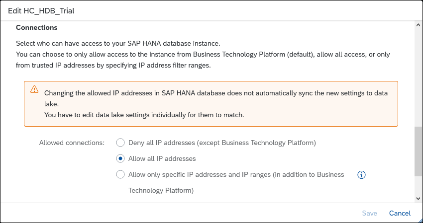

## Prerequisites
 - Two SAP HANA databases and an SAP HANA Data Lake instance
 - You have completed the first 3 tutorials in this group.

## Details
### You will learn
  - How to use SAP HANA Smart Data Access (SDA) to access data in other data sources
  - How to create remote connections and virtual tables

Virtual tables point to data stored in another database.  Federated queries join local and virtual tables.

To illustrate these concepts, a table will be created in an SAP HANA Cloud or Data Lake trial that contains fictitious review data from some of the top tourist sites near a given hotel.  There is likely a correlation between hotel stays and the desire for customers to visit nearby tourist attractions or restaurants.  The review data that is stored in SAP HANA Cloud or SAP HANA Data Lake will be remotely accessed from an SAP HANA, express edition database.

For additional details on SAP HANA Smart Data Access (SDA) and SAP HANA Smart Data Integration (SDI), consult [Connecting SAP HANA Cloud to Remote Data Sources](https://help.sap.com/viewer/db19c7071e5f4101837e23f06e576495/cloud/en-US/afa3769a2ecb407695908cfb4e3a9463.html) and [Data Access with SAP HANA Cloud](https://help.sap.com/viewer/f9c5015e72e04fffa14d7d4f7267d897/cloud/en-US/7791e61775f949d9989eafc443158cdb.html).

>Note that this tutorial requires two SAP HANA databases and an SAP HANA Data Lake to complete.  The examples are shown using an SAP HANA, express edition database connecting to an SAP HANA Cloud trial database.  It is not necessary to complete this tutorial to continue to the next tutorial in this group.  

>Note that the SAP HANA Cloud trial is limited to creating one SAP HANA database per trial account.

---

[ACCORDION-BEGIN [Step 1: ](Create a tourist review table in SAP HANA Cloud)]

1. From the SAP HANA Cloud Cockpit, open the SAP HANA database explorer.

2. Execute the following SQL statements to create the `tourist_reviews` table.

    >If needed, first create a schema and user.
    ```SQL
    CREATE SCHEMA HOTEL;
    CREATE USER USER1 PASSWORD Password1 no force_first_password_change;
    GRANT ALL PRIVILEGES ON SCHEMA HOTEL TO USER1;
    ```

    ```SQL
    CREATE COLUMN TABLE hotel.tourist_reviews(
        review_id INTEGER GENERATED BY DEFAULT AS IDENTITY PRIMARY KEY,
        review_date DATE NOT NULL,
        destination_id INTEGER,
        destination_rating INTEGER,
        review CHAR(500) NOT NULL
    );

    INSERT INTO hotel.tourist_reviews(review_date, destination_id, destination_rating, review) VALUES('2019-12-24', 1, 5, 'We had a great day swimming at the beach and exploring the beach front shops.  We will for sure be back next summer.');
    INSERT INTO hotel.tourist_reviews(review_date, destination_id, destination_rating, review) VALUES('2019-11-13', 1, 4, 'We had an enjoyable meal.  The service and food was outstanding.  Would have like to have slightly larger portions');
    ```

3. The result can be seen below.  

    ```SQL
    SELECT * FROM HOTEL.TOURIST_REVIEWS;
    ```

    

[DONE]
[ACCORDION-END]

[ACCORDION-BEGIN [Step 2: ](Create a remote source from SAP HANA, express edition to SAP HANA Cloud)]

1. To create a remote source from SAP HANA, express edition to SAP HANA Cloud, open the SAP HANA database explorer from the SAP HANA, express edition.

     Right-click **Remote Sources** and select **Add Remote Source**.  

     

    Alternatively, in a SQL console, enter the SQL statement below after adjusting the `ServerNode`.  

    ```SQL
    CREATE REMOTE SOURCE REMOTE_HC ADAPTER "hanaodbc" CONFIGURATION 'ServerNode=7e2a2bb8-c560-46b3-b33f-dc4a1a9fd47c.hana.trial-us10.hanacloud.ondemand.com:443;encrypt=true;Driver=libodbcHDB.so;dml_mode=readwrite;sslTrustStore="-----BEGIN CERTIFICATE-----MIIDrzCCApegAwIBAgIQCDvgVpBCRrGhdWrJWZHHSjANBgkqhkiG9w0BAQUFADBhMQswCQYDVQQGEwJVUzEVMBMGA1UEChMMRGlnaUNlcnQgSW5jMRkwFwYDVQQLExB3d3cuZGlnaWNlcnQuY29tMSAwHgYDVQQDExdEaWdpQ2VydCBHbG9iYWwgUm9vdCBDQTAeFw0wNjExMTAwMDAwMDBaFw0zMTExMTAwMDAwMDBaMGExCzAJBgNVBAYTAlVTMRUwEwYDVQQKEwxEaWdpQ2VydCBJbmMxGTAXBgNVBAsTEHd3dy5kaWdpY2VydC5jb20xIDAeBgNVBAMTF0RpZ2lDZXJ0IEdsb2JhbCBSb290IENBMIIBIjANBgkqhkiG9w0BAQEFAAOCAQ8AMIIBCgKCAQEA4jvhEXLeqKTTo1eqUKKPC3eQyaKl7hLOllsBCSDMAZOnTjC3U/dDxGkAV53ijSLdhwZAAIEJzs4bg7/fzTtxRuLWZscFs3YnFo97nh6Vfe63SKMI2tavegw5BmV/Sl0fvBf4q77uKNd0f3p4mVmFaG5cIzJLv07A6Fpt43C/dxC//AH2hdmoRBBYMql1GNXRor5H4idq9Joz+EkIYIvUX7Q6hL+hqkpMfT7PT19sdl6gSzeRntwi5m3OFBqOasv+zbMUZBfHWymeMr/y7vrTC0LUq7dBMtoM1O/4gdW7jVg/tRvoSSiicNoxBN33shbyTApOB6jtSj1etX+jkMOvJwIDAQABo2MwYTAOBgNVHQ8BAf8EBAMCAYYwDwYDVR0TAQH/BAUwAwEB/zAdBgNVHQ4EFgQUA95QNVbRTLtm8KPiGxvDl7I90VUwHwYDVR0jBBgwFoAUA95QNVbRTLtm8KPiGxvDl7I90VUwDQYJKoZIhvcNAQEFBQADggEBAMucN6pIExIK+t1EnE9SsPTfrgT1eXkIoyQY/EsrhMAtudXH/vTBH1jLuG2cenTnmCmrEbXjcKChzUyImZOMkXDiqw8cvpOp/2PV5Adg06O/nVsJ8dWO41P0jmP6P6fbtGbfYmbW0W5BjfIttep3Sp+dWOIrWcBAI+0tKIJFPnlUkiaY4IBIqDfv8NZ5YBberOgOzW6sRBc4L0na4UU+Krk2U886UAb3LujEV0lsYSEY1QSteDwsOoBrp+uvFRTp2InBuThs4pFsiv9kuXclVzDAGySj4dzp30d8tbQkCAUw7C29C79Fv1C5qfPrmAESrciIxpg0X40KPMbp1ZWVbd4=-----END CERTIFICATE-----"' WITH CREDENTIAL TYPE 'PASSWORD' USING 'user=User1;password=Password1';
    ```  

    > The ServerNode can be copied from the SAP HANA Cloud Cockpit.
    >
    > 

    >---

    >If the above command fails, one reason might be that an allowlist has been set on the SAP HANA Cloud instance.  This can be seen by clicking on the edit icon in the SAP HANA Cloud Cockpit.
    >
    >
    >---

    >The public root certificate of the certificate authority (CA) that signed the SAP HANA Cloud instance's server certificate is required in the `sslTrustStore` parameter.  For more information, see [Secure Communication Between SAP HANA Cloud and JDBC/ODBC Clients](https://help.sap.com/viewer/c82f8d6a84c147f8b78bf6416dae7290/cloud/en-US/dbd3d887bb571014bf05ca887f897b99.html).

2. After executing the create remote source SQL statement, the result can be seen in the **Remote Sources** folder, as shown below.  You may need to press the refresh button.

    

    Additional details can be found at [CREATE REMOTE SOURCE Statement](https://help.sap.com/viewer/c1d3f60099654ecfb3fe36ac93c121bb/cloud/en-US/20d48343751910149985a2c925e12190.html).

[DONE]
[ACCORDION-END]

[ACCORDION-BEGIN [Step 3: ](Create a virtual table and execute a federated query)]
In this step, a virtual table named `vt_tourist_reviews` will be created in SAP HANA, express edition. This will enable access to the `tourist_reviews` table that was created in SAP HANA Cloud.   This can be visualized as follows:

  


1. Open the SAP HANA database explorer from the SAP HANA, express edition.  If needed, create the HOTEL schema and a user who can access the schema.

    ```SQL
    CREATE USER USER1 PASSWORD Password1 no force_first_password_change;
    CREATE SCHEMA HOTEL;
    GRANT ALL PRIVILEGES ON SCHEMA HOTEL TO USER1;
    ```

2. Right-click the remote source named `Remote_HC` and choose **Open**.  

3. Set the **Schema** to be **`HOTEL`** and press the **Search** button.

    Check the `TOURIST_REVIEWS` checkbox and press the **Create Virtual Object(s)** button.

    

4. Set the **Object Name** to be `VT_TOURIST_REVIEWS` and the **Schema** to be **`HOTEL`**.

    Press the **Create** button.

    

    >Alternatively, the virtual table can also be created with the SQL statement below.
    >
    ```SQL
    CREATE VIRTUAL TABLE HOTEL.VT_TOURIST_REVIEWS2 AT "REMOTE_HC"."Dans_HC_Trial_US-hana"."HOTEL"."TOURIST_REVIEWS";
    ```


5. Open the virtual table `VT_TOURIST_REVIEWS` and notice that its type is virtual.

    

6. Perform queries against the local tables and the remote table, and perform a federated query that contains both local and remote tables.

    ```SQL
    SELECT * FROM HOTEL.RESERVATION;
    SELECT * FROM HOTEL.CUSTOMER;
    SELECT * FROM HOTEL.VT_TOURIST_REVIEWS;
    SELECT C.NAME, TR.REVIEW, REVIEW_DATE
    FROM
	    HOTEL.RESERVATION AS R JOIN
	    HOTEL.VT_TOURIST_REVIEWS AS TR
	    ON TR.REVIEW_DATE = R.ARRIVAL JOIN
	    HOTEL.CUSTOMER AS C
      ON C.CNO = R.CNO;
    ```

    

7. Notice the executed time is greater when the data is retrieved from a virtual table.

    

8. Add a new review.

    ```SQL
    INSERT INTO hotel.vt_tourist_reviews(review_date, destination_id, destination_rating, review) VALUES('2020-08-21', 1, 5, 'The harbour cruise was fantastic.  It was great to see the city from a different viewpoint');
    SELECT * FROM HOTEL.VT_TOURIST_REVIEWS;
    ```    

    Notice that the virtual table is editable.


A benefit of a virtual table is that there is no data movement.  There is only one location where the data is persisted.  As seen above, this can lead to longer query times when accessing remote data.

[DONE]
[ACCORDION-END]

[ACCORDION-BEGIN [Step 4: ](SAP HANA Data Lake)]

[SAP HANA Data Lake](https://help.sap.com/viewer/product/SAP_HANA_DATA_LAKE/cloud/en-US) can be used to store large amounts of data that is not accessed frequently.  The following steps create the table `tourist_reviews` in SAP HANA Data Lake and access the table from the associated SAP HANA Cloud instance and from an SAP HANA, express edition database.

1. In the SAP Cloud Platform Cockpit, add an SAP HANA Data Lake instance to your SAP HANA Cloud instance, if it does not already exist.

    

2. In a SQL console connected to the HANA Cloud instance, execute the following SQL to create a table named `tourist_reviews` and populate it with a few rows in SAP HANA Data Lake.

    ```SQL
    CALL SYSRDL#CG.REMOTE_EXECUTE('
    BEGIN
        CREATE TABLE TOURIST_REVIEWS (
        REVIEW_ID INTEGER PRIMARY KEY,
        REVIEW_DATE DATE NOT NULL,
        DESTINATION_ID INTEGER,
        DESTINATION_RATING INTEGER,
        REVIEW VARCHAR(500) NOT NULL
      );
      INSERT INTO TOURIST_REVIEWS(REVIEW_ID, REVIEW_DATE, DESTINATION_ID, DESTINATION_RATING, REVIEW) VALUES(1, ''2019-12-24'', 1, 5, ''We had a great day swimming at the beach and exploring the beach front shops.  We will for sure be back next summer.'');
      INSERT INTO TOURIST_REVIEWS(REVIEW_ID, REVIEW_DATE, DESTINATION_ID, DESTINATION_RATING, REVIEW) VALUES(2, ''2019-11-13'', 1, 4, ''We had an enjoyable meal.  The service and food was outstanding.  Would have like to have slightly larger portions'');
    END');
    ```

    For additional details consult [Creating a Data Lake Table](https://help.sap.com/viewer/071308868de34b289a6b1553b8cc37b9/cloud/en-US/d78a08b242274b36bb276b7096f6c35b.html).

3. Notice that under remote sources, there is a connection named `SYSRDL#CG_SOURCE`.  This is the remote source for the SAP HANA Data Lake that is associated with the SAP HANA Cloud instance.

    

4. Create a virtual table in SAP HANA Cloud named **`VT_DL_TOURIST_REVIEWS`** in the schema **HOTEL** that maps to the newly created table in SAP HANA Data Lake.

    

    This can be visualized as follows:

    

5. Query the local SAP HANA table and the equivalent SAP HANA Data Lake table.

    ```SQL
    SELECT * FROM HOTEL.TOURIST_REVIEWS;
    SELECT * FROM HOTEL.VT_DL_TOURIST_REVIEWS;
    ```

    

6. Another SAP HANA instance such as the SAP HANA, express edition can also access tables in the SAP HANA Cloud database and the SAP HANA Data Lake via a remote connection.  

     

     This can be visualized as follows:

     

7. Query a few local tables, a remote table in SAP HANA Cloud, and a remote table in the SAP HANA Data Lake.

    ```SQL
    SELECT * FROM HOTEL.RESERVATION;
    SELECT * FROM HOTEL.CUSTOMER;
    SELECT * FROM HOTEL.VT_TOURIST_REVIEWS;
    SELECT * FROM HOTEL.VT_DL_TOURIST_REVIEWS;

    SELECT C.NAME, TR.REVIEW, TR.REVIEW_DATE
    FROM
        HOTEL.RESERVATION AS R JOIN
        HOTEL.VT_TOURIST_REVIEWS AS TR
        ON TR.REVIEW_DATE = R.ARRIVAL JOIN
        HOTEL.CUSTOMER AS C
      ON C.CNO = R.CNO;

    SELECT C.NAME, TR.REVIEW, TR.REVIEW_DATE
    FROM
        HOTEL.RESERVATION AS R JOIN
        HOTEL.VT_DL_TOURIST_REVIEWS as TR
        ON TR.REVIEW_DATE = R.ARRIVAL JOIN
        HOTEL.CUSTOMER AS C
      ON C.CNO = R.CNO;
    ```

    

8. Add a new review.

    ```SQL
    INSERT INTO HOTEL.VT_DL_TOURIST_REVIEWS VALUES(3, '2020-08-21', 1, 5, 'The harbour cruise was fantastic.  It was great to see the city from a different viewpoint');
    SELECT * FROM HOTEL.VT_DL_TOURIST_REVIEWS;
    ```    

    Notice that the remote data source is updateable.  Data stored in an SAP HANA Data Lake is stored on disk, which is less costly than memory storage. SAP HANA Data Lake can also store larger amounts of data.

    For additional details on remote sources and virtual tables using two HANA Cloud instances, see [Getting Started with SAP HANA Cloud VII | Remote Data Source (multicloud)](https://blogs.sap.com/2020/08/03/getting-started-with-sap-hana-cloud-vii-smart-data-access/).

    For information on how to connect from SAP HANA Cloud to an on-premise SAP HANA instance, see the replay of the workshop [Access Data Across Your On-Premise and Cloud Data Sources](https://saphanajourney.com/hana-cloud/sap-hana-cloud-workshops/).


Congratulations!   You have now used remote sources to access data running on a different SAP HANA instance and on a SAP HANA Data Lake.

[VALIDATE_1]
[ACCORDION-END]

---
