# Access Remote Sources with SAP HANA Database Explorer
<!-- description --> Use SAP HANA federation capabilities to query data from other SAP HANA and SAP HANA Cloud, data lake Relational Engine databases using SAP HANA smart data access (SDA) and the Cloud Connector.

## Prerequisites
 - You have completed the first 3 tutorials in this group
 - Two SAP HANA databases and an SAP HANA Cloud, data lake instance

## You will learn
  - How to use SAP HANA smart data access (SDA) to create connections (remote sources) to other databases
  - How to create virtual tables from a remote source
  - How to setup the Cloud Connector to enable a remote source from SAP HANA Cloud to an on-premise SAP HANA database

## Intro
Remote sources are connections to other databases.  Virtual tables use a remote source to create a local table that points to data stored in another database.  Federated queries make use of virtual and non virtual tables.

To illustrate these concepts, a table will be created in the remote database that contains fictitious review data from some of the top tourist sites near a given hotel.  There is likely a correlation between hotel stays and the desire for customers to visit nearby tourist attractions or restaurants.

For additional details on SAP HANA smart data access (SDA) and SAP HANA Smart Data Integration (SDI), consult [Connecting SAP HANA Cloud to Remote Data Sources](https://help.sap.com/docs/hana-cloud/sap-hana-cloud-getting-started-guide/connecting-sap-hana-cloud-sap-hana-database-to-remote-data-sources) and [Data Access with SAP HANA Cloud](https://help.sap.com/docs/hana-cloud-database/sap-hana-cloud-sap-hana-database-data-access-guide/data-access-in-sap-hana-cloud-sap-hana-database).

>This tutorial requires more than one database to complete.  It is not necessary to complete this tutorial to continue to the next tutorial in this group.  

>The SAP HANA Cloud free tier or trial is limited to creating one SAP HANA database and one data lake instance.

The example in step 1 demonstrates connectivity from an on-premise, SAP HANA, express edition database to an SAP HANA Cloud, SAP HANA  database.  The example in step 2 demonstrates a connection from an SAP HANA Cloud, SAP HANA  database to an SAP HANA Cloud, data lake Relational Engine. The example in step 3 demonstrates connecting from SAP HANA Cloud, data lake Relational Engine to an SAP HANA Cloud, SAP HANA  database. The example in step 4 demonstrates connecting from one SAP HANA Cloud, data lake Relational Engine to another. The example in step 5 demonstrates connecting from SAP HANA Cloud, database via the Cloud Connector to an SAP HANA, express edition database.    


---

###  Connect from SAP HANA, express edition to SAP HANA Cloud, SAP HANA database
1. From SAP HANA Cloud Central, select an SAP HANA database instance (HDB), open the SAP HANA database explorer, and execute the following SQL statements to create the `tourist_reviews` table.

    >If needed, first create a schema and user.
    ```SQL
    CREATE SCHEMA HOTELS;
    CREATE USER USER1 PASSWORD Password1 no force_first_password_change;
    GRANT ALL PRIVILEGES ON SCHEMA HOTELS TO USER1;
    ```

    ```SQL
    SET SCHEMA HOTELS;
    CREATE COLUMN TABLE TOURIST_REVIEWS(
        review_id INTEGER GENERATED BY DEFAULT AS IDENTITY PRIMARY KEY,
        review_date DATE NOT NULL,
        destination_id INTEGER,
        destination_rating INTEGER,
        review VARCHAR(500) NOT NULL
    );

    INSERT INTO TOURIST_REVIEWS(review_date, destination_id, destination_rating, review) VALUES('2019-03-15', 1, 5, 'We had a great day swimming at the beach and exploring the beach front shops.  We will for sure be back next summer.');
    INSERT INTO TOURIST_REVIEWS(review_date, destination_id, destination_rating, review) VALUES('2019-02-02', 1, 4, 'We had an enjoyable meal.  The service and food was outstanding.  Would have liked to have slightly larger portions');
    ```

2. The result can be seen below.  

    ```SQL
    SELECT * FROM TOURIST_REVIEWS;
    ```

    


3. To create a remote source from SAP HANA, express edition to SAP HANA Cloud, open the SAP HANA database explorer from the SAP HANA, express edition.

    >This step is optional for SAP HANA Cloud Trial users if you do not have an SAP HANA, express edition database.  If you do not have an SAP HANA, express edition database, proceed to the next step which is Connect from SAP HANA Cloud to SAP HANA Cloud, data lake Relational Engine.

    In a SQL console, enter the SQL statement below after adjusting the `ServerNode`.  

    ```SQL
    CREATE REMOTE SOURCE REMOTE_HC ADAPTER "hanaodbc" CONFIGURATION 'ServerNode=XXXXXXXX-XXXX-XXXX-XXXX-XXXXXXXXXXXX.hana.prod-ca10.hanacloud.ondemand.com:443;driver=libodbcHDB.so;dml_mode=readwrite;sslTrustStore="-----BEGIN CERTIFICATE-----MIIDrzCCApegAwIBAgIQCDvgVpBCRrGhdWrJWZHHSjANBgkqhkiG9w0BAQUFADBhMQswCQYDVQQGEwJVUzEVMBMGA1UEChMMRGlnaUNlcnQgSW5jMRkwFwYDVQQLExB3d3cuZGlnaWNlcnQuY29tMSAwHgYDVQQDExdEaWdpQ2VydCBHbG9iYWwgUm9vdCBDQTAeFw0wNjExMTAwMDAwMDBaFw0zMTExMTAwMDAwMDBaMGExCzAJBgNVBAYTAlVTMRUwEwYDVQQKEwxEaWdpQ2VydCBJbmMxGTAXBgNVBAsTEHd3dy5kaWdpY2VydC5jb20xIDAeBgNVBAMTF0RpZ2lDZXJ0IEdsb2JhbCBSb290IENBMIIBIjANBgkqhkiG9w0BAQEFAAOCAQ8AMIIBCgKCAQEA4jvhEXLeqKTTo1eqUKKPC3eQyaKl7hLOllsBCSDMAZOnTjC3U/dDxGkAV53ijSLdhwZAAIEJzs4bg7/fzTtxRuLWZscFs3YnFo97nh6Vfe63SKMI2tavegw5BmV/Sl0fvBf4q77uKNd0f3p4mVmFaG5cIzJLv07A6Fpt43C/dxC//AH2hdmoRBBYMql1GNXRor5H4idq9Joz+EkIYIvUX7Q6hL+hqkpMfT7PT19sdl6gSzeRntwi5m3OFBqOasv+zbMUZBfHWymeMr/y7vrTC0LUq7dBMtoM1O/4gdW7jVg/tRvoSSiicNoxBN33shbyTApOB6jtSj1etX+jkMOvJwIDAQABo2MwYTAOBgNVHQ8BAf8EBAMCAYYwDwYDVR0TAQH/BAUwAwEB/zAdBgNVHQ4EFgQUA95QNVbRTLtm8KPiGxvDl7I90VUwHwYDVR0jBBgwFoAUA95QNVbRTLtm8KPiGxvDl7I90VUwDQYJKoZIhvcNAQEFBQADggEBAMucN6pIExIK+t1EnE9SsPTfrgT1eXkIoyQY/EsrhMAtudXH/vTBH1jLuG2cenTnmCmrEbXjcKChzUyImZOMkXDiqw8cvpOp/2PV5Adg06O/nVsJ8dWO41P0jmP6P6fbtGbfYmbW0W5BjfIttep3Sp+dWOIrWcBAI+0tKIJFPnlUkiaY4IBIqDfv8NZ5YBberOgOzW6sRBc4L0na4UU+Krk2U886UAb3LujEV0lsYSEY1QSteDwsOoBrp+uvFRTp2InBuThs4pFsiv9kuXclVzDAGySj4dzp30d8tbQkCAUw7C29C79Fv1C5qfPrmAESrciIxpg0X40KPMbp1ZWVbd4=-----END CERTIFICATE-----"' WITH CREDENTIAL TYPE 'PASSWORD' USING 'user=User1;password=Password1';
    CALL PUBLIC.CHECK_REMOTE_SOURCE('REMOTE_HC');
    ```  

    Alternatively, you can create a remote source manually by right-clicking **Remote Sources** and select **Add Remote Source**.  

     

     Add a source name and specify the server, port, and credentials (USER1, Password1). The Extra Adapter properties can be retreived by copying the `sslTrustStore` in the SQL query above.

     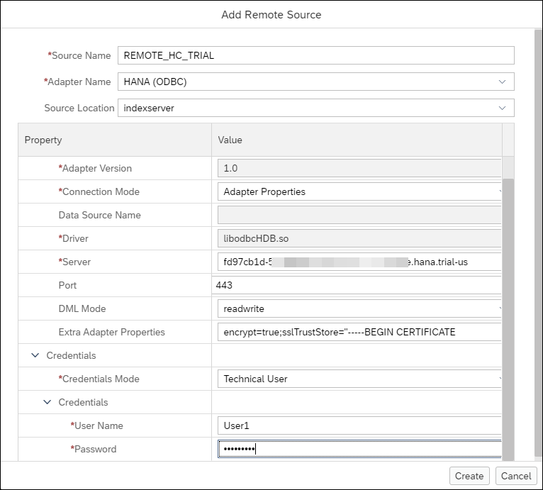


    Additional details can be found at [CREATE REMOTE SOURCE Statement](https://help.sap.com/docs/hana-cloud-database/sap-hana-cloud-sap-hana-database-sql-reference-guide/create-remote-source-statement-access-control).

    > The ServerNode can be copied from SAP HANA Cloud Central by choosing **Actions > Copy SQL Endpoint**.
    >
    > 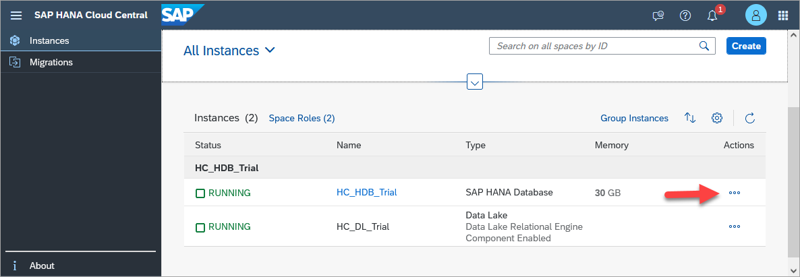

    >---

    >If the above command fails, one reason might be that an allowlist has been set on the SAP HANA Cloud instance.  This can be seen by choosing **Actions > Edit**.
    >
    >

    >---

    >The public root certificate of the certificate authority (CA) that signed the SAP HANA Cloud instance's server certificate is required in the `sslTrustStore` parameter.  For more information, see [Secure Communication Between SAP HANA Cloud and JDBC/ODBC Clients](https://help.sap.com/docs/hana-cloud-database/sap-hana-cloud-sap-hana-database-security-guide/secure-communication-between-sap-hana-and-sap-hana-clients).

4. After executing the create remote source SQL statement, the result can be seen in the **Remote Sources** folder, as shown below.  You may need to press the refresh button.

    

5. A virtual table named `vt_tourist_reviews` will be created in SAP HANA, express edition. This will enable access to the `tourist_reviews` table that was created in SAP HANA Cloud.   This can be visualized as follows:

    


    Open the SAP HANA database explorer from the SAP HANA, express edition.  
    
    >If needed, create the HOTELS schema and a user who can access the schema.

    ```SQL
    CREATE USER USER1 PASSWORD Password1 no force_first_password_change;
    CREATE SCHEMA HOTELS;
    GRANT ALL PRIVILEGES ON SCHEMA HOTELS TO USER1;
    ```

6. Right-click the remote source named `REMOTE_HC` and choose **Open**.  

7. Set the **Schema** to be **`HOTELS`** and press the **Search** button.

    Check the `TOURIST_REVIEWS` checkbox and press the **Create Virtual Object(s)** button.

    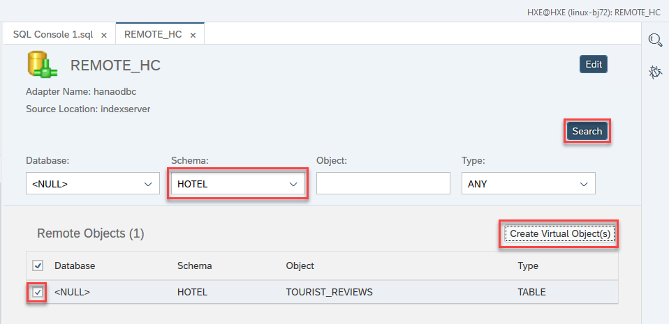

8. Set the **Object Name** to be `VT_TOURIST_REVIEWS` and the **Schema** to be **`HOTELS`**.

    Press the **Create** button.

    

    >Alternatively, the virtual table can also be created with the SQL statement below.
    >
    ```SQL
    CREATE VIRTUAL TABLE VT_TOURIST_REVIEWS AT "REMOTE_HC"."HC_HDB".HOTELS."TOURIST_REVIEWS";
    ```
    >
    >Additional details can be found at [CREATE VIRTUAL TABLE Statement](https://help.sap.com/docs/hana-cloud-database/sap-hana-cloud-sap-hana-database-sql-reference-guide/create-virtual-table-statement-data-definition).

9. Open the virtual table `VT_TOURIST_REVIEWS` and notice that its type is virtual.

    

10. Perform queries against the local tables, the remote table, and perform a federated query that contains both local and remote tables.

    ```SQL
    SELECT * FROM HOTELS.RESERVATION;
    SELECT * FROM HOTELS.CUSTOMER;
    SELECT * FROM HOTELS.VT_TOURIST_REVIEWS;
    SELECT C.NAME, TR.REVIEW, REVIEW_DATE
    FROM
	    HOTELS.RESERVATION AS R JOIN
	    HOTELS.VT_TOURIST_REVIEWS AS TR
	    ON TR.REVIEW_DATE = R.ARRIVAL JOIN
	    HOTELS.CUSTOMER AS C
      ON C.CNO = R.CNO;
    ```

    

    Notice the executed time is greater when the data is retrieved from a virtual table.

    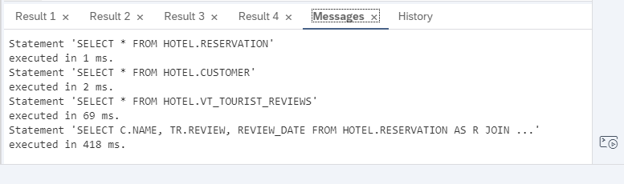

11. Add a new review.

    ```SQL
    INSERT INTO HOTELS.VT_TOURIST_REVIEWS(review_id, review_date, destination_id, destination_rating, review) VALUES(3, '2020-08-21', 1, 5, 'The harbour cruise was fantastic.  It was great to see the city from a different viewpoint');
    SELECT * FROM HOTELS.VT_TOURIST_REVIEWS;
    ```    

    Notice that the virtual table is editable.


A benefit of a virtual table is that there is no data movement.  There is only one location where the data is persisted.  As seen above, this can lead to longer query times when accessing remote data.


### Connect from SAP HANA Cloud, SAP HANA database to a data lake Relational Engine
[SAP HANA Cloud, data lake](https://help.sap.com/docs/hana-cloud-data-lake) can be used to store large amounts of data that is not accessed and updated as frequently as data in an SAP HANA database.  The following steps create the table `tourist_reviews` in SAP HANA Cloud, data lake Relational Engine and access the table from the associated HDB instance.

1. If needed, in SAP HANA Cloud Central, add an SAP HANA Cloud, data lake (HDLRE) instance to your SAP HANA Cloud instance, by choosing **Actions > Add Data Lake**.

    

2. Open the database explorer with a connection to the data lake by choosing **Open in SAP HANA Database Explorer**.

    

3.  Execute the following SQL to create a table named `tourist_reviews` in the HDLRE.

    >If needed, first create the required schema and role.
    
    ```SQL
    --Create a schema for the sample hotel dataset 
    CREATE SCHEMA HOTELS;
    --Create USER1 and grant privileges 
    CREATE USER USER1 IDENTIFIED BY Password1;
    GRANT ALL PRIVILEGES ON SCHEMA HOTELS TO USER1;
        
    SET SCHEMA HOTELS;
    
    CREATE TABLE TOURIST_REVIEWS (
        REVIEW_ID INTEGER PRIMARY KEY,
        REVIEW_DATE DATE NOT NULL,
        DESTINATION_ID INTEGER,
        DESTINATION_RATING INTEGER,
        REVIEW VARCHAR(500) NOT NULL
    );

    INSERT INTO TOURIST_REVIEWS(REVIEW_ID, REVIEW_DATE, DESTINATION_ID, DESTINATION_RATING, REVIEW) VALUES(1, '2019-03-15', 1, 5, 'We had a great day swimming at the beach and exploring the beach front shops.  We will for sure be back next summer.');
    INSERT INTO TOURIST_REVIEWS(REVIEW_ID, REVIEW_DATE, DESTINATION_ID, DESTINATION_RATING, REVIEW) VALUES(2, '2019-02-02', 1, 4, 'We had an enjoyable meal.  The service and food were outstanding.  Would have liked to have slightly larger portions');
    ```

    

    For additional details consult [CREATE TABLE Statement for Data Lake Relational Engine](https://help.sap.com/docs/hana-cloud-data-lake/sql-reference-for-data-lake-relational-engine/create-table-statement-for-data-lake-relational-engine).

4. In the SAP HANA database connection, create a remote source **from** the HANA database **to** the HDLRE.  Be sure to replace the host and password values.

    >If you have not already done so, ensure that you have added USER1 to your HDLRE database, as shown in Step 1.

    ```SQL
    CREATE REMOTE SOURCE HC_DL
    	ADAPTER "IQODBC"
    		CONFIGURATION 'Driver=libdbodbc17_r.so;host=XXXXXXXX-XXXX-XXXX-XXXX-XXXXXXXXXXXX.iq.hdl.trial-XXXX.hanacloud.ondemand.com:443;ENC=TLS(tls_type=rsa;direct=yes)'
    			WITH CREDENTIAL TYPE 'PASSWORD'
    				USING 'user=USER1;password=Password1';
    CALL PUBLIC.CHECK_REMOTE_SOURCE('HC_DL');
    ```

    

5. After pressing refresh, notice that under remote sources, there is a remote source `HC_DL`.

    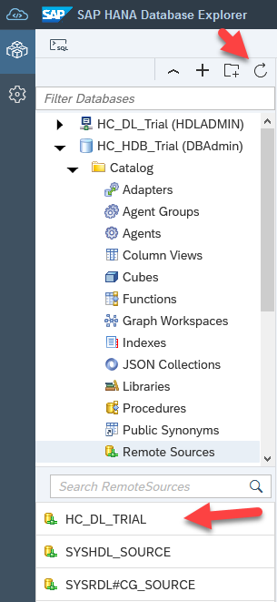

6. Right-click on **`HC_DL`** and choose **Open**.  Create a virtual table in SAP HANA Cloud named **`VT_DL_TOURIST_REVIEWS`** in the schema **HOTELS** that maps to the newly created table in the HDLRE.

    

    This can be visualized as follows:

    

    > Alternatively, the following SQL statement can be used to create the virtual table.  
    >
    ```SQL
    CREATE VIRTUAL TABLE VT_DL_TOURIST_REVIEWS AT HC_DL.iqaas.HOTELS.TOURIST_REVIEWS;
    ```
    >
    It is also possible to create the remote table and virtual table together in the same statement.
    >
    ```SQL
    CREATE VIRTUAL TABLE VT_DL_TOURIST_REVIEWS (
      REVIEW_ID INTEGER PRIMARY KEY,
      REVIEW_DATE DATE NOT NULL,
      DESTINATION_ID INTEGER,
      DESTINATION_RATING INTEGER,
      REVIEW VARCHAR(500) NOT NULL
    ) AT HC_DL.iqaas.HOTELS.TOURIST_REVIEWS WITH REMOTE;
    INSERT INTO VT_DL_TOURIST_REVIEWS VALUES(1, '2019-03-15', 1, 5, 'We had a great day swimming at the beach and exploring the beach front shops.  We will for sure be back next summer.');
    INSERT INTO VT_DL_TOURIST_REVIEWS VALUES(2, '2019-02-02', 1, 4, 'We had an enjoyable meal.  The service and food were outstanding.  Would have liked to have slightly larger portions');
    ```

7. Query the local SAP HANA table and the equivalent HDLRE table.

    ```SQL
    SELECT * FROM TOURIST_REVIEWS;
    SELECT * FROM VT_DL_TOURIST_REVIEWS;
    ```

    

8. Add a new review.

    ```SQL
    INSERT INTO VT_DL_TOURIST_REVIEWS VALUES(3, '2020-08-21', 1, 5, 'The harbour cruise was fantastic.  It was great to see the city from a different viewpoint');
    SELECT * FROM VT_DL_TOURIST_REVIEWS;
    ```    

    Notice that the remote data source is updateable.  Data stored in an HDLRE is stored on disk, which has cost advantages compared to memory storage. HDLRE can also be used to store large amounts of data.

    > Another approach is to use a relational container.  For additional details see [Manage Relational Containers in Data Lake Relational Engine (SAP HANA DB-Managed)](https://help.sap.com/docs/SAP_HANA_DATA_LAKE/9220e7fec0fe4503b5c5a6e21d584e63/0b494fedebb243fc9bd92c87bac7ddd4.html).  An example follows.
    >
    ```SQL
    CALL SYSHDL.CREATE_CONTAINER('HOTELS_CONTAINER', 'DBADMIN');
    CREATE VIRTUAL TABLE TOURIST_REVIEWS (
      REVIEW_ID INTEGER PRIMARY KEY,
      REVIEW_DATE DATE NOT NULL,
      DESTINATION_ID INTEGER,
      DESTINATION_RATING INTEGER,
      REVIEW VARCHAR(500) NOT NULL
    ) at "SYSHDL_HOTELS_CONTAINER_SOURCE"."<NULL>"."SYSHDL_HOTELS_CONTAINER"."TOURIST_REVIEWS" WITH REMOTE;
    INSERT INTO TOURIST_REVIEWS(REVIEW_ID, REVIEW_DATE, DESTINATION_ID, DESTINATION_RATING, REVIEW) VALUES(1, '2019-03-15', 1, 5, 'We had a great day swimming at the beach and exploring the beach front shops.  We will for sure be back next summer.');
    CALL SYSHDL_HOTELS_CONTAINER.REMOTE_EXECUTE('INSERT INTO TOURIST_REVIEWS VALUES(2, ''2019-02-02'', 1, 4, ''We had an enjoyable meal.  The service and food was outstanding.  Would have liked to have slightly larger portions'')');
    --GRANT SYSHDL_HOTELS_CONTAINER_ROLE TO USER1;
    --CONNECT USER1 PASSWORD Password1;
    SELECT * FROM SYSHDL_HOTELS_CONTAINER.TOURIST_REVIEWS;
    CALL SYSHDL_HOTELS_CONTAINER.REMOTE_EXECUTE('DROP TABLE SYSHDL_HOTELS_CONTAINER.TOURIST_REVIEWS;');
    --CONNECT DBADMIN PASSWORD Hana1234;
    CALL SYSHDL.DELETE_CONTAINER('HOTELS_CONTAINER');
    ```


### Connect from a data lake Relational Engine to SAP HANA Cloud, SAP HANA database
The first task in preparing the HDLRE instance is creating a remote server that connects the HDLRE to the HDB instance that contains the data you want to access. 

1. First, right click the HDB in Database Explorer and select properties. 

    

2. In the properties modal, copy the “Host” value to use when create a remote server to the HDB.

    

3. Open your HDLRE in SAP HANA database explorer and open an SQL Console.

    

4. Run the following SQL query against the HDLRE instance using HDLADMIN. Notice, you are naming the remote server `HDB_SERVER`. Replace the `<HANA Host Name>` with the host copied from the properties modal.

    ```SQL
    CREATE SERVER HDB_SERVER CLASS 'HANAODBC' USING
    'Driver=libodbcHDB.so;
    ConnectTimeout=0;
    CommunicationTimeout=15000000;
    RECONNECT=0;
    ServerNode=<HANA Host Name>:443;
    ENCRYPT=TRUE;';
    ```

5. Now that the remote server is created, you must create the `EXTERNLOGIN` that will map your HDLRE user to the HANA user credentials and allow access to the HDB. Notice below in the `CREATE EXTERNLOGIN` statement you are granting your HDLRE user permission to use the HANA user for the `HDB_SERVER` that was created above.
   
    ```SQL
    -- Replace `<HDL USER NAME>` with the current HDLRE user that is being used and replace `<HANA USER NAME>` and `<HANA PASSWORD>` with the target HANA database user password.

    -- CREATE EXTERNLOGIN <HDL USER NAME> to HDB_SERVER REMOTE LOGIN <HANA USER NAME> IDENTIFIED BY <HANA PASSWORD>;

    CREATE EXTERNLOGIN HDLADMIN to HDB_SERVER REMOTE LOGIN USER1 IDENTIFIED BY Password1;
    ```

    >If you would prefer to use USER1 instead of HDLADMIN, execute the `GRANT MANAGE ANY USER TO USER1;` query as described [here](https://help.sap.com/docs/hana-cloud-data-lake/sql-reference-for-data-lake-relational-engine/create-externlogin-statement-for-data-lake-relational-engine).

6. Do a quick test to ensure everything has been set up successfully. You will create a temporary table that points to your TOURIST_REVIEWS table in SAP HDB. Then run a select against that table to ensure you are getting data back.

    ```SQL
    CREATE EXISTING LOCAL TEMPORARY TABLE VT_HDB_TOURIST_REVIEWS
    (
        REVIEW_ID           INTEGER          NOT NULL,
        DESTINATION_ID      INTEGER          DEFAULT NULL,
        DESTINATION_RATING  INTEGER          DEFAULT NULL,
        REVIEW              NVARCHAR(500)    NOT NULL,
        REVIEW_DATE         DATE             NOT NULL,
        PRIMARY KEY (REVIEW_ID)
    ) AT 'HDB_SERVER..HOTELS.TOURIST_REVIEWS';

    SELECT * FROM VT_HDB_TOURIST_REVIEWS;
    --DROP TABLE VT_HDB_TOURIST_REVIEWS;
    ```
    


### Connect from a data lake Relational Engine to another data lake Relational Engine
When connecting from one HDLRE instance to another, the steps follow a similar pattern to connecting from an HDLRE to an HDB instance (Step 2 of this tutorial).

1. First, right click the HDLRE instance you want to connect to in Database Explorer (your target instance) and select properties.
    
    

2. In the properties modal, copy the “Host” value to use when creating a remote server to the HDB.
    
    

3. Open your main HDLRE in SAP HANA database explorer and open an SQL Console.

    

4. Run the following SQL query against the HDLRE instance using a user with the `MANAGE ANY REMOTE SERVER` privilege to create a remote server. Notice, you are naming the remote server HDLRE_SERVER. Replace the `<HANA Host Name>` with the host copied from the properties modal.
   
    ```SQL
    CREATE SERVER HDLRE_SERVER CLASS 'IQODBC' USING 
    'DRIVER=libodbc17_r.so;
    host=<remote_host>:443;
    UseCloudConnector=OFF;
    ENC=TLS(tls_type=rsa;direct=yes);'
    ```

5. After creating the server, use the `CREATE EXTERNLOGIN` statement to assign an alternate login name and password for communications with the target server. Replace `<HDLRE USER NAME>` and `<HDLRE PASSWORD>` with the target HDLRE user credentials.

    ```SQL
    -- Replace `<HOST HDL USER NAME>` with the current HDLRE user that is being used and replace `<HDL USER NAME>` and `<HDL PASSWORD>` with the target HDLRE database user password.

    -- CREATE EXTERNLOGIN <HOST HDL USER NAME> TO HDLRE_SERVER REMOTE LOGIN <HDL USER NAME> IDENTIFIED BY <HDL PASSWORD>;

    CREATE EXTERNLOGIN HDLADMIN TO HDLRE_SERVER REMOTE LOGIN USER1 IDENTIFIED BY Password1;
    ```

    >If you would prefer to use USER1 instead of HDLADMIN, execute the `GRANT MANAGE ANY USER TO USER1;` query as described [here](https://help.sap.com/docs/hana-cloud-data-lake/sql-reference-for-data-lake-relational-engine/create-externlogin-statement-for-data-lake-relational-engine).

6. Do a quick test to ensure everything has been set up successfully. You will create a temporary table that points to your TOURIST_REVIEWS table in your target HDLRE. Then run a select against that table to ensure you are getting data back. 
   
    ```SQL
    CREATE EXISTING LOCAL TEMPORARY TABLE VT_HDLRE_TOURIST_REVIEWS
    (
        REVIEW_ID INTEGER PRIMARY KEY,
        REVIEW_DATE DATE NOT NULL,
        DESTINATION_ID INTEGER,
        DESTINATION_RATING INTEGER,
        REVIEW VARCHAR(500) NOT NULL
    ) AT 'HDLRE_SERVER..HOTELS.TOURIST_REVIEWS';

    SELECT * FROM VT_HDLRE_TOURIST_REVIEWS;
    --DROP TABLE VT_HDLRE_TOURIST_REVIEWS;
    ```

    

### Connect from SAP HANA Cloud to SAP HANA, express edition via the Cloud Connector (optional)
The [Cloud Connector](https://help.sap.com/docs/connectivity/sap-btp-connectivity-cf/cloud-connector?version=Cloud) enables communication from the SAP BTP running in the public internet to securely connect to a configured on-premise system such as SAP HANA, express edition.

1. Enable the Cloud Connector connectivity in SAP HANA Cloud Central: Actions > Manage Configuration > Edit.

    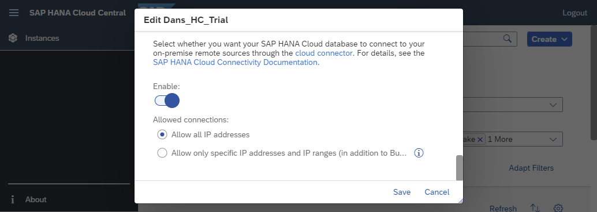

2.  [Download the Cloud Connector](https://tools.hana.ondemand.com/#cloud).  The software needs to run on a machine that can access your on-premise SAP HANA instance.  In this example, the Cloud Connector is running on Windows and is accessing an SAP HANA, express edition database running in a VM on the same machine.  

3. As described at [Installation on Microsoft Windows OS](https://help.sap.com/docs/connectivity/sap-btp-connectivity-cf/installation-on-microsoft-windows-os?version=Cloud), a Java JDK is required.  

    The following commands were used to start the Cloud Connector.

    ```Shell (Microsoft Windows)
    set PATH=<Java Installation Directory\bin>;C:\Windows\System32
    set JAVA_HOME=<Java Installation Directory>
    cd C:\SAP\CC
    go.bat
    ```

    

    >It may take a while to start the Cloud Connector and a line such as Cloud Connector 2.17.0 started will appear as shown above when it is started.

4. In a browser, open the URL <https://localhost:8443>.  

    The initial user name and password are Administrator and manage.

5. Configure the Cloud Connector to connect to the Cloud Foundry subaccount.     

    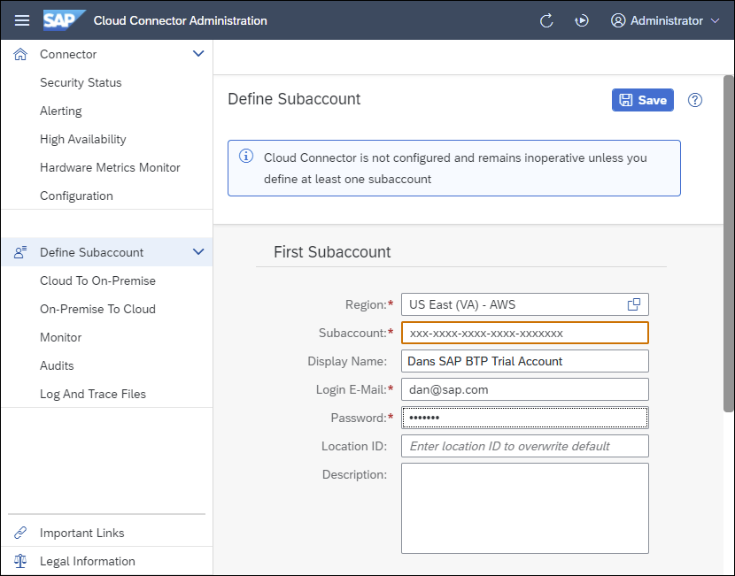

    >The location ID is used when multiple Cloud Connectors are connected to the same subaccount

    >---

    >If you are an SAP employee, you may need to enter your password + a  time-based passcode as the password.


    The region and subaccount ID can be found in the SAP BTP cockpit.

    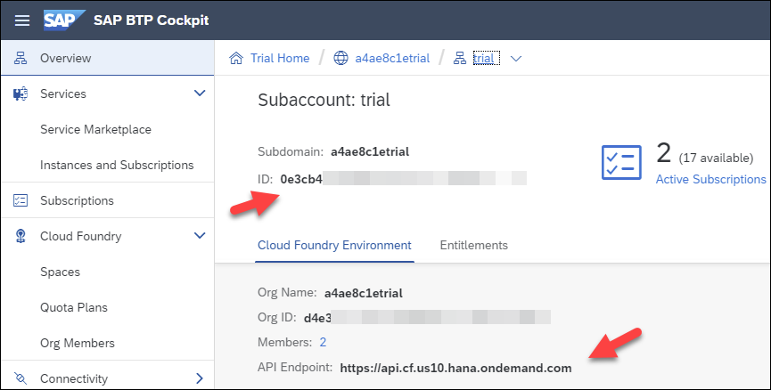

    The screen below shows a successful connection.

    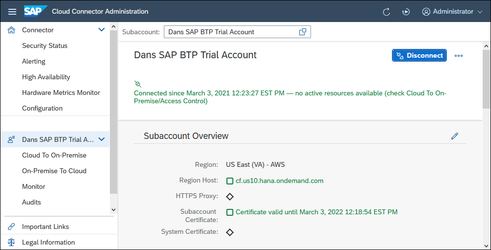

    For additional details, see [Initial Configuration](https://help.sap.com/docs/connectivity/sap-btp-connectivity-cf/cloud-connector-initial-configuration?version=Cloud).

6. Configure the Cloud Connector to connect to the on-premise database.

    Select **Cloud To On-Premise** and press the **+** icon.

    Select **SAP HANA** for the back-end type.

    Select **TCP** for the protocol.

    Specify the host and port for the SAP HANA, express database.

    The virtual name and port can be different.

    

    Once the cloud connector has been installed and configured to connect to a BTP subaccount, it will appear as shown below in the SAP BTP Cockpit.

    

7. In the SAP HANA database explorer connected to SAP HANA Cloud, right-click **Remote Sources** and select **Add Remote Source**.  

    

    Specify the server, port, extra adapter properties, credentials (User1, Password1) and if a Location ID was specified in step 5, add `scc_location_id=<locationid>'` to the Extra Adapter Properties.

    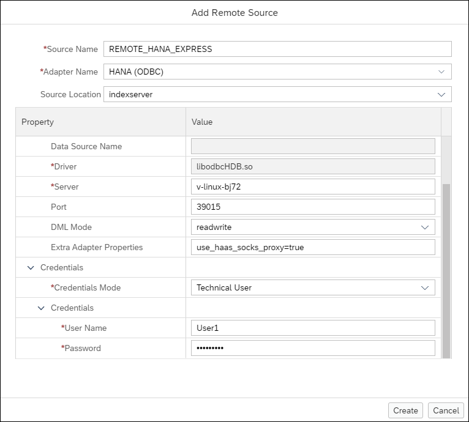

    Alternatively, in a SQL console, enter the SQL statement below after adjusting the `ServerNode`.  

    ```SQL
    CREATE REMOTE SOURCE REMOTE_HANA_EXPRESS
    	ADAPTER "hanaodbc"
    		CONFIGURATION 'ServerNode=hxehost:39015;use_haas_socks_proxy=true;driver=libodbcHDB.so;'
    			WITH CREDENTIAL TYPE 'PASSWORD'
    				USING 'user=User1;password=Password1';
    CALL PUBLIC.CHECK_REMOTE_SOURCE('REMOTE_HANA_EXPRESS');
    ```  

    Additional details can be found at [Create an SAP HANA On-Premise Remote Source](https://help.sap.com/docs/hana-cloud-database/sap-hana-cloud-sap-hana-database-data-access-guide/create-sap-hana-on-premise-remote-source).

8. After executing the create remote source SQL statement, the result can be seen in the **Remote Sources** folder, as shown below.  You may need to press the refresh button.

    

9. Right-click the remote source named `REMOTE_HANA_EXPRESS` and choose **Open**.  

10. Set the **Schema** to be **`HOTELS`** and press the **Search** button.

    

    Notice that it is possible to create virtual tables to access the data from the on-premise system in SAP HANA Cloud.

    This can be visualized as follows:

    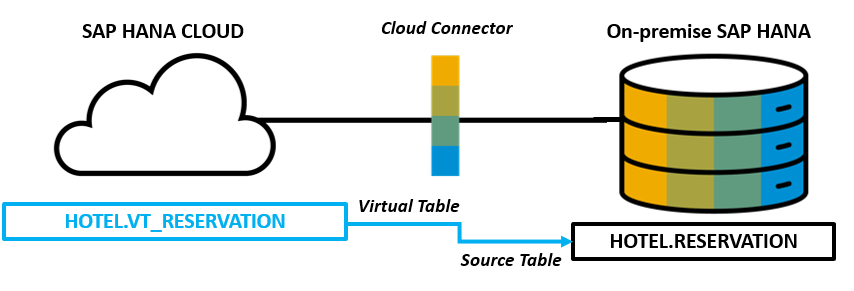

For further information, see [Data Replication and Data Virtualization](group.hana-cloud-extend-2-data-replication), and [Getting Started with SAP HANA Cloud | Remote Data Source](https://blogs.sap.com/2020/08/03/getting-started-with-sap-hana-cloud-vii-smart-data-access/).


### Knowledge check

Congratulations!  You have now used remote sources to access data running on a different SAP HANA instance and on an SAP HANA Cloud, data lake Relational Engine.


---
