# Explore SAP HANA Cloud, SAP HANA Database SQL on Files
<!-- description --> Learn how files such as CSV or Parquet stored on data lake Files can be queried using SQL on Files.  

## Prerequisites 
- An SAP HANA Cloud, SAP HANA database (2024 QRC3)
- A data lake Files instance (unavailable in trial/free tier)

## You will learn
  - How to create and configure a data lake Files instance
  - How to upload and view files on a data lake Files instance 
  - How to create a remote source that connects an SAP HANA Cloud database to a data lake Files instance
  - How to create and query virtual tables that are based on CSV or PARQUET files stored on a data lake Files instance
  - How to create a snapshot replica tables
  - How to export data to data lake Files
  - How to create partitioned virtual tables

---


### SAP HANA Cloud data lake overview
A [data lake Relational Engine](https://help.sap.com/docs/hana-cloud-data-lake/welcome-guide/data-lake-relational-engine) is a column oriented, disk based relational store that can be used to economically store data that is not updated frequently.  With a data lake Relational Engine, virtual tables can also be created that retrieve their data from a CSV,  Parquet, or ORC file that is stored on a data lake Files instance. 

A [data lake Files](https://help.sap.com/docs/hana-cloud-data-lake/user-guide-for-data-lake-files/understanding-data-lake-files) instance provides storage for non-structured files such as images or PDF documents.  It can also store structured files such as CSV or Parquet files and with the use of [SQL on Files](https://help.sap.com/docs/hana-cloud-data-lake/administration-guide-for-sql-on-files/using-sql-on-files), queries can be performed on the data contained in those files, without ingestion, and at a reduced cost, providing access to diverse datasets.
  
In this tutorial, we will be using the SAP HANA Database SQL on Files feature which was released in QRC 3 of 2024.  Virtual tables can be created in SAP HANA Cloud, SAP HANA database that retrieve their data from a CSV, Parquet, or Delta table stored on a data lake Files instance.  Details can be found in [SAP HANA Cloud, SAP HANA Database SQL on Files Guide](https://help.sap.com/docs/hana-cloud-database/sap-hana-cloud-sap-hana-database-sql-on-files-guide/sap-hana-native-sql-on-files-overview) and [Unlocking the True Potential of Data in Files with SAP HANA Database SQL on Files in SAP HANA Cloud](https://community.sap.com/t5/technology-blogs-by-sap/unlocking-the-true-potential-of-data-in-files-with-sap-hana-database-sql-on/ba-p/13861585).

### View and Create Instances in SAP HANA Cloud Central
[SAP HANA Cloud Central](https://help.sap.com/docs/hana-cloud/sap-hana-cloud-administration-guide/subscribing-to-sap-hana-cloud-administration-tools) can be used to view and manage your SAP HANA Cloud instances running in a subaccount.  

A SAP HANA database and a Data lake Files instance are required to complete this tutorial.

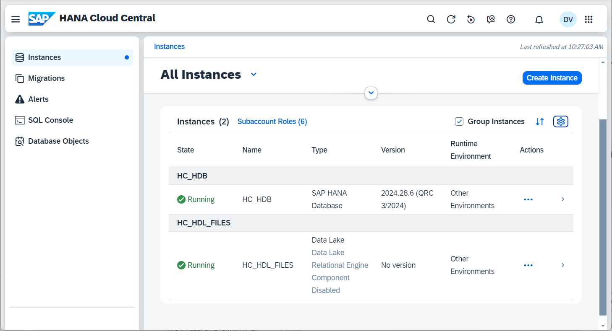

If you have not already done so, use the **Create Instance** button to create the required instances.  Note that the version must be 2024 QRC 3 or higher. 

1. Create an SAP HANA Cloud, SAP HANA database instance.

    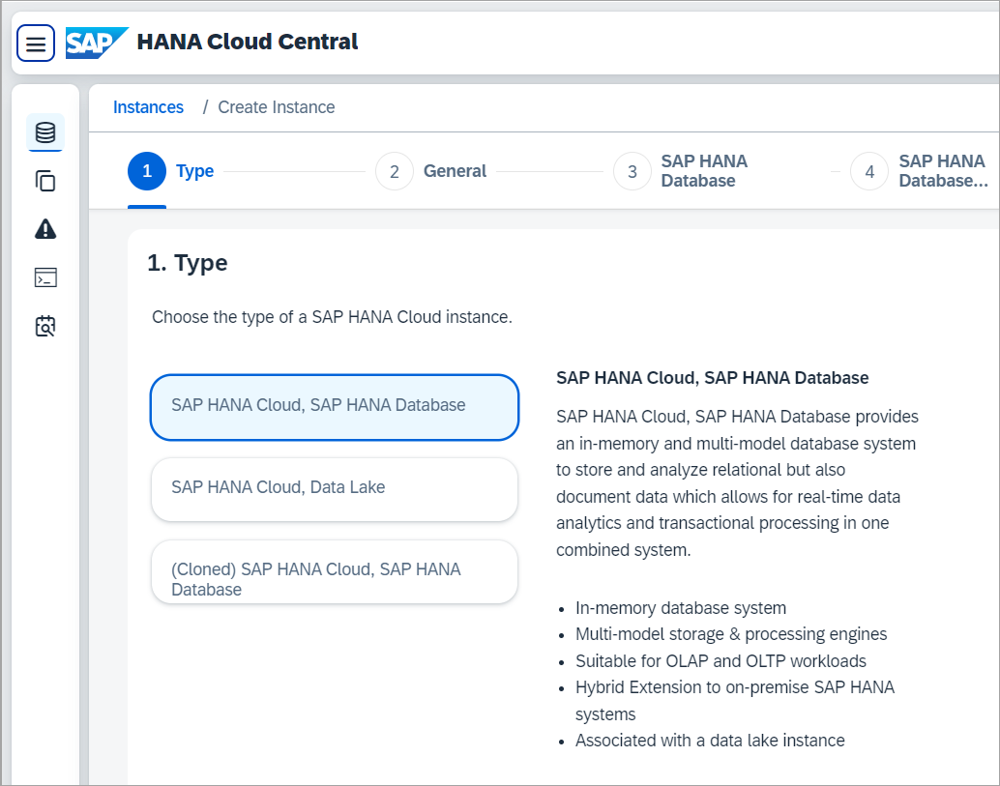

2. Create an SAP HANA Cloud, data lake Files instance.

    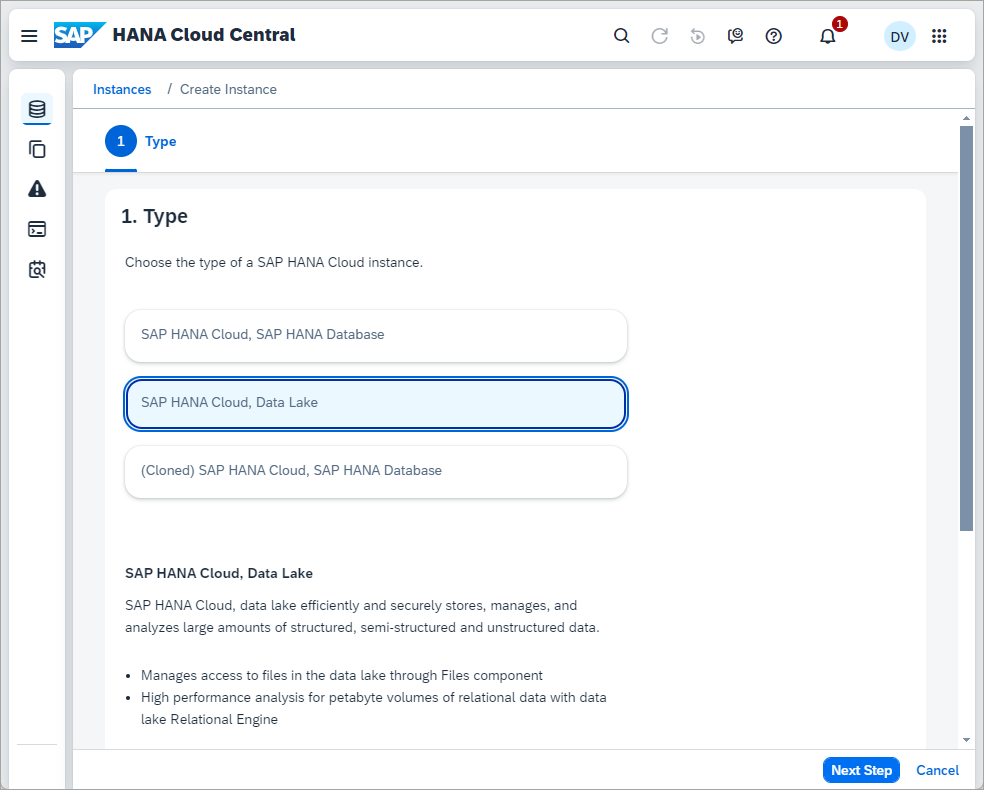

    For this tutorial, a data lake Relational Engine is not required so it can be optionally disabled.

    

    Notice that the estimate is 0 CU or consumption units per month as initially the data lake Files instance will be empty.

### Configure a data lake Files instance
The data lake Files instance uses X.509 certificates for authentication and authorization.

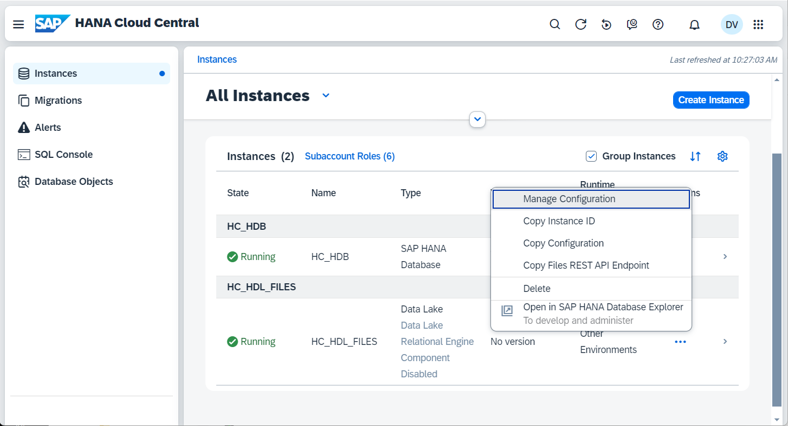

Details on how to create the certificates and configure the data lake Files instance can be found at steps 3 and 4 of [Getting Started with Data Lake Files HDLFSCLI](data-lake-file-containers-hdlfscli).

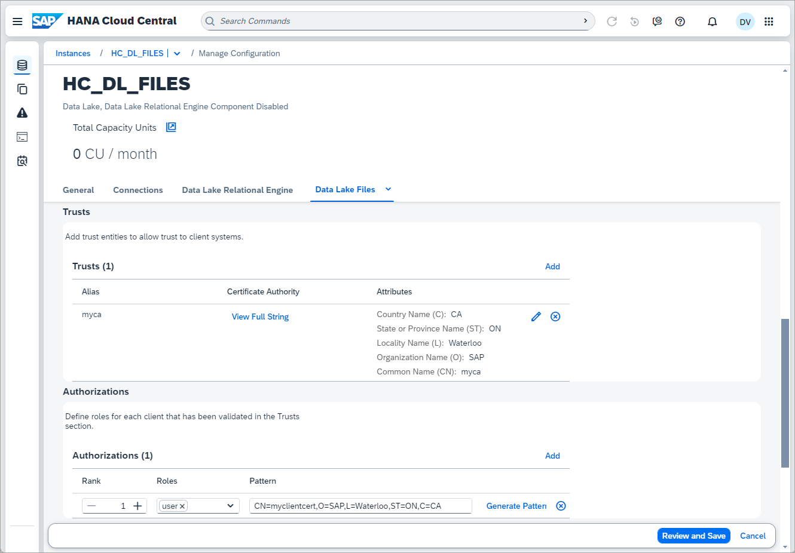

The authorization pattern indicates that client certificates that are trusted by the CA specified in the trusts section that match the provided pattern (SAP employees in Waterloo) will have the privileges assigned to the role user. 

See also [Setting Up Initial Access to HANA Cloud data lake Files](https://community.sap.com/t5/technology-blogs-by-sap/setting-up-initial-access-to-hana-cloud-data-lake-files/ba-p/13519656) and [Configuring Data Lake Files](https://help.sap.com/docs/hana-cloud-data-lake/user-guide-for-data-lake-files/configuring-data-lake-files).

### Create a database user with the required privileges
Follow the steps below to connect to the database using the SAP HANA database explorer.

1. In the Instances app, from the action menu for HC_HDB, select Open in SAP HANA database explorer.

    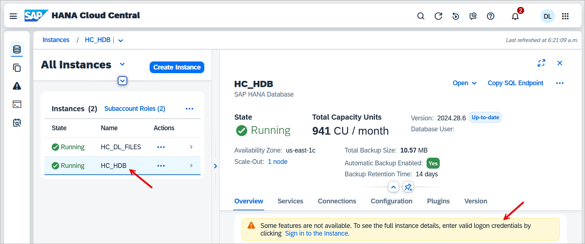

2.  Click on the SQL icon in the top right to open a SQL Console.

3. If you do not wish to use the DBADMIN user, the following SQL can be used to create a database user that can be used for the steps in this tutorial.

    ```SQL
    CREATE USERGROUP HC_UG SET PARAMETER 'minimal_password_length' = '8', 'force_first_password_change' = 'FALSE';
    CREATE USER USER3 PASSWORD Password3 no force_first_password_change SET USERGROUP HC_UG;
    
    CREATE ROLE HC_DLFILES_ROLE;
    GRANT TRUST ADMIN TO HC_DLFILES_ROLE; -- required to create a PSE
    GRANT CERTIFICATE ADMIN TO HC_DLFILES_ROLE; --required to create a certificate
    GRANT CREDENTIAL ADMIN TO HC_DLFILES_ROLE; --required to create a credential
    GRANT EXPORT TO HC_DLFILES_ROLE; --required to enable export of data
    GRANT IMPORT TO HC_DLFILES_ROLE; --required to enable import of data
    GRANT CREATE REMOTE SOURCE TO HC_DLFILES_ROLE; --allow setting the PSE purpose to REMOTE SOURCE and to create REMOTE SOURCES
    GRANT CATALOG READ TO HC_DLFILES_ROLE;   --allow access to system views
    GRANT HC_DLFILES_ROLE TO USER3;
    
    CONNECT USER3 PASSWORD Password3;
    ```

    Then create a new connection using the specified user using the Add Database with Different User option.

    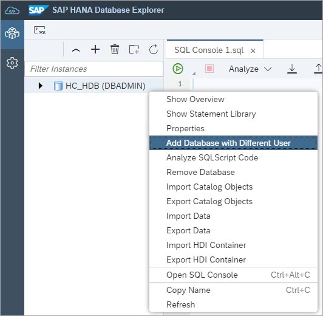

### Connect from SAP HANA database explorer to data lake Files
Once the data lake Files instance has been created and configured, it can be accessed using the [SAP HANA database explorer](https://help.sap.com/docs/hana-cloud/sap-hana-database-explorer/getting-started-with-sap-hana-database-explorer), [REST API](https://help.sap.com/doc/9d084a41830f46d6904fd4c23cd4bbfa/2024_3_QRC/en-US/html/index.html), or [hdlfscli](https://help.sap.com/docs/hana-cloud-data-lake/user-guide-for-data-lake-files/hdlfscli-data-lake-files-utility).

1. From SAP HANA Cloud Central, select **Open in SAP HANA Database Explorer** from the action menu of the instance HC_DL_FILES.

    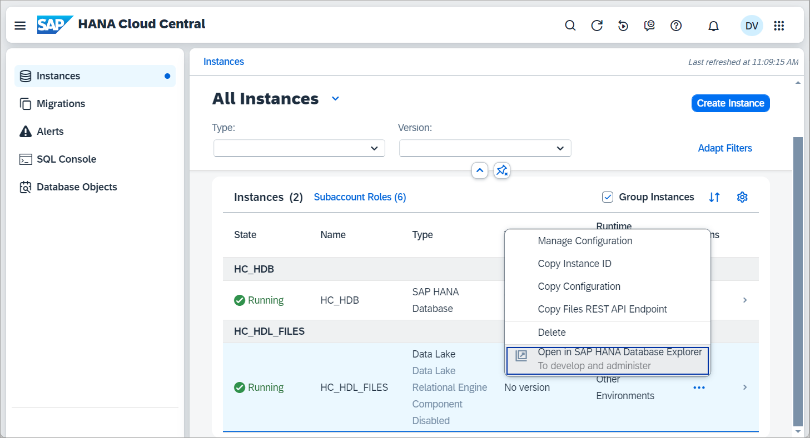

2. Specify the Client Certificate, Client Key, and Display Name.

    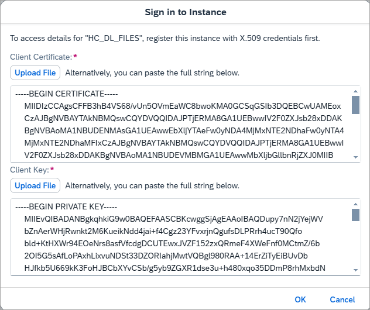

    A new connection will appear.

    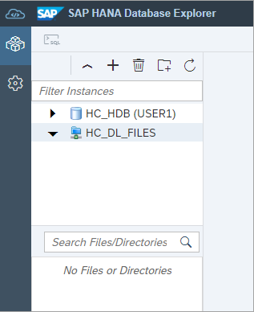

### Upload and perform operations on files
Files can now be uploaded to the data lake Files instance.

1. Download a data set on the passengers of the Titanic in both csv and parquet.

    * [titanic.csv](https://www.timestored.com/data/sample/csv)
    * [titanic.parquet](https://www.timestored.com/data/sample/parquet)

    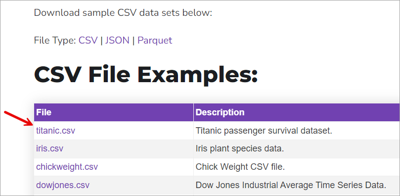

    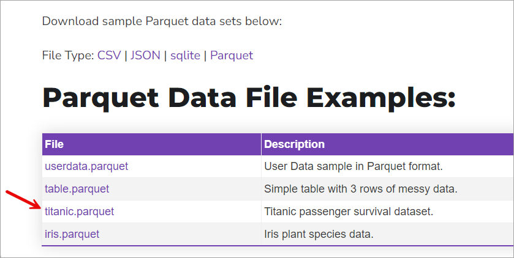


2. When using SQL on Files with a CSV file, the source file cannot have a header row.  CSV files with a header will likely be supported in an upcoming release.  

    * Open the previously downloaded CSV file in an editor such as Notepad.  
    
    * Remove the header row or the first row which contains the names of the columns.  
    
    * Save the file as titanic_nh.csv.  

3. Upload these files into a folder of your choosing such as your first name.  

    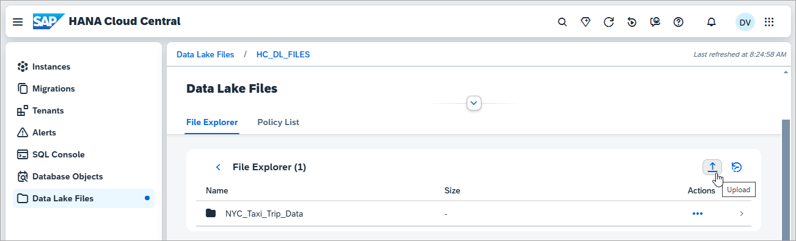

    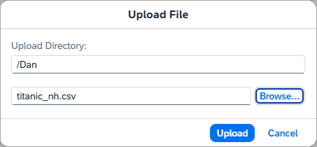

4. Examine the uploaded csv file.  A viewer is provided so that text files such as CSV can be viewed. 

    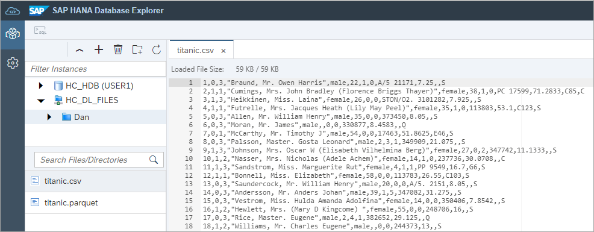

    Different operations can be performed on a folder or individual files such as: 
    
    * move
    * rename
    * delete
    * restore snapshot
    * download
    
    A detailed view of the files can be seen as shown below enabling multiple files to be selected.

    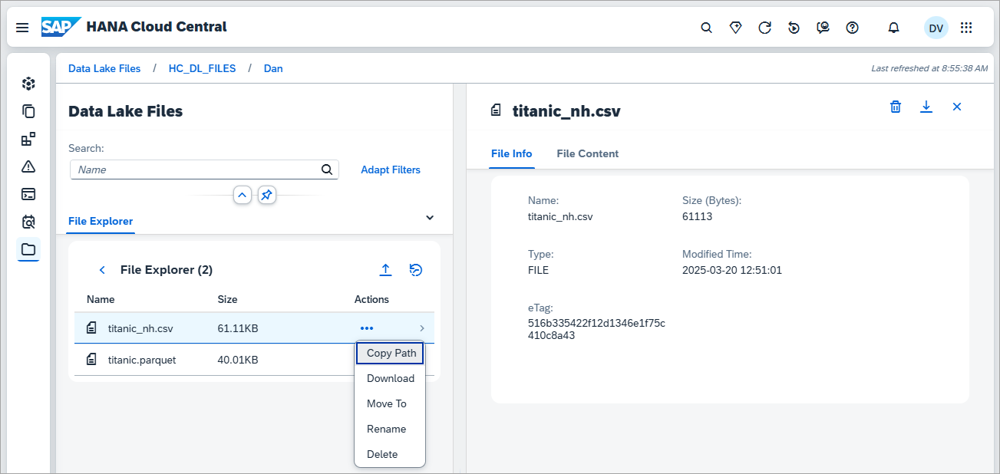

    Notice above that the Parquet file while containing the same data is smaller as it stores the data in a compressed format.

### Create a remote source
A remote source provides a connection from an SAP HANA database to the data lake Files instance.

1. Execute the below SQL to view a list of existing remote sources, PSEs, and certificates.  In order for a remote source to be created, a personal security environment (PSE) store is required that contains the appropriate certificates to enable the connection from the database to the data lake Files instance.  

    ```SQL
    SELECT * FROM REMOTE_SOURCES;
    SELECT * FROM PSES;
    SELECT * FROM CERTIFICATES;
    SELECT * FROM PSE_CERTIFICATES;
    ```

2. Use the **Link** option in SAP HANA Cloud Central to create a remote source, PSE, and certificates.  It should be noted that the client certificate created does not have an option to export the client.key so it is not available to be used for connections other than those that originate from within the SAP HANA Cloud, SAP HANA database such as those from the SAP HANA database explorer or hdlfscli tool. 

    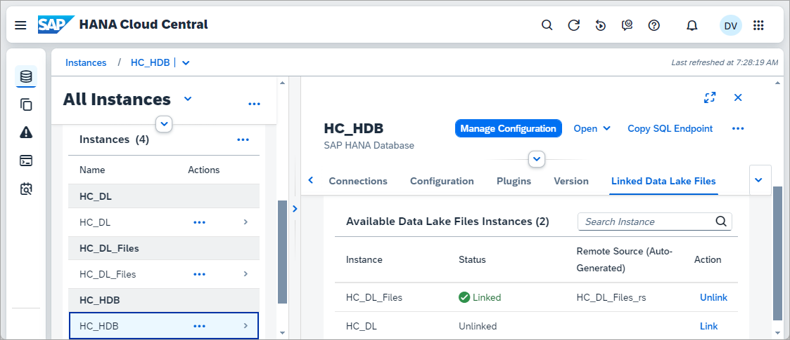

    ```SQL
    SELECT * FROM REMOTE_SOURCES;
    SELECT * FROM PSES;
    SELECT * FROM CERTIFICATES;
    SELECT * FROM PSE_CERTIFICATES;
    ```

    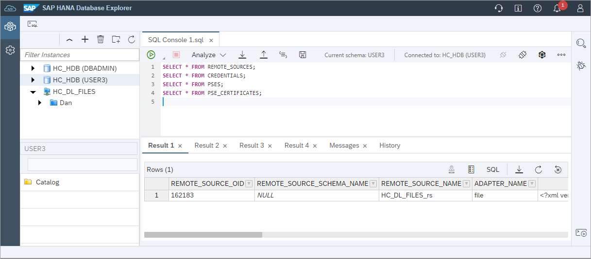

    Notice that there is now a remote source to the linked data lake Files instance.

3.  Users can be granted privileges to access the PSE and remote source.  Further details can be found at [GRANT Statement (Access Control)](https://help.sap.com/docs/hana-cloud-database/sap-hana-cloud-sap-hana-database-sql-reference-guide/grant-statement-access-control).

    ```SQL
    CONNECT DBADMIN PASSWORD YOUR_PASSWORD;
    
    GRANT REFERENCES ON PSE _SAP_DB_ACCESS_PSE_CLIENT_IDENTITY TO HC_DLFILES_ROLE;

    GRANT CREATE VIRTUAL TABLE ON REMOTE SOURCE "HC_HDL_FILES_rs" TO HC_DLFILES_ROLE;

    --Authorizes the creation of tables on a remote source object
    GRANT REMOTE TABLE ADMIN ON REMOTE SOURCE "HC_HDL_FILES_rs" TO HC_DLFILES_ROLE;
    
    CONNECT USER3 PASSWORD Password3;
    ```

4. Should you wish to create the remote source, PSE, and certificates without using the UI, the following SQL can be used.
    
    ```SQL
    SELECT * FROM PSES;
    CREATE PSE HC_DL_FILES_PSE;

    SELECT SUBJECT_COMMON_NAME, CERTIFICATE_ID, COMMENT, CERTIFICATE FROM CERTIFICATES;
    --See also https://help.sap.com/docs/hana-cloud-database/sap-hana-cloud-sap-hana-database-security-guide/secure-communication-between-sap-hana-and-sap-hana-clients
    CREATE CERTIFICATE FROM '-----BEGIN CERTIFICATE-----MIIDrzCCApegAwIBAgIQCDvgVpBCRrGhdWrJWZHHSjANBgkqhkiG9w0BAQUFADBh
    MQswCQYDVQQGEwJVUzEVMBMGA1UEChMMRGlnaUNlcnQgSW5jMRkwFwYDVQQLExB3
    d3cuZGlnaWNlcnQuY29tMSAwHgYDVQQDExdEaWdpQ2VydCBHbG9iYWwgUm9vdCBD
    QTAeFw0wNjExMTAwMDAwMDBaFw0zMTExMTAwMDAwMDBaMGExCzAJBgNVBAYTAlVT
    MRUwEwYDVQQKEwxEaWdpQ2VydCBJbmMxGTAXBgNVBAsTEHd3dy5kaWdpY2VydC5j
    b20xIDAeBgNVBAMTF0RpZ2lDZXJ0IEdsb2JhbCBSb290IENBMIIBIjANBgkqhkiG
    9w0BAQEFAAOCAQ8AMIIBCgKCAQEA4jvhEXLeqKTTo1eqUKKPC3eQyaKl7hLOllsB
    CSDMAZOnTjC3U/dDxGkAV53ijSLdhwZAAIEJzs4bg7/fzTtxRuLWZscFs3YnFo97
    nh6Vfe63SKMI2tavegw5BmV/Sl0fvBf4q77uKNd0f3p4mVmFaG5cIzJLv07A6Fpt
    43C/dxC//AH2hdmoRBBYMql1GNXRor5H4idq9Joz+EkIYIvUX7Q6hL+hqkpMfT7P
    T19sdl6gSzeRntwi5m3OFBqOasv+zbMUZBfHWymeMr/y7vrTC0LUq7dBMtoM1O/4
    gdW7jVg/tRvoSSiicNoxBN33shbyTApOB6jtSj1etX+jkMOvJwIDAQABo2MwYTAO
    BgNVHQ8BAf8EBAMCAYYwDwYDVR0TAQH/BAUwAwEB/zAdBgNVHQ4EFgQUA95QNVbR
    TLtm8KPiGxvDl7I90VUwHwYDVR0jBBgwFoAUA95QNVbRTLtm8KPiGxvDl7I90VUw
    DQYJKoZIhvcNAQEFBQADggEBAMucN6pIExIK+t1EnE9SsPTfrgT1eXkIoyQY/Esr
    hMAtudXH/vTBH1jLuG2cenTnmCmrEbXjcKChzUyImZOMkXDiqw8cvpOp/2PV5Adg
    06O/nVsJ8dWO41P0jmP6P6fbtGbfYmbW0W5BjfIttep3Sp+dWOIrWcBAI+0tKIJF
    PnlUkiaY4IBIqDfv8NZ5YBberOgOzW6sRBc4L0na4UU+Krk2U886UAb3LujEV0ls
    YSEY1QSteDwsOoBrp+uvFRTp2InBuThs4pFsiv9kuXclVzDAGySj4dzp30d8tbQk
    CAUw7C29C79Fv1C5qfPrmAESrciIxpg0X40KPMbp1ZWVbd4=-----END CERTIFICATE-----' COMMENT 'SAP_HC';
    SELECT CERTIFICATE_ID FROM CERTIFICATES WHERE COMMENT = 'SAP_HC'; --CERTIFICATE_ID
    ALTER PSE HC_DL_FILES_PSE ADD CERTIFICATE <REPLACE_WITH_CERT_ID>;

    ALTER PSE HC_DL_FILES_PSE SET OWN CERTIFICATE
    '<Contents from client.key>
    <Contents from client.crt>
    <Contents from ca.crt>';
    SELECT * FROM PSE_CERTIFICATES;
    ```

    For further details see [Set Up an X.509 Mutual Authentication Environment](https://help.sap.com/docs/hana-cloud-database/sap-hana-cloud-sap-hana-database-data-access-guide/set-up-x-509-mutual-authentication-environment).

    ```SQL
    --Create a credential for export using the previously created PSE.
    CREATE CREDENTIAL FOR COMPONENT 'SAPHANAIMPORTEXPORT' PURPOSE 'DL_FILES' TYPE 'X509' PSE HC_DL_FILES_PSE;
    SELECT * FROM CREDENTIALS;
    ```

    ```SQL
    --Replace the endpoint value below
    CREATE REMOTE SOURCE HC_DL_FILES_RS ADAPTER "file" CONFIGURATION '
    provider=hdlf;
    endpoint=b5183d42-9150-4bb2-9f51-80d51b8f5c4b.files.hdl.prod-us10.hanacloud.ondemand.com;'
    WITH CREDENTIAL TYPE 'X509' PSE HC_DL_FILES_PSE;
    SELECT * FROM REMOTE_SOURCES;
    ```

    Users can be granted privileges to access the PSE and remote source.  Further details can be found at [GRANT Statement (Access Control)](https://help.sap.com/docs/hana-cloud-database/sap-hana-cloud-sap-hana-database-sql-reference-guide/grant-statement-access-control).

    ```SQL
    GRANT REFERENCES ON PSE HC_DL_FILES_PSE TO HC_DLFILES_ROLE;

    GRANT CREATE VIRTUAL TABLE ON REMOTE SOURCE "HC_DL_FILES_RS" TO HC_DLFILES_ROLE;

    --Authorizes the creation of tables on a remote source object
    GRANT REMOTE TABLE ADMIN ON REMOTE SOURCE "HC_DL_FILES_RS" TO HC_DLFILES_ROLE;
    ```
   
### Create virtual tables
Virtual tables can now be created using the remote source HC_HDL_FILES_rs.  

1. Create a virtual table that points to the CSV file.  

    ```SQL
    --Update YOUR_NAME before executing and ensure the case is correct
    --DROP TABLE TITANIC_CSV;
    CREATE VIRTUAL TABLE TITANIC_CSV (
        PASSENGERID INTEGER,
        SURVIVED INTEGER,
        PCLASS INTEGER,
        NAME NVARCHAR(100),
        SEX NVARCHAR(6),
        AGE DOUBLE,
        SIBSP INTEGER,
        PARCH INTEGER,
        TICKET NVARCHAR(25),
        FARE DOUBLE,
        CABIN NVARCHAR(15),
        EMBARKED NVARCHAR (1)
    ) AT "HC_HDL_FILES_rs"."/YOUR_NAME/titanic_nh.csv"
      AS CSV FIELD DELIMITED BY ',' ESCAPE '"';

    SELECT * FROM TITANIC_CSV;
    ```

    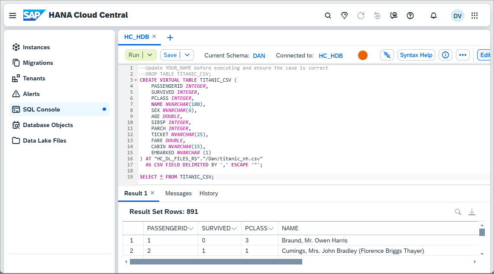

    Notice above that the table, TITANIC_CSV in the catalog browser appears with an annotation indicating that it is a virtual file.

2. Create a virtual table that points to the Parquet file.

    ```SQL
    --Update YOUR_NAME before executing and ensure the case is correct
    --DROP TABLE TITANIC_P;
    CREATE VIRTUAL TABLE TITANIC_P (
        PASSENGERID BIGINT,
        SURVIVED BIGINT,
        PCLASS BIGINT,
        NAME NVARCHAR(100),
        SEX NVARCHAR(6),
        AGE DOUBLE,
        SIBSP BIGINT,
        PARCH BIGINT,
        TICKET NVARCHAR(25),
        FARE DOUBLE,
        CABIN NVARCHAR(15),
        EMBARKED NVARCHAR (1)
    ) AT "HC_HDL_FILES_rs"."/YOUR_NAME/titanic.parquet" AS PARQUET;

    SELECT * FROM TITANIC_P;
    ```

3. The file structure of a parquet file can be determined by calling the below stored procedure.

    ```SQL
    --Update YOUR_NAME before executing and ensure the case is correct
    CALL GET_REMOTE_SOURCE_FILE_COLUMNS(
      REMOTE_SOURCE_NAME => 'HC_HDL_FILES_rs',
      REMOTE_FILE_PATH => '/YOUR_NAME/titanic.parquet',
      REMOTE_FILE_FORMAT => 'PARQUET',
      OPTIONS => ''
    )
    ```

     

### Query virtual tables
The data being stored on the data lake Files can now be queried using SQL similar to a regular table.  Virtual tables can also be joined with regular tables.

The following are some sample queries that can be performed on the previously created virtual tables.

1. View the number of female and male passengers.

    ```SQL
    SELECT SEX, COUNT(*) FROM TITANIC_P GROUP BY SEX;
    ```

2. Survival rate based on class of ticket

    ```SQL
    SELECT   
      PCLASS AS PASSENGER_CLASS,
      CASE WHEN (SURVIVED = 0) THEN 'perished' 
              ELSE 'survived' END AS SURVIVED, 
      COUNT(*) AS COUNT_SURVIVED
    FROM TITANIC_P
    GROUP BY PCLASS, SURVIVED
    ORDER BY PCLASS ASC, SURVIVED ASC;
    ```

3. Survival rate based on gender

    ```SQL
    SELECT   
      SEX AS MALE_OR_FEMALE,
      CASE WHEN (SURVIVED = 0) THEN 'perished' 
          ELSE 'survived' END AS SURVIVED,  
      COUNT(*) AS COUNT_SURVIVED
    FROM TITANIC_P
    GROUP BY SEX, SURVIVED
    ORDER BY SEX ASC, SURVIVED ASC;
    ```

4. Survival rate based on age

    ```SQL 
    SELECT 
    SUM(CASE WHEN AGE < 18 AND SURVIVED = 0 THEN 1 ELSE 0 END) AS "DIED UNDER 18",
    SUM(CASE WHEN AGE < 18 AND SURVIVED = 1 THEN 1 ELSE 0 END) AS "SURVIVED UNDER 18",
    SUM(CASE WHEN AGE >= 18 AND AGE <= 50 AND SURVIVED = 0 THEN 1 ELSE 0 END) AS "DIED 18 - 50",
    SUM(CASE WHEN AGE >= 18 AND AGE <= 50 AND SURVIVED = 1 THEN 1 ELSE 0 END) AS "SURVIVED 18 - 50",
    SUM(CASE WHEN AGE >= 51 AND SURVIVED = 0 THEN 1 ELSE 0 END) AS "DIED 51+",
    SUM(CASE WHEN AGE >= 51 AND SURVIVED = 1 THEN 1 ELSE 0 END) AS "SURVIVED 51+",
    SUM(CASE WHEN AGE IS NULL AND SURVIVED = 0 THEN 1 ELSE 0 END) AS "DIED Unknown",
    SUM(CASE WHEN AGE IS NULL AND SURVIVED = 1 THEN 1 ELSE 0 END) AS "SURVIVED Unknown"
    FROM TITANIC_CSV;
    ```

5. Virtual SQL on Files tables are not updatable.  Try adding yourself to the passenger list.  

    ```SQL
    INSERT INTO TITANIC_CSV VALUES(
      892 /*PASSENGERID <INTEGER>*/,
      1 /*SURVIVED <INTEGER>*/,
      2 /*PCLASS <INTEGER>*/,
      'YOUR_NAME' /*NAME <NVARCHAR(100)>*/,
      'male' /*SEX <NVARCHAR(6)>*/,
      52 /*AGE <DOUBLE>*/,
      0 /*SIBSP <INTEGER>*/,
      0 /*PARCH <INTEGER>*/,
      '1234' /*TICKET <NVARCHAR(25)>*/,
      75 /*FARE <DOUBLE>*/,
      'A50'/*CABIN <NVARCHAR(15)>*/,
      'C'/*EMBARKED <NVARCHAR(1)>*/
    )
    ```

    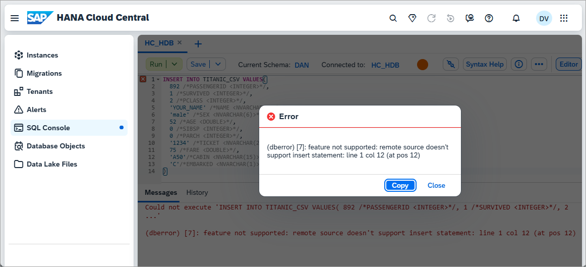

### Replica tables
A virtual table can be changed so that the data is stored in the SAP HANA Cloud database rather than be retrieved from a file stored on the data lake Files instance.  This is called a snapshot replica.

1. Execute a query and examine the time taken.  

    ```SQL
    SELECT * FROM TITANIC_CSV WHERE NAME LIKE '%Dan%';
    ```

    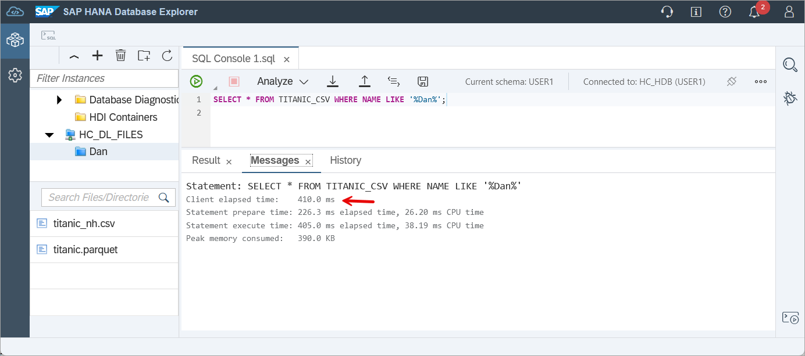

2. Change the table to be a replica table.

    ```SQL
    ALTER VIRTUAL TABLE TITANIC_CSV ADD SHARED SNAPSHOT REPLICA;
    ```

3. Run the same query on the replica table and examine the time taken.

    ```SQL
    SELECT * FROM TITANIC_CSV WHERE NAME LIKE '%Dan%';
    ```

    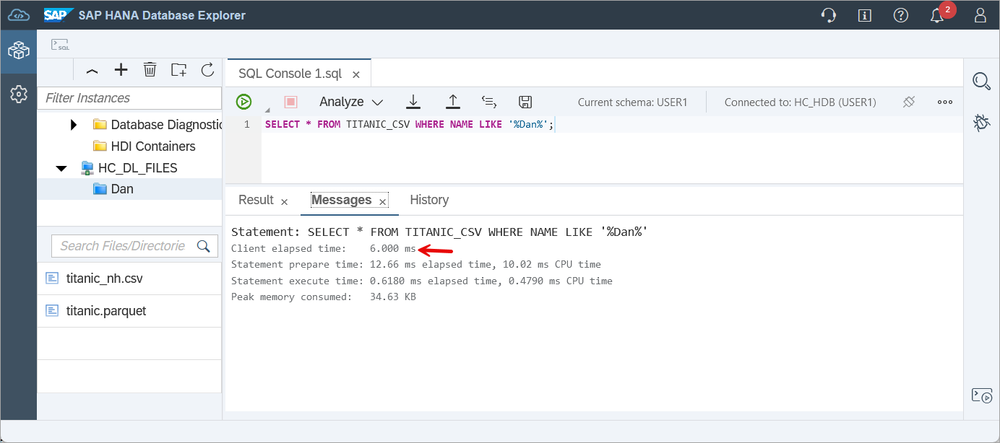

4. Add yourself as a passenger on the Titanic by editing the titanic_nh.csv file you downloaded earlier and including a new row. An example row is shown below.   

    ```CSV
    892,1,2,"van Leeuwen, Mr. Dan",male,52,0,0,1234,75,A50,C
    ```
    Ensure there is a new line character after the added row.

    Upload this modified file to your instance, replacing the existing one. 

5. Execute the following SQL (update to reflect your name) and notice that the replica table does not contain the newly inserted row.

    ```SQL
    SELECT * FROM TITANIC_CSV WHERE NAME LIKE '%Dan%';
    ```

6. Refresh the replica table and notice that it now contains the newly added row.

    ```SQL
    ALTER VIRTUAL TABLE TITANIC_CSV REFRESH SNAPSHOT REPLICA;
    SELECT * FROM TITANIC_CSV WHERE NAME LIKE '%Dan%';
    ```

    

7. The replica can be dropped using the SQL below.

    ```SQL
    ALTER VIRTUAL TABLE TITANIC_CSV DROP REPLICA;
    ```

### Bring a subset of the virtual data into an SAP HANA table
An alternative approach that enables you to only include a subset of the data or aggregate data is shown below.

1. Create a table.

    ```SQL
    CREATE TABLE TITANIC_SURVIVORS(
        PASSENGERID BIGINT,
        SURVIVED BIGINT,
        PCLASS BIGINT,
        NAME NVARCHAR(100),
        SEX NVARCHAR(6),
        AGE DOUBLE,
        SIBSP BIGINT,
        PARCH BIGINT,
        TICKET NVARCHAR(25),
        FARE DOUBLE,
        CABIN NVARCHAR(15),
        EMBARKED NVARCHAR (1)
    );
    ```

2. Populate and select against the table.

    ```SQL
    INSERT INTO TITANIC_SURVIVORS SELECT * FROM TITANIC_CSV WHERE SURVIVED = 1;
    SELECT * FROM TITANIC_SURVIVORS;
    ```

### Export to data lake Files from an SAP HANA Cloud, SAP HANA database table
Data from an SAP HANA Cloud, SAP HANA table or view can be exported to data lake Files as shown below.  

1. Create a credential for export.

    ```SQL 
    --Create a credential for export using the previously created PSE.
    CREATE CREDENTIAL FOR COMPONENT 'SAPHANAIMPORTEXPORT' PURPOSE 'DL_FILES' TYPE 'X509' PSE _SAP_DB_ACCESS_PSE_CLIENT_IDENTITY;
    SELECT * FROM CREDENTIALS;
    ```

2. Export using CSV.

    ```SQL
    --Update YOUR_NAME before executing and ensure the case is correct
    --Replace the endpoint value below
    EXPORT INTO CSV FILE
        'hdlfs://b5183d42-9150-4bb2-9f51-80d51b8f5c4b.files.hdl.prod-us10.hanacloud.ondemand.com/YOUR_NAME/titanic_export.csv'
    FROM TITANIC_SURVIVORS
    WITH
        CREDENTIAL 'DL_FILES'
        COLUMN LIST IN FIRST ROW;
    ```

3. Export using Parquet

    ```SQL
    --Update YOUR_NAME before executing and ensure the case is correct
    --Replace the endpoint value below
    EXPORT INTO PARQUET FILE
        'hdlfs://b5183d42-9150-4bb2-9f51-80d51b8f5c4b.files.hdl.prod-us10.hanacloud.ondemand.com/YOUR_NAME/titanic_export.parquet'
    FROM TITANIC_SURVIVORS
    WITH
        CREDENTIAL 'DL_FILES';
    ```

Further details on the export command can be found at [EXPORT INTO Statement (Data Import Export)](https://help.sap.com/docs/hana-cloud-database/sap-hana-cloud-sap-hana-database-sql-reference-guide/export-into-statement-data-import-export).

### Partitioned Parquet Table
For this step we will be using taxi data from New York City from June and July of 2023 and 2024 as well as a taxi zone csv file.
 
The files shown below were downloaded from [NYC Taxi & Limousine Commission](https://www.nyc.gov/site/tlc/about/tlc-trip-record-data.page).

NYC_Taxi_Trip_Data
* taxi_zone_lookup.csv
* YEAR=2023
  * MONTH=06
    * yellow_tripdata_2023-06.parquet
  * MONTH=07
    * yellow_tripdata_2023-07.parquet
* YEAR=2024
  * MONTH=06
    * yellow_tripdata_2024-06.parquet
  * YEAR=07
    * yellow_tripdata_2024-07.parquet


1.  Upload the files specified above to your data lake Files instance.

     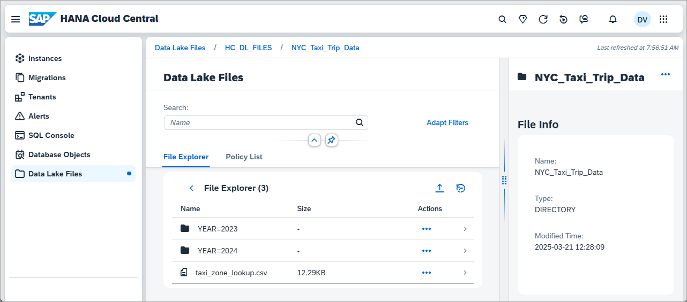 

     Well-organized and maintained directory-based partitioning can improve query performance by allowing unnecessary files to be pruned during query execution.

2. Create a virtual table for the taxi_zone_lookup.csv.

    ```SQL
    CREATE VIRTUAL TABLE TAXI_ZONE_LOOKUP (
        LOCATIONID INT PRIMARY KEY,
        BOROUGH NVARCHAR(5000),
        ZONE NVARCHAR(5000),
        SERVICE_ZONE NVARCHAR(5000)
    ) AT "HC_HDL_FILES_rs"."/NYC_Taxi_Trip_Data/taxi_zone_lookup.csv" AS CSV;

    SELECT * FROM TAXI_ZONE_LOOKUP ORDER BY SERVICE_ZONE, BOROUGH, ZONE;
    ```

3. View the column information for the file yellow_tripdata_2023-06.parquet.

    ```SQL
    CALL GET_REMOTE_SOURCE_FILE_COLUMNS(
        REMOTE_SOURCE_NAME => 'HC_HDL_FILES_rs',
        REMOTE_FILE_PATH => '/NYC_Taxi_Trip_Data/YEAR=2023/MONTH=06/yellow_tripdata_2023-06.parquet',
        REMOTE_FILE_FORMAT => 'PARQUET',
        OPTIONS => ''
    )
    ```
4. Create a virtual table for yellow_tripdata_2023-06.parquet.  Notice that just a subset of the columns in the Parquet file are included as specified in the column list.

    ```SQL
    CREATE VIRTUAL TABLE TAXI_TRIP_DATA_2023_JUNE (
        VENDORID INT PRIMARY KEY,
        PASSENGER_COUNT BIGINT,
        TRIP_DISTANCE DOUBLE,
        PULOCATIONID INT,
        FARE_AMOUNT DOUBLE
    ) AT "HC_HDL_FILES_rs"."/NYC_Taxi_Trip_Data/YEAR=2023/MONTH=06/yellow_tripdata_2023-06.parquet" AS PARQUET FILE COLUMN LIST(1, 4, 5, 8, 11);
    ```
    
5. Execute a few queries using the virtual tables.

    ```SQL
    SELECT * FROM  TAXI_TRIP_DATA_2023_JUNE;   
    SELECT COUNT(*) FROM TAXI_TRIP_DATA_2023_JUNE;

    -- Which zone has the most yellow taxi pickups in NYC in June of 2023?
    SELECT TZL.BOROUGH, TZL.ZONE, COUNT(*) AS TRIPS
    FROM TAXI_TRIP_DATA_2023_JUNE YT
    JOIN TAXI_ZONE_LOOKUP TZL
    ON YT.PULOCATIONID = TZL.LOCATIONID
    GROUP BY TZL.BOROUGH,TZL.ZONE
    ORDER BY TRIPS DESC;
    ```

6. Create a virtual table that includes all 4 Parquet files.  Notice that the folder names YEAR and MONTH are now part of the table and are at position 1 and 2 in the column list and that the VENDORID has moved to position 3.

    ```SQL
    --CREATE with a partition
    CREATE VIRTUAL TABLE TAXI_TRIP_DATA (
        YEAR INT,
        MONTH INT,
        VENDORID INT PRIMARY KEY,
        PASSENGER_COUNT BIGINT,
        TRIP_DISTANCE DOUBLE,
        PULOCATIONID INT,
        FARE_AMOUNT DOUBLE
    ) AT "HC_HDL_FILES_rs"."/NYC_Taxi_Trip_Data" AS PARQUET 
    FILE COLUMN LIST(1, 2, 3, 6, 7, 10, 13)
    PARTITION BY (YEAR, MONTH);
    ```

7. Execute the below queries and examine the time taken for each.  

    ```SQL
    SELECT COUNT(*) FROM TAXI_TRIP_DATA;
    SELECT COUNT(*) FROM TAXI_TRIP_DATA WHERE YEAR=2023 AND MONTH=06;
    ```

    Notice that the second query is faster as three of the four Parquet files did not need to be accessed.


### Monitoring views related to virtual tables
1. Execute the below SQL and examine the output of each to see some of the available information available in the monitoring views that relate to virtual tables.

    ```SQL
    SELECT SCHEMA_NAME, TABLE_NAME, REMOTE_SOURCE_NAME, REMOTE_OBJECT_NAME, CREATE_TIME FROM VIRTUAL_TABLES ORDER BY SCHEMA_NAME, TABLE_NAME;

    SELECT USER_NAME, REMOTE_SOURCE_NAME, VIRTUAL_TABLE_SCHEMA_NAME, VIRTUAL_TABLE_NAME, START_TIME, FETCHED_RECORD_COUNT, FETCHED_SIZE FROM M_VIRTUAL_TABLE_FILE_OPERATIONS;

    --View details about the files and file size of virtual tables
    SELECT * FROM M_VIRTUAL_TABLE_FILES;

    --View details of the virtual table
    SELECT * FROM VIRTUAL_TABLE_FILES;
    ```

### Knowledge check

Congratulations! You now have used SAP HANA SQL on Files and have seen how data can be moved between SAP HANA and data lake Files which provides access to diverse datasets and an option to reduce costs for less frequently accessed archive data.