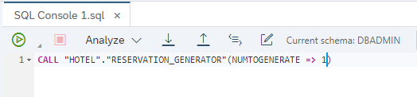
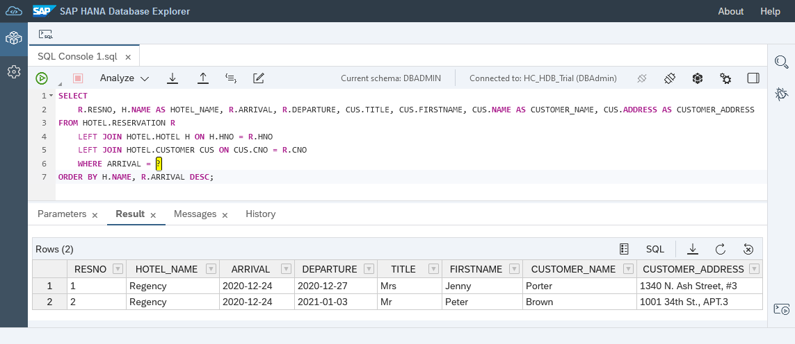
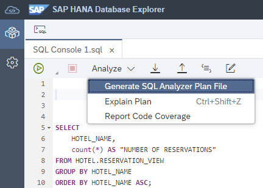
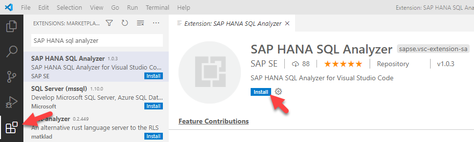
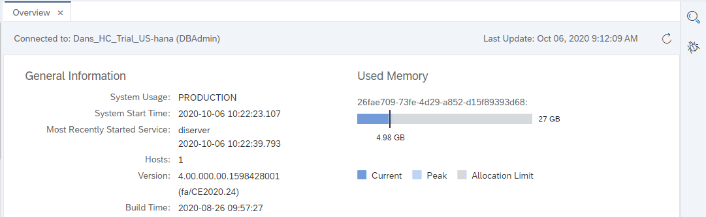
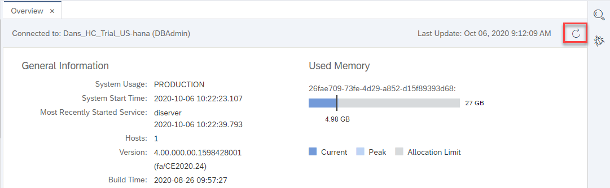
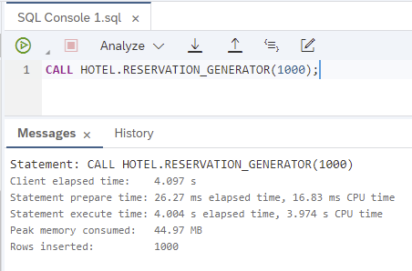
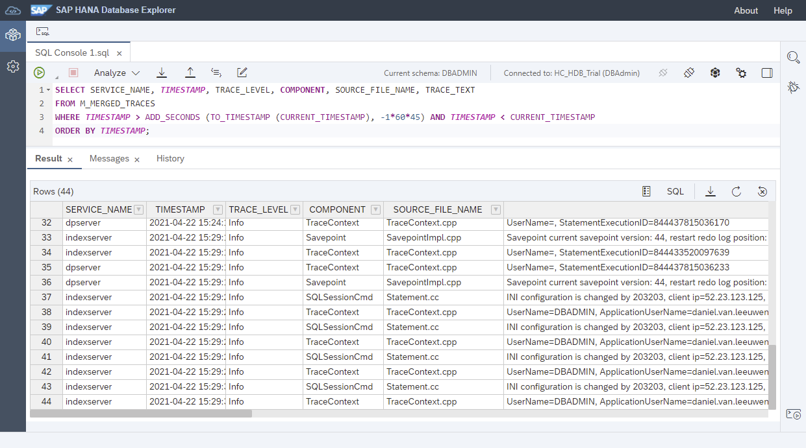
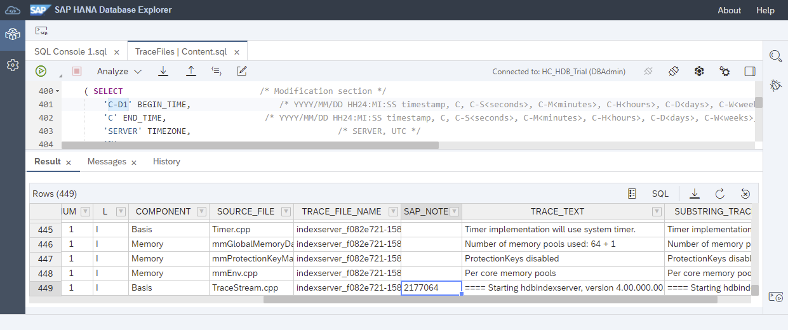

## Prerequisites
 - An SAP HANA database such as SAP HANA Cloud, HANA database trial or the SAP HANA, express edition that includes the SAP HANA database explorer
 - You have completed the first 3 tutorials in this group.

## Details
### You will learn
  - How to debug SQLScript
  - How to use code coverage and SQLScript code analysis
  - About the tools available to assist in performance analysis (explain plan, SQL Analyzer)
  - How to configure and examine traces

---

[ACCORDION-BEGIN [Step 1: ](Debugger)]
The debugger can be used to help find issues in procedures, functions, or anonymous blocks.  The steps below demonstrate how to use the debugger to debug a procedure.

  1. To start a debugging session, navigate to the procedure `RESERVATION_GENERATOR`, right-click, and select **Open For Debugging**.

    


  2. From the **Debugger Attach Options** dialog, ensure that **SQL console connections** is selected.  

    

    >Note that anonymous blocks can also be debugged if the **Stop at execution start** option is checked.

  3. Set breakpoints in the procedure by clicking next to the line number.  A check mark will appear next to the line number to  indicate that a breakpoint has been set.

    

  4. Right-click the procedure named `RESERVATION_GENERATOR` in the database browser and select **Generate Call Statement** or **Generate Call Statement with UI**.

    

    A call statement for the procedure will open in a new SQL console. Provide an input parameter value, such as 10, and run the statement.

    

  5. When the breakpoint is hit, execution will suspend.

    

    The current values of any variables used can be examined.  It is possible to modify the value of certain local and global variables types by clicking the edit button highlighted above.

    

  6. Execution can be continued by using the navigation icons at the top of the debugger. The debugging session can be stopped by using the detach icon.

    

    >For more information on the SAP database explorer debugger, see the [Debugger Tutorials](https://help.sap.com/viewer/e8d0ddfb84094942a9f90288cd6c05d3/latest/en-US/5f452e148e2440f89d6d94cdb1d73b70.html).

[DONE]
[ACCORDION-END]

[ACCORDION-BEGIN [Step 2: ](Code coverage)]
The code coverage tool shows statements that have been run.  This can be helpful when used in conjunction with a set of tests, as it can show the amount of statements that the tests have covered.

1. Right-click the procedure `RESERVATION_GENERATOR` and choose **Generate CALL Statement**.

    

    A call statement for the procedure will open in a new console. Provide an input parameter value of 1.

    

    Select  **Report Code Coverage**.

    

2. The code coverage report shows the number of statements that were hit.

      

    The report also visually shows the statements that were hit and the ones that were not.

    

[DONE]
[ACCORDION-END]

[ACCORDION-BEGIN [Step 3: ](SQLScript analysis)]
The [SQLScript code analyzer](https://help.sap.com/viewer/d1cb63c8dd8e4c35a0f18aef632687f0/latest/en-US/f7e1c7fbce6f4db49e29d7cc58b78384.html) can be used to identify patterns indicating problems in code quality, security, or performance.  Follow the steps below to try it out.

1. Create a new procedure to generate fictitious hotel reservations. The procedure accepts a number of reservations to generate and a room type.

    ```SQL
    CREATE OR REPLACE PROCEDURE HOTEL.RESERVATION_GENERATOR2(
    		IN numToGenerate INTEGER,
    		IN rmType STRING
    	)
    	LANGUAGE SQLSCRIPT AS
    BEGIN
    	USING SQLSCRIPT_PRINT AS PRTLIB;
    	DECLARE val INT := 0;
    	DECLARE stmt VARCHAR(256) := '';
    	DECLARE rno INT := 0;
    	DECLARE cno INT := 0;
    	DECLARE hno INT :=0;
    	DECLARE arriveDate DATE := null;
    	DECLARE arriveDateString STRING := '';
    	DECLARE departDate DATE := null;
    	DECLARE departDateString STRING := '';
    	DECLARE randomDaysFromCurrent INT :=0;
    	DECLARE randomLengthOfStay INT :=0;
    	DECLARE unusedVar INT :=0;
    	DECLARE MYCOND CONDITION FOR SQL_ERROR_CODE 10001;
    	DECLARE EXIT HANDLER FOR SQL_ERROR_CODE 301
    	SELECT ::SQL_ERROR_CODE, ::SQL_ERROR_MESSAGE FROM DUMMY;
    	unusedVar := unusedVar + 1;
    	-- IF IS_SQL_INJECTION_SAFE(rmType) <> 1 THEN
    	--     SIGNAL MYCOND SET MESSAGE_TEXT = 'Invalid field ' || rmType;
    	-- END IF;

    	WHILE (val < numToGenerate) DO
    		-- generate random room number from 100-300
    		rno := FLOOR(RAND_SECURE() * 200) + 1 + 100;
    		-- generate random customer number from 1000-1014
    		cno := FLOOR(RAND_SECURE() * 14) + 1 + 1000;
    		-- generate random hotel number from 10-26
    		hno := FLOOR(RAND_SECURE() * 16) + 1 + 10;

            -- generate random number of days to be used for arrival date.  
    		-- date range is one year in the past to one year in the future
    		randomDaysFromCurrent := FLOOR(RAND_SECURE() * 730) + 1 - 365;
    		arriveDate := ADD_DAYS( TO_DATE( CURRENT_DATE, 'YYYY-MM-DD' ), randomDaysFromCurrent );
    		arriveDateString := '''' || TO_VARCHAR( arriveDate, 'YYYY-MM-DD' ) || '''';
    		-- generate a random number of days to stay
    		randomLengthOfStay := FLOOR(RAND_SECURE() * 7) + 1;
    		departDate := ADD_DAYS( arriveDate, randomLengthOfStay );
    		departDateString := '''' || TO_VARCHAR( departDate, 'YYYY-MM-DD' ) || '''';

            -- Reservations Columns: RNO, CNO, HNO, Type, Arrival, Departure
    		stmt := 'INSERT INTO HOTEL.RESERVATION (RNO, CNO, HNO, TYPE, ARRIVAL, DEPARTURE) VALUES(' || rno || ',' || cno || ',' || hno || ',' || rmType || ',' || arriveDateString || ',' || departDateString || ');';
        PRTLIB:PRINT_LINE(stmt);
        EXEC(stmt);
    		val := val + 1;
    	END WHILE;
    	PRTLIB:PRINT_LINE('Rows inserted: ' || val);
    END;
    ```

2. Try it out.

    ```SQL
    CALL "HOTEL"."RESERVATION_GENERATOR2"(NUMTOGENERATE => 3,RMTYPE => '''suite''');
    ```

    

3. Right-click the procedure and choose **Analyze SQLScript Code**.

    

4. Notice that three issues were raised.   

    

    A double-click on an issue will open another tab containing the SQL of the procedure and the issue will be highlighted.

    

5. To address these issues, make the following changes and rerun the SQL in the SQL Console tab.  
    * The first issue can be resolved by commenting out `unusedVar` on lines 19 and 23.  
    * The second issue can be resolved by checking the input parameter `rmType` with the [IS SQL INJECTION SAFE](https://help.sap.com/viewer/c1d3f60099654ecfb3fe36ac93c121bb/latest/en-US/4496cc5717e847feb7daa41516047df9.html) function.  Uncomment lines 24 - 26 to try this.

3. Right-click the procedure and choose **Analyze SQLScript Code**.

    Notice that only one warning remains

    

[DONE]
[ACCORDION-END]

[ACCORDION-BEGIN [Step 4: ](Explain plan)]
Explain plan provides a compiled plan in tabular form without executing it.  This can be useful in analyzing certain situations when it is hard to reproduce issues without causing the issue.

1. Run the following SQL and enter the date 2020-12-24 when prompted.  

    ```SQL
    SELECT
      R.RESNO, H.NAME AS HOTEL_NAME, R.ARRIVAL, R.DEPARTURE, CUS.TITLE, CUS.FIRSTNAME, CUS.NAME AS CUSTOMER_NAME, CUS.ADDRESS AS CUSTOMER_ADDRESS
    FROM HOTEL.RESERVATION R
    	LEFT JOIN HOTEL.HOTEL H ON H.HNO = R.HNO
    	LEFT JOIN HOTEL.CUSTOMER CUS ON CUS.CNO = R.CNO
    	WHERE ARRIVAL = ?
    ORDER BY H.NAME, R.ARRIVAL DESC
    WITH HINT (IGNORE_PLAN_CACHE);
    ```

    > Notice that a hint is provided which indicates that if a query plan is found in the cache it is ignored.

    

2. Choose **Analyze | Explain Plan** to see the complied plan without executing the statement.  

    

For further details see the links below.

[View Execution Plans for SQL Statements, Procedures, and Anonymous Blocks](https://help.sap.com/viewer/a2cea64fa3ac4f90a52405d07600047b/cloud/en-US/c41b37e67fa647b392c05b41804aee39.html)

[Explain Plan](https://help.sap.com/viewer/9de0171a6027400bb3b9bee385222eff/latest/en-US/ee5e2ac159f14cc897c8b3a5f39a38b5.html)


[DONE]
[ACCORDION-END]

[ACCORDION-BEGIN [Step 5: ](SQL Analyzer)]
The SQL Analyzer provides a graphical view of how an analyzed SQL statement was executed which can provide additional insights into query execution.  The latest version is available as an extension for Visual Studio Code or as an additional extension (SAP Performance Tools) in the SAP Business Application Studio.  A `.plv` file can be generated in the SAP HANA database explorer which can then be opened in the SQL Analyzer.  A previous version of the SQL Analyzer is also included in the on-premise SAP HANA database explorer, the on-premise SAP HANA cockpit as well as SAP HANA studio.  

1. Run the following SQL.

    ```SQL
    SELECT HOTEL_NAME, count(*) AS "NUMBER OF RESERVATIONS" FROM HOTEL.RESERVATION_VIEW group by HOTEL_NAME order by HOTEL_NAME;
    ```

    

2. If using SAP HANA Cloud, HANA database, choose **Analyze | Generate SQL Analyzer Plan File**.  

    

    Once the file has been saved it can then be opened in Visual Studio Code or SAP Business Application Studio as shown below.

    * Visual Studio

        Install the plugin

        

        Add the plan file

        

    * SAP Business Application studio

        Add the additional extension

        

        Add the plan file

        


3. If using an on-premise edition, choose **Analyze | Analyze SQL** to execute the SQL and to view graphically how the SQL was executed.  Alternatively, choose to download the `plv` file and open it in the SQL Analyzer in Visual Studio Code or the SAP Business Application Studio.

      

4. Information is shown about the top 5 dominant operators, the top 10 critical path operators, the time it took to compile and execute the SQL statement, the peak memory, the result record count and accessed tables.

    

5. Switch to the **PLAN GRAPH** tab to visually see details of the query execution.

    

>Refer to [Analyzing Statement Performance](https://help.sap.com/viewer/6b94445c94ae495c83a19646e7c3fd56/latest/en-US/1458a4079b294a58a57eca5823025108.html) and [SQL Analyzer Extension](https://help.sap.com/viewer/6b94445c94ae495c83a19646e7c3fd56/latest/en-US/50bc09af2fa549c3ace4178b61056da8.html) for more information.

---


[DONE]
[ACCORDION-END]


[ACCORDION-BEGIN [Step 6: ](SQL trace)]
A SQL trace can be helpful when debugging a problem or in identifying SQL statements that a particular application is using.  The following steps demonstrate an example of enabling a SQL trace and then viewing the resulting trace file by using the SAP HANA database explorer.

1. The database overview presents general information about a database.  Right-click a database and choose **Show Overview**.

    

    Different information and statistics are shown for the selected database.

    

2. To determine the SQL requests that were executed in order to populate the various fields of the overview (e.g. memory used), enable a SQL trace by running the SQL statements below in a SQL console.

    ```SQL SAP HANA Cloud, HANA database
    ALTER SYSTEM ALTER CONFIGURATION ('indexserver.ini', 'SYSTEM') SET ('sqltrace', 'trace') = 'on', ('sqltrace', 'application') = 'sap_xsac_hrtt', ('sqltrace', 'user') = 'DBAdmin' WITH RECONFIGURE;
    ```

    ```SQL SAP HANA on-premise
    ALTER SYSTEM ALTER CONFIGURATION ('indexserver.ini', 'SYSTEM') SET ('sqltrace', 'trace') = 'on', ('sqltrace', 'tracefile') = 'database_overview', ('sqltrace', 'application') = 'sap_xsac_hrtt', ('sqltrace', 'user') = 'SYSTEM' WITH RECONFIGURE;
    ```

    >Additional details can be found in the [Configuration Parameter Reference](https://help.sap.com/viewer/138dcf7d779543608917a2307a6115f2/latest/en-US/514ab38a2e574c85a70ebba80ff16d99.html#loio514ab38a2e574c85a70ebba80ff16d99__configHC_id_30).

    >---

    >The names of the configuration files, their contents, and a history of changes can be viewed by performing a select against the monitoring views named M_INIFILES,  M_INIFILE_CONTENTS, M_INIFILE_CONTENT_HISTORY, SYS.CONFIGURATION_PARAMETER_PROPERTIES, and M_CONFIGURATION_PARAMETER_VALUES.


3. Press the refresh button on the database overview.

    

4. Turn off the SQL trace as tracing can have an effect on performance and takes up storage space.

    ```SQL
    ALTER SYSTEM ALTER CONFIGURATION ('indexserver.ini', 'SYSTEM') SET ('sqltrace', 'trace') = 'off' WITH RECONFIGURE;
    ```

    >Note that when using the SAP HANA database explorer running in SAP HANA on-premise or HANA as a Service, it is possible to configure traces using a graphical interface.
    >
    >
    >
    >A set of tiles display that provide a graphical user interface to configure different trace types.
    >
    >
    >
    >The SQL Trace dialog is shown below.
    >
    >

5. Examine the trace file.

    

    >Note that in SP 12 and older versions of the database explorer, the file can be found under the `other` folder rather than the `sqltrace` folder.

    The SQL queries that return information about the memory being used by the HANA instance can be viewed in the file.  For example, the highlighted query is one such SQL request.

    


6. If you are unsure where to find a trace file, choose **Show Files**.

    

    Notice that trace files can be found by using sorting and filtering.

    

>For additional details, consult the [Traces](https://help.sap.com/viewer/6b94445c94ae495c83a19646e7c3fd56/latest/en-US/7e31247372fb4dd7b8c6bbac758b8c91.html) topic in the SAP HANA Administration Guide for SAP HANA Platform and SAP Note [2119087 - How-To: Configuring SAP HANA Traces](https://launchpad.support.sap.com/#/notes/2119087) and SAP Note [2186744 - FAQ: SAP HANA Parameters](https://launchpad.support.sap.com/#/notes/2186744).

[DONE]
[ACCORDION-END]

[ACCORDION-BEGIN [Step 7: ](Expensive statements trace)]
It can be important to examine SQL statements that consume large amounts of time, CPU or memory.  The following steps demonstrates how to enable an expensive statements trace.

1. The following SQL will enable tracing of expensive statements, set the threshold values, run some statements that will exceed the thresholds, and then disable expensive statement tracing.

    ```SQL
    ALTER SYSTEM ALTER CONFIGURATION ('global.ini', 'DATABASE') SET ('expensive_statement', 'enable') = 'on' WITH RECONFIGURE;
    ALTER SYSTEM ALTER CONFIGURATION ('global.ini', 'DATABASE') SET ('expensive_statement', 'threshold_memory') = '41943040' WITH RECONFIGURE;   -- 40 MB
    ALTER SYSTEM ALTER CONFIGURATION ('global.ini', 'DATABASE') SET ('expensive_statement', 'threshold_duration') = '3000000' WITH RECONFIGURE;  -- 3 sec

    CALL HOTEL.RESERVATION_GENERATOR(1000);  --consumes more than 40 MB of memory

    DO BEGIN
      -- Wait for a few seconds
      USING SQLSCRIPT_SYNC AS SYNCLIB;
      CALL SYNCLIB:SLEEP_SECONDS( 3 );  --runs for longer than 3 seconds
      -- Now execute a query
      SELECT * FROM M_TABLES;
    END;

    ALTER SYSTEM ALTER CONFIGURATION ('global.ini', 'DATABASE') SET ('expensive_statement', 'enable') = 'off' WITH RECONFIGURE;
    ```

2. The list of statements that exceed the expensive statement threshold values can be found in the view `M_EXPENSIVE_STATEMENTS`.

    ```SQL
    select TOP 2 DURATION_MICROSEC/1000000, CPU_TIME/1000000, MEMORY_SIZE/1048576, START_TIME, RECORDS, STATEMENT_STRING from  M_EXPENSIVE_STATEMENTS order by start_time desc;
    ```

    

3. When using SAP HANA Cloud or the on-premise SP 13 or higher database explorer, the messages tab also contains detailed information about the duration, CPU, and memory consumed by a statement.

    

    > For SAP HANA on-premise databases, the peak memory used option requires the configuration parameters `enable_tracking` and `memory_tracking` to be enabled.
    >
    > ```SQL
    SELECT * FROM SYS.M_CONFIGURATION_PARAMETER_VALUES WHERE KEY = 'memory_tracking' OR KEY = 'enable_tracking';
    ALTER SYSTEM ALTER CONFIGURATION ('global.ini', 'DATABASE') SET ('resource_tracking', 'enable_tracking') = 'on' WITH RECONFIGURE;
    ALTER SYSTEM ALTER CONFIGURATION ('global.ini', 'DATABASE') SET ('resource_tracking', 'memory_tracking') = 'on' WITH RECONFIGURE;
    > ```

[DONE]
[ACCORDION-END]

[ACCORDION-BEGIN [Step 8: ](Viewing trace files with SQL)]    
The SAP HANA database provides a set of monitoring views enabling access to the trace files.  An example is [`M_MERGED_TRACES` System View](https://help.sap.com/viewer/c1d3f60099654ecfb3fe36ac93c121bb/latest/en-US/20b52c0075191014a43fb02951633999.html) which contains the content of multiple trace files enabling a query to be performed across trace files for a certain time period.  The following instructions provide some examples of accessing the views.

1. Information about the available trace files and content from individual trace files can be queried.

    ```SQL
    SELECT * FROM M_TRACEFILES;
    SELECT * FROM M_TRACEFILE_CONTENTS  WHERE HOST = 'XXXXXXXX' AND FILE_NAME='XXXXXXXX.XXX';
    ```

2. Execute the following SQL query to see entries from the past 45 minutes.

    ```SQL
    SELECT SERVICE_NAME, TIMESTAMP, TRACE_LEVEL, COMPONENT, SOURCE_FILE_NAME, TRACE_TEXT
    FROM M_MERGED_TRACES
    WHERE TIMESTAMP > ADD_SECONDS (TO_TIMESTAMP (CURRENT_TIMESTAMP), -1*60*45) AND TIMESTAMP < CURRENT_TIMESTAMP
    ORDER BY TIMESTAMP;
    ```

    

3. The SAP Note [SQL Statement Collection for SAP HANA](https://launchpad.support.sap.com/#/notes/1969700) contains a query named `HANA_TraceFiles_Content` that also includes relevant SAP notes that match certain strings in the trace files.

    

    >Notice above that the modification section can be used to set the begin and end time.


Congratulations! You have now explored many of the available tools in the SAP HANA database explorer to help diagnose or debug.

[VALIDATE_1]
[ACCORDION-END]


---
