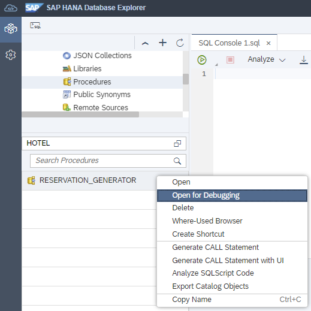
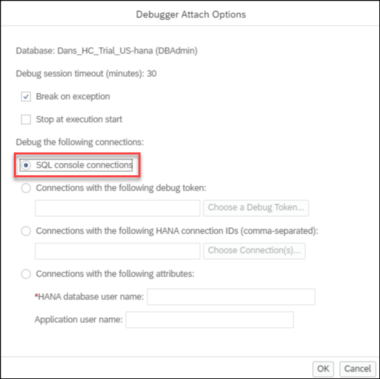
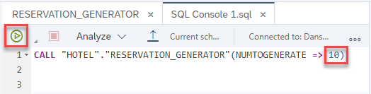
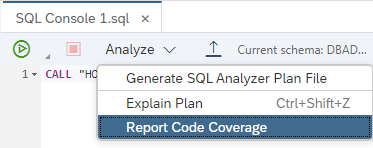
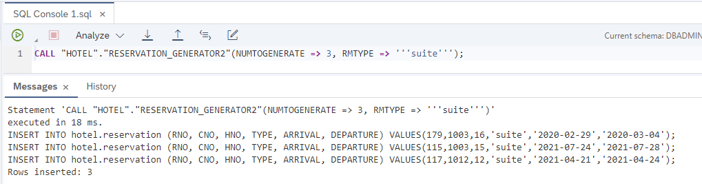
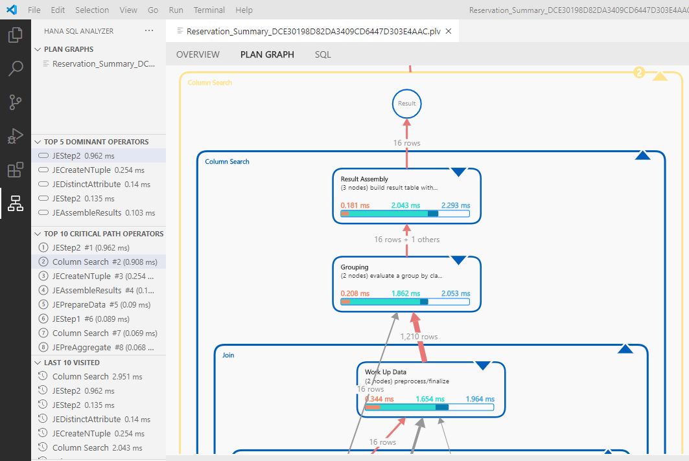
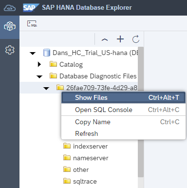
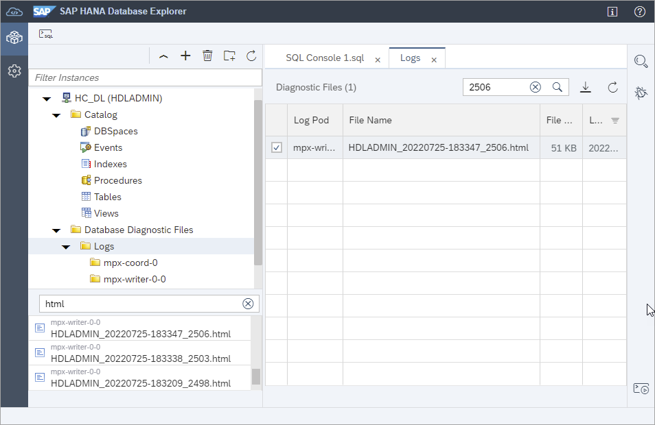

# Troubleshoot SQL with SAP HANA Database Explorer
<!-- description --> Explore the available tools to help diagnose and debug SQL or SQLScript.

## Prerequisites
 - An SAP HANA database such as SAP HANA Cloud, HANA database trial or the SAP HANA, express edition that includes the SAP HANA database explorer
 - You have completed the first 3 tutorials in this group.

## You will learn
  - How to debug SQLScript
  - How to use code coverage and SQLScript code analysis
  - About the tools available to assist in performance analysis (explain plan, SQL Analyzer)
  - How to configure and examine traces

---

### Debugger

The debugger can be used to help find issues in procedures, functions, or anonymous blocks.  The steps below demonstrate how to use the debugger to debug a procedure.

1. To start a debugging session, navigate to the procedure `RESERVATION_GENERATOR`, right-click, and select **Open For Debugging**.

    

2. From the **Debugger Attach Options** dialog, ensure that **SQL console connections** is selected.  

    

    >Anonymous blocks can also be debugged if the **Stop at execution start** option is checked.  An example of an anonymous block is shown below.

    >
    ```SQL
    DO BEGIN
        USING SQLSCRIPT_PRINT AS PRTLIB;
        DECLARE count INT := 0;
        SQLQUERY = SELECT count(*) C from MAINTENANCE;
        SELECT C INTO count from :SQLQUERY;
        PRTLIB:PRINT_LINE(CONCAT('Entries in the maintenance table is: ', count));
    END
    ```

3. Set breakpoints in the procedure by clicking next to the line number.  A check mark will appear next to the line number to  indicate that a breakpoint has been set.

    

4. Right-click the procedure named `RESERVATION_GENERATOR` in the database browser and select **Generate Call Statement**.

    

    A call statement for the procedure will open in a new SQL console. Provide an input parameter value, such as 10, and run the statement.

    

5. When the breakpoint is hit, execution will suspend.

    

    The current values of any variables used can be examined.  It is possible to modify the value of certain local and global variables by clicking the edit button highlighted above.

    

6. Execution can be continued by using the navigation icons at the top of the debugger. The debugging session can be stopped by using the detach icon.

    

    >For more information on the SAP database explorer debugger, see the [Debugger Tutorials](https://help.sap.com/docs/hana-cloud/sap-hana-database-explorer/sap-hana-database-explorer-debugger-tutorials-sap-hana-cloud-database).


### Code coverage

The code coverage tool shows statements that have been run.  This can be helpful when used in conjunction with a set of tests, as it can show the statements that the tests have covered.

1. Right-click the procedure `RESERVATION_GENERATOR` and choose **Generate CALL Statement**.

    

    A call statement for the procedure will open in a new console. Provide an input parameter value of 1.

    

    Select  **Report Code Coverage**.

    

2. The code coverage report shows the number of statements that were hit.

      

    The report also visually shows the statements that were hit and the ones that were not.

    


### SQLScript analysis

The [SQLScript code analyzer](https://help.sap.com/docs/hana-cloud-database/sap-hana-cloud-sap-hana-sqlscript-reference/sqlscript-code-analyzer) can be used to identify patterns indicating problems in code quality, security, or performance.  Follow the steps below to try it out.

1. Create a new procedure to generate fictitious hotel reservations. The procedure accepts a number of reservations to generate and a room type.

    ```SQL
    CREATE OR REPLACE PROCEDURE RESERVATION_GENERATOR2(
    		IN numToGenerate INTEGER,
    		IN rmType STRING
    	)
    	LANGUAGE SQLSCRIPT AS
    BEGIN
    	USING SQLSCRIPT_PRINT AS PRTLIB;
    	DECLARE val INT := 0;
    	DECLARE stmt VARCHAR(256) := '';
    	DECLARE rno INT := 0;
    	DECLARE cno INT := 0;
    	DECLARE hno INT :=0;
    	DECLARE arriveDate DATE := null;
    	DECLARE arriveDateString STRING := '';
    	DECLARE departDate DATE := null;
    	DECLARE departDateString STRING := '';
    	DECLARE randomDaysFromCurrent INT :=0;
    	DECLARE randomLengthOfStay INT :=0;
    	DECLARE unusedVar INT :=0;
    	DECLARE MYCOND CONDITION FOR SQL_ERROR_CODE 10001;
    	DECLARE EXIT HANDLER FOR SQL_ERROR_CODE 301
    	SELECT ::SQL_ERROR_CODE, ::SQL_ERROR_MESSAGE FROM DUMMY;
    	unusedVar := unusedVar + 1;
    	-- IF IS_SQL_INJECTION_SAFE(rmType) <> 1 THEN
    	--     SIGNAL MYCOND SET MESSAGE_TEXT = 'Invalid field ' || rmType;
    	-- END IF;

    	WHILE (val < numToGenerate) DO
    		-- generate random room number from 100-300
    		rno := FLOOR(RAND_SECURE() * 200) + 1 + 100;
    		-- generate random customer number from 1000-1014
    		cno := FLOOR(RAND_SECURE() * 14) + 1 + 1000;
    		-- generate random hotel number from 10-26
    		hno := FLOOR(RAND_SECURE() * 16) + 1 + 10;

            -- generate random number of days to be used for arrival date.  
    		-- date range is one year in the past to one year in the future
    		randomDaysFromCurrent := FLOOR(RAND_SECURE() * 730) + 1 - 365;
    		arriveDate := ADD_DAYS( TO_DATE( CURRENT_DATE, 'YYYY-MM-DD' ), randomDaysFromCurrent );
    		arriveDateString := '''' || TO_VARCHAR( arriveDate, 'YYYY-MM-DD' ) || '''';
    		-- generate a random number of days to stay
    		randomLengthOfStay := FLOOR(RAND_SECURE() * 7) + 1;
    		departDate := ADD_DAYS( arriveDate, randomLengthOfStay );
    		departDateString := '''' || TO_VARCHAR( departDate, 'YYYY-MM-DD' ) || '''';

            -- Reservations Columns: RNO, CNO, HNO, Type, Arrival, Departure
    		stmt := 'INSERT INTO RESERVATION (RNO, CNO, HNO, TYPE, ARRIVAL, DEPARTURE) VALUES(' || rno || ',' || cno || ',' || hno || ',' || rmType || ',' || arriveDateString || ',' || departDateString || ');';
        PRTLIB:PRINT_LINE(stmt);
        EXEC(stmt);
    		val := val + 1;
    	END WHILE;
    	PRTLIB:PRINT_LINE('Rows inserted: ' || val);
    END;
    ```

2. Try it out.

    ```SQL
    CALL "RESERVATION_GENERATOR2"(NUMTOGENERATE => 3,RMTYPE => '''suite''');
    ```

    

3. Right-click the procedure and choose **Analyze SQLScript Code**.

    

4. Notice that three issues were raised.   

    

    A double-click on an issue will open another tab containing the SQL of the procedure and the issue will be highlighted.

    

5. To address these issues, make the following changes and rerun the SQL in the SQL console tab.  
    * The first issue can be resolved by commenting out `unusedVar` on lines 19 and 23.  
    * The second issue can be resolved by checking the input parameter `rmType` with the [IS SQL INJECTION SAFE](https://help.sap.com/docs/hana-cloud-database/sap-hana-cloud-sap-hana-database-sql-reference-guide/is-sql-injection-safe-function-security) function.  Uncomment lines 24 - 26 to try this.

    >The above changes can be made in the SQL console.  The Create Statement tab is read only.

6. Right-click the procedure and choose **Analyze SQLScript Code**.

    Notice that only one warning remains

    


### Explain plan

Explain plan provides a compiled plan in tabular form without executing it.  This can be useful in analyzing certain situations when it is hard to reproduce issues without causing the issue.

1. Choose **Analyze | Explain Plan** to see the compiled plan without executing the statement.  Enter the date 2020-12-24 when prompted.  

    ```SQL
    SELECT
      R.RESNO, H.NAME AS HOTEL_NAME, R.ARRIVAL, R.DEPARTURE, 
      CUS.TITLE, CUS.FIRSTNAME, CUS.NAME AS CUSTOMER_NAME, CUS.ADDRESS AS CUSTOMER_ADDRESS
    FROM RESERVATION R
    	LEFT JOIN HOTEL H ON H.HNO = R.HNO
    	LEFT JOIN CUSTOMER CUS ON CUS.CNO = R.CNO
    	WHERE ARRIVAL = ?
    ORDER BY H.NAME, R.ARRIVAL DESC
    WITH HINT (IGNORE_PLAN_CACHE);
    ```

    > Notice that a hint is provided which indicates that if a query plan is found in the cache, it should be ignored.

    

2. The result is shown below.  

    

For further details see the links below.

[View Execution Plans for SQL Statements, Procedures, and Anonymous Blocks](https://help.sap.com/docs/hana-cloud/sap-hana-database-explorer/view-execution-plans-for-sql-statements-procedures-and-anonymous-blocks-sap-hana-cloud-database)

[Explain Plan](https://help.sap.com/docs/SAP_HANA_PLATFORM/9de0171a6027400bb3b9bee385222eff/ee5e2ac159f14cc897c8b3a5f39a38b5.html)


### SQL Analyzer

The SQL Analyzer provides a graphical view of how a SQL statement was executed which can provide additional insights into query execution.  The latest version is available as an extension for Visual Studio Code or as an additional extension (SAP Performance Tools) in the SAP Business Application Studio.  A `.plv` file can be generated in the SAP HANA database explorer which can then be opened in the SQL Analyzer.

1. Run the following SQL.

    ```SQL
    SELECT
    R.RESNO, H.NAME AS HOTEL_NAME, R.ARRIVAL, R.DEPARTURE, 
    CUS.TITLE, CUS.FIRSTNAME, CUS.NAME AS CUSTOMER_NAME, CUS.ADDRESS AS CUSTOMER_ADDRESS
    FROM RESERVATION R
        LEFT JOIN HOTEL H ON H.HNO = R.HNO
        LEFT JOIN CUSTOMER CUS ON CUS.CNO = R.CNO
        WHERE ARRIVAL = '2020-12-24'
    ORDER BY H.NAME, R.ARRIVAL DESC;
    ```

    

2. Choose **Analyze | Generate SQL Analyzer Plan File**.  

    

    

    
    
    Once the file has been downloaded it can then be opened in Visual Studio Code or SAP Business Application Studio as shown below.

    * In Visual Studio Code:

        * Install the plugin

            

        * Add the plan file

            

    * In SAP Business Application Studio:

        * Add the additional extension

            

        * Add the plan file

            

3. Information is shown about the top 5 dominant operators, the top 10 critical path operators, the peak memory, the result record count, and accessed tables.

    

4. Switch to the **PLAN GRAPH** tab to visually see details of the query execution.

    

    For additional details, refer to [SQL analyzer tool for SAP HANA](https://help.sap.com/docs/HANA_SQL_ANALYZER).


---


### SQL trace

A SQL trace can be helpful when debugging a problem or in identifying SQL statements that a particular application is using.  The following steps demonstrate an example of enabling a SQL trace and then viewing the resulting trace file by using the SAP HANA database explorer.

1. The database overview presents general information about a database.  Right-click a database and choose **Show Overview**.

    

    Different information and statistics are shown for the selected database.

    

2. To determine the SQL requests that were executed in order to populate the various fields of the overview (e.g. memory used), enable a SQL trace by running the SQL statements below in a SQL console.

    ```SQL
    ALTER SYSTEM ALTER CONFIGURATION ('indexserver.ini', 'DATABASE') 
        SET ('sqltrace', 'trace') = 'on', 
        ('sqltrace', 'application') = 'SAP_HANARuntimeTools_HRA', 
        ('sqltrace', 'user') = 'USER1' 
        WITH RECONFIGURE;
    ```

    >Additional details can be found in the [Configuration Parameter Reference](https://help.sap.com/viewer/138dcf7d779543608917a2307a6115f2/latest/en-US/514ab38a2e574c85a70ebba80ff16d99.html#loio514ab38a2e574c85a70ebba80ff16d99__configHC_id_30).

    >---

    >The names of the configuration files, their contents, and a history of changes can be viewed by performing a select against the following monitoring views:
    >
    - M_INIFILES
    - M_INIFILE_CONTENTS
    - M_INIFILE_CONTENT_HISTORY
    - CONFIGURATION_PARAMETER_PROPERTIES
    - M_CONFIGURATION_PARAMETER_VALUES


3. Press the refresh button on the database overview.

    

4. Turn off the SQL trace as tracing can have an effect on performance and takes up storage space.

    ```SQL
    ALTER SYSTEM ALTER CONFIGURATION ('indexserver.ini', 'DATABASE') 
        SET ('sqltrace', 'trace') = 'off' WITH RECONFIGURE;
    ```

    >When using the SAP HANA database explorer running in SAP HANA on-premise or HANA as a Service, it is possible to configure traces using a graphical interface.
    >
    >
    >
    >A set of tiles display that provide a graphical user interface to configure different trace types.
    >
    >
    >
    >The SQL Trace dialog is shown below.
    >
    >

5. Examine the trace file.

    

    The SQL queries that return information about the memory being used by the HANA instance can be viewed in the file.  For example, the highlighted query is one such SQL request.

    


6. If you are unsure where to find a trace file, choose **Show Files**.

    

    Notice that trace files can be found by using sorting and filtering.

    

>For additional details, consult the [Traces](https://help.sap.com/viewer/f9c5015e72e04fffa14d7d4f7267d897/latest/en-US/7e31247372fb4dd7b8c6bbac758b8c91.html) topic in the SAP HANA Administration Guide, SAP Note [2119087 - How-To: Configuring SAP HANA Traces](https://launchpad.support.sap.com/#/notes/2119087) and SAP Note [2186744 - FAQ: SAP HANA Parameters](https://launchpad.support.sap.com/#/notes/2186744).


### Expensive statements trace

It can be important to examine SQL statements that consume large amounts of time, CPU or memory.  The following steps demonstrates how to enable an expensive statements trace.

1. The following SQL will enable tracing of expensive statements, set the threshold values, run some statements that will exceed the thresholds, and then disable expensive statement tracing.

    ```SQL
    ALTER SYSTEM ALTER CONFIGURATION ('global.ini', 'DATABASE') SET ('expensive_statement', 'enable') = 'on' WITH RECONFIGURE;
    ALTER SYSTEM ALTER CONFIGURATION ('global.ini', 'DATABASE') SET ('expensive_statement', 'threshold_memory') = '41943040' WITH RECONFIGURE;   -- 40 MB
    ALTER SYSTEM ALTER CONFIGURATION ('global.ini', 'DATABASE') SET ('expensive_statement', 'threshold_duration') = '3000000' WITH RECONFIGURE;  -- 3 sec

    CALL RESERVATION_GENERATOR(1000);  --consumes more than 40 MB of memory

    DO BEGIN
      -- Wait for a few seconds
      USING SQLSCRIPT_SYNC AS SYNCLIB;
      CALL SYNCLIB:SLEEP_SECONDS( 3 );  --runs for longer than 3 seconds
      -- Now execute a query
      SELECT * FROM M_TABLES;
    END;

    ALTER SYSTEM ALTER CONFIGURATION ('global.ini', 'DATABASE') SET ('expensive_statement', 'enable') = 'off' WITH RECONFIGURE;
    ```

2. The list of statements that exceed the expensive statement threshold values can be found in the view `M_EXPENSIVE_STATEMENTS`.

    ```SQL
    select TOP 2 DURATION_MICROSEC/1000000, CPU_TIME/1000000, MEMORY_SIZE/1048576, START_TIME, RECORDS, STATEMENT_STRING from  M_EXPENSIVE_STATEMENTS order by start_time desc;
    ```

    

3. When using SAP HANA Cloud or the on-premise SP 13 or higher SAP HANA database explorer, the messages tab also contains detailed information about the duration, CPU, and memory consumed by a statement.

    

    > For SAP HANA on-premise databases, the peak memory used option requires the configuration parameters `enable_tracking` and `memory_tracking` to be enabled.
    >
    >```SQL
    SELECT * FROM SYS.M_CONFIGURATION_PARAMETER_VALUES WHERE KEY = 'memory_tracking' OR KEY = 'enable_tracking';
    ALTER SYSTEM ALTER CONFIGURATION ('global.ini', 'DATABASE') SET ('resource_tracking', 'enable_tracking') = 'on' WITH RECONFIGURE;
    ALTER SYSTEM ALTER CONFIGURATION ('global.ini', 'DATABASE') SET ('resource_tracking', 'memory_tracking') = 'on' WITH RECONFIGURE;
    ```

    > For additional details see [SAP HANA Configuration Parameter Reference](https://help.sap.com/viewer/009e68bc5f3c440cb31823a3ec4bb95b/latest/en-US/514ab38a2e574c85a70ebba80ff16d99.html).


### Viewing trace files with SQL
    
The SAP HANA database provides a set of monitoring views (as indicated by 'M') enabling access to the trace files.  An example is [`M_MERGED_TRACES` System View](https://help.sap.com/viewer/c1d3f60099654ecfb3fe36ac93c121bb/latest/en-US/20b52c0075191014a43fb02951633999.html) which contains the content of multiple trace files enabling a query to be performed across trace files for a certain time period.  The following instructions provide some examples of accessing the views.

1. Information about the available trace files and content from individual trace files can be queried.

    ```SQL
    SELECT * FROM M_TRACEFILES;
    SELECT * FROM M_TRACEFILE_CONTENTS  WHERE HOST = 'XXXXXXXX' AND FILE_NAME='XXXXXXXX.XXX';
    ```

2. Execute the following SQL query to see entries from the past 45 minutes.

    ```SQL
    SELECT SERVICE_NAME, TIMESTAMP, TRACE_LEVEL, COMPONENT, SOURCE_FILE_NAME, TRACE_TEXT
    FROM M_MERGED_TRACES
    WHERE TIMESTAMP > ADD_SECONDS (TO_TIMESTAMP (CURRENT_TIMESTAMP), -1*60*45) AND TIMESTAMP < CURRENT_TIMESTAMP
    ORDER BY TIMESTAMP;
    ```

    

3. SAP note [SQL Statement Collection for SAP HANA](https://launchpad.support.sap.com/#/notes/1969700) provides a set of SQL statements that can be used to summarize details of and to provide an analysis of an SAP HANA database.  

    Navigate to the *Attachments* section and download `SQLStatements.zip`.

     

    Upload the file to your Statement Library, which can be accessed by right-clicking on the database. This file contains a query named `HANA_TraceFiles_Content`. It includes relevant SAP notes that match certain strings in the trace files. File names suffixed with 'SHC' are specific to SAP HANA Cloud.

    

    

    >Notice above that the modification section can be used to set the begin and end time.

### Data lake Relational Engine diagnostic files
    

A data lake Relational engine can contain log files, query plans, and audit files.

> Note that these files are unavailable for Trial users.

1. Log files and query plans can be located and viewed as shown below.

    

    If the log file is clicked on it can be opened or if it is selected, it can be downloaded.

2. The logs can also be accessed through SQL.

    ```SQL
    CALL sp_list_directory('/diag/logs');
    SELECT * FROM sa_split_list(cast( READ_SERVER_FILE('/diag/logs/<file_path>') as long varchar ), '\n');
    ```

    Additional details can be found at [Diagnostic Logs for Data Lake Relational Engine](https://help.sap.com/docs/SAP_HANA_DATA_LAKE/a8937bea84f21015a80bc776cf758d50/02e694dff4c44c0db8e1b3783d599d6b.html).

3. Query plans can be enabled, configured, and viewed.

    ```SQL
    SET SCHEMA HOTEL;
    SET TEMPORARY OPTION Query_Plan_As_HTML = 'ON';
    SET TEMPORARY OPTION QUERY_DETAIL = 'ON';
    SET TEMPORARY OPTION QUERY_TIMING  = 'ON';
    SELECT * FROM TOURIST_REVIEWS WHERE DESTINATION_RATING = 5;
    SET TEMPORARY OPTION QUERY_DETAIL = 'OFF';
    SET TEMPORARY OPTION QUERY_TIMING  = 'OFF';
    SET TEMPORARY OPTION Query_Plan_As_HTML = 'OFF';
    ```

    

    The query plan can be downloaded and viewed in a browser.

    

    Additional details can be found at [Generating Query Plans](https://help.sap.com/docs/SAP_HANA_DATA_LAKE/a8982cc084f21015a7b4b7fcdeb0953d/a606f4e784f210159f4dfa0340fac977.html).

4. Audit logs can be enabled, configured, and viewed.

    Additional details can be found at [Configuring Auditing](https://help.sap.com/docs/SAP_HANA_DATA_LAKE/a8982cc084f21015a7b4b7fcdeb0953d/a606f4e784f210159f4dfa0340fac977.html).

    ```SQL
    SET OPTION PUBLIC.auditing = 'On';
    CALL sa_enable_auditing_type( 'all' );
    SET OPTION PUBLIC.audit_log='FILE(filename_prefix=audit_log)';
    CALL sa_audit_string( 'yyz3 Started audit testing here.' );
    SET OPTION PUBLIC.auditing = 'Off';
    SELECT * FROM SYSOPTIONS where "option" like '%audit%';
    CALL sp_list_directory('/diag/audit');
    SELECT * FROM sp_list_etd_files('*');
    SELECT * FROM sp_read_etd( 'audit_log_20220726_115854.382_mpx-writer-0-0.etd' ) WHERE event_data LIKE '%yyz%';
    ```

    

    For additional methods such as using the HDLFSCLI to access logs, see [View your SAP HANA Cloud, data lake Diagnostic Files and Audit Logs](data-lake-customer-facing-diagnostic-files).

### Knowledge check

Congratulations! You have now explored many of the available tools in the SAP HANA database explorer that help to debug and diagnose.


---
