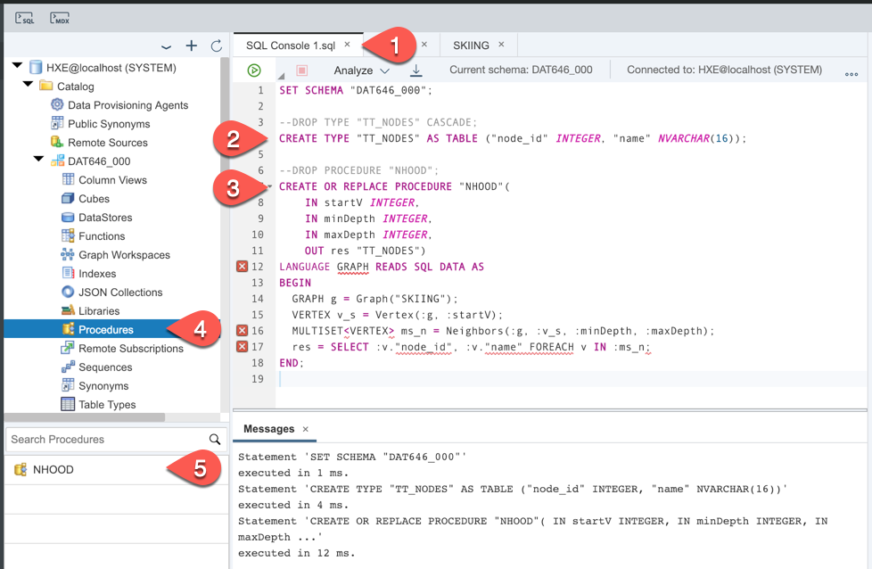
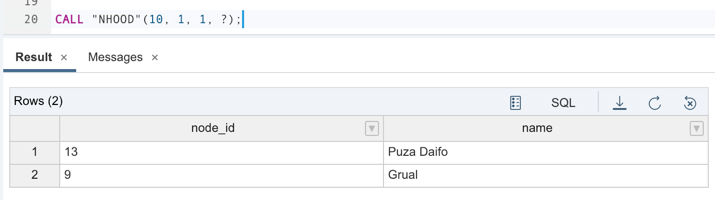
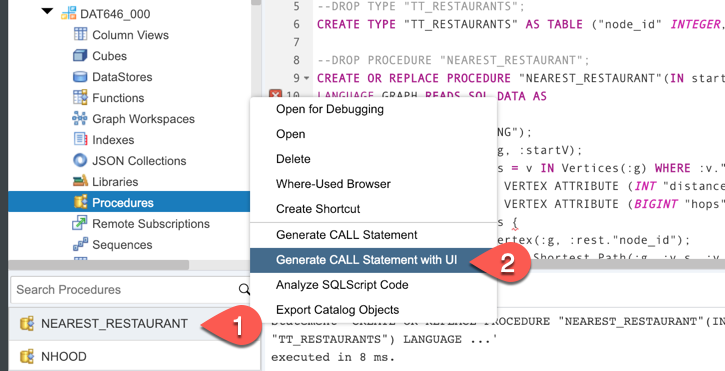
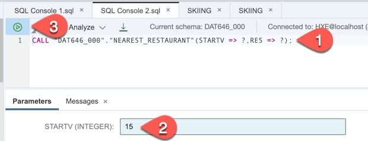
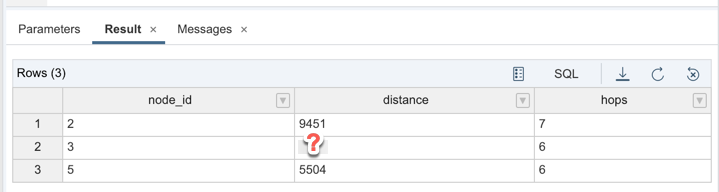

## Prerequisites
 - Completed [Pattern Matching using OpenCypher](hana-graph-overview-pattern-matching)

## Details
### You will learn
  - What GraphScript is
  - How to create and execute GraphScript procedures

---

[ACCORDION-BEGIN [Step 1: ](What GraphScript is)]

GraphScript is a high-level, powerful domain-specific language. GraphScript is specifically designed to ease the development and integration of complex graph algorithms into the existing data management workflow.

[DONE]
[ACCORDION-END]

[ACCORDION-BEGIN [Step 2: ](Call built-in algorithm from GraphScript)]

In the SQL Console paste and execute following code.

```sql
SET SCHEMA "DAT646_000";

--DROP TYPE "TT_NODES" CASCADE;
CREATE TYPE "TT_NODES" AS TABLE ("node_id" INTEGER, "name" NVARCHAR(16));

--DROP PROCEDURE "NHOOD";
CREATE OR REPLACE PROCEDURE "NHOOD"(
	IN startV INTEGER,
	IN minDepth INTEGER,
	IN maxDepth INTEGER,
	OUT res "TT_NODES")
LANGUAGE GRAPH READS SQL DATA AS
BEGIN
  GRAPH g = Graph("SKIING");
  VERTEX v_s = Vertex(:g, :startV);
  MULTISET<VERTEX> ms_n = Neighbors(:g, :v_s, :minDepth, :maxDepth);
  res = SELECT :v."node_id", :v."name" FOREACH v IN :ms_n;
END;
```

This creates an `NHOOD` object in **Procedures**.



Run `CALL "NHOOD"` with different parameters to check results.

```sql
CALL "NHOOD"(10, 1, 1, ?);
```



[DONE]
[ACCORDION-END]


[ACCORDION-BEGIN [Step 3: ](Custom traverse algorithm)]

In the SQL Console paste and execute following code.

```sql
SET SCHEMA "DAT646_000";

--DROP TYPE "TT_RESTAURANTS";
CREATE TYPE "TT_RESTAURANTS" AS TABLE ("node_id" INTEGER, "distance" INTEGER, "hops" BIGINT);

--DROP PROCEDURE "NEAREST_RESTAURANT";
CREATE OR REPLACE PROCEDURE "NEAREST_RESTAURANT"(IN startV INT, OUT res "TT_RESTAURANTS")
LANGUAGE GRAPH READS SQL DATA AS
BEGIN
	GRAPH g = Graph("SKIING");
	VERTEX v_s = Vertex(:g, :startV);
	MULTISET<Vertex> rests = v IN Vertices(:g) WHERE :v."restaurant" == N'TRUE';
	ALTER g ADD TEMPORARY VERTEX ATTRIBUTE (INT "distance" = 0);
	ALTER g ADD TEMPORARY VERTEX ATTRIBUTE (BIGINT "hops" = 0L);
	FOREACH rest in :rests {
		VERTEX v_rest = Vertex(:g, :rest."node_id");
		WeightedPath<INT> p = Shortest_Path(:g, :v_s, :v_rest, (Edge conn) => INTEGER { return :conn."length"; } );
		rest."hops" = Length(:p);
		rest."distance" = Weight(:p);
	}
	res = SELECT :v."node_id", :v."distance", :v."hops" FOREACH v IN :rests;
END;
```

This creates an `NEAREST_RESTAURANT` object in **Procedures**. Right click on the procedure name and pick **Generate CALL Statement With UI**.



Procedure's call statement is generated. Provide input value `15` and click **Run**.



When the graph script is executed, then the result is displayed. It shows a shortest distance in meters to each station with the restaurant plus number of hops to get there.



What is the shortest path distance in meters from station `15` to station `3`?

[VALIDATE_1]
[ACCORDION-END]

---
