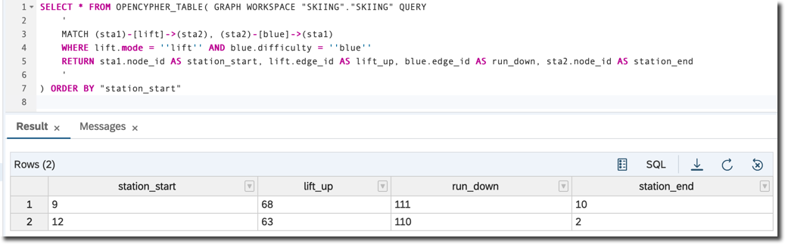

## Prerequisites
 - You completed [Create an SAP HANA Graph Workspace](hana-graph-overview-setup).

## Details
### You will learn
  - How to execute OpenCypher pattern matching queries

---

[ACCORDION-BEGIN [Step 1: ](OpenCypher in SAP HANA SQL)]
OpenCypher is a declarative graph query language for graph pattern matching developed by the OpenCypher Implementers Group.

SAP HANA Graph allows you to use OpenCypher directly in SQL. For more please refer to [online documentation for SAP HANA Cloud](https://help.sap.com/viewer/11afa2e60a5f4192a381df30f94863f9/2020_04_QRC/en-US/4c3ee700e7a8458baed3f1141d9380f3.html).

Go to the SQL Console and execute the following query.

```sql
SELECT * FROM OPENCYPHER_TABLE( GRAPH WORKSPACE "SKIING"."SKIING" QUERY
    '
    MATCH (point1)
    WHERE point1.ticket_office = ''TRUE''
    RETURN point1.node_id as station_id, point1.ticket_office as is_ticket_office
    '
) ORDER BY "station_id"
```

Only matched nodes with `ticket_office` = 'TRUE' have been selected.


[DONE]
[ACCORDION-END]

[ACCORDION-BEGIN [Step 2: ](More examples with OpenCypher)]

Copy the statement and paste it into Cypher's code field.

```sql
SELECT * FROM OPENCYPHER_TABLE( GRAPH WORKSPACE "SKIING"."SKIING" QUERY
    '
	MATCH (point1)-[conn]->(point2)
	WHERE point1.ticket_office = ''TRUE'' AND point2.restaurant = ''TRUE''
	RETURN point1.node_id as station_start, conn.edge_id as connection, conn.mode as conn_mode, point2.node_id as station_end
    '
) ORDER BY "station_start"
```

Now you selected only edges (or ___relationships___ in Cypher terminology), where you can go directly from a station with a ticket office to a station with a restaurant.


Now let's find all runs for beginners.

```sql
SELECT * FROM OPENCYPHER_TABLE( GRAPH WORKSPACE "SKIING"."SKIING" QUERY
    '
	MATCH (sta1)-[lift]->(sta2), (sta2)-[blue]->(sta1)
	WHERE lift.mode = ''lift'' AND blue.difficulty = ''blue''
	RETURN sta1.node_id AS station_start, lift.edge_id AS lift_up, blue.edge_id AS run_down, sta2.node_id AS station_end
    '
) ORDER BY "station_start"
```

You selected only pairs of stations where you can go up using a lift, and then go down using a blue run (blue runs are the easiest for beginners).



[DONE]
[ACCORDION-END]


[ACCORDION-BEGIN [Step 3: ](Pattern Matching in calculation scenarios in SAP HANA 2.0)]

> The following functionality is applicable only to SAP HANA 2.0, but not to SAP HANA Cloud!

SAP HANA 2.0 Graph provides a new graph calculation node that can be used in calculation scenarios (think objects generated from calculated views). This node allows you to execute one of the available actions on the given graph workspace and provide results as table output. The action `MATCH_SUBGRAPHS` allows you to execute pattern matching queries written in the supported subset of the OpenCypher query language on the given graph workspace. Calculation scenarios can be created with SQL as shown in the following section.

Go back to the SQL Console and execute the following code.

```sql
SET SCHEMA "SKIING";

--DROP CALCULATION SCENARIO "CYPHER" CASCADE;
CREATE CALCULATION SCENARIO CYPHER USING '<?xml version="1.0"?>
<cubeSchema version="2" operation="createCalculationScenario" defaultLanguage="en">
  <calculationScenario name="CYPHER">
    <calculationViews>
      <graph name="match_subgraphs_node" defaultViewFlag="true"
      workspace="SKIING" action="MATCH_SUBGRAPHS">
        <expression>
          <![CDATA[
          MATCH (sta1)-[lift]->(sta2), (sta2)-[blue]->(sta1)
          WHERE lift.mode = ''lift'' AND blue.difficulty = ''blue''
          RETURN sta1.node_id AS Lower_station, lift.edge_id AS Lift_up,
          sta2.node_id AS Upper_station, blue.edge_id AS Run_down
          ]]>
        </expression>
        <viewAttributes>
            <viewAttribute name="Lower_station" datatype="integer"/>
            <viewAttribute name="Lift_up"  datatype="integer"/>
            <viewAttribute name="Upper_station" datatype="integer"/>
            <viewAttribute name="Run_down" datatype="integer"/>
        </viewAttributes>
      </graph>
    </calculationViews>
  </calculationScenario>
</cubeSchema>
' WITH PARAMETERS ('EXPOSE_NODE'=('match_subgraphs_node', 'CYPHER'));

SELECT * from "CYPHER";
```

You can see **Column Views** now have `CYPHER` object created.

As well data is selected from that calculation view using the pattern matching.


[VALIDATE_1]
[ACCORDION-END]

---
