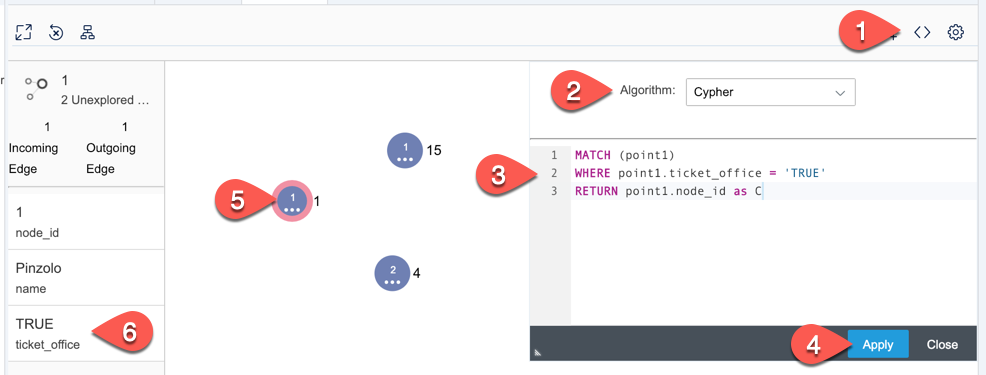
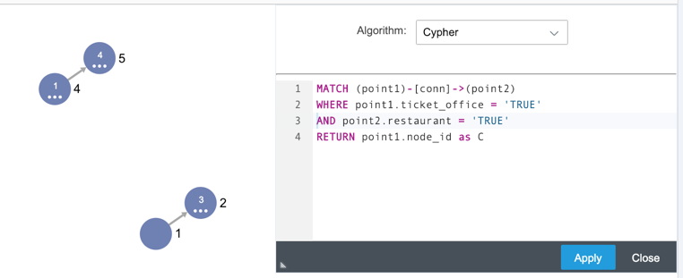
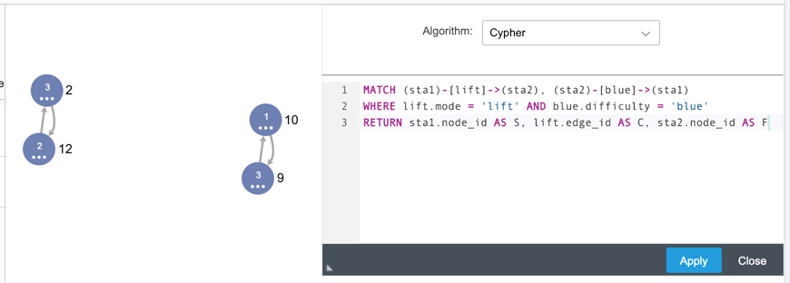

## Prerequisites
 - Completed [Explore SAP HANA Graph Viewer](hana-graph-overview-viewer)

## Details
### You will learn
  - How to execute OpenCypher pattern matching queries

---

[ACCORDION-BEGIN [Step 1: ](OpenCypher in Graph Viewer)]

In Graph Viewer click on **Algorithm** icon.

Select **Cypher**, paste the code.

```sql
MATCH (point1)
WHERE point1.ticket_office = 'TRUE'
RETURN point1.node_id as C
```

click **Apply**.

Only matched nodes with `ticket_office` = 'TRUE' has been selected.

Click on each of them and check the value of a parameter `ticket_office` in the left pane.



[DONE]
[ACCORDION-END]

[ACCORDION-BEGIN [Step 2: ](More examples with OpenCypher)]

Copy the statement and paste it into Cypher's code field.

```sql
MATCH (point1)-[conn]->(point2)
WHERE point1.ticket_office = 'TRUE' AND point2.restaurant = 'TRUE'
RETURN point1.node_id as C
```

Click **Apply**. Now you selected only edges (or __relationships__ in Cypher terminology), where you can go directly from a station with a ticket office to a station with a restaurant.



Now let's find all runs for beginners.

```sql
MATCH (sta1)-[lift]->(sta2), (sta2)-[blue]->(sta1)
WHERE lift.mode = 'lift' AND blue.difficulty = 'blue'
RETURN sta1.node_id AS S, lift.edge_id AS C, sta2.node_id AS F
```

You selected only pairs of stations where you can go up using a lift, and then go down using a blue run (blue runs are the easiest for beginners).



[DONE]
[ACCORDION-END]


[ACCORDION-BEGIN [Step 3: ](Pattern Matching in calculation scenarios)]

> SAP HANA Graph provides a new graph calculation node that can be used in calculation scenarios (think objects generated from calculated views). This node allows you to execute one of the available actions on the given graph workspace and provide results as table output. The action `MATCH_SUBGRAPHS` allows you to execute pattern matching queries written in the supported subset of the OpenCypher query language on the given graph workspace. Calculation scenarios can be created with SQL as shown in the following section.

Go back to SQL Console and execute the following code.

```sql
SET SCHEMA "DAT646_000";

--DROP CALCULATION SCENARIO "CYPHER" CASCADE;
CREATE CALCULATION SCENARIO CYPHER USING '<?xml version="1.0"?>
<cubeSchema version="2" operation="createCalculationScenario" defaultLanguage="en">
  <calculationScenario name="CYPHER">
    <calculationViews>
      <graph name="match_subgraphs_node" defaultViewFlag="true"
      workspace="SKIING" action="MATCH_SUBGRAPHS">
        <expression>
          <![CDATA[
          MATCH (sta1)-[lift]->(sta2), (sta2)-[blue]->(sta1)
          WHERE lift.mode = ''lift'' AND blue.difficulty = ''blue''
          RETURN sta1.node_id AS Lower_station, lift.edge_id AS Lift_up,
          sta2.node_id AS Upper_station, blue.edge_id AS Run_down
          ]]>
        </expression>
        <viewAttributes>
            <viewAttribute name="Lower_station" datatype="integer"/>
            <viewAttribute name="Lift_up"  datatype="integer"/>
            <viewAttribute name="Upper_station" datatype="integer"/>
            <viewAttribute name="Run_down" datatype="integer"/>
        </viewAttributes>
      </graph>
    </calculationViews>
  </calculationScenario>
</cubeSchema>
' WITH PARAMETERS ('EXPOSE_NODE'=('match_subgraphs_node', 'CYPHER'));

SELECT * from "CYPHER";
```

You can see **Column Views** now have `CYPHER` object created.

As well data is selected from that calculation view using the pattern matching.


[VALIDATE_1]
[ACCORDION-END]

---
