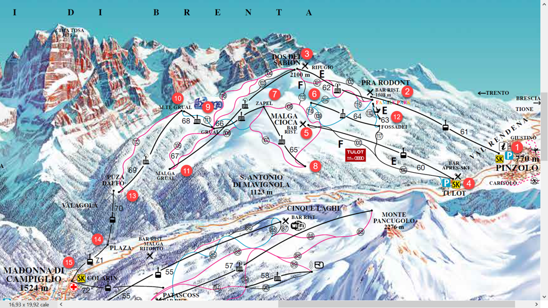

## Prerequisites
 - Min. SAP HANA 2.0 SPS 03 with XSA, e.g. [SAP HANA, express edition](https://developers.sap.com/topics/hana.html)

## Details
### You will learn
  - What SAP HANA Graph is
  - How to create graph workspace using sample data

---

[ACCORDION-BEGIN [Step 1: ](SAP HANA Graph)]
SAP HANA Graph is an integral part of SAP HANA core functionality. It expands the SAP HANA platform with native support for graph processing and allows you to execute typical graph operations on the data stored in an SAP HANA system.

Graphs are a powerful abstraction that can be used to model different kinds of networks and linked data coming from many industries, such as logistics and transportation, utility networks, knowledge representation, text processing, and so on.

In SAP HANA, a graph is a set of vertices and a set of edges. Each edge connects two vertices; one vertex is denoted as the source and the other as the target. Edges are always directed and there can be two or more edges connecting the same two vertices. Vertices and edges can have an arbitrary number of attributes. A vertex attribute consists of a name that is associated with a data type and a value. Edge attributes consist of the same information.


For more please refer to [online documentation for SAP HANA 2.0 SPS 3](https://help.sap.com/viewer/f381aa9c4b99457fb3c6b53a2fd29c02/2.0.03/en-US/7734f2cfafdb4e8a9d49de5f6829dc32.html) used in these exercises.

[DONE]
[ACCORDION-END]

[ACCORDION-BEGIN [Step 2: ](Exercise data)]

You will have a model and data representing a part of the real life ski resort [`Pinzolo/Madonna di Campiglio`](https://www.skiresort.info/ski-resort/madonna-di-campigliopinzolofolgaridamarilleva) in Italy. The full-size picture of the map is available in [the file](map_large.jpg) and small-scale version is displayed below.



Every station got a number (in red circle) and will serve as vertices of our graph. They have additional attributes:

-	`ticket_office` = 'TRUE' (string, not boolean), is where you buy a ticket and start the day. These are stations 1, 4, 15
-	`restaurant` = 'TRUE' is a place to have a break for a delicious Italian coffee, or to refill with a few slices of pizza. These are stations 2, 3, 5.

Stations are connected by either lifts (to go up) or runs (to ski down). Those will be our edges in the graph with a few attributes:

-	'lift' or 'run' will be their `mode` attribute
-	`start` and `end` will be ids of connected stations
-	each of them will have attribute `length` as well, measured in meters
-	additionally, runs will have 'blue', 'red', or 'black' values in the attribute `difficulty`
-	attribute `status` is either 'open' or 'close', reflecting if particular lift or run can be used. By default all connections will be open.


[DONE]
[ACCORDION-END]


[ACCORDION-BEGIN [Step 3: ](Create tables)]

Open SQL Editor connected to your database in SAP Web IDE. The assumption in these exercises is that you are using a schema `DAT646_000`, but you can change it to any other schema of your choice.

Copy following code into your SQL Editor.

```sql
CREATE SCHEMA "DAT646_000";
SET SCHEMA "DAT646_000";

CREATE COLUMN TABLE "NODES"(
	"node_id" INTEGER NOT NULL,
	"name" NVARCHAR(16),
	"ticket_office" NVARCHAR(4),
	"restaurant" NVARCHAR(4),
	PRIMARY KEY (
		"node_id"
	)
);

CREATE COLUMN TABLE "EDGES"(
	"edge_id" INTEGER NOT NULL,
	"length" INTEGER,
	"difficulty" NVARCHAR(16),
	"start" INTEGER NOT NULL,
	"end" INTEGER NOT NULL,
	"mode" NVARCHAR(8),
	"status" NVARCHAR(8),
	PRIMARY KEY (
		"edge_id"
	)
);

ALTER TABLE "EDGES" ADD FOREIGN KEY ( "start" ) REFERENCES "NODES" ("node_id") ON UPDATE CASCADE ON DELETE CASCADE ENFORCED VALIDATED
;
ALTER TABLE "EDGES" ADD FOREIGN KEY ( "end" ) REFERENCES "NODES" ("node_id") ON UPDATE CASCADE ON DELETE CASCADE ENFORCED VALIDATED
;
```

Press `F8` to execute all statements at once, or run them one by one with `F9` key.

You should see two tables created in your schema.


[DONE]
[ACCORDION-END]

[ACCORDION-BEGIN [Step 4: ](Review tables)]

Open review definitions of both tables.


[DONE]
[ACCORDION-END]

[ACCORDION-BEGIN [Step 5: ](Insert data)]

Copy following code into your SQL Editor and execute it.

```sql
SET SCHEMA "DAT646_000";

--Populate NODES
INSERT INTO "NODES" VALUES (1, 'Pinzolo', 'TRUE', '') ;
INSERT INTO "NODES" VALUES (2, 'Pra Rodont', '', 'TRUE') ;
INSERT INTO "NODES" VALUES (3, 'Dos Del Sabion', '', 'TRUE') ;
INSERT INTO "NODES" VALUES (4, 'Tulot', 'TRUE', '') ;
INSERT INTO "NODES" VALUES (5, 'Malga Ciocia', '', 'TRUE') ;
INSERT INTO "NODES" VALUES (6, 'Malga Ciocia Up', '', '') ;
INSERT INTO "NODES" VALUES (7, 'Zapel', '', '') ;
INSERT INTO "NODES" VALUES (8, 'Zapel Down', '', '') ;
INSERT INTO "NODES" VALUES (9, 'Grual', '', '') ;
INSERT INTO "NODES" VALUES (10, 'Mte Grual', '', '') ;
INSERT INTO "NODES" VALUES (11, 'Malga Grual', '', '') ;
INSERT INTO "NODES" VALUES (12, 'Fossadei', '', '') ;
INSERT INTO "NODES" VALUES (13, 'Puza Daifo', '', '') ;
INSERT INTO "NODES" VALUES (14, 'Plaza', '', '') ;
INSERT INTO "NODES" VALUES (15, 'Colarin', 'TRUE', '') ;

--Populate EDGES
INSERT INTO "EDGES" VALUES (61, 1755, '', 1, 2, 'lift', 'open') ;
INSERT INTO "EDGES" VALUES (62, 1718, '', 2, 3, 'lift', 'open') ;
INSERT INTO "EDGES" VALUES (60, 2453, '', 4, 5, 'lift', 'open') ;
INSERT INTO "EDGES" VALUES (63, 123, '', 12, 2, 'lift', 'open') ;
INSERT INTO "EDGES" VALUES (64, 1050, '', 12, 6, 'lift', 'open') ;
INSERT INTO "EDGES" VALUES (65, 1041, '', 8, 7, 'lift', 'open') ;
INSERT INTO "EDGES" VALUES (66, 365, '', 9, 7, 'lift', 'open') ;
INSERT INTO "EDGES" VALUES (67, 1312, '', 11, 3, 'lift', 'open') ;
INSERT INTO "EDGES" VALUES (68, 360, '', 9, 10, 'lift', 'open') ;
INSERT INTO "EDGES" VALUES (69, 1365, '', 13, 10, 'lift', 'open') ;
INSERT INTO "EDGES" VALUES (70, 1223, '', 14, 13, 'lift', 'open') ;
INSERT INTO "EDGES" VALUES (71, 1151, '', 15, 14, 'lift', 'open') ;
INSERT INTO "EDGES" VALUES (100, 2600, 'black', 5, 4, 'run', 'open') ;
INSERT INTO "EDGES" VALUES (101, 3100, 'red', 3, 2, 'run', 'open') ;
INSERT INTO "EDGES" VALUES (102, 2500, 'black', 3, 2, 'run', 'open') ;
INSERT INTO "EDGES" VALUES (103, 2000, 'black', 3, 9, 'run', 'open') ;
INSERT INTO "EDGES" VALUES (104, 2100, 'red', 3, 9, 'run', 'open') ;
INSERT INTO "EDGES" VALUES (105, 1200, 'red', 9, 11, 'run', 'open') ;
INSERT INTO "EDGES" VALUES (106, 2000, 'red', 7, 11, 'run', 'open') ;
INSERT INTO "EDGES" VALUES (107, 1800, 'red', 7, 8, 'run', 'open') ;
INSERT INTO "EDGES" VALUES (108, 700, 'red', 7, 5, 'run', 'open') ;
INSERT INTO "EDGES" VALUES (1108, 1000, 'red', 5, 8, 'run', 'open') ;
INSERT INTO "EDGES" VALUES (109, 1900, 'blue', 6, 2, 'run', 'open') ;
INSERT INTO "EDGES" VALUES (110, 200, 'blue', 2, 12, 'run', 'open') ;
INSERT INTO "EDGES" VALUES (111, 700, 'blue', 10, 9, 'run', 'open') ;
INSERT INTO "EDGES" VALUES (112, 1500, 'red', 10, 13, 'run', 'open') ;
INSERT INTO "EDGES" VALUES (113, 700, 'black', 3, 5, 'run', 'open') ;
INSERT INTO "EDGES" VALUES (114, 600, 'blue', 6, 2, 'run', 'open') ;
INSERT INTO "EDGES" VALUES (116, 2100, 'red', 3, 9, 'run', 'open') ;
INSERT INTO "EDGES" VALUES (117, 2300, 'black', 12, 4, 'run', 'open') ;
INSERT INTO "EDGES" VALUES (118, 200, 'blue', 6, 5, 'run', 'open') ;
```

[DONE]
[ACCORDION-END]

[ACCORDION-BEGIN [Step 6: ](Preview data)]

Switch to the tab with one of table definitions, and click on **Open Data**. Then repeat it for the second table too.


There should be 15 rows in the table `NODES` and 31 rows in the table `EDGES`.

[DONE]
[ACCORDION-END]

[ACCORDION-BEGIN [Step 7: ](Create a graph workspace)]

Copy following code into your SQL Editor and execute it.

```sql
SET SCHEMA "DAT646_000";

create graph workspace "SKIING"
edge table "EDGES"
source column "start"
target column "end"
key column "edge_id"
vertex table "NODES"
key column "node_id"
;
```

[DONE]
[ACCORDION-END]

[ACCORDION-BEGIN [Step 8: ](Check the workspace artifact)]

Find just created `SKIING` workspace in the `Graph Workspaces` folder of your schema.

Click on it to open its definition.


[VALIDATE_1]
[ACCORDION-END]


---
