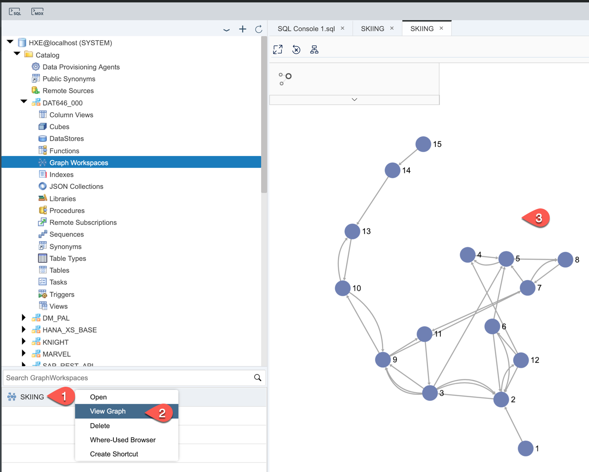
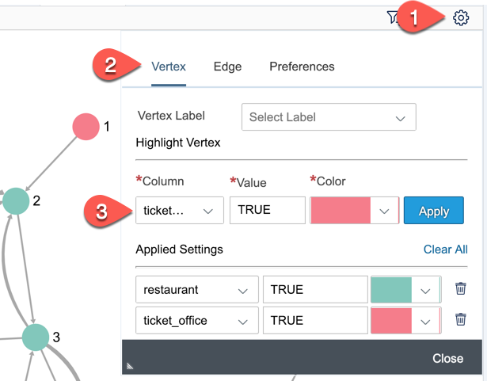
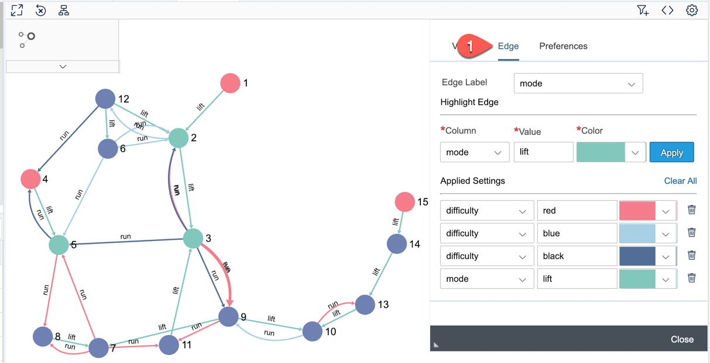
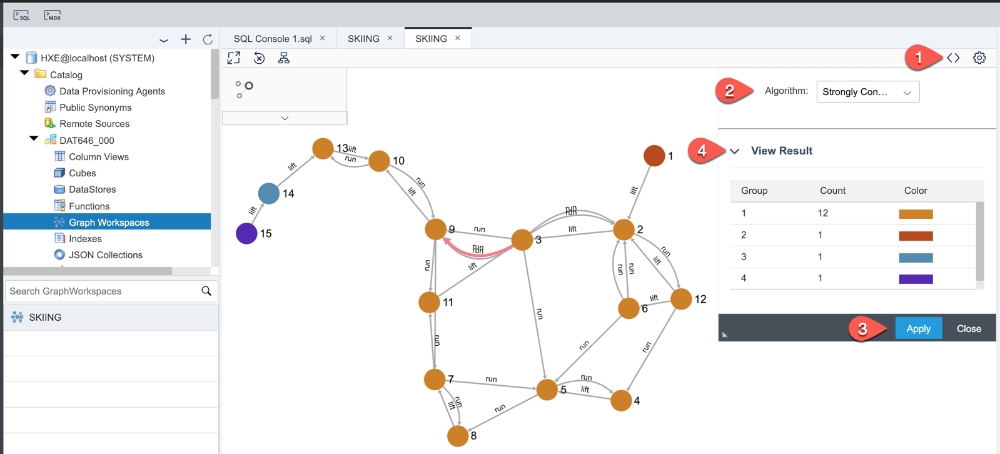
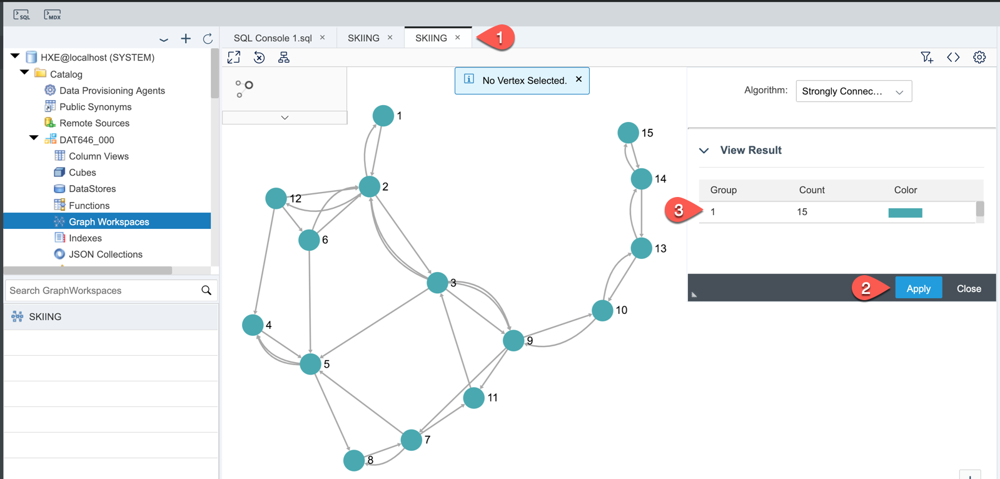
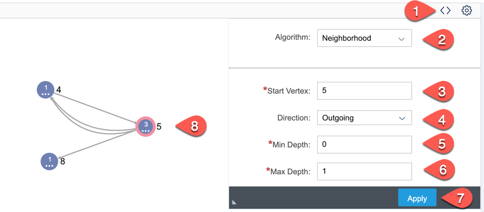
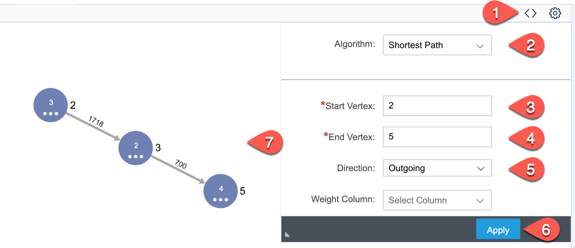
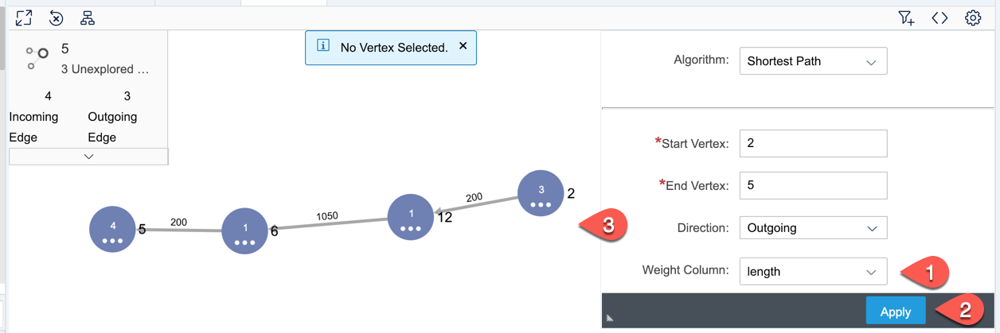

## Prerequisites
 - Completed tutorial [Create SAP HANA Graph Workspace](hana-graph-overview-setup)

## Details
### You will learn
  - How to open Graph Viewer
  - How to run standard algorithms from Graph Viewer


---

[ACCORDION-BEGIN [Step 1: ](Open Graph Viewer)]

Right click on `SKIING` graph workspace and pick **View Graph**.

The graph viewer will open and load the initial view of graph.

> Note, that the rendering of graph's nodes and edges is different every time



[DONE]
[ACCORDION-END]

[ACCORDION-BEGIN [Step 2: ](Customize a view of the graph)]

Use **Preferences** to color code your chart, i.e. different color for nodes with ticket offices and restaurants...



...and to differentiate lifts and runs, as well as difficulty of runs.



[DONE]
[ACCORDION-END]


[ACCORDION-BEGIN [Step 3: ](Built-in algorithm Strongly Connected)]

Graph Viewer has three of most common network algorithms available for graph analysis.

In Graph Viewer click on **Algorithm** icon.

Select **Strongly Connected** and click **Apply**.

Expand **View Result** to see a number of groups and their node counts.

You should see four groups, because two of the stations with ticket offices have only lift connections going in one direction right now.



[DONE]
[ACCORDION-END]

[ACCORDION-BEGIN [Step 4: ](Add more data)]

In reality these lifts at going from the ticket offices are used as well to go down. So, we need to add additional edges.

Add four new records to `EDGES` table by executing following `INSERT` statements in SQL Editor.

```sql
--Add lifts down to boarding stations
INSERT INTO "EDGES" VALUES (1061, 1755, '', 2, 1, 'lift', 'open') ;
INSERT INTO "EDGES" VALUES (1060, 2453, '', 5, 4, 'lift', 'open') ;
INSERT INTO "EDGES" VALUES (1070, 1223, '', 13, 14, 'lift', 'open') ;
INSERT INTO "EDGES" VALUES (1071, 1151, '', 14, 15, 'lift', 'open') ;
```

[DONE]
[ACCORDION-END]

[ACCORDION-BEGIN [Step 5: ](Re-execute Strongly Connected algorithm)]

Go back to the Graph Viewer and click again on **Apply** for **Strongly Connected** algorithm.

Now all nodes are in one group, because you can reach every node from every other one.

> As you can see as well, a graph workspace does not store data itself. It works more like a view reflecting all data changes in underlying tables.



[DONE]
[ACCORDION-END]

[ACCORDION-BEGIN [Step 6: ](Built-it algorithm Neighborhood)]

In Graph Viewer click on **Algorithm** icon.

**Select **Neighborhood** and click **Apply** for parameters:
**Start Vertex**: `5`
**Min Depth**: `0`
**Max Depth**: `1`
**Direction**: `Outgoing`



Play with different parameters to see the results.

[DONE]
[ACCORDION-END]

[ACCORDION-BEGIN [Step 7: ](Build-in algorithm Shortest Path)]

In Graph Viewer click on **Algorithm** icon.

Select **Shortest Path** and click **Apply** for parameters:
**Start Vertex**: `2`
**End Vertex**: `5`
**Direction**: `Outgoing`

SAP HANA calculated the shortest path (in number of connections) is via lift `62` up and then via run `113` down to get to the station `5`. (Compare to the picture of the trail map)



[DONE]
[ACCORDION-END]

[ACCORDION-BEGIN [Step 8: ](Weighted shortest path)]

Now change parameter **Weighted Column** to `length` and **Apply** the algorithm again.

Now SAP HANA calculated that the shortest path (in meters) is via the run `110`, then the lift `64`, and then the run `118`.



[VALIDATE_1]
[ACCORDION-END]

---
