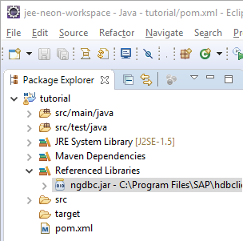

## Prerequisites  
 - **Proficiency:** Beginner

## Details
### You will learn  
In this tutorial you will learn how to use the Eclipse IDE to set up a Maven project that can be used to start developing applications using Hibernate and SAP HANA.

### Time to Complete
**15 Min**

[ACCORDION-BEGIN [Prerequisites: ](Software)]

To complete this tutorial, you will need:

 - **Eclipse IDE for Java EE Developers Neon** or newer (other Eclipse packages may require to manually install additional components)
 - The **SAP HANA Client** (available using the **SAP HANA, express edition** download manager or from the [SAP Store](https://store.sap.com/sap/cpa/ui/resources/store/html/SolutionDetails.html?pid=0000012950))

You will also need an instance of **SAP HANA 2.0, express edition** (SPS02 revision 21 or newer), and both package, the ***Server only*** and ***Server + Applications***, works.

To get your instance up and running, you can check the available options and get started on the [SAP HANA, express edition](https://www.sap.com/developer/topics/sap-hana-express.html) product page.

[ACCORDION-END]

[ACCORDION-BEGIN [Step 1: ](Create a new Maven project In Eclipse)]

Open the ***Eclipse IDE***.

Create a new Maven project by selecting ***File -> New -> Maven Project*** from the menu bar.


> **Note:** if you can't find the ***Maven Project*** entry in the menu as in the above screenshot, then use the ***Other*** option and search for ***Maven Project***

&nbsp;

Check ***Create a simple project*** and click on ***Next***.

Click on ***Next*** again

> **Note:** after you click on ***Next***, the Maven Archetype will be downloaded. If you receive errors like ***Could not resolve archetype***, it is likely that your Maven repository is either corrupted or not properly configured to use a proxy. Refer to the Maven [Configuring a proxy](https://maven.apache.org/guides/mini/guide-proxies.html) documentation.

&nbsp;


Next, enter a group ID (like **`com.sap.hana.hibernate`**), an artefact ID (like **`tutorial`**) and package name for the project.


Then click on **Finish**.

Your project is now created.


[ACCORDION-END]

[ACCORDION-BEGIN [Step 2: ](Add Hibernate as a Maven dependency)]

Open the **`pom.xml`** file and switch to the **Dependencies** tab.


Click on **Add** in the **Dependencies** area (not the **Dependency Management**).

Enter the following details:

- Group Id: `org.hibernate`
- Artifact Id: `hibernate-core`
- Version: `5.2.12.Final`


Click on **OK**

Save the `pom.xml` file.

The project should rebuild automatically.

[ACCORDION-END]

[ACCORDION-BEGIN [Step 3: ](Add the HANA JDBC driver to the Eclipse project)]

Follow the steps from the tutorial **[Connect to SAP HANA, express edition using JDBC](https://www.sap.com/developer/how-tos/2016/08/hxe-connect-hxe-using-jdbc.html)** to add the JDBC driver to your Eclipse project.

This tutorial will also help you identify your system details (server host, port, username and password).



[ACCORDION-END]

[ACCORDION-BEGIN [Step 4: ](Create a persistence configuration)]

Create a file named **`persistence.xml`** in **`tutorial/src/main/resources/META_INF`** using the ***File -> New -> File*** menu bar.


Paste the following content into the **`persistence.xml`** file:

```xml
<?xml version="1.0" encoding="UTF-8"?>
<persistence xmlns="http://java.sun.com/xml/ns/persistence" version="1.0">
    <persistence-unit name="Tutorial">
        <provider>org.hibernate.jpa.HibernatePersistenceProvider</provider>
        <properties>
            <property name="hibernate.dialect" value="org.hibernate.dialect.HANAColumnStoreDialect"/>
            <property name="hibernate.connection.driver_class" value="com.sap.db.jdbc.Driver"/>
            <!-- update the <server host> and <port>-->
            <property name="hibernate.connection.url" value="jdbc:sap://<server host>:<port>"/>
            <!-- update the <username>-->
            <property name="hibernate.connection.username" value="<username>"/>
            <!-- update the <password>-->
            <property name="hibernate.connection.password" value="<password>"/>
            <!-- -->
            <property name="hibernate.connection.pool_size" value="5"/>
            <property name="hibernate.show_sql" value="true"/>
            <property name="hibernate.format_sql" value="true"/>
            <property name="hibernate.hbm2ddl.auto" value="create-drop"/>
            <property name="hibernate.bytecode.provider" value="javassist" />
            <property name="hibernate.bytecode.use_reflection_optimizer" value="true" />
          	<property name="hibernate.jdbc.batch_size" value="10000" />          
        </properties>
    </persistence-unit>
</persistence>
```

Don't forget to update the following property values to match your target SAP HANA instance:

 - `hibernate.connection.url`
 - `hibernate.connection.username`
 - `hibernate.connection.password`

Save the `persistence.xml` file.

[ACCORDION-END]

[ACCORDION-BEGIN [Step 5: ](Test your setup)]

Create a new **`TestSetup`** Java class in a package named **`com.sap.hana.hibernate.tutorial.setup`** (either using a right-click on the project and choose ***New -> Class*** or use the ***File -> New -> Class*** menu bar), then paste the following content:

```java
package com.sap.hana.hibernate.tutorial.setup;

import javax.persistence.EntityManager;
import javax.persistence.EntityManagerFactory;
import javax.persistence.Persistence;
import javax.persistence.Query;

public class TestSetup {

	public static void main(String[] args) {
		try {
      EntityManagerFactory entityManagerFactory = Persistence.createEntityManagerFactory("Tutorial");
  		EntityManager entityManager = entityManagerFactory.createEntityManager();

      Query nativeQuery = entityManager.createNativeQuery("SELECT * FROM DUMMY");
			String result = String.valueOf(nativeQuery.getSingleResult());
			if ("X".equals(result)) {
				System.out.println("SUCCESS!");
			} else {
				throw new RuntimeException("Wrong result!");
			}
			entityManager.clear();
			entityManager.close();
		} catch (Exception e) {
			e.printStackTrace();
		}
		System.exit(0);
	}
}
```

Save the class file.

Run the application by right-clicking the class file and choosing ***Run As -> Java Application*** or click on the  icon.

You should see the following output log in your console:

```
nov. 07, 2017 8:30:29 AM org.hibernate.jpa.internal.util.LogHelper logPersistenceUnitInformation
INFO: HHH000204: Processing PersistenceUnitInfo [
	name: Tutorial
	...]
nov. 07, 2017 8:30:29 AM org.hibernate.Version logVersion
INFO: HHH000412: Hibernate Core {5.2.12.Final}
nov. 07, 2017 8:30:29 AM org.hibernate.cfg.Environment <clinit>
INFO: HHH000206: hibernate.properties not found
nov. 07, 2017 8:30:29 AM org.hibernate.spatial.integration.SpatialService <init>
INFO: HHH80000001: hibernate-spatial integration enabled : true
nov. 07, 2017 8:30:29 AM org.hibernate.annotations.common.reflection.java.JavaReflectionManager <clinit>
INFO: HCANN000001: Hibernate Commons Annotations {5.0.1.Final}
nov. 07, 2017 8:30:29 AM org.hibernate.engine.jdbc.connections.internal.DriverManagerConnectionProviderImpl configure
WARN: HHH10001002: Using Hibernate built-in connection pool (not for production use!)
nov. 07, 2017 8:30:29 AM org.hibernate.engine.jdbc.connections.internal.DriverManagerConnectionProviderImpl buildCreator
INFO: HHH10001005: using driver [com.sap.db.jdbc.Driver] at URL [jdbc:sap://rhhxehost:39015]
nov. 07, 2017 8:30:29 AM org.hibernate.engine.jdbc.connections.internal.DriverManagerConnectionProviderImpl buildCreator
INFO: HHH10001001: Connection properties: {user=SYSTEM, password=****}
nov. 07, 2017 8:30:29 AM org.hibernate.engine.jdbc.connections.internal.DriverManagerConnectionProviderImpl buildCreator
INFO: HHH10001003: Autocommit mode: false
nov. 07, 2017 8:30:29 AM org.hibernate.engine.jdbc.connections.internal.PooledConnections <init>
INFO: HHH000115: Hibernate connection pool size: 5 (min=1)
nov. 07, 2017 8:30:29 AM org.hibernate.dialect.Dialect <init>
INFO: HHH000400: Using dialect: org.hibernate.dialect.HANAColumnStoreDialect
nov. 07, 2017 8:30:29 AM org.hibernate.engine.jdbc.env.internal.LobCreatorBuilderImpl useContextualLobCreation
INFO: HHH000424: Disabling contextual LOB creation as createClob() method threw error : java.lang.reflect.InvocationTargetException
nov. 07, 2017 8:30:30 AM org.hibernate.tool.schema.internal.SchemaCreatorImpl applyImportSources
INFO: HHH000476: Executing import script 'org.hibernate.tool.schema.internal.exec.ScriptSourceInputNonExistentImpl@14bdbc74'
Hibernate:
    SELECT
        *
    FROM
        DUMMY
SUCCESS!
```

[ACCORDION-END]
