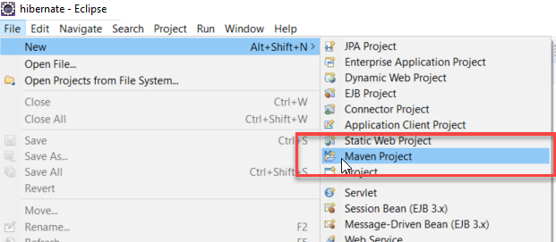
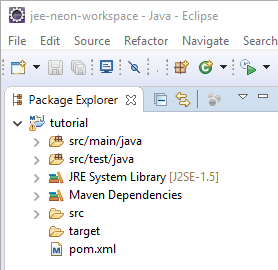
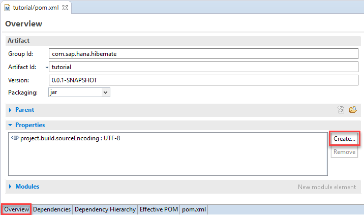
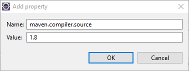
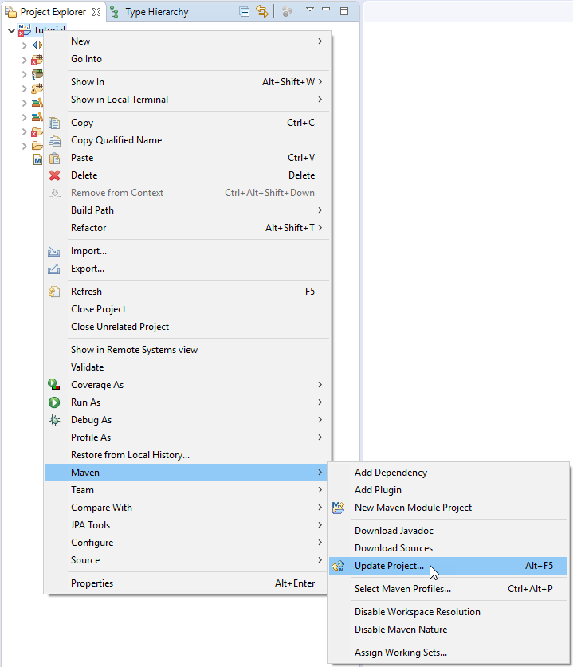
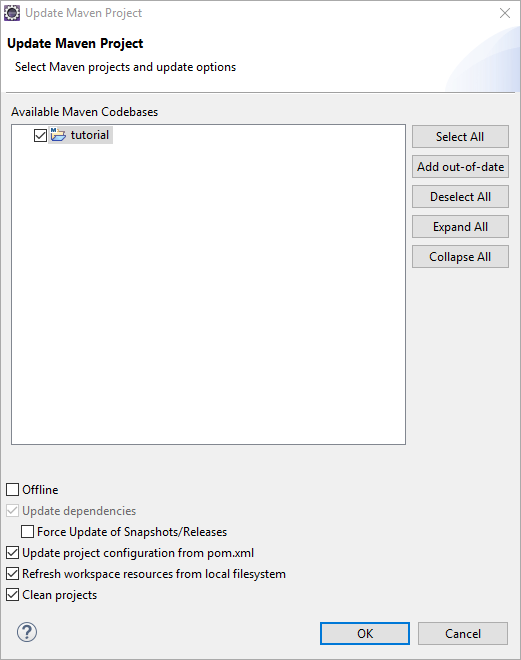
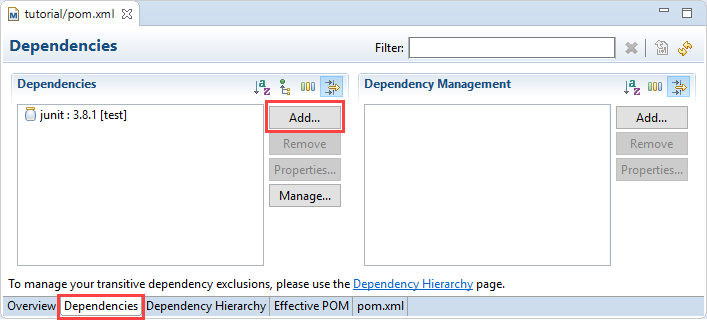
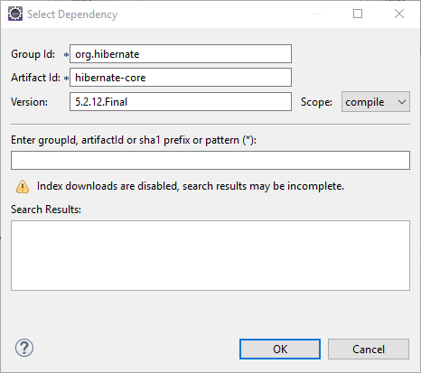
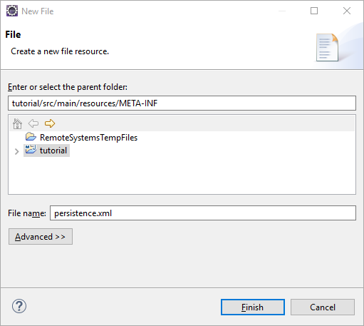

## Prerequisites  
 - **Proficiency:** Beginner

## Details
### You will learn  
In this tutorial you will learn how to use the Eclipse IDE to set up a Maven project that can be used to start developing applications using Hibernate and SAP HANA.

### Time to Complete
**20 Min**

[ACCORDION-BEGIN [Prerequisites: ](Software)]

To complete this tutorial, you will need:

 - **Eclipse IDE for Java EE Developers Neon** or newer (other Eclipse packages may require to manually install additional components)

You will also need an instance of **SAP HANA 2.0, express edition** (SPS02 revision 24 or newer). Both packages, the ***Server only*** and ***Server + Applications***, will work.

To get your instance up and running, you can check the available options and get started on the [SAP HANA, express edition](https://developers.sap.com/topics/hana.html) product page.

[DONE]
[ACCORDION-END]

[ACCORDION-BEGIN [Step 1: ](Create a new Maven project In Eclipse)]

Open the ***Eclipse IDE***.

Create a new Maven project by selecting ***File -> New -> Maven Project*** from the menu bar.



> **Note:** if you can't find the ***Maven Project*** entry in the menu as in the above screenshot, then use the ***Other*** option and search for ***Maven Project***

&nbsp;

Check ***Create a simple project*** and click on ***Next***.

Click on ***Next*** again

> **Note:** after you click on ***Next***, the Maven Archetype will be downloaded. If you receive errors like ***Could not resolve archetype***, it is likely that your Maven repository is either corrupted or not properly configured to use a proxy. Refer to the Maven [Configuring a proxy](https://maven.apache.org/guides/mini/guide-proxies.html) documentation.

&nbsp;


Next, enter a group ID (like **`com.sap.hana.hibernate`**), an artefact ID (like **`tutorial`**) and package name for the project.


Then click on **Finish**.

Your project is now created.



[DONE]
[ACCORDION-END]

[ACCORDION-BEGIN [Step 2: ](Set the minimum Java version)]
By default, the Eclipse Maven plugin will configure the project to use Java 1.5. Since this Java version is very old and lacks many features, we will set the Java version to Java 8.

Open the **`pom.xml`** file and switch to the **Overview** tab.



Click on **Create...** in the **Properties** area.

Enter the following details:

- Name: `maven.compiler.source`
- Value: `1.8`



Click on **OK**

Save the `pom.xml` file.

In order for the change to become effective, the project configuration must be updated.

Right-click on the project in the **Project Explorer** tab and choose **Maven -> Update Project...**.



The following dialog shows what will be updated. You don't need to change anything.



Click on **OK**

[DONE]
[ACCORDION-END]

[ACCORDION-BEGIN [Step 3: ](Add Hibernate as a Maven dependency)]

Open the **`pom.xml`** file and switch to the **Dependencies** tab.



Click on **Add** in the **Dependencies** area (not the **Dependency Management**).

Enter the following details:

- Group Id: `org.hibernate`
- Artifact Id: `hibernate-core`
- Version: `5.3.6.Final`



Click on **OK**

Save the `pom.xml` file.

The project should rebuild automatically.

[DONE]
[ACCORDION-END]

[ACCORDION-BEGIN [Step 4: ](Add Maven dependencies for Java 9 and higher)]
If you are using Java 9 or higher, you'll have to add the JAXB jars as explicit dependencies. Add the following dependencies just like the Hibernate dependency in the previous step:

**JAXB API**

- Group Id: `javax.xml.bind`
- Artifact Id: `jaxb-api`
- Version: `2.2.11`

**JAXB Core**

- Group Id: `com.sun.xml.bind`
- Artifact Id: `jaxb-core`
- Version: `2.2.11`

**JAXB Implementation**

- Group Id: `com.sun.xml.bind`
- Artifact Id: `jaxb-impl`
- Version: `2.2.11`

**Activation Framework**

- Group Id: `javax.activation`
- Artifact Id: `activation`
- Version: `1.1.1`

[DONE]
[ACCORDION-END]

[ACCORDION-BEGIN [Step 5: ](Add the HANA JDBC driver as a Maven dependency)]
The HANA JDBC driver can be added as another Maven dependency. Repeat the steps to add a Maven dependency with the following data:

- Group Id: `com.sap.cloud.db.jdbc`
- Artifact Id: `ngdbc`
- Version: `2.3.48`

[DONE]
[ACCORDION-END]

[ACCORDION-BEGIN [Step 6: ](Create a persistence configuration)]

Create a file named **`persistence.xml`** in **`tutorial/src/main/resources/META_INF`** using the ***File -> New -> File*** menu bar.



Paste the following content into the **`persistence.xml`** file:

```xml
<?xml version="1.0" encoding="UTF-8"?>
<persistence xmlns="http://java.sun.com/xml/ns/persistence" version="1.0">
    <persistence-unit name="Tutorial">
        <provider>org.hibernate.jpa.HibernatePersistenceProvider</provider>
        <properties>
            <property name="hibernate.dialect" value="org.hibernate.dialect.HANAColumnStoreDialect"/>
            <property name="hibernate.connection.driver_class" value="com.sap.db.jdbc.Driver"/>
            <!-- update the <server host> and <port>-->
            <property name="hibernate.connection.url" value="jdbc:sap://<server host>:<port>"/>
            <!-- update the <username>-->
            <property name="hibernate.connection.username" value="<username>"/>
            <!-- update the <password>-->
            <property name="hibernate.connection.password" value="<password>"/>
            <!-- -->
            <property name="hibernate.connection.pool_size" value="5"/>
            <property name="hibernate.show_sql" value="false"/>
            <property name="hibernate.format_sql" value="true"/>
            <property name="hibernate.hbm2ddl.auto" value="create-drop"/>
            <property name="hibernate.bytecode.provider" value="javassist" />
            <property name="hibernate.bytecode.use_reflection_optimizer" value="true" />
          	<property name="hibernate.jdbc.batch_size" value="10000" />          
        </properties>
    </persistence-unit>
</persistence>
```

Don't forget to update the following property values to match your target SAP HANA instance:

 - `hibernate.connection.url`
 - `hibernate.connection.username`
 - `hibernate.connection.password`

Save the `persistence.xml` file.

[DONE]
[ACCORDION-END]

[ACCORDION-BEGIN [Step 7: ](Test your setup)]

Create a new **`TestSetup`** Java class in a package named **`com.sap.hana.hibernate.tutorial.setup`** (either using a right-click on the project and choose ***New -> Class*** or use the ***File -> New -> Class*** menu bar), then paste the following content:

```java
package com.sap.hana.hibernate.tutorial.setup;

import javax.persistence.EntityManager;
import javax.persistence.EntityManagerFactory;
import javax.persistence.Persistence;
import javax.persistence.Query;

public class TestSetup {

	public static void main(String[] args) {
		try {
      EntityManagerFactory entityManagerFactory = Persistence.createEntityManagerFactory("Tutorial");
  		EntityManager entityManager = entityManagerFactory.createEntityManager();

      Query nativeQuery = entityManager.createNativeQuery("SELECT * FROM DUMMY");
			String result = String.valueOf(nativeQuery.getSingleResult());
			if ("X".equals(result)) {
				System.out.println("SUCCESS!");
			} else {
				throw new RuntimeException("Wrong result!");
			}
			entityManager.clear();
			entityManager.close();
		} catch (Exception e) {
			e.printStackTrace();
		}
		System.exit(0);
	}
}
```

Save the class file.

Run the application by right-clicking the class file and choosing ***Run As -> Java Application*** or click on the  icon.

You should see the following output log in your console:

```
Hibernate:
    SELECT
        *
    FROM
        DUMMY
SUCCESS!
```

Provide an answer to the question below then click on **Validate**.

[VALIDATE_1]
[ACCORDION-END]
