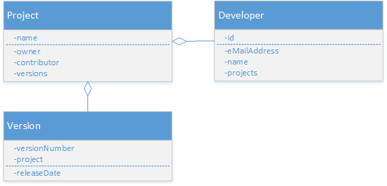
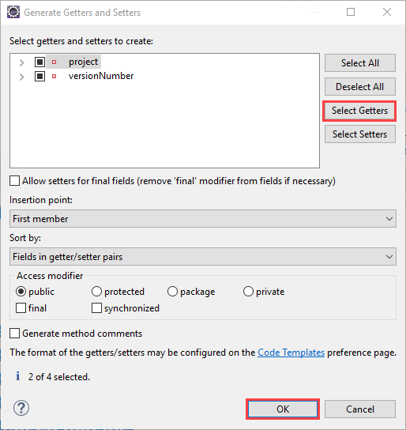
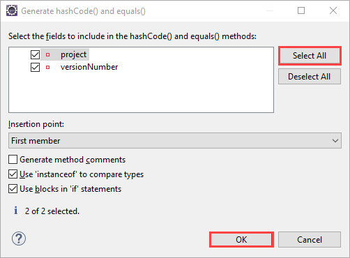

## Prerequisites  
 - **Proficiency:** Beginner

## Details
### You will learn  
In this tutorial you will learn how to create a simple object-oriented data model in Java and use Hibernate to read and write data from and to a SAP HANA database instance.

### Time to Complete
**15 Min**

[ACCORDION-BEGIN [Step 1: ](Define the model)]

In this tutorial you will model a small software project portal where developers can create projects, upload code, and create software releases.

The model consists of three entities: project, developer, and version:



A project has exactly one owner and can have zero or more contributors. A project can have zero or more released versions.

As defined by the model three Java classes representing the entities will be created:

 - Project
 - Developer
 - Version

As the identity of a version entity will be defined by a composite value (i.e. the project to which it belongs and the version string), we will need an additional class named `VersionPK` to represent it.

[DONE]
[ACCORDION-END]

[ACCORDION-BEGIN [Step 2: ](Create the Version Key Entity)]

As the identity of a version entity is defined by a composite value (i.e. the project to which it belongs and the version string), we will need an additional class named `VersionPK` to represent it.

This class will be referenced by the `Version` class via the `@IdClass` annotation and could subsequently be used to query the database for a specific version.

Create a Java class named **`VersionPK`** in a package named **`com.sap.hana.hibernate.tutorial.simple`** (either using a right-click on the project and choose ***New -> Class*** or use the ***File -> New -> Class*** menu bar), then paste the following content:

```java
package com.sap.hana.hibernate.tutorial.simple;

import java.io.Serializable;

public class VersionPK implements Serializable {
  private String versionNumber;
  private String project;
}
```

Now, generate the ***Getters*** for all the attributes using the ***Source -> Generate Getters and Setters...*** menu bar or using a right click in the code, click on ***Select Getters***, and then click on ***Finish***.



Next, we need to generate the ***`hashCode` & equals*** function for all the attributes using the ***Source -> Generate `hashCode`() and equals()...*** menu bar or using a right click in the code, click on ***Select All***, and then click on ***Finish***.



Save the class file.

> **Note:** Upon saving the class, a warning will remain as the class is missing the `serialVersionUID` attribute. To fix it, add the following code:
```java
private static final long serialVersionUID = 1L;
```

&nbsp;

[DONE]
[ACCORDION-END]

[ACCORDION-BEGIN [Step 3: ](Create the Version Entity)]

This class defines three attributes:

- ***The version number***: this string is used to uniquely identify a version of a project.
- ***The project***: the project is also part of the version identifier since two different projects could both specify a version with the same name, e.g. "1.0".
- ***The release date***: contains the date on which the version was released.

Create a Java class named **`Version`** in a package named **`com.sap.hana.hibernate.tutorial.simple`** (either using a right-click on the project and choose ***New -> Class*** or use the ***File -> New -> Class*** menu bar), then paste the following content:

```java
package com.sap.hana.hibernate.tutorial.simple;

import java.util.Date;

import javax.persistence.Entity;
import javax.persistence.Id;
import javax.persistence.IdClass;
import javax.persistence.ManyToOne;

@IdClass(value = VersionPK.class)
@Entity
public class Version {
  @Id
  private String versionNumber;
  @Id
  @ManyToOne
  private Project project;
  private Date releaseDate;

  protected Version() {
  }

  public Version(String versionNumber, Project project) {
    this.versionNumber = versionNumber;
    this.project = project;
    this.releaseDate = new Date();
  }
}
```

Now, generate the ***Getters*** for all the attributes using the ***Source -> Generate Getters and Setters...*** menu bar or using a right click in the code, click on ***Select Getters***, and then click on ***Finish***.

Save the class file.

> **Note:** Upon saving the class, a series of errors will remain as the ***Project*** class is missing. this will be resolved when the next steps will be completed.

&nbsp;

[DONE]
[ACCORDION-END]

[ACCORDION-BEGIN [Step 4: ](Create the Developer Entity)]

The class defines four attributes:

- ***The developer's e-mail address***: since e-mail addresses are globally unique, a developer's e-mail address can serve as a natural identifier (defined via the `@Id` annotation).
- ***The developer's name***: the name of the developer.
- ***The list of projects owned by the developer***: a list of `Project` instances. The association is defined as one-to-many via the `@OneToMany` annotation as a developer can own zero or more projects, but a project is always owned by exactly one developer.

> **Note:** upon saving the class, a series of errors will be triggered as the other classes are not yet created.

&nbsp;

Create a Java class named **`Developer`** in a package named **`com.sap.hana.hibernate.tutorial.simple`** (either using a right-click on the project and choose ***New -> Class*** or use the ***File -> New -> Class*** menu bar), then paste the following content:

```java
package com.sap.hana.hibernate.tutorial.simple;

import java.util.List;

import javax.persistence.Entity;
import javax.persistence.Id;
import javax.persistence.OneToMany;

@Entity
public class Developer {
  @Id
  private String eMailAddress;
  private String name;
  @OneToMany(mappedBy = "projectOwner")
  private List<Project> ownedProjects;

  protected Developer() {
  }

  public Developer(String eMailAddress) {
    this.eMailAddress = eMailAddress;
  }
}
```

Now, generate the ***Getters*** for all the attributes using the ***Source -> Generate Getters and Setters...*** menu bar or using a right click in the code, click on ***Select Getters***, and then click on ***Finish***.

Save the class file.

> **Note:** Upon saving the class, a series of errors will remain as the ***Project*** class is missing. this will be resolved when the next steps will be completed.

&nbsp;

[DONE]
[ACCORDION-END]

[ACCORDION-BEGIN [Step 5: ](Create the Project Entity)]

The class defines four attributes:

- ***The project name***: serves as the identifier of the project as denoted by the `@Id` annotation.
- ***The project owner***: an instance of the `Developer` entity. The association is defined as many-to-one via the `@ManyToOne` annotation as a project always has exactly one owner, but a developer could own several projects.
- ***The list of project contributors****: a list of `Developer` instances. The association is defined as many-to-many via the `@ManyToMany` annotation as a project can have zero or more contributors, and a developer could contribute to zero or more projects.
- ***The list of project versions***: a list of `Version` instances. The association is defined as one-to-many via the `@OneToMany` annotation as a project can have zero or more versions, but a version always belongs to exactly one project.


Create a Java class named **`Project`** in a package named **`com.sap.hana.hibernate.tutorial.simple`** (either using a right-click on the project and choose ***New -> Class*** or use the ***File -> New -> Class*** menu bar), then paste the following content:

```java
package com.sap.hana.hibernate.tutorial.simple;

import java.util.ArrayList;
import java.util.List;

import javax.persistence.Entity;
import javax.persistence.Id;
import javax.persistence.ManyToMany;
import javax.persistence.ManyToOne;
import javax.persistence.OneToMany;

@Entity
public class Project {
  @ManyToMany
  private List<Developer> contributors;

  @Id
  private String name;

  @ManyToOne
  private Developer projectOwner;

  @OneToMany(mappedBy = "project")
  private List<Version> versions;

  protected Project() {
  }

  public Project(String name) {
    this.name = name;
  }

  public void addContributor(Developer contributor) {
    if (this.contributors == null) {
      this.contributors = new ArrayList<>();
    }
    this.contributors.add(contributor);
  }

  public void addVersion(Version version) {
    if (this.versions == null) {
      this.versions = new ArrayList<>();
    }
    this.versions.add(version);
  }
}
```

Save the class file.

> **Note:** upon saving the class, a series of errors will be triggered as the other classes are not yet created.

&nbsp;

[DONE]
[ACCORDION-END]

[ACCORDION-BEGIN [Step 6: ](Test your entities)]

Now let's test our created entities with the following:

 1. creates two developers, John Doe and Jane Doe.
 2. creates a project owned by John and adds Jane as a contributor.
 3. creates version 1.0 of the project.
 4. search for the created project and test its content

Create a Java class named **`TestSimple`** in a package named **`com.sap.hana.hibernate.tutorial.simple`** (either using a right-click on the project and choose ***New -> Class*** or use the ***File -> New -> Class*** menu bar), then paste the following content:

```java
package com.sap.hana.hibernate.tutorial.simple;

import javax.persistence.EntityManager;
import javax.persistence.EntityManagerFactory;
import javax.persistence.Persistence;

public class TestSimple {

  private static Developer createDeveloper(String name, String eMail) {
    Developer developer = new Developer(eMail);
    developer.setName(name);
    return developer;
  }

  private static Project createProject(String name, Developer owner) {
    Project project = new Project(name);
    project.setProjectOwner(owner);
    return project;
  }

  private static Version createVersion(String versionNumber, Project project) {
    Version version = new Version(versionNumber, project);
    return version;
  }

  public static void main(String[] args) {
    try {
      EntityManagerFactory entityManagerFactory = Persistence.createEntityManagerFactory("Tutorial");
      EntityManager entityManager = entityManagerFactory.createEntityManager();

      entityManager.getTransaction().begin();

      System.out.println("************************************************************************");
      System.out.println(" >> Creating entities");
      System.out.println("************************************************************************");

      Developer john = createDeveloper("John Doe", "john@doe.com");
      entityManager.persist(john);

      Developer jane = createDeveloper("Jane Doe", "jane@doe.com");
      entityManager.persist(jane);

      Project project = createProject("John's big project", john);
      project.addContributor(jane);

      Version version = createVersion("1.0", project);
      project.addVersion(version);

      entityManager.persist(project);

      project.addVersion(version);

      entityManager.persist(version);

      entityManager.getTransaction().commit();
      entityManager.clear();

      System.out.println("************************************************************************");
      System.out.println(" >> Creating entities completed");
      System.out.println("************************************************************************");

      System.out.println("************************************************************************");
      System.out.println(" >> Finding project by name");
      System.out.println("************************************************************************");

      Project johnsBigProject = entityManager.find(Project.class, "John's big project");

      System.out.println("************************************************************************");
      System.out.println(" >> Getting project name : " + johnsBigProject.getName());
      System.out.println(" >> Getting project owner: " + johnsBigProject.getProjectOwner().getName());
      System.out.println("************************************************************************");

      assert johnsBigProject.getName().equals("John's big project");
      assert johnsBigProject.getProjectOwner().getName().equals("John Doe");
      System.out.println("************************************************************************");
      entityManager.clear();
      entityManager.close();
    } catch (Exception e) {
      e.printStackTrace();
    }
    System.exit(0);
  }
}
```

Save the class file.

Run the application by right-clicking the class file and choosing ***Run As -> Java Application*** or click on the  icon.

You should see the following output log in your console (with only the `stdout`):

```
Hibernate:

    drop table Developer cascade
Hibernate:

    drop table Project cascade
Hibernate:

    drop table Project_Developer cascade
Hibernate:

    drop table Version cascade
Hibernate: create column table Developer (eMailAddress varchar(255) not null, name varchar(255), primary key (eMailAddress))
Hibernate:

    alter table Project
       add constraint FK3oeqfkq5jn0kjy2mdaft7rp5u
       foreign key (projectOwner_eMailAddress)
       references Developer
Hibernate:

    alter table Project_Developer
       add constraint FKfjmrxrx78c50vodgyffyfu1ni
       foreign key (contributors_eMailAddress)
       references Developer
Hibernate:

    alter table Project_Developer
       add constraint FKs6slwia2sper8m6sqjma71g3d
       foreign key (Project_name)
       references Project
Hibernate:

    alter table Version
       add constraint FK9igf86no0jfeogkcj9q46l290
       foreign key (project_name)
       references Project
INFO: HHH000476: Executing import script 'org.hibernate.tool.schema.internal.exec.ScriptSourceInputNonExistentImpl@3b2c0e88'
************************************************************************
 >> Creating entities
************************************************************************
Hibernate:
    insert
    into
        Developer
        (name, eMailAddress)
    values
        (?, ?)
Hibernate:
    insert
    into
        Developer
        (name, eMailAddress)
    values
        (?, ?)
Hibernate:
    insert
    into
        Project
        (projectOwner_eMailAddress, name)
    values
        (?, ?)
Hibernate:
    insert
    into
        Version
        (releaseDate, project_name, versionNumber)
    values
        (?, ?, ?)
Hibernate:
    insert
    into
        Project_Developer
        (Project_name, contributors_eMailAddress)
    values
        (?, ?)
************************************************************************
 >> Creating entities completed
************************************************************************
************************************************************************
 >> Finding project by name
************************************************************************
************************************************************************
 >> Getting project name : John's big project
 >> Getting project owner: John Doe
************************************************************************
************************************************************************
```

This output shows the SQL statements that were generated to insert the values into the database and to read the project from the database again.

[VALIDATE_1]
[ACCORDION-END]
