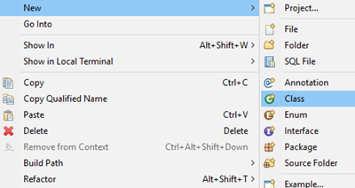

## Prerequisites  
 - **Proficiency:** Beginner

## Details
### You will learn  
In this tutorial you will learn how to create a simple object-oriented data model in Java and use Hibernate to read and write data from and to a SAP HANA database instance.

### Time to Complete
**15 Min**

[ACCORDION-BEGIN [Step 1: ](Define the model)]

In this tutorial you will model a small software project portal where developers can create projects, upload code, and create software releases.

The model consists of three entities: project, developer, and version:


A project has exactly one owner and can have zero or more contributors. A project can have zero or more released versions.

[ACCORDION-END]

[ACCORDION-BEGIN [Step 2: ](Create the Hibernate Entities)]

As defined by the model three Java classes representing the entities must be created:

 - Project
 - Developer
 - Version

For each of the entities listed above, create the corresponding Java class and in the next steps you will add the relevant piece of code.

The create a new Java class, right-click on the project and choose ***New -> Class*** or use the ***File -> New -> Class*** menu bar.



Enter the class name, then click on **Finish**.

[ACCORDION-END]

[ACCORDION-BEGIN [Step 3: ](Create the Project Entity)]

Open **Project** Java class located in **`src/main/java/Project.java`**, and replace its current content by the following:

```java
package com.sap.hana.hibernate.tutorial;

import java.util.ArrayList;
import java.util.List;

import javax.persistence.Entity;
import javax.persistence.Id;
import javax.persistence.ManyToMany;
import javax.persistence.ManyToOne;
import javax.persistence.OneToMany;

@Entity
public class Project {

	@Id
	private String name;
	@ManyToOne
	private Developer projectOwner;
	@ManyToMany
	private List<Developer> contributors;
	@OneToMany
	private List<Version> versions;

	protected Project() {
	}
	public Project(String name) {
		this.name = name;
	}
	public Developer getProjectOwner() {
		return this.projectOwner;
	}
	public void setProjectOwner(Developer projectOwner) {
		this.projectOwner = projectOwner;
	}
	public List<Developer> getContributors() {
		return this.contributors;
	}
	public void setContributors(List<Developer> contributors) {
		this.contributors = contributors;
	}
	public void addContributor(Developer contributor) {
		if (this.contributors == null) {
			this.contributors = new ArrayList<>();
		}
		this.contributors.add(contributor);
	}
	public List<Version> getVersions() {
		return this.versions;
	}
	public void setVersions(List<Version> versions) {
		this.versions = versions;
	}
	public String getName() {
		return this.name;
	}
}
```

The class defines four attributes:

- ***The project name***: serves as the identifier of the project as denoted by the `@Id` annotation.
- ***The project owner***: an instance of the `Developer` entity. The association is defined as many-to-one via the `@ManyToOne` annotation as a project always has exactly one owner, but a developer could own several projects.
- ***The list of project contributors****: a list of `Developer` instances. The association is defined as many-to-many via the `@ManyToMany` annotation as a project can have zero or more contributors, and a developer could contribute to zero or more projects.
- ***The list of project versions***: a list of `Version` instances. The association is defined as one-to-many via the `@OneToMany` annotation as a project can have zero or more versions, but a version always belongs to exactly one project.

Save the class.

> **Note:** upon saving the class, a series of errors will be triggered as the other classes are not yet created.

&nbsp;

[ACCORDION-END]

[ACCORDION-BEGIN [Step 4: ](Create the Developer Entity)]

Open **Developer** Java class located in **`src/main/java/Developer.java`**, and replace its current content by the following:

```java
package com.sap.hana.hibernate.tutorial;

import java.util.List;

import javax.persistence.Entity;
import javax.persistence.Id;
import javax.persistence.OneToMany;

@Entity
public class Developer {

	@Id
	private String eMailAddress;
	private String name;
	@OneToMany(mappedBy = "projectOwner")
	private List<Project> ownedProjects;

	protected Developer() {
	}
	public Developer(String eMailAddress) {
		this.eMailAddress = eMailAddress;
	}
	public String getName() {
		return this.name;
	}
	public void setName(String name) {
		this.name = name;
	}
	public String geteMailAddress() {
		return this.eMailAddress;
	}
}
```

The class defines four attributes:

- ***The developer's e-mail address***: since e-mail addresses are globally unique, a developer's e-mail address can serve as a natural identifier (defined via the `@Id` annotation).
- ***The developer's name***: the name of the developer.
- ***The list of projects owned by the developer***: a list of `Project` instances. The association is defined as one-to-many via the `@OneToMany` annotation as a developer can own zero or more projects, but a project is always owned by exactly one developer.

> **Note:** upon saving the class, a series of errors will be triggered as the other classes are not yet created.

&nbsp;

[ACCORDION-END]

[ACCORDION-BEGIN [Step 5: ](Create the Version Entity)]

Open **Version** Java class located at **`src/main/java/Version.java`**, and replace its current content by the following:

```java
package com.sap.hana.hibernate.tutorial;

import java.util.Date;

import javax.persistence.Entity;
import javax.persistence.Id;
import javax.persistence.IdClass;
import javax.persistence.ManyToOne;

@IdClass(value = VersionPK.class)
@Entity
public class Version {

	@Id
	private String versionNumber;
	@Id
	@ManyToOne
	private Project project;
	private Date releaseDate;

	protected Version() {
	}
	public Version(String versionNumber, Project project) {
		this.versionNumber = versionNumber;
		this.project = project;
		this.releaseDate = new Date();
	}
	public Date getReleaseDate() {
		return this.releaseDate;
	}
	public void setReleaseDate(Date releaseDate) {
		this.releaseDate = releaseDate;
	}
	public String getVersionNumber() {
		return this.versionNumber;
	}
	public Project getProject() {
		return this.project;
	}
}
```

This class defines three attributes:

- ***The version number***: this string is used to uniquely identify a version of a project.
- ***The project***: the project is also part of the version identifier since two different projects could both specify a version with the same name, e.g. "1.0".
- ***The release date***: contains the date on which the version was released.

> **Note:** upon saving the class, a series of errors will be triggered as the other classes are not yet created.

&nbsp;

As the identity of a version entity is defined by a composite value (i.e. the project to which it belongs and the version string), we will need an additional class named `VersionPK` to represent it.

Create a **`VersionPK`** Java class located at **`src/main/java/VersionPK.java`**, and replace its current content by the following:

```java
package com.sap.hana.hibernate.tutorial;

import java.io.Serializable;

public class VersionPK implements Serializable {

	private static final long serialVersionUID = 1L;
	private String versionNumber;
	private Project project;

	public String getVersionNumber() {
		return this.versionNumber;
	}
	public Project getProject() {
		return this.project;
	}

	@Override
	public int hashCode() {
		final int prime = 31;
		int result = 1;
		result = prime * result + ((project == null) ? 0 : project.hashCode());
		result = prime * result + ((versionNumber == null) ? 0 : versionNumber.hashCode());
		return result;
	}

	@Override
	public boolean equals(Object obj) {
		if (this == obj) {
			return true;
		}
		if (obj == null) {
			return false;
		}
		if (!(obj instanceof VersionPK)) {
			return false;
		}
		VersionPK other = (VersionPK) obj;
		if (project == null) {
			if (other.project != null) {
				return false;
			}
		} else if (!project.equals(other.project)) {
			return false;
		}
		if (versionNumber == null) {
			if (other.versionNumber != null) {
				return false;
			}
		} else if (!versionNumber.equals(other.versionNumber)) {
			return false;
		}
		return true;
	}

}
```

This class is referenced by the `Version` class via the `@IdClass` annotation and could subsequently be used to query the database for a specific version.

[ACCORDION-END]

[ACCORDION-BEGIN [Step 6: ](Test your entities)]

Edit the **`App.java`** located in **`tutorial/src/main/java/com.sap.hana.hibernate.tutorial`**.

Paste the following content into the **`App.java`** file:

```java
package com.sap.hana.hibernate.tutorial;

import javax.persistence.EntityManager;
import javax.persistence.EntityManagerFactory;
import javax.persistence.Persistence;

public class App {

	public static void main(String[] args) {
		EntityManagerFactory entityManagerFactory = Persistence.createEntityManagerFactory("Tutorial");
		EntityManager entityManager = entityManagerFactory.createEntityManager();

		entityManager.getTransaction().begin();

		System.out.println("************************************************************************");
		System.out.println(" >> Creating entities");
		System.out.println("************************************************************************");

		Developer john = createDeveloper("John Doe", "john@doe.com");
		entityManager.persist(john);

		Developer jane = createDeveloper("Jane Doe", "jane@doe.com");
		entityManager.persist(jane);

		Project project = createProject("John's big project", john);
		project.addContributor(jane);
		entityManager.persist(project);

		Version version = createVersion("1.0", project);
		entityManager.persist(version);

		entityManager.getTransaction().commit();
		entityManager.clear();

		System.out.println("************************************************************************");
		System.out.println(" >> Creating entities completed");
		System.out.println("************************************************************************");

		System.out.println("************************************************************************");
		System.out.println(" >> Finding project by name");
		System.out.println("************************************************************************");

		Project johnsBigProject = entityManager.find(Project.class, "John's big project");

		System.out.println("************************************************************************");
		System.out.println(" >> Getting project name : " + johnsBigProject.getName());
		System.out.println(" >> Getting project owner: " + johnsBigProject.getProjectOwner().getName());
		System.out.println("************************************************************************");

		assert johnsBigProject.getName().equals("John's big project");
		assert johnsBigProject.getProjectOwner().getName().equals("John Doe");
		System.out.println("************************************************************************");
	}

	private static Developer createDeveloper(String name, String eMail) {
		Developer developer = new Developer(eMail);
		developer.setName(name);
		return developer;
	}

	private static Project createProject(String name, Developer owner) {
		Project project = new Project(name);
		project.setProjectOwner(owner);
		return project;
	}

	private static Version createVersion(String versionNumber, Project project) {
		Version version = new Version(versionNumber, project);
		return version;
	}
}
```

This application will:

 1. creates two developers, John Doe and Jane Doe.
 2. creates a project owned by John and adds Jane as a contributor.
 3. creates version 1.0 of the project.
 4. search for the created project and test its content

Run the application by right-clicking the `App.java` file and choosing ***Run As -> Java Application*** or click on the  icon.

You should see the following output log in your console:

```
...
Hibernate:

    drop table Developer cascade
Hibernate:

    drop table Project cascade
Hibernate:

    drop table Project_Developer cascade
Hibernate:

    drop table Project_Version cascade
Hibernate:

    drop table Version cascade
Hibernate: create column table Project (name varchar(255) not null, projectOwner_eMailAddress varchar(255), primary key (name))
Hibernate: create column table Project_Developer (Project_name varchar(255) not null, contributors_eMailAddress varchar(255) not null)
Hibernate: create column table Project_Version (Project_name varchar(255) not null, versions_project_name varchar(255) not null, versions_versionNumber varchar(255) not null)
Hibernate: create column table Version (versionNumber varchar(255) not null, releaseDate timestamp, project_name varchar(255) not null, primary key (project_name, versionNumber))
Hibernate:

    alter table Project_Version
       add constraint UK_ppsraqy42otesf6g0t5ent6 unique (versions_project_name, versions_versionNumber)
Hibernate:

    alter table Project
       add constraint FK3oeqfkq5jn0kjy2mdaft7rp5u
       foreign key (projectOwner_eMailAddress)
       references Developer
Hibernate:

    alter table Project_Developer
       add constraint FKfjmrxrx78c50vodgyffyfu1ni
       foreign key (contributors_eMailAddress)
       references Developer
Hibernate:

    alter table Project_Developer
       add constraint FKs6slwia2sper8m6sqjma71g3d
       foreign key (Project_name)
       references Project
Hibernate:

    alter table Project_Version
       add constraint FKfrg5onmiowqd18gjetq02qt2w
       foreign key (versions_project_name, versions_versionNumber)
       references Version
Hibernate:

    alter table Project_Version
       add constraint FKr217pk6wqy0xciu3fnnn6iocd
       foreign key (Project_name)
       references Project
Hibernate:

    alter table Version
       add constraint FK9igf86no0jfeogkcj9q46l290
       foreign key (project_name)
       references Project
************************************************************************
 >> Creating entities
************************************************************************
Hibernate:
    insert
    into
        Developer
        (name, eMailAddress)
    values
        (?, ?)
Hibernate:
    insert
    into
        Developer
        (name, eMailAddress)
    values
        (?, ?)
Hibernate:
    insert
    into
        Project
        (projectOwner_eMailAddress, name)
    values
        (?, ?)
Hibernate:
    insert
    into
        Version
        (releaseDate, project_name, versionNumber)
    values
        (?, ?, ?)
Hibernate:
    insert
    into
        Project_Developer
        (Project_name, contributors_eMailAddress)
    values
        (?, ?)
************************************************************************
 >> Creating entities completed
************************************************************************
************************************************************************
 >> Finding project by name
************************************************************************
Hibernate:
    select
        project0_.name as name1_1_0_,
        project0_.projectOwner_eMailAddress as projectOwner_eMailAddress2_1_0_,
        developer1_.eMailAddress as eMailAddress1_0_1_,
        developer1_.name as name2_0_1_
    from
        Project project0_
    left outer join
        Developer developer1_
            on project0_.projectOwner_eMailAddress=developer1_.eMailAddress
    where
        project0_.name=?
************************************************************************
 >> Getting project name : John's big project
 >> Getting project owner: John Doe
************************************************************************
************************************************************************
```

This output shows the SQL statements that were generated to insert the values into the database and to read the project from the database again.

[ACCORDION-END]
