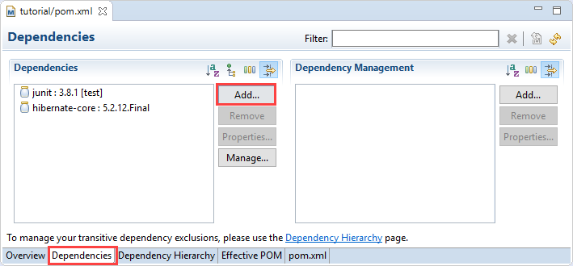

## Prerequisites  
 - **Proficiency:** Intermediate

## Details
### You will learn  
In this tutorial you will learn how to create an application that process geospatial data using Hibernate on SAP HANA to create the data model, process the data, and interact with the database.

### Time to Complete
**30 Min**


[ACCORDION-BEGIN [Step 1: ](The GDELT data)]

The data set you will use for the tutorial is the one provided by the Global Database of Events, Language, and Tone data (GDELT) version 1.0 from the [GDELT project](https://www.gdeltproject.org/).

The GDELT 1.0 event dataset comprises over 3.5 billion mentions of over 364 million distinct events from almost every corner of the earth spanning January 1979 to present and updated daily.

The [file format documentation](http://data.gdeltproject.org/documentation/GDELT-Data_Format_Codebook.pdf) describes the various fields and their structure.

In addition, tab-delimited lookup files are available that contain the human-friendly textual labels for each of those codes to make it easier to work with the data for those who have not previously worked with CAMEO.

Lookups are available for both [Event Codes](https://www.gdeltproject.org/data/lookups/CAMEO.eventcodes.txt) and the [Goldstein Scale](https://www.gdeltproject.org/data/lookups/CAMEO.goldsteinscale.txt).

In addition, detailed recording characteristics of the actors involved in each event are stored as a sequence of 3 character codes.

Lookups are available for:

 - [Country Codes](https://www.gdeltproject.org/data/lookups/CAMEO.country.txt)
 - [Type Codes](https://www.gdeltproject.org/data/lookups/CAMEO.type.txt)
 - [Known Group Codes](https://www.gdeltproject.org/data/lookups/CAMEO.knowngroup.txt)
 - [Ethnic Codes](https://www.gdeltproject.org/data/lookups/CAMEO.ethnic.txt)
 - [Religion Codes](https://www.gdeltproject.org/data/lookups/CAMEO.religion.txt).

And you can download the complete collection as a series of Event CSV files here:

- <http://data.gdeltproject.org/events/index.html>

You can find more details about GDELT version 1 here:

- <https://www.gdeltproject.org/data.html#documentation>

[DONE]
[ACCORDION-END]

[ACCORDION-BEGIN [Step 2: ](Update the project configuration)]

In order to be able to work with geospatial data in Hibernate, the Hibernate Spatial artefact must be added as a dependency to the Maven project descriptor `pom.xml`.

Open the **`pom.xml`** file and switch to the **Dependencies** tab.



Click on **Add** in the **Dependencies** area (not the **Dependency Management**).

Enter the following details:

- Group Id: `org.hibernate`
- Artifact Id: `hibernate-spatial`
- Version: `5.2.12.Final`


Click on **OK**

Save the `pom.xml` file.

After the Hibernate Spatial dependency has been added, the persistence configuration must be adapted to use the SAP HANA spatial dialect by replacing
  - ***`org.hibernate.dialect.HANAColumnStoreDialect`***
by:
  - ***`org.hibernate.spatial.dialect.hana.HANASpatialDialect`***

Open the **`persistence.xml`** file located at **`src/main/resources/META-INF`** and change the configuration to resemble the following:

```xml
<?xml version="1.0" encoding="UTF-8"?>
<persistence xmlns="http://java.sun.com/xml/ns/persistence" version="1.0">
    <persistence-unit name="Tutorial">
        <provider>org.hibernate.jpa.HibernatePersistenceProvider</provider>
        <properties>
          <!-- switch to spatial dialect-->
          <property name="hibernate.dialect" value="org.hibernate.spatial.dialect.hana.HANASpatialDialect"/>
          <property name="hibernate.connection.driver_class" value="com.sap.db.jdbc.Driver"/>
          <!-- update the <server host> and <port>-->
          <property name="hibernate.connection.url" value="jdbc:sap://<server host>:<port>"/>
          <!-- update the <username>-->
          <property name="hibernate.connection.username" value="<username>"/>
          <!-- update the <password>-->
          <property name="hibernate.connection.password" value="<password>"/>
          <!-- -->
          <property name="hibernate.connection.pool_size" value="5"/>
          <property name="hibernate.show_sql" value="false"/>
          <property name="hibernate.format_sql" value="false"/>
          <property name="hibernate.hbm2ddl.auto" value="create-drop"/>
          <property name="hibernate.bytecode.provider" value="javassist" />
          <property name="hibernate.bytecode.use_reflection_optimizer" value="true" />
          <property name="hibernate.jdbc.batch_size" value="10000" />
        </properties>
    </persistence-unit>
</persistence>
```

Don't forget to update the following property values to match your target SAP HANA instance:

 - `hibernate.connection.url`
 - `hibernate.connection.username`
 - `hibernate.connection.password`

Save the `persistence.xml` file.

[DONE]
[ACCORDION-END]

[ACCORDION-BEGIN [Step 3: ](Download a GDELT data file)]

Download one of the GDELT zipped CSV file, for example `20171005.export.CSV.zip`, from <http://data.gdeltproject.org/events/index.html>.

Save the file locally, then extract the contents of the zip file into the `src/main/resources` project folder.

> #### **Hint:** Copy-Paste works from Windows Explorer.

&nbsp;

[DONE]
[ACCORDION-END]

[ACCORDION-BEGIN [Step 4: ](Define the model)]

The GDELT data can be modelled using four entities:

 - Event
 - Actor
 - Action
 - Geography

The entities need to define the attributes listed in the [GDELT file format documentation](http://data.gdeltproject.org/documentation/GDELT-Data_Format_Codebook.pdf).

Therefore, we will need to create the Java classes representing the entities during the following steps.

[DONE]
[ACCORDION-END]

[ACCORDION-BEGIN [Step 5: ](Create the Helper class)]

In order to simplify the code, a Java Helper class with reusable static method will be created.

Create a Java class named **`Helper`** in a package named **`com.sap.hana.hibernate.tutorial.spatial`** (either using a right-click on the project and choose ***New -> Class*** or use the ***File -> New -> Class*** menu bar), then paste the following content:

```java
package com.sap.hana.hibernate.tutorial.spatial;

import java.text.ParseException;
import java.text.SimpleDateFormat;
import java.util.Date;

import org.geolatte.geom.C2D;
import org.geolatte.geom.crs.CoordinateReferenceSystem;
import org.geolatte.geom.crs.CoordinateReferenceSystems;
import org.geolatte.geom.crs.Unit;

public class Helper {

  static final SimpleDateFormat DAY_DATE_FORMAT = new SimpleDateFormat("yyyyMMdd");
  static final SimpleDateFormat MONTH_DATE_FORMAT = new SimpleDateFormat("yyyyMM");
  // The default HANA coordinate reference system with ID 0
  static final CoordinateReferenceSystem<C2D> DEFAULT_CRS = CoordinateReferenceSystems.mkProjected(0, Unit.METER);

  public static Date parseDate(String s) {
    if (s == null || s.isEmpty()) {
      return null;
    }

    try {
      return DAY_DATE_FORMAT.parse(s);
    } catch (ParseException e) {
      return null;
    }
  }

  public static double parseDouble(String s) {
    if (s == null || s.isEmpty()) {
      return 0.d;
    }

    return Double.parseDouble(s);
  }

  public static int parseInt(String s) {
    if (s == null || s.isEmpty()) {
      return 0;
    }

    return Integer.parseInt(s);
  }

  public static SimpleDateFormat getDayDateFormat() {
    return Helper.DAY_DATE_FORMAT;
  }

  public static SimpleDateFormat getMonthDateFormat() {
    return Helper.MONTH_DATE_FORMAT;
  }
}
```

[DONE]
[ACCORDION-END]

[ACCORDION-BEGIN [Step 6: ](Create the Actor Entity)]

This entity defines the attributes listed in the documentation and uses the code as the identifier.

Create a Java class named **`Actor`** in a package named **`com.sap.hana.hibernate.tutorial.spatial`** (either using a right-click on the project and choose ***New -> Class*** or use the ***File -> New -> Class*** menu bar), then paste the following content:

```java
package com.sap.hana.hibernate.tutorial.spatial;

import javax.persistence.Entity;
import javax.persistence.Id;

@Entity
public class Actor {

  @Id
  private String code;
  private String name;
  private String countryCode;
  private String knownGroupCode;
  private String ethnicCode;
  private String religion1Code;
  private String religion2Code;
  private String type1Code;
  private String type2Code;
  private String type3Code;

  public Actor() {
    super();
  }

  public Actor(String code, String name, String countryCode, String knownGroupCode, String ethnicCode,
      String religion1Code, String religion2Code, String type1Code, String type2Code, String type3Code) {
    super();
    this.code = code;
    this.name = name;
    this.countryCode = countryCode;
    this.knownGroupCode = knownGroupCode;
    this.ethnicCode = ethnicCode;
    this.religion1Code = religion1Code;
    this.religion2Code = religion2Code;
    this.type1Code = type1Code;
    this.type2Code = type2Code;
    this.type3Code = type3Code;
  }
}
```

Now, generate the ***Getters*** and ***Setters*** for all the attributes using the ***Source -> Generate Getters and Setters...*** menu bar or using a right click in the code, click on ***Select All***, and then click on ***Finish***.

Save the class file.

[DONE]
[ACCORDION-END]

[ACCORDION-BEGIN [Step 7: ](Create the Action Entity)]

Like the actor class this class defines the attributes listed in the documentation and uses the code as the identifier.

Create a Java class named **`Action`** in a package named **`com.sap.hana.hibernate.tutorial.spatial`** (either using a right-click on the project and choose ***New -> Class*** or use the ***File -> New -> Class*** menu bar), then paste the following content:

```java
package com.sap.hana.hibernate.tutorial.spatial;

import javax.persistence.Entity;
import javax.persistence.Id;

@Entity
public class Action {

  private boolean rootEvent;
  @Id
  private String code;
  private String baseCode;
  private String rootCode;
  private int quadClass;
  private double goldsteinScale;
  private int numMentions;

  public Action() {
    super();
  }

  public Action(boolean rootEvent, String code, String baseCode, String rootCode, int quadClass,
      double goldsteinScale, int numMentions, int numSources, int numArticles, double avgTone) {
    super();
    this.rootEvent = rootEvent;
    this.code = code;
    this.baseCode = baseCode;
    this.rootCode = rootCode;
    this.quadClass = quadClass;
    this.goldsteinScale = goldsteinScale;
    this.numMentions = numMentions;
    this.numSources = numSources;
    this.numArticles = numArticles;
    this.avgTone = avgTone;
  }
}
```

Now, generate the ***Getters*** and ***Setters*** for all the attributes using the ***Source -> Generate Getters and Setters...*** menu bar or using a right click in the code, click on ***Select All***, and then click on ***Finish***.

Save the class file.

[DONE]
[ACCORDION-END]

[ACCORDION-BEGIN [Step 8: ](Create the Geography Entity)]

The geography entity is marked as an embeddable entity via the `@Embeddable` annotation. Because of this the geography entities will not be stored in a separate table. Instead they will be stored in the table of a parent entity, in this case the event entity.

Create a Java class named **`Geography`** in a package named **`com.sap.hana.hibernate.tutorial.spatial`** (either using a right-click on the project and choose ***New -> Class*** or use the ***File -> New -> Class*** menu bar), then paste the following content:

```java
package com.sap.hana.hibernate.tutorial.spatial;

import javax.persistence.Embeddable;

import org.geolatte.geom.C2D;
import org.geolatte.geom.Point;

@Embeddable
public class Geography {

  private int type;
  private String fullName;
  private String countryCode;
  private String adm1Code;
  private Point<C2D> position;
  private int featureId;

  public Geography() {
    super();
  }

  public Geography(int type, String fullName, String countryCode, String adm1Code, String latitude, String longitude, int featureIdType, String featureId) {
    super();
    this.type = type;
    this.fullName = fullName;
    this.countryCode = countryCode;
    this.adm1Code = adm1Code;
    this.setPosition(latitude, longitude);
    this.setFeatureId(featureIdType, featureId);
  }

  public void setPosition(String latitude, String longitude) {
    if (latitude.isEmpty() || longitude.isEmpty()) {
      return;
    }
    C2D location = new C2D(Helper.parseDouble(latitude), Helper.parseDouble(longitude));
    Point<C2D> position = new Point<C2D>(location, Helper.DEFAULT_CRS);
    this.setPosition(position);
  }

  public void setFeatureId(int featureIdType, String featureId) {
    if (featureIdType > 2) {
      this.featureId = Helper.parseInt(featureId);
    }
  }
}
```
Now, generate the ***Getters*** and ***Setters*** for all the attributes using the ***Source -> Generate Getters and Setters...*** menu bar or using a right click in the code, click on ***Select All***, and then click on ***Finish***.

Save the class file.

[DONE]
[ACCORDION-END]

[ACCORDION-BEGIN [Step 9: ](Create the Event Entity)]

This class defines the event-level attributes listed in the documentation and contains associations to the other entities. It uses the global event ID as the identifier.

The event-level attributes combined with the referenced entities describe one complete record of the GDELT data set.

Create a Java class named **`Event`** in a package named **`com.sap.hana.hibernate.tutorial.spatial`** (either using a right-click on the project and choose ***New -> Class*** or use the ***File -> New -> Class*** menu bar), then paste the following content:

```java
package com.sap.hana.hibernate.tutorial.spatial;

import java.text.ParseException;
import java.text.SimpleDateFormat;
import java.util.Date;

import javax.persistence.AttributeOverride;
import javax.persistence.AttributeOverrides;
import javax.persistence.Column;
import javax.persistence.Embedded;
import javax.persistence.Entity;
import javax.persistence.Id;
import javax.persistence.ManyToOne;

@Entity
public class Event {

  @Id
  private int id;
  private Date day;
  private Date month;
  private int year;
  private double fractionDate;
  @ManyToOne(optional = true)
  private Actor actor1;
  @ManyToOne(optional = true)
  private Actor actor2;
  @ManyToOne
  private Action action;
  @Embedded
  @AttributeOverrides(value = { @AttributeOverride(name = "type", column = @Column(name = "actor1Geo_type")),
      @AttributeOverride(name = "fullName", column = @Column(name = "actor1Geo_fullName")),
      @AttributeOverride(name = "countryCode", column = @Column(name = "actor1Geo_countryCode")),
      @AttributeOverride(name = "adm1Code", column = @Column(name = "actor1Geo_adm1Code")),
      @AttributeOverride(name = "position", column = @Column(name = "actor1Geo_position")),
      @AttributeOverride(name = "featureId", column = @Column(name = "actor1Geo_featureId")) })
  private Geography actor1Geo;
  @Embedded
  @AttributeOverrides(value = { @AttributeOverride(name = "type", column = @Column(name = "actor2Geo_type")),
      @AttributeOverride(name = "fullName", column = @Column(name = "actor2Geo_fullName")),
      @AttributeOverride(name = "countryCode", column = @Column(name = "actor2Geo_countryCode")),
      @AttributeOverride(name = "adm1Code", column = @Column(name = "actor2Geo_adm1Code")),
      @AttributeOverride(name = "position", column = @Column(name = "actor2Geo_position")),
      @AttributeOverride(name = "featureId", column = @Column(name = "actor2Geo_featureId")) })
  private Geography actor2Geo;
  @Embedded
  @AttributeOverrides(value = { @AttributeOverride(name = "type", column = @Column(name = "actionGeo_type")),
      @AttributeOverride(name = "fullName", column = @Column(name = "actionGeo_fullName")),
      @AttributeOverride(name = "countryCode", column = @Column(name = "actionGeo_countryCode")),
      @AttributeOverride(name = "adm1Code", column = @Column(name = "actionGeo_adm1Code")),
      @AttributeOverride(name = "position", column = @Column(name = "actionGeo_position")),
      @AttributeOverride(name = "featureId", column = @Column(name = "actionGeo_featureId")) })

  private Geography actionGeo;
  private Date dateAdded;
  private String sourceURL;

  public void setDay(String day) {
    try {
      this.day = Helper.DAY_DATE_FORMAT.parse(day);
    } catch (ParseException e) {
      throw new IllegalArgumentException("Invalid day date: " + day, e);
    }
  }

  public void setMonth(String month) {
    try {
      this.month = Helper.MONTH_DATE_FORMAT.parse(month);
    } catch (ParseException e) {
      throw new IllegalArgumentException("Invalid month date: " + month, e);
    }
  }
}
```

[DONE]
[ACCORDION-END]

[ACCORDION-BEGIN [Step 10: ](Test The Spatial Data Import)]

In this application we will be parsing the event data from the downloaded CSV file and then storing it in the database

Parsing the data consists of opening the CSV file, reading the data line by line, splitting each line into fields, setting the value of the appropriate entity, and finally persisting the entities in the database.

Create a Java class named **`TestSpatialDataImport`** in a package named **`com.sap.hana.hibernate.tutorial.spatial`** (either using a right-click on the project and choose ***New -> Class*** or use the ***File -> New -> Class*** menu bar), then paste the following content:

> **Note:** Before running the application make sure to adjust the path of the CSV file to the actual file location ( ***`FILE_NAME`*** ).

```java
package com.sap.hana.hibernate.tutorial.spatial;

import java.io.BufferedReader;
import java.io.IOException;
import java.nio.file.Files;
import java.nio.file.Path;
import java.nio.file.Paths;
import java.text.ParseException;

import javax.persistence.EntityManager;
import javax.persistence.EntityManagerFactory;
import javax.persistence.Persistence;

public class TestSpatialDataImport {

  // The GDELT file name
  private static final String FILE_NAME = "20171005.export.CSV";

  // The flush size
  private static final int FLUSH_SIZE = 10000;

  public static void main(String[] args) {
    try {
      EntityManagerFactory entityManagerFactory = Persistence.createEntityManagerFactory("Tutorial");
      EntityManager entityManager = entityManagerFactory.createEntityManager();

      Path csvFilePath = Paths.get(Thread.currentThread().getContextClassLoader().getResource(FILE_NAME).toURI());
      parseAndStoreCSV(csvFilePath, entityManager);

      entityManager.clear();
      entityManager.close();
    } catch (Exception e) {
      e.printStackTrace();
    }
    System.exit(0);
  }

  public static void parseAndStoreCSV(Path filePath, EntityManager entityManager) throws IOException, ParseException {
    // Open the CSV file containing the data
    String line = null;
    int numberOfRecords = 0;
    try {
      BufferedReader reader = Files.newBufferedReader(filePath);

      // Start a database transaction
      entityManager.getTransaction().begin();

      // Read the CSV file line by line
      while ((line = reader.readLine()) != null) {
        Event event = parseEvent(line, entityManager);
        entityManager.persist(event);

        numberOfRecords++;

        // Clear the entity manager cache every 1000 records to avoid
        // excessive memory usage
        if (numberOfRecords % FLUSH_SIZE == 0) {
          System.out.println("Flushing after " + numberOfRecords + " records");

          entityManager.flush();
          entityManager.clear();
        }
      }
      System.out.println("Imported " + numberOfRecords + " records");
      // Commit the database transaction
      entityManager.getTransaction().commit();
    } catch (Exception e) {
      e.printStackTrace();
    }
  }

  public static Event parseEvent(String line, EntityManager entityManager) throws IOException, ParseException {
    // Split the line by tab separator
    String[] fields = line.split("\t");
    assert fields.length == 58;

    Event event = new Event();
    event.setId(Helper.parseInt(fields[0]));
    event.setDay(fields[1]);
    event.setMonth(fields[2]);
    event.setYear(Helper.parseInt(fields[3]));
    event.setFractionDate(Helper.parseDouble(fields[4]));

    String actor1Code = fields[5];
    if (actor1Code != null && !actor1Code.trim().isEmpty()) {
      Actor actor1 = entityManager.find(Actor.class, actor1Code);
      if (actor1 == null) {
        actor1 = new Actor(actor1Code, fields[6], fields[7], fields[8], fields[9], fields[10], fields[11], fields[12], fields[13], fields[14]);
        entityManager.persist(actor1);
      }
      event.setActor1(actor1);
    }

    String actor2Code = fields[15];
    if (actor2Code != null && !actor2Code.trim().isEmpty()) {
      Actor actor2 = entityManager.find(Actor.class, actor2Code);
      if (actor2 == null) {
        actor2 = new Actor(actor2Code, fields[16], fields[17], fields[18], fields[19], fields[20], fields[21], fields[22], fields[23], fields[24]);
        entityManager.persist(actor2);
      }
      event.setActor2(actor2);
    }

    String actionCode = fields[26];
    Action action = entityManager.find(Action.class, actionCode);
    if (action == null) {
      action = new Action("1".equals(fields[25]), actionCode, fields[27], fields[28], Helper.parseInt(fields[29]), Helper.parseDouble(fields[30]), Helper.parseInt(fields[31]), Helper.parseInt(fields[32]), Helper.parseInt(fields[33]), Helper.parseDouble(fields[34]));
      entityManager.persist(action);
    }
    event.setAction(action);

    Geography actor1Geo = new Geography();
    int actor1Geo_Type = Helper.parseInt(fields[35]);
    if (actor1Geo_Type > 0) {
      actor1Geo = new Geography(actor1Geo_Type, fields[36], fields[37], fields[38], fields[39], fields[40], actor1Geo_Type, fields[41]);
    }
    event.setActor1Geo(actor1Geo);

    Geography actor2Geo = new Geography();
    int actor2Geo_Type = Helper.parseInt(fields[42]);
    if (actor2Geo_Type > 0) {
      actor2Geo = new Geography(actor2Geo_Type, fields[43], fields[44], fields[45], fields[46], fields[47], actor2Geo_Type, fields[48]);
    }
    event.setActor2Geo(actor2Geo);

    Geography actionGeo = new Geography();
    int actionGeo_Type = Helper.parseInt(fields[49]);
    if (actionGeo_Type > 0) {
      actionGeo = new Geography(actionGeo_Type, fields[50], fields[51], fields[52], fields[53], fields[54], actionGeo_Type, fields[55]);
    }
    event.setActionGeo(actionGeo);

    event.setDateAdded(Helper.parseDate(fields[57]));

    return event;
  }
}
```

> **Note:** Before running the application make sure to adjust the path of the CSV file to the actual file location (***`FILE_NAME`***).

Save the class file.

Run the application by right-clicking the class file and choosing ***Run As -> Java Application*** or click on the  icon.

You should see the following output log in your console (with only the `stdout`):

```
Flushing after 10000 records
Flushing after 20000 records
Flushing after 30000 records
Flushing after 40000 records
Flushing after 50000 records
Flushing after 60000 records
Flushing after 70000 records
Flushing after 80000 records
Flushing after 90000 records
Flushing after 100000 records
Flushing after 110000 records
Imported 112207 records
```

> **Note:** Depending on which data set file you will be using, the number of records and the number of events in Europe might be different.

[DONE]
[ACCORDION-END]

[ACCORDION-BEGIN [Step 10: ](Test The Spatial Data Querying)]

Now that the data is loaded in our database, we run spatial queries.

As an example for a query, the code bellow retrieves and counts all events whose action is located in Europe (at least approximately).

Create a Java class named **`TestSpatialDataQuery`** in a package named **`com.sap.hana.hibernate.tutorial.spatial`** (either using a right-click on the project and choose ***New -> Class*** or use the ***File -> New -> Class*** menu bar), then paste the following content:

```java
package com.sap.hana.hibernate.tutorial.spatial;

import java.nio.file.Path;
import java.nio.file.Paths;
import java.util.List;

import javax.persistence.EntityManager;
import javax.persistence.EntityManagerFactory;
import javax.persistence.Persistence;
import javax.persistence.TypedQuery;

import org.geolatte.geom.Polygon;
import org.geolatte.geom.codec.Wkt;
import org.geolatte.geom.codec.WktDecoder;

public class TestSpatialDataQuery {

  // The GDELT file name
  private static final String FILE_NAME = "20171005.export.CSV";

  public static void main(String[] args) {
    try {
      // TestSpatialDataImport.main(args);
      EntityManagerFactory entityManagerFactory = Persistence.createEntityManagerFactory("Tutorial");
      EntityManager entityManager = entityManagerFactory.createEntityManager();

      Path csvFilePath = Paths.get(Thread.currentThread().getContextClassLoader().getResource(FILE_NAME).toURI());
      TestSpatialDataImport.parseAndStoreCSV(csvFilePath, entityManager);

      // Select all events within a region
      TypedQuery<Event> eventQuery = entityManager.createQuery("select e from Event e where within(actionGeo.position, :area) = true", Event.class);

      // Create a polygon describing a box around Europe
      WktDecoder decoder = Wkt.newDecoder(Wkt.Dialect.HANA_EWKT);
      Polygon<?> europeBox = (Polygon<?>) decoder.decode("POLYGON((35 -10, 35 30, 71 30, 71 -10, 35 -10))");
      eventQuery.setParameter("area", europeBox);

      // Return all events within the Europe box
      List<Event> eventsInEurope = eventQuery.getResultList();

      System.out.println("Found " + eventsInEurope.size() + " events in Europe");

      entityManager.clear();
      entityManager.close();
    } catch (Exception e) {
      e.printStackTrace();
    }
    System.exit(0);
  }
}
```

Save the class file.

Run the application by right-clicking the class file and choosing ***Run As -> Java Application*** or click on the  icon.

You should see the following output log in your console:

```
...
Found 14412 events in Europe
```

[VALIDATE_1]
[ACCORDION-END]
