## Details
  - Installing SAP HANA Tools for your Eclipse
  - Downloading SHINE DU

### You will learn
  In this tutorial you'll learn how to import a SAP HANA Interactive Education (SHINE) Delivery Unit (DU) from the web, make some small modifications in the code, and export the DU again.

&nbsp;
> **DEPRECATED:** SAP HANA XS Classic is deprecated as of SPS02. Please use XS Advanced, and learn about how to get started with the new mission [Get Started with XS Advanced Development](https://www.sap.com/developer/missions/xsa-get-started.html).

&nbsp;

---

### Add and Configure a Cloud System

1. [Install](https://help.hana.ondemand.com/help/frameset.htm?b0e351ada628458cb8906f55bcac4755.html) SAP HANA Tools for your Eclipse.
2. Go to your **Eclipse > Window > Perspective > Open Perspective** and then choose **SAP HANA Administration Console**.
3. In the **Systems** view, just right-click on the white field and choose **Add Cloud System**.
4. Now, you are on the account information page and you have to enter your developer account details and then choose **Next**.

    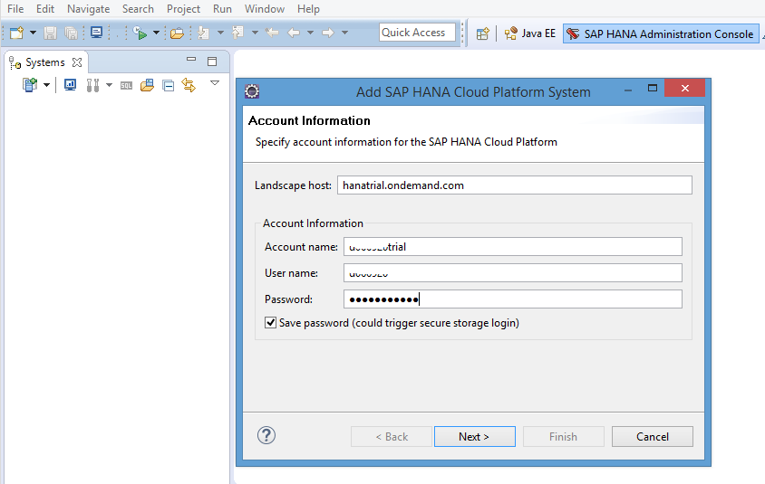

    If you are confused about the account name and user name, you can go to [SAP Cloud Platform Cockpit](https://account.hanatrial.ondemand.com/) and there you can see your account name on the tile and if you click on it, then in the URL. The user name is the same name, just without the "trial" part.

5. Choose your tenant database, which you've already created and enter the database user name **SYSTEM** and password you specified when you created this database. Then choose **Finish**.

    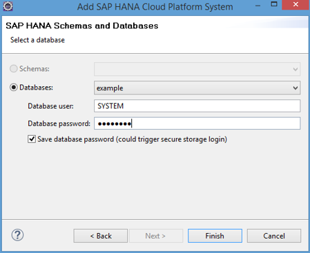

    Now your Cloud System is added and you can see it right there:

    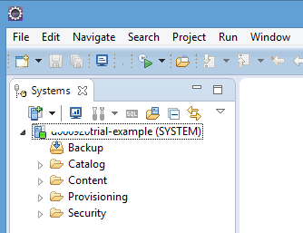


### Download SHINE DU & Manage Roles and Users

1. Go to [GitHub-SHINE](https://github.com/SAP/hana-shine) and download the SHINE Delivery Unit. Just click on **Clone or download** and choose **Download ZIP**. Don't forget to export the zip file.

    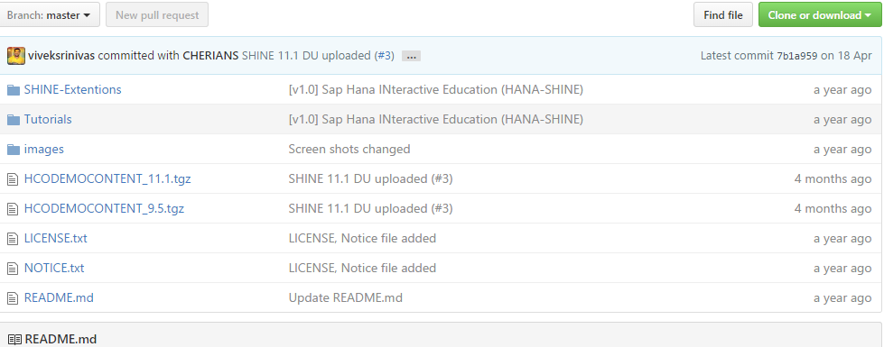

2. Create another database user.
    Go to your [SAP Cloud Platform Cockpit](https://account.hanatrial.ondemand.com/), then **Persistence > Databases & Schemas** and open your tenant database. Then click on **SAP HANA Cockpit** and enter your **SYSTEM** database user name and password.
3. From the **SAP HANA Database Administration** page, choose **Manage Roles and Users**.

    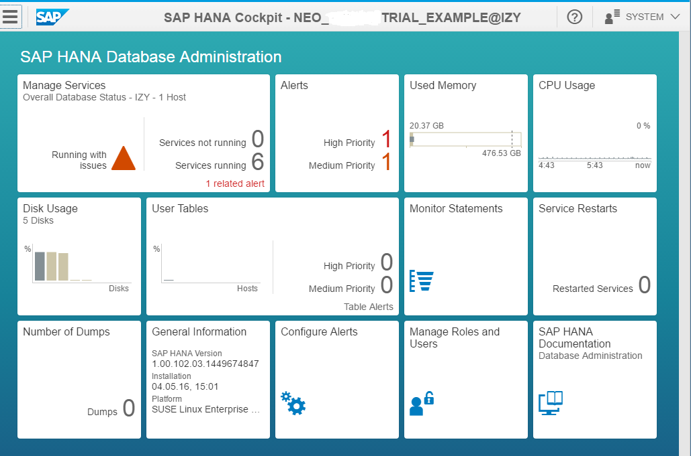

4. From the **Users** context menu, choose **New User**.

5. Enter a username, for example, **`SHINE_DEV`**, specify a password and assign the following roles to this user:

    ```
    sap.hana.admin.roles::Administrator
    sap.hana.xs.lm.roles::Administrator`
    sap.hana.xs.ide.roles::Developer`
    sap.hana.xs.debugger::Debugger`
    CONTENT_ADMIN
    ```

6. Save the changes (after **Save**, the **`PUBLIC`** role is automatically added.)

    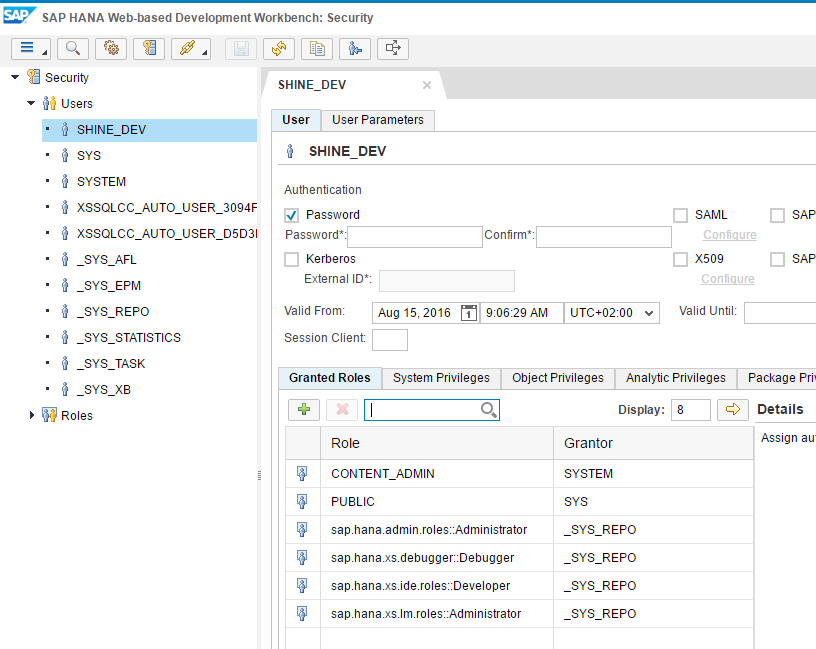

7. Assign the following privilege to this user in the *Object Privileges* tab:

    `GRANT_ACTIVATED_ROLE::EXECUTE`

    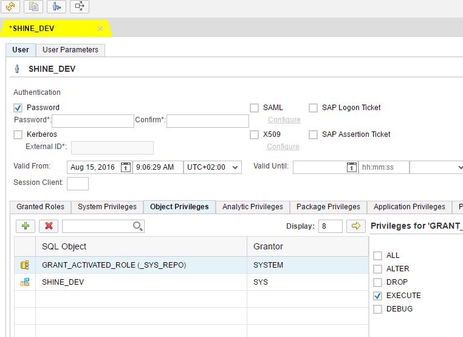

8. Select **EXECUTE** and save again.


### Import the Delivery Unit Using SAP HANA Web-based Development Workbench

1. Log out from the SAP HANA Database Administration and log in again with your **`SHINE_DEV`** user.
  After you type your new username (`SHINE_DEV`) and password, you have to change this password.
2. Choose **`HANA Application Lifecycle Management > Delivery Units`**.
3. Choose **Import** and then browse to the unzipped Delivery Unit you downloaded from GitHub. Locate the **`HCO_DEMOCONTENT_11.1.tgz`** archive and choose **Open**. Then, choose **Import**. Save the changes.
4. Go to the SAP HANA Cockpit, log on with `SHINE_DEV` user and assign these roles:

    ```
    sap.hana.democontent.epm.roles::Admin
    sap.hana.democontent.epm.roles::User
    ```


### Import the Delivery Unit Using Eclipse IDE

You can also import Delivery Unit using the Eclipse IDE

1. Open Eclipse and switch to the **SAP HANA Development Console** perspective.
2. Open the **Systems** view and double-click on your tenant database to start it.
3. Open the **Project Explorer** view, right-click on the white field and then choose **`Import > Import > SAP HANA Content > Delivery Unit`** and choose **Next**.

    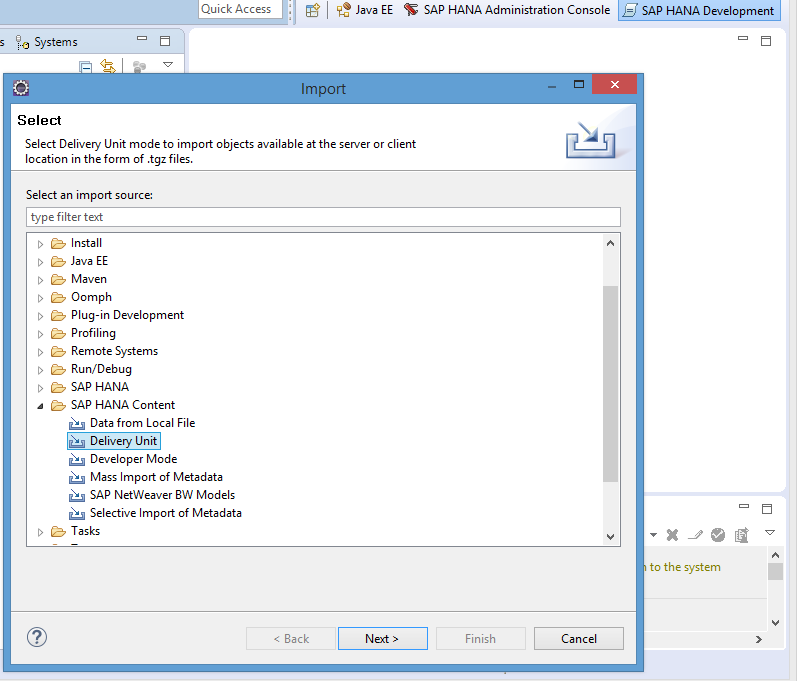

4. Select your tenant database and choose **Next**.
5. Select the **Client** radio button and browse to the **`HCO_DEMOCONTENT_11.1.tgz`** archive and choose **Open**. Then, choose **Finish**.

    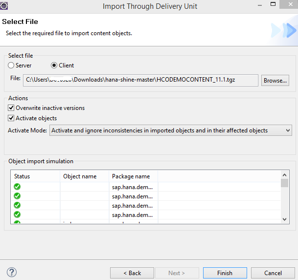

6. You can check that the import is in status **Running**.

    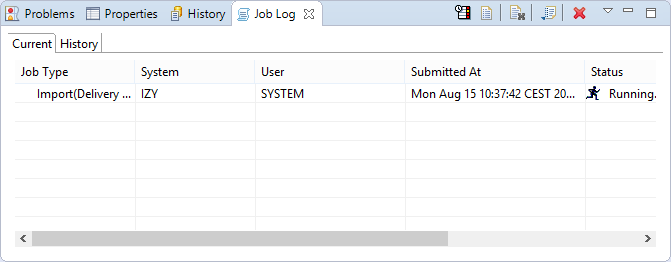

    >Note: In the end, the status should be **completed successfully** even if it is **completed with errors** that shouldn't be a problem. The Delivery Unit is still imported.

    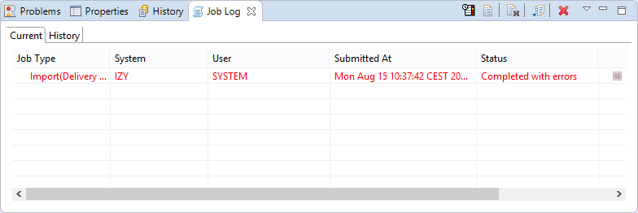

7. **Refresh** the Delivery Unit in HANA Application Lifecycle Management to check that the **`HCO_DEMOCONTENT_11.1.tgz`** archive is there. This means that the SHINE application is successfully imported.

    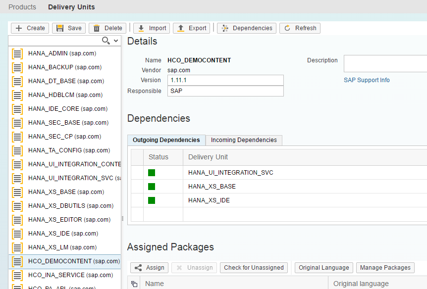

8. Go to the SAP HANA Cockpit, log on with the `SHINE_DEV` user and assign these roles and save the changes:

    ```
    sap.hana.democontent.epm.roles::Admin
    sap.hana.democontent.epm.roles::User
    ```

    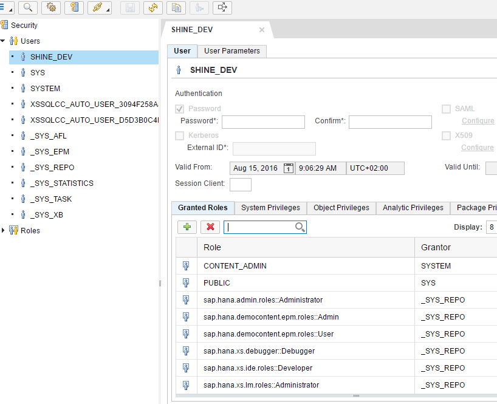


### Edit the Code and Run the Application

1. Go to your [SAP Cloud Platform Cockpit](https://account.hanatrial.ondemand.com/), then *Persistence > Database & Schemas* and open your tenant database. Then click on *SAP HANA Web-based Development Workbench.*
2. Select *Editor* and enter your **`SHINE_DEV`** database user name and password.
3. Select **`sap > hana > democontent > epm > index.html`**

    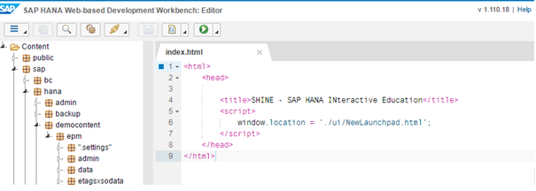

    There we have an index file. With this file you can work on the code, change and save them again.

    If you want to run your application, click the green run button above. Then you can see the Launchpad for your application.

    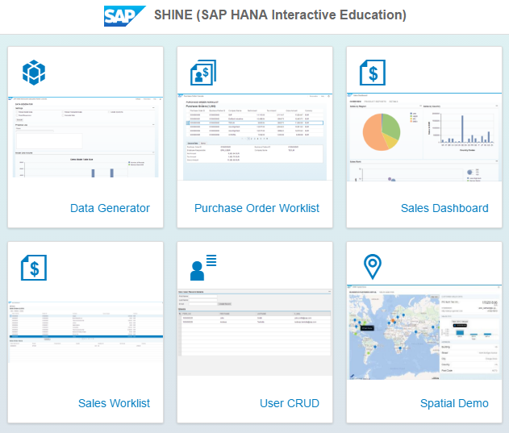


### Export the Delivery Unit

1. Go to your [SAP Cloud Platform Cockpit](https://account.hanatrial.ondemand.com/), then *Persistence > Database & Schemas* and open your tenant database. Then click on **SAP HANA Cockpit**.
2. Enter your **`SHINE_DEV`** database user name and password.
3. Choose **`HANA Application Lifecycle Management > Delivery Units > HCO_DEMOCONTENT`**
4. Select the **Export** button above.
5. Choose your file format and select **export**.

    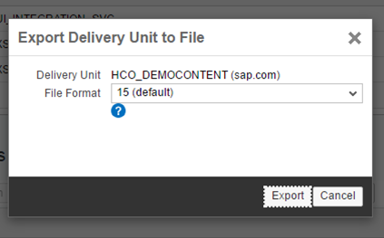
