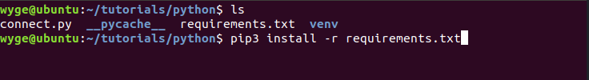
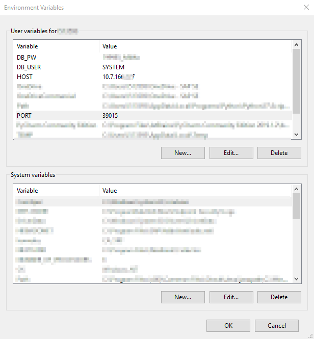

## Prerequisites
- A running SAP HANA database instance and credentials of a database user.
- Familiarity with Python.

## Details
### You will learn
  - How to install the SAP HANA client driver for Python
  - How to install the client driver using a virtual environment (optional)
  - How to connect to an instance of SAP HANA
  - How to use environment variables to provide connection parameters

We recommend using [virtual environments](https://docs.python.org/3/library/venv.html) to localize your Python runtime environment. If you choose to use virtual environments, you can find a guide on using virtual environments [here](https://packaging.python.org/tutorials/installing-packages/#creating-virtual-environments).

---

[ACCORDION-BEGIN [Step 1: ](Install the hdbcli dependency)]
[OPTION BEGIN [Virtual Environment]]

Create a virtual environment to localize dependencies:

```Shell
python -m venv venv
```

Activate the virtual environment:

```Shell
source ./venv/bin/activate
```

After activating the virtual environment, you should see `(venv)` in front of your Linux user in your bash shell. For example:


If you're on Windows:

```cmd
.\venv\Scripts\activate
```


Create a dependency file and name it `requirements.txt`:

```requirements.txt
hdbcli
### add other dependencies below ###
```

Install the dependencies:

```Shell
pip install -r requirements.txt
```



The dependencies will be saved in your `venv` directory.
[OPTION END]

[OPTION BEGIN [Unix]]
Install the `hdbcli` package:

```Shell
pip install hdbcli
```
[OPTION END]

[OPTION BEGIN [Windows]]
Install the `hdbcli` package:

```cmd
pip install hdbcli
```
[OPTION END]

You should see the following after installing the client:

```Shell
Installing collected packages: hdbcli
Successfully installed hdbcli-2.x.xxx
```

[DONE]
[ACCORDION-END]

[ACCORDION-BEGIN [Step 2: ](Establish a test connection)]
To establish a simple connection to SAP HANA, you need the following information:

- Database host
- Database port
- Database user
- Password


```Python
#connect.py

#Import your dependencies
from hdbcli import dbapi
#Initialize your connection
conn = dbapi.connect(
    address='<Database host>',
    port='<Database port>',
    user='<Database user>',
    password='<Password>'
)
#If no errors, print connected
print('connected')

### rest of your code here ###

```

>You should never have database information directly in your code; you are only doing this for a connection test.

Run the file with:

```Shell
python3 connect.py
```

If the connection information used is correct, you should see the following printed in your shell:

```Shell
connected
```

[DONE]
[ACCORDION-END]

[ACCORDION-BEGIN [Step 3: ](Hide sensitive connection parameters)]
[OPTION BEGIN [Unix]]  

Now that you've successfully connected to the database, we need to take out connection parameters and credentials out of the source code. Having connection parameters directly in your source code is insecure, one option is to provide these parameters at runtime as environment variables instead.

Export your environment variables to your bash profile through your preferred method.

```Bash
export HOST="<Database Host>"
export PORT="<Database Port>"
export DB_USER="<Database User>"
export DB_PW="<Password>"
```

We'll use the `os` package in Python to access these environment variables to connect.

```Python
from hdbcli import dbapi
import os

conn = dbapi.connect(
    address=os.environ['HOST'],
    port=os.environ['PORT'],
    user=os.environ['DB_USER'],
    password=os.environ['DB_PW']
)

print('connected')

#test select from dummy table
cursor = conn.cursor()
cursor.execute("SELECT * FROM DUMMY")
for result in cursor:
    print(result)

```
[OPTION END]

[OPTION BEGIN [Windows]]
>It isn't recommended to deploy a production application of this type on Windows.

Export your environment variables

- Database host
- Database port
- Database user
- Password



We'll use the `os` package from Python to access these user environment variables.

```Python
from hdbcli import dbapi
import os

conn = dbapi.connect(
    address=os.getenv('HOST'),
    port=os.getenv('PORT'),
    user=os.getenv('DB_USER'),
    password=os.getenv('DB_PW')
)

print('connected')

#test select from dummy table
cursor = conn.cursor()
cursor.execute("SELECT * FROM DUMMY")
for result in cursor:
    print(result)
```
[OPTION END]

Test run the Python file again with:

```Shell
python connect.py
```

[VALIDATE_1]
[ACCORDION-END]
---
