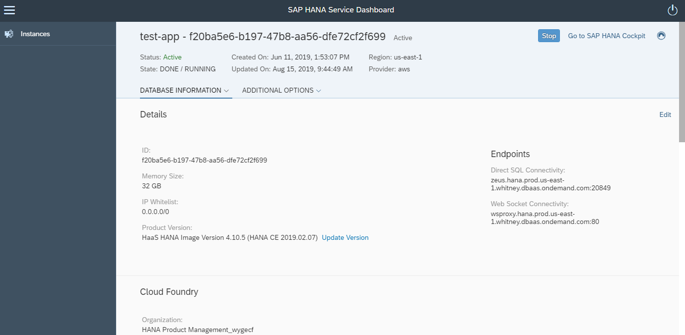
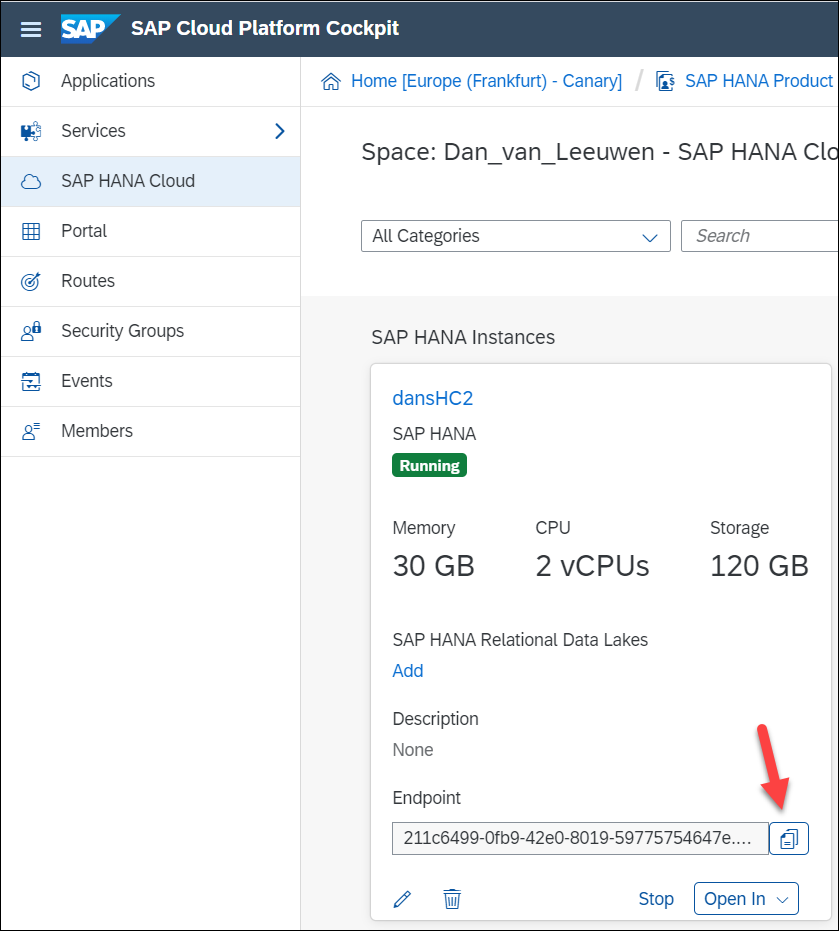
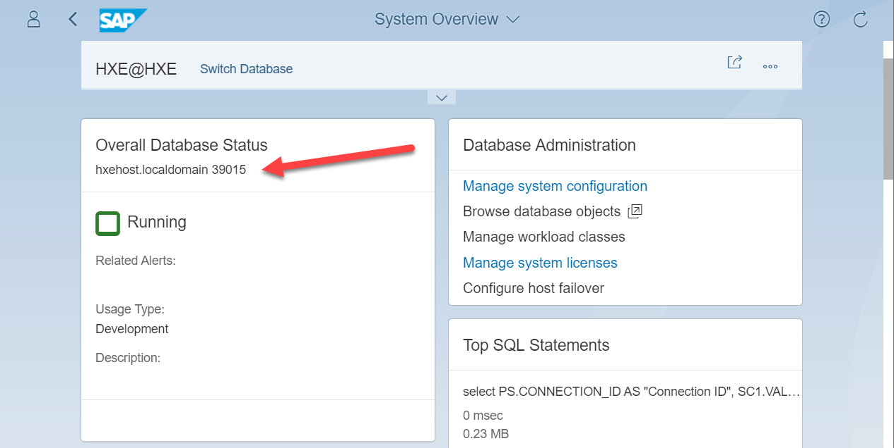
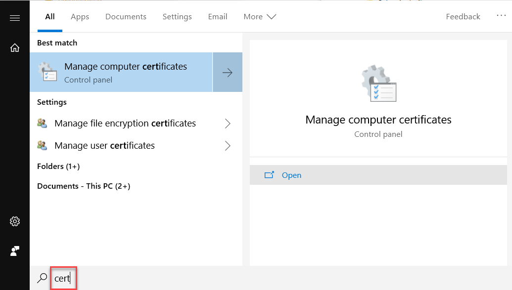
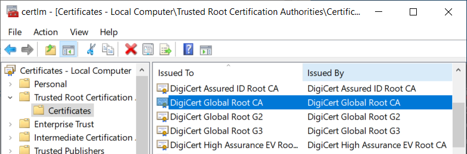
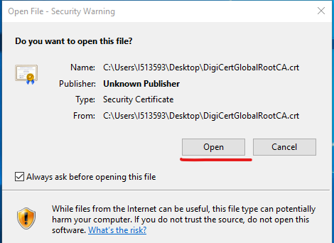
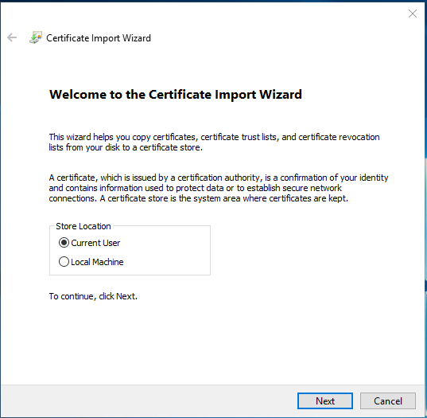
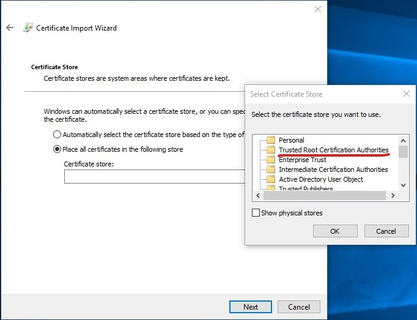
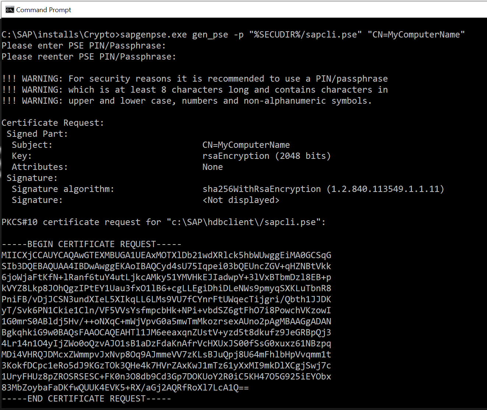
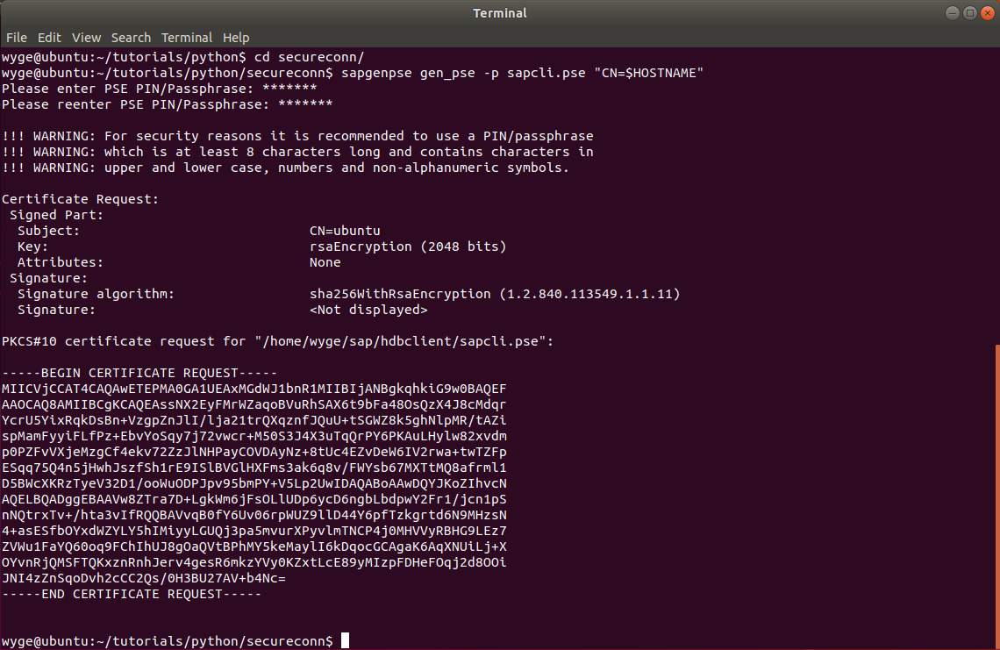

## Prerequisites
- Install required clients through the [SAP HANA Client Installation and Update Guide](https://help.sap.com/viewer/e7e79e15f5284474b965872bf0fa3d63/latest/en-US).
- An SAP HANA instance
- Python 3 installed

## Details
### You will learn
  - How to securely connect to SAP HANA using `mscrypto` on Windows
  - How to securely connect to SAP HANA using OpenSSL on Mac or Linux
  - How to securely connect to SAP HANA using the SAP Common Crypto Library on Windows, Mac, or Linux

If you have not used the SAP HANA client for Python, check out the [Connect to SAP HANA Using Python](hana-python-basic-connection) tutorial.

---

[ACCORDION-BEGIN [Step 1: ](Find connection parameters to SAP HANA)]

The following information is needed to connect to SAP HANA:

  - SAP HANA host name and port
  - Database username and password

There are multiple ways to gather this information depending on which version of HANA you are using.  

If you are using HANA as a Service, you can find endpoint information in the SAP HANA Service Dashboard.  



If you are using HANA Cloud, you can find the endpoint information in the SAP Cloud Platform Cockpit.  

  

If you are using [SAP HANA, express edition](https://help.sap.com/viewer/product/SAP_HANA,_EXPRESS_EDITION/latest/en-US), the host and port by default are `hexehost` and 39015.  




[VALIDATE_2]
[ACCORDION-END]

[ACCORDION-BEGIN [Step 2: ](Test connection parameters without validating the server certificate)]

Before proceeding, test out the connection parameters.  Knowing that these parameters are correct can make debugging in the coming steps much easier.

Use the following code and substitute in your connection parameters.

```Python
from hdbcli import dbapi

conn = dbapi.connect(
    address="<host name>",
    port=<port>,
    user="<username>",
    password="<password>",
#   cryptographic providers
#   sslCryptoProvider='openssl',        #default for Linux/Mac
#   sslCryptoProvider='mscrypto',       #default for Windows
#   sslCryptoProvider='commoncrypto',   #SAP Common Crypto Library

#   OpenSSL trust store location containing the CA cert that signed the HANA server's cert
#   sslTrustStore='/home/<username>/.ssl/trust.pem',

#   sslKeyStore='C:\SAP\hdbclient\sapcli.pse',  #commoncrypto
#   sslKeyStore='/home/<username>/sap/hdbclient/sapcli.pse',

    ENCRYPT=True,
    sslValidateCertificate=False
)


with conn.cursor() as cursor:
    sql = "SELECT SYSTEM_ID, DATABASE_NAME, VERSION FROM M_DATABASE"
    cursor.execute(sql)
    result = cursor.fetchall()
print("Connection to SAP HANA Service successful.")
print("SID =", result[0][0])
print("Database Name =", result[0][1])
print("Version =", result[0][2])
conn.close()
```  

> You've disabled `sslValidateCertificate` temporarily to restrict scope and test
 other connection parameters. **Don't do this in production.**

Let's briefly discuss the connection parameters. To connect to a SAP HANA as a Service or HANA Cloud instance you must specify `ENCRYPT=True` in your connection parameters to enable TLS  encryption as these services do not allow unencrypted connections.  Different cryptographic providers are available depending on the platform.  Windows uses `mscrypto` by default and can be configured to use `commoncrypto`.  Linux and Mac use `openssl` by default and can be configured to use `commoncrypto`.  

 `sslValidateCertificate=False` indicates to not validate the certificate authority that signed the database's certificate.  On Windows, the certificate authority's public certificate should be available so this can be optionally set to True.  
For additional details see the [Encrypted Communication](https://help.sap.com/viewer/cc53ad464a57404b8d453bbadbc81ceb/Cloud/en-US/5bd9bcec690346a8b36df9161b1343c2.html) section of the documentation titled Connecting to an SAP HANA Service Instance Directly from SAP HANA Clients.  
For additional details on the connection parameters see [Connect Method and Python Connection Properties](https://help.sap.com/viewer/0eec0d68141541d1b07893a39944924e/latest/en-US/ee592e89dcce4480a99571a4ae7a702f.html).  

If you run the code in the current state, you'll see something similar to the output below.  

```
python pythonQuery.py
Connection to SAP HANA Service successful.
SID = H00
Database Name = H00
Version = 2.00.040.00.1554459575
```

> On a Mac, if you encounter an issue where the crypto library is not loading, then this article [Python crashing on MacOS 10.15 Beta](https://stackoverflow.com/questions/58272830/python-crashing-on-macos-10-15-beta-19a582a-with-usr-lib-libcrypto-dylib) may help.  


[DONE]
[ACCORDION-END]

[ACCORDION-BEGIN [Step 3: ](Set up certificate validation)]
With the `sslValidateCertificate` parameter set to True, the SAP HANA client attempts to validate the server's certificate when connecting.  To do so, the client needs to have access to the root certificate of the certificate authority that signed the server's certificate.  

If it is not already set to True, change the `sslValidateCertificate` parameter True.

If you run your code now, you may see something similar to the output below.  Note that when connecting to HANA as a Service on Windows, the certificate authority's root certificate is installed by default and available to the SAP HANA Client.

```
Traceback (most recent call last):
  File "secure_conn.py", line 8, in <module>
    ENCRYPT=True
hdbcli.dbapi.Error: (-10709, 'Connection failed (RTE:[300010]
  Cannot create SSL context:   SSL trust store cannot be found:
  /home/userX/.ssl/trust.pem (zeus.SAP HANA.prod.us-east-1.whitney.dbaas.ondemand.com:208xx))')
```

If you see this error, specify where to find the root certificate from the certificate authority that signed the database server's certificate.  For SAP HANA as a Service, the certificate authority is [DigiCert](https://www.digicert.com/digicert-root-certificates.htm).

The process differs between Windows and Mac/Linux.

[OPTION BEGIN [Windows]]
Check to see if the `DigiCert Global Root CA` is installed on Windows.  

  

  

If it isn't, download [DigiCertGlobalRootCA.crt](https://dl.cacerts.digicert.com/DigiCertGlobalRootCA.crt) and then right-click to install it.  


If you see a security warning, click **Open**.  



You can install the certificate for current user or the local machine.  



Install the certificate under **Trusted Root Certificate Authorities**.  



Complete installing by clicking Finish.  


After installing the certificate and enabling SSL certificate validation you should see something similar to the output below.

```
python pythonQuery.py
Connection to SAP HANA Service successful.
SID = H00
Database Name = H00
Version = 2.00.040.00.1554459575
```

To specify an encryption provider, the parameter below can be used.  Note the default value is `mscrypto` on Windows.  In the next section, this will be changed to use the SAP Common Crypto Library.

```
sslCryptoProvider='mscrypto',
```


[OPTION END]

[OPTION BEGIN [Mac or Linux]]

Download [DigiCertGlobalRootCA.crt.pem](https://dl.cacerts.digicert.com/DigiCertGlobalRootCA.crt.pem).

Place the file into the location the SAP HANA Client by default looks for certificates as specified in the error message, such as

`/Users/userX/.ssl/trust.pem`

or  

`/home/userX/.ssl/trust.pem`.  

Note you need to rename the file to `trust.pem`.  
Create the folder `.ssl` if it does not already exist.

If you instead have a `.crt` file, it can be converted to a `.pem` file with the command below.

```Shell
openssl x509 -inform der -in DigiCertGlobalRootCA.crt -out trust.pem
```

After placing the certificate in the default location, the output should now be as below.

```
Connection to SAP HANA Service successful.
SID = H00
Database Name = H00
Version = 2.00.040.00.1554459575
```

If you want to use a custom path for your certificate, the following parameter can be used.

```
sslTrustStore='<Path to certificate>'
```

To specify an encryption provider, the parameter below can be used.  Note the default value is `openssl` on Mac and Linux.  In the next section, this will be changed to use the SAP Common Crypto Library.

```
sslCryptoProvider='openssl'
```

[OPTION END]

[DONE]

[ACCORDION-END]

[ACCORDION-BEGIN [Step 4: ](Use the SAP Common Crypto Library (optional) )]

The SAP Common Crypto Library provides another library that can be used to securely connect to HANA.  Additionally, it is required for LDAP authentication or client-side encryption.  This tutorial serves as a general overview for using this library.  See also [Configuring the Client for Client-Side Encryption and LDAP](https://help.sap.com/viewer/0eec0d68141541d1b07893a39944924e/2.0.04/en-US/34712c46d7104a2d91ed2f10c66bbc9e.html).

The following steps describe how to use the SAP Common Crypto Library instead of OpenSSL or Windows-provided software.

>Make sure you've installed the SAP HANA Clients from the [SAP Software Downloads](https://support.sap.com/en/my-support/software-downloads.html) as opposed to [SAP Development Tools](https://tools.hana.ondemand.com/#hanatools).  The version downloaded from SAP Software Downloads uses a different license and contains additional cryptographic libraries.  If you are unsure which version you have, the `manifest.mf` file in the SAP HANA Client install can be consulted.  If it says `keycaption: SAP HANA CLIENT W/O CRYPTO` you should download a new version that includes cryptographic libraries from SAP Software Downloads.  

A utility named `sapgenpse` is required to generate a `pse` file containing `DigiCertAssuredIDRootCA`.

* Download the SAP CRYPTOGRAPHIC SOFTWARE from [SAP Software Downloads](https://support.sap.com/en/my-support/software-downloads.html) which contains the `sapgenpse` tool.  
* Choose Installation and Upgrades.  
* Choose By Alphabetical Index.  
* Choose C.  
* Choose SAP CRYPTOGRAPHIC SOFTWARE.  
* Choose SAPCRYPTOLIB.  
* Choose COMMONCRYPTOLIB 8.  
* Choose the appropriate platform and download.  
* Extract the SAR file using the SAPCAR utility (also available from SAP Software Downloads).

```Shell
SAPCAR -xvf SAPCRYPTOLIBP_8530-20011729.SAR
```

Move or copy the extracted files into the `hdbclient` folder which will be added to the path with the following step.


[OPTION BEGIN [Windows]]

The following script should be run which adds the HANA client folder to the PATH and creates an environment variable named `SECUDIR`.  

```Shell
c:\sap\hdbclient\hdbclienv.bat
```

After running the script, the SAP HANA client install directory is in the path and an environment variable named SECUDIR is set.

```Shell
echo %SECUDIR%
c:\SAP\hdbclient\
```

Use the following command to generate a `keystore`.  Note, additional details can be seen by adding the -log option.  

```Shell
sapgenpse gen_pse -p "%SECUDIR%/sapcli.pse" "CN=MyComputerName"
```

>This tutorial only provides a CN or Common Name as an LDAP parameter but the Common Crypto Library implements the full `LDAPv3` standard.  Full identification parameters are beyond the scope of this tutorial.

Do not provide a pin as a `pse` protected by a pin is not supported.  



Next, add the root certificate to the keystore just generated.

```Shell
sapgenpse maintain_pk -p "%SECUDIR%/sapcli.pse" -a "C:\Users\userX\Downloads\DigiCertGlobalRootCA.crt"
```

You can double-check if your root certificate has been added with the following command:

```Shell
sapgenpse maintain_pk -p "%SECUDIR%/sapcli.pse% -l
```

[OPTION END]


[OPTION BEGIN [Mac or Linux]]

The following script should be run which adds the HANA client folder to the PATH and creates an environment variable named `SECUDIR`.  

```Shell
source ~/sap/hdbclient/hdbclienv.sh
```

After running the script, the SAP HANA client install directory is added to the path and an environment variable named SECUDIR is set.

```Shell
echo $SECUDIR
/home/userX/sap/hdblient
```

Note, the source command above is used to make changes to the current shell.  For further information see [script sourcing](https://superuser.com/questions/176783/what-is-the-difference-between-executing-a-bash-script-vs-sourcing-it).

Next you need to generate a keystore. You can do so with the command:

```Shell
sapgenpse gen_pse -p "$SECUDIR/sapcli.pse" "CN=$HOSTNAME"
```

>This tutorial only provides a CN or Common Name as an LDAP parameter but the Common Crypto Library implements the full `LDAPv3` standard.  Full identification parameters are beyond the scope of this tutorial.

Do not provide a pin as a `pse` protected by a pin is not supported.  



Now you'll want to add your root certificate to the keystore you just generated. For this, run the command:

```Shell
sapgenpse maintain_pk -p "$SECUDIR/sapcli.pse" -a ~/.ssl/trust.pem
```

You can double-check if your root certificate has been added with the following command:

```Shell
sapgenpse maintain_pk -p "$SECUDIR/sapcli.pse" -l
```


[OPTION END]

You are now ready to use the SAP Common Crypto Library instead of OpenSSL.  
Change the `sslCryptoProvider` to be `commoncrypto`and run the test app.  
Optionally, the location for the `sapcli.pse` file can be specified via the `sslKeyStore` setting.  

```Shell
python pythonQuery.py
```

You have now connected securely to HANA using multiple cryptographic providers.  

[DONE]

[ACCORDION-END]

---
