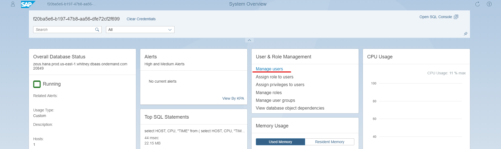
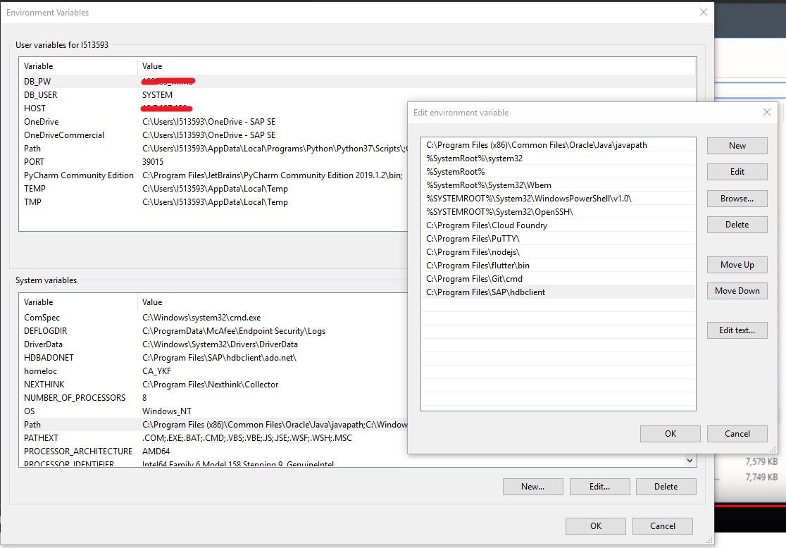
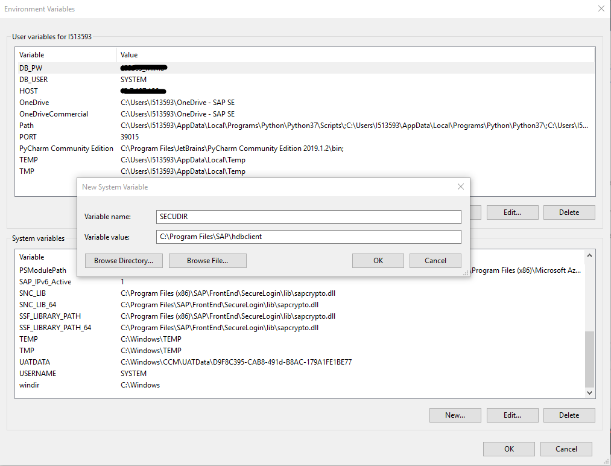
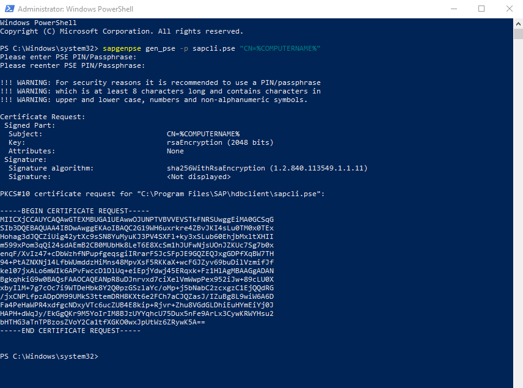
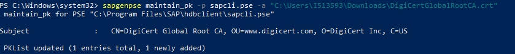

## Prerequisites
- Install required clients through the [SAP HANA Client Installation and Update Guide](https://help.sap.com/viewer/e7e79e15f5284474b965872bf0fa3d63/2.0.04/en-US)
- A SAP HANA as a Service instance
- Python 3 Installed
- OpenSSL Installed

## Details
### You will learn
  - Securely connect to SAP HANA as a Service using OpenSSL
  - Securely connect to SAP HANA as a Service using the Common Crypto Library

---

>If you've never used the SAP HANA client for Python, I suggest checking out the Connecting to SAP HANA Using Python tutorial.

[ACCORDION-BEGIN [Step 1: ](Finding connection parameters to your SAP HANA as a Service)]

You will need the following information to connect to `SAP HANA as a Service`:

  - Database Direct SQL Connectivity endpoint address and port
  - Preferred database username and password

You can find endpoint information on SAP HANA Service Dashboard:


If you don't have a database user setup on your `SAP HANA as a Service` instance, you can setup a database user on your SAP HANA Cockpit:



Hold on to these pieces of information, you'll need them again later.

[VALIDATE_2]
[ACCORDION-END]

[ACCORDION-BEGIN [Step 2: ](Test connection parameters without validating server certificates)]

You want to test the connection parameters you will use for your SAP HANA as a Service instance before moving forward. Knowing that these parameters are correct will make debugging in the coming steps much easier.

You'll use the following block of code.

```Python
from hdbcli import dbapi

conn = dbapi.connect(
    address="<address>",
    port=<port>,
    user="<username>",
    password='<password>',
    ENCRYPT=True,
    sslValidateCertificate=False
)
with conn.cursor() as cursor:
    sql = "SELECT SYSTEM_ID, DATABASE_NAME, VERSION FROM M_DATABASE"
    cursor.execute(sql)
    result = cursor.fetchall()
print("Connection to SAP HANA Service successful.")
print("SID =", result[0][0])
print("Database Name =", result[0][1])
print("Version =", result[0][2])
conn.close()
```

> You've disabled `sslValidateCertificate` temporarily to restrict scope and test
 other connection parameters. Don't do this in production.

Let's briefly discuss the connection parameters. To connect to a `SAP HANA as a Service` instance you must specify `ENCRYPT=True` in your connection parameters to enable encryption.

`SAP HANA as a Service` has restricted network traffic to only allow encrypted traffic. You will also want to specify `sslValidateCertificate=False` for now, since you haven't setup root CA certificates locally.

If you run the code in the current state, you'll see something similar to this  
 output:
```
Connection to SAP HANA Service successful.
SID = H00
Database Name = H00
Version = 2.00.040.00.1554459575
```

[DONE]
[ACCORDION-END]

[ACCORDION-BEGIN [Step 3: ](Setting up certificate validation)]
You want to validate your `SSL/TSL` certificates when connecting to `SAP HANA as a Service` for security reasons. This prevents network traffic between your client and the SAP HANA database from being altered by third parties.

To do this you want to specify `sslValidateCertificate=True`.

If you run your code now, you may see something similar to this:

```
Traceback (most recent call last):
  File "secure_conn.py", line 8, in <module>
    ENCRYPT=True
hdbcli.dbapi.Error: (-10709, 'Connection failed (RTE:[300010] Cannot create SSL context: SSL trust store cannot be found: /home/wyge/.ssl/trust.pem (zeus.SAP HANA.prod.us-east-1.whitney.dbaas.ondemand.com:20849))')
```

If you see this error, you will need to setup your "trusted root certification authorities" locally. A certificate root authority allows your client to validate the certificate presented by your `SAP HANA as a Service` instance during communication. For `SAP HANA as a Service`, you'll rely on the [`DigiCert` Global Root CA](https://dl.cacerts.digicert.com/DigiCertGlobalRootCA.crt).

The process for installing this certificate is different between Unix based operating systems and Windows.

[OPTION BEGIN [Windows]]
Once you obtain [DigiCertGlobalRootCA.crt](https://dl.cacerts.digicert.com/DigiCertGlobalRootCA.crt), you can right click to install it.


If you see a security warning, click open.


You can install the certificate for current user or the local machine.


Install the certificate under `Trusted Root Certificate Authorities`.


Complete installing by clicking import.


After installing the correct certificates and enabling SSL certificate validation, you can run the code in the current state, you'll see something similar this output:

```
Connection to SAP HANA Service successful.
SID = H00
Database Name = H00
Version = 2.00.040.00.1554459575
```

Your code should look like this

```Python
from hdbcli import dbapi

conn = dbapi.connect(
    address="<address>",
    port=<port>,
    user="<username>",
    password='<password>',
    ENCRYPT=True,
    sslValidateCertificate=True
)
with conn.cursor() as cursor:
    sql = "SELECT SYSTEM_ID, DATABASE_NAME, VERSION FROM M_DATABASE"
    cursor.execute(sql)
    result = cursor.fetchall()
print("Connection to SAP HANA Service successful.")
print("SID =", result[0][0])
print("Database Name =", result[0][1])
print("Version =", result[0][2])
conn.close()
```

[OPTION END]

[OPTION BEGIN [Unix]]

Once you obtain [DigiCertGlobalRootCA.crt](https://dl.cacerts.digicert.com/DigiCertGlobalRootCA.crt), you will want to convert this to the `.pem` format.

Copy the `DigiCertGlobalRootCA.crt` file to `~/.ssl/`.

You'll now use OpenSSL to install the certificate. Make sure you have OpenSSL installed.

```shell
openssl x509 -inform der -in DigiCertGlobalRootCA.crt  -out trust.pem
```

The results should be similar to this:

```shell
wyge@ubuntu:~/.ssl$ ls
DigiCertGlobalRootCA.crt
wyge@ubuntu:~/.ssl$ openssl x509 -inform der -in DigiCertGlobalRootCA.crt  -out trust.pem
wyge@ubuntu:~/.ssl$ ls
DigiCertGlobalRootCA.crt  trust.pem
wyge@ubuntu:~/.ssl$
```

This installs the certificate to the default location referenced by the client.

After installing the correct certificates and enabling SSL certificate validation, you can run the code in the current state, you'll see something similar to this output:

```
Connection to SAP HANA Service successful.
SID = H00
Database Name = H00
Version = 2.00.040.00.1554459575
```

Your code should look like this:

```Python
from hdbcli import dbapi

conn = dbapi.connect(
    address="<address>",
    port=<port>,
    user="<username>",
    password='<password>',
    ENCRYPT=True,
    sslValidateCertificate=True
)
with conn.cursor() as cursor:
    sql = "SELECT SYSTEM_ID, DATABASE_NAME, VERSION FROM M_DATABASE"
    cursor.execute(sql)
    result = cursor.fetchall()
print("Connection to SAP HANA Service successful.")
print("SID =", result[0][0])
print("Database Name =", result[0][1])
print("Version =", result[0][2])
conn.close()
```

If you want to use a custom path for your certificate, do the following:

```Python
from hdbcli import dbapi

conn = dbapi.connect(
    address="<address>",
    port=<port>,
    user="<username>",
    password='<password>',
    ENCRYPT=True,
    sslValidateCertificate=True,
    sslCryptoProvider='openssl',
    sslTrustStore='<Path to certificate>'
)
with conn.cursor() as cursor:
    sql = "SELECT SYSTEM_ID, DATABASE_NAME, VERSION FROM M_DATABASE"
    cursor.execute(sql)
    result = cursor.fetchall()
print("Connection to SAP HANA Service successful.")
print("SID =", result[0][0])
print("Database Name =", result[0][1])
print("Version =", result[0][2])
conn.close()
```

Specify your encryption provider here, in your case openSSL :`sslCryptoProvider='openssl'`.

Specify your custom path to your certificate `.pem` file: `sslTrustStore='<Path to certificate>'`.

[OPTION END]

[DONE]

[ACCORDION-END]

[ACCORDION-BEGIN [Step 4: ]((Optional) Using the "SAP Common Crypto Library")]

>This part of the tutorial is a bit more advanced, if you simply want to connect to a `SAP HANA as a Service` instance, you don't have to use `Common Crypto`. This tutorial serves as a general overview for using the `Common Crypto` Library. We assume you will have a good understanding of what it is and why you will need to use it.

If you wish to use "SAP Common Crypto Library" instead of OpenSSL or Windows provided software, there are some small tweaks you need to make.

[OPTION BEGIN [Windows]]

>Make sure you've installed the SAP HANA Clients mentioned in the "Prerequisites" section. You can validate your installation by attempting the command: ```hdbsql```

First we need your SAP client installation directory. For me it's `C:\Program Files\SAP\hdbclient`

We need to export this as `SECUDIR` and as a Path Variable.





Now open an administrator `PowerShell` or `Command Prompt` and use the following command to generate a `keystore`.

```
sapgenpse gen_pse -p sapcli.pse "CN=%COMPUTERNAME%"
```

>This tutorial only provides a `CN` or "Common Name" as an `LDAP` parameter but the `Common Crypto` Library implements the full [LDAPv3](https://ldapwiki.com/wiki/Distinguished%20Names) standard. You will want to provide full identification parameters and properly sign your `ketstore`, but this is beyond the scope of this tutorial.

You'll be asked to provide a pin, but you'll leave the pin empty for now. You should see something like this:



>If you do decide to provide a pin you can use the parameter `clientside_encryption_keystore_password` in the Python client's connection parameters. This option is required when using client-side encryption. Passwords must be at least eight characters and have at least one upper case character, one lower case character, and one number.

Now you'll want to add your root certificate to the keystore you just generated. For this, run the command:

```
sapgenpse maintain_pk -p sapcli.pse -a "C:\Users\I513593\Downloads\DigiCertGlobalRootCA.crt"
```



Now you can update your code to use your `.pem keystore`

``` Python
from hdbcli import dbapi

conn = dbapi.connect(
    address="<address>",
    port=<port>,
    user="<username>",
    password='<password>',
    ENCRYPT=True,
    sslValidateCertificate=True,
    sslCryptoProvider='commoncrypto',
    sslKeyStore='<Path to keystore>'
)
with conn.cursor() as cursor:
    sql = "SELECT SYSTEM_ID, DATABASE_NAME, VERSION FROM M_DATABASE"
    cursor.execute(sql)
    result = cursor.fetchall()
print("Connection to SAP HANA Service successful.")
print("SID =", result[0][0])
print("Database Name =", result[0][1])
print("Version =", result[0][2])
conn.close()
```

[OPTION END]


[OPTION BEGIN [Unix]]

>Make sure you've installed the SAP HANA Clients mentioned in the "Prerequisites" section. You can validate your installation by attempting the command: ```hdbsql```

First you need to generate a `keystore`. You can do so with the command:

```
sapgenpse gen_pse -p sapcli.pse "CN=$HOSTNAME"
```

>This tutorial only provides a `CN` or "Common Name" as an `LDAP` parameter but the `Common Crypto` Library implements the full [LDAPv3](https://ldapwiki.com/wiki/Distinguished%20Names) standard. You will want to provide full identification parameters and properly sign your `ketstore`, but this is beyond the scope of this tutorial.

You'll be asked to provide a pin, but you'll leave the pin empty for now. You should see something like this:


>If you do decide to provide a pin you can use the parameter `clientside_encryption_keystore_password` in the Python client's connection parameters. This option is required when using client-side encryption. Passwords must be at least eight characters and have at least one upper case character, one lower case character, and one number.

Now you'll want to add your root certificate to the keystore you just generated. For this, run the command:

```
sapgenpse maintain_pk -p sapcli.pse -a ~/.ssl/DigiCertGlobalRootCA.pem
```

You should see the following outputted:

```
wyge@ubuntu:~/tutorials/Python/secureconn$ sapgenpse maintain_pk -p sapcli.pse -a ~/.ssl/DigiCertGlobalRootCA.pem
Please enter PSE PIN/Passphrase: *******
 maintain_pk for PSE "/home/wyge/sap/hdbclient/sapcli.pse"
----------------------------------------------------------------------------
Subject               :   CN=DigiCert Global Root CA, OU=www.digicert.com, O=DigiCert Inc, C=US

 PKList updated (1 entries total, 1 newly added)

```

You can double check if your root certificate has been added with the following command:

```
sapgenpse maintain_pk -p sapcli.pse -l
```

```
wyge@ubuntu:~/tutorials/Python/secureconn$ sapgenpse maintain_pk -p sapcli.pse -l
Please enter PSE PIN/Passphrase: *******
 maintain_pk for PSE "/home/wyge/sap/hdbclient/sapcli.pse"
PKList:
 Version:                              3
 Subject:                              CN=DigiCert Global Root CA, OU=www.digicert.com, O=DigiCert Inc, C=US
 Issuer:                               CN=DigiCert Global Root CA, OU=www.digicert.com, O=DigiCert Inc, C=US
 Serial Number:                        08:3B:E0:56:90:42:46:B1:A1:75:6A:C9:59:91:C7:4A
 Validity not before:                  Thu Nov  9 16:00:00 2006 (061110000000Z)
 Validity not after:                   Sun Nov  9 16:00:00 2031 (311110000000Z)
 Public key:                           rsaEncryption (2048 bits)
 Public key fingerprint (MD5):         0F:3A:05:27:D2:42:DE:2D:C9:8E:5C:FC:B1:E9:91:EE
 Signature algorithm:                  sha1WithRsaEncryption (1.2.840.113549.1.1.5)
 Extensions:
  Authority Key Identifier:            03:DE:50:35:56:D1:4C:BB:66:F0:A3:E2:1B:1B:C3:97:B2:3D:D1:55
  Subject Key Identifier:              03:DE:50:35:56:D1:4C:BB:66:F0:A3:E2:1B:1B:C3:97:B2:3D:D1:55
  Key Usage:                           Critical: digitalSignature keyCertSign cRLSign
  Basic Constraints:                   Critical: CA
 Certificate fingerprint (MD5):        79:E4:A9:84:0D:7D:3A:96:D7:C0:4F:E2:43:4C:89:2E
 Certificate fingerprint (SHA1):       A8:98:5D:3A:65:E5:E5:C4:B2:D7:D6:6D:40:C6:DD:2F:B1:9C:54:36
 Certificate fingerprint (SHA256):     43:48:A0:E9:44:4C:78:CB:26:5E:05:8D:5E:89:44:B4:D8:4F:96:62:BD:26:DB:25:7F:89:34:A4:43:C7:01:61
```

If you need help locating the `.pse` file, remember the following command:

```
ls -l $SECUDIR/sapcli.pse
```

The output should be similar to:

```
wyge@ubuntu:~/tutorials/Python$ ls -l $SECUDIR/sapcli.pse
-rw------- 1 wyge wyge 2815 Aug 13 11:31 /home/wyge/sap/hdbclient/sapcli.pse
```


Once these certificates are installed, you're ready modify your code to use Common Crypto instead of OpenSSL.

```
# openSSL
#sslCryptoProvider='openssl',
#sslTrustStore='/home/wyge/.ssl/DigiCertGlobalRootCA.pem'

# Common Crypto code
sslCryptoProvider='commoncrypto',
sslKeyStore='/home/wyge/sap/hdbclient/sapcli.pse'
```

Your code should look like this:

``` Python
from hdbcli import dbapi

conn = dbapi.connect(
    address="<address>",
    port=<port>,
    user="<username>",
    password='<password>',
    ENCRYPT=True,
    sslValidateCertificate=True,
    sslCryptoProvider='commoncrypto',
    sslKeyStore='<Path to keystore>'
)
with conn.cursor() as cursor:
    sql = "SELECT SYSTEM_ID, DATABASE_NAME, VERSION FROM M_DATABASE"
    cursor.execute(sql)
    result = cursor.fetchall()
print("Connection to SAP HANA Service successful.")
print("SID =", result[0][0])
print("Database Name =", result[0][1])
print("Version =", result[0][2])
conn.close()
```

[OPTION END]


The key changes:

```
#user commoncrypto as the crypto provider
sslCryptoProvider='commoncrypto',
#user keystore rather than trust store and provide path to generated PSE
sslKeyStore='<Path to keystore>'
```

For more information about the Common Crypto Library, check out this [blog](https://blogs.sap.com/2019/01/24/sap-SAP HANA-service-secure-client-connections-with-sap-commoncryptolib-by-the-sap-SAP HANA-academy/).

[DONE]

[ACCORDION-END]

---
