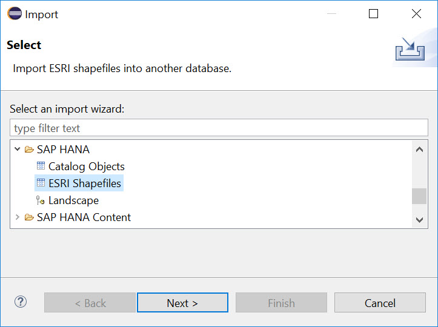
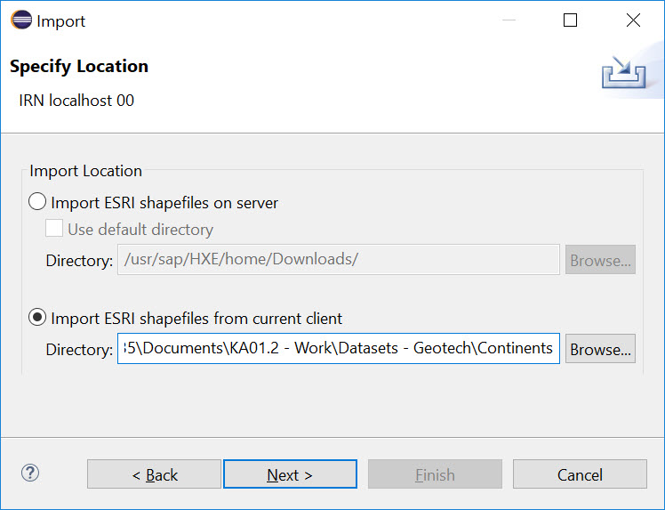
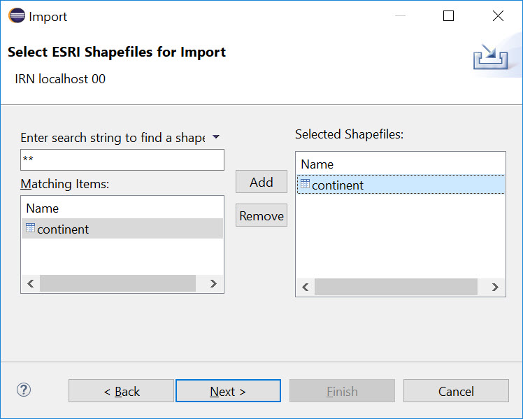

# Load ESRI files via Eclipse
<!-- description --> Load ESRI files via Eclipse

## Prerequisites  
 - Eclipse is setup for CodeJam exercises

## You will learn  
  - How to load ESRI shape files into SAP HANA using Eclipse

## Intro
Add additional information: Background information, longer prerequisites

---

### Download Geotech files


Download two zip files from [http://bit.ly/GeotechFiles](http://bit.ly/GeotechFiles) to your computer.

Uncompress them.

### View file content with Mapshaper


Open [`Mapshaper`](https://mapshaper.org/) web site and load `Continents.zip` file to check the content.


### Create a schema to load files


Create a schema `GEOTECH` using SQL.

```sql
CREATE SCHEMA "GEOTECH";
```

### Load files via Eclipse


In Eclipse in SAP HANA Administration go to **File** -> **Import**.

Select an import wizard for **SAP HANA** -> **ESRI Shapefiles**. Click **Next**



Select you SAP HANA instance as a target, if asked by the wizard.

In **Specify Location** screen select the option to load from current client (i.e. from your laptop).

Click **Browse** and point to the directory `Continets`, where you uncompressed the zip file.



On **Select ESRI Shapefiles to import** you should see `continent` has been found in the directory and added to **Selected Shapefiles**.



On **Options...** screen type:
- Schema: `GEOTECH`
- Replace existing tables: checked
- Number of parallel threads: `4`
- Spatial Reference Identifier: `1000004326`


Click **Finish**

### Verify loaded data


Check there are 8 records loaded using SQL:

```sql
SELECT COUNT(*) FROM "GEOTECH"."continent";
```

### Load countries file


Repeat the same steps to load `cntry00` data into `"GEOTECH"` schema as well.


---
