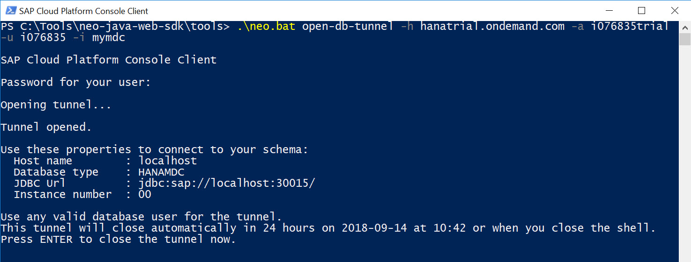
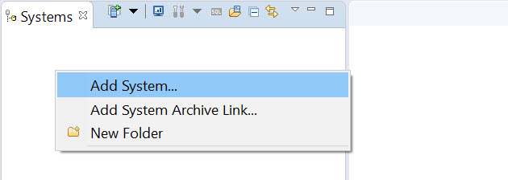
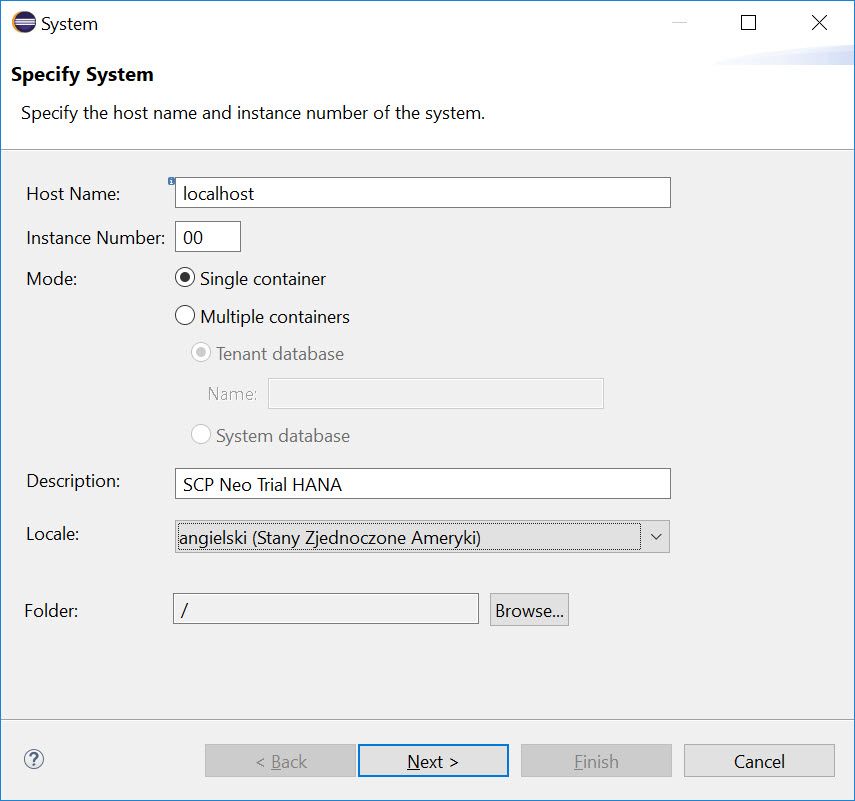
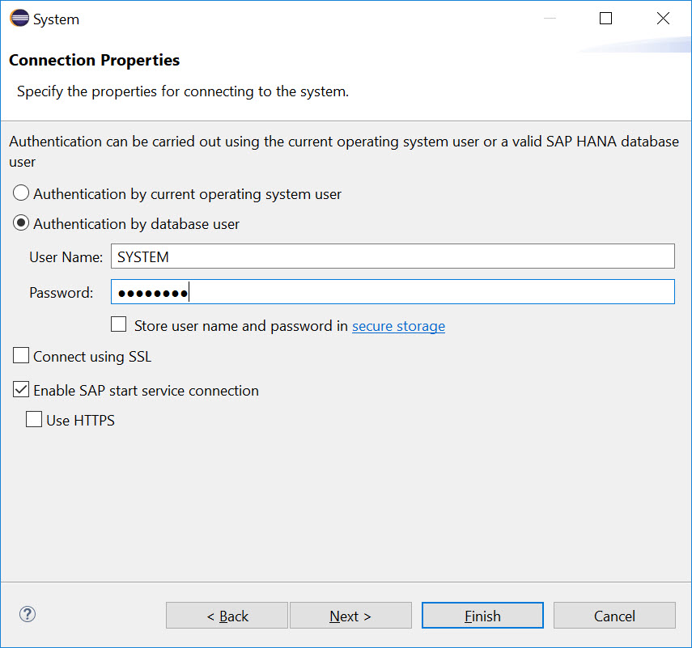

# Setup Eclipse for SAP HANA in SAP Cloud Platform Neo Trial
<!-- description --> Setup Eclipse for SAP HANA in SAP Cloud Platform Neo Trial

## Prerequisites  
 - Completed software installation as per CodeJam prerequisites

## You will learn  
  - How to open a tunnel to SAP HANA container in SAP Cloud Platform Neo trial
  - How to connect to you SAP HANA instance from Eclipse


---

### Open the tunnel

Go to the location where you uncompressed SCP Neo SDK (like `...\neo-java-web-sdk\`) and then to the subfolder `tools`.

From the command line run the following to open a tunnel to your instance of a database.

```sh
neo open-db-tunnel -h hanatrial.ondemand.com -a <your_SCP_Neo_Trial_account> -u <your_SCP_user> -i <your_HANA_MDC_instance_name>
```

Provide your SCP user password to open the tunnel.



### Add the system in Eclipse

Open Eclipse Oxygen with SAP HANA Tools installed.

Open **SAP HANA Administration Console** perspective by going to Window -> Perspective -> Open perspective -> Other, and then choosing SAP HANA Administration Console from the list.

In this perspective right click on empty area of Systems pane and choose **Add System...**



On the first dialog's screen **Specify System** type:
- Host Name: `localhost`
- Instance Number: `00`

Click **Next**



On the dialog's screen **Connection Properties** type:
- User Name: `SYSTEM`
- Password: the password you specified when creating the database, e.g. `Welcome18Welcome18`

Click **Finish**



If all parameters where correct and the tunnel is open, then the new system entry is added.


### SQL Console


Right click on your system and choose **Open SQL Console**

In SQL Console type the following code and execute it to check everything is fine.

```SQL
select 'Hello CodeJam!' as Greeting from dummy;
```


---
