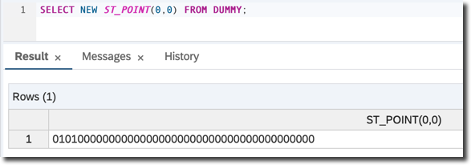
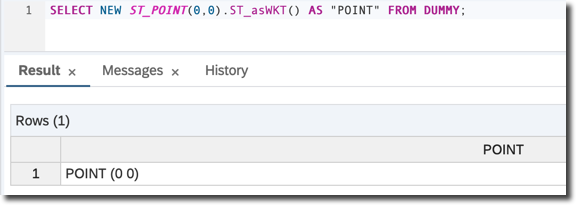
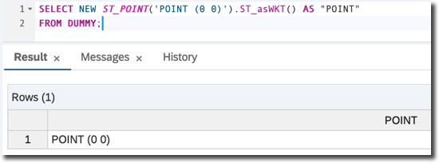
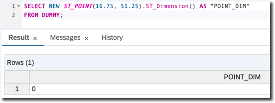

## Prerequisites
- **System access:** You have developer access to SAP HANA database instance, for example [SAP HANA Cloud trial](https://developers.sap.com/topics/hana.html)

## Next Steps
- [Strings](hana-spatial-intro2-string)

## Details
### You will learn  
You will learn the basics of spatial processing starting with points, and use them to understand the types, constructors and methods defined by the SQL/MM standard implemented by a SAP HANA database.

---

[ACCORDION-BEGIN [Step 1: ](Select a point in the 2D Euclidean space)]

SAP HANA includes a spatial engine and supports spatial data types and methods for processing spatial data. **Spatial data** is data that describes the position, shape, and orientation of objects in a defined space.

For more check the [SAP HANA Spatial Reference](https://help.sap.com/viewer/bc9e455fe75541b8a248b4c09b086cf5/2020_04_QRC/en-US/e1c934157bd14021a3b43b5822b2cbe9.html)

Open the SQL editor of your choice (web or desktop based) connected to your SAP HANA database instance. Screenshots in this and following tutorials are taken using SAP HANA Database Explorer.

Type the following SQL statement.
```sql
SELECT NEW ST_POINT(0,0) FROM "DUMMY";
```

This query selects a point in the 2-dimensional `2D` Euclidean space. A point defines a single location in space. A point always has an X and Y coordinate. In the example above it is `(0, 0)`, i.e. `X=0` and `Y=0`.

Spatial support in SAP HANA database follows the **`ISO/IEC 13249-3` "SQL multimedia and application packages -- Part 3: Spatial"** (`SQL/MM`) standard. This standard defines:

- how to store, retrieve and process spatial data using SQL,
- how spatial data is to be represented as values,
- which functions are available for converting, comparing, and processing this data in various ways.

A key component of this standard is the use of the __spatial data types hierarchy__. Within the hierarchy, the prefix `ST` is used for all data types (also referred to as ___classes___ or ___types___).

The **`ST_POINT`** type is a 0-dimensional geometry which represents a single location. To get an object of the `ST_POINT` spatial type you need to call a type's constructor following the syntax **`NEW ST_Point(<x>,<y>)`**, where x and y are the corresponding longitude and latitude coordinate values of data type DOUBLE.

Execute the query. Congratulations! You've just run your very first query using the spatial capabilities of SAP HANA.



[VALIDATE_1]
[ACCORDION-END]

[ACCORDION-BEGIN [Step 2: ](Change result format)]

The SAP HANA Database Explorer's SQL Console returns the value like `010100000000000000000000000000000000000000` as a result of the query execution. In some other SQL clients a question mark (`?`) can be returned.

This is because SAP HANA database stores spatial objects in the binary form, and not as a text. To get a human-readable value you need to apply a method **`ST_asWKT()`** to the `ST_POINT` object.

__WKT__ stands for **Well-known text**, which is a text markup language for representing vector geometry objects defined by the Open Geospatial Consortium (OGC). SAP HANA follows this industry standard.

Syntax for Spatial Functions must be in __Objective-style__, therefore modify the statement to use object syntax as shown below and execute.

```sql
SELECT NEW ST_POINT(0,0).ST_asWKT() AS "POINT" FROM "DUMMY";
```

Now the result of the query `POINT (0 0)` can be read and understood by a human.



[DONE]
[ACCORDION-END]

[ACCORDION-BEGIN [Step 3: ](Define a point in the constructor)]

The WKT standard can also be used to define a point in the constructor. The following query

```sql
SELECT NEW ST_POINT('POINT (0 0)').ST_asWKT() AS "POINT"
FROM "DUMMY";
```

returns the same result as `NEW ST_POINT(0,0)`



[DONE]
[ACCORDION-END]

[ACCORDION-BEGIN [Step 4: ](Try other spatial methods)]

There are more spatial methods that can be applied to `ST_POINT` objects. For now try two of them. Both will be **Access Functions** used to retrieve characteristics of spatial geometries.

`ST_X()` returns the X coordinate of the `ST_POINT` value as a DOUBLE data type.

```sql
SELECT NEW ST_POINT(16.75, 51.25).ST_X() AS "POINT_X"
FROM "DUMMY";
```


`ST_Dimension()` returns the dimension of the point or other geometry objects. In the case of points the result is obviously `0`.

```sql
SELECT NEW ST_POINT(16.75, 51.25).ST_Dimension() AS "POINT_DIM"
FROM "DUMMY";
```



[VALIDATE_2]
[ACCORDION-END]

### Optional
- Check the [SAP HANA Spatial Reference](https://help.sap.com/viewer/bc9e455fe75541b8a248b4c09b086cf5/2020_04_QRC/en-US/7a29e653787c1014813b997510a8cc06.html)
