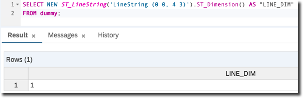
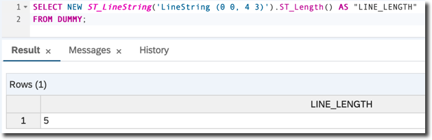
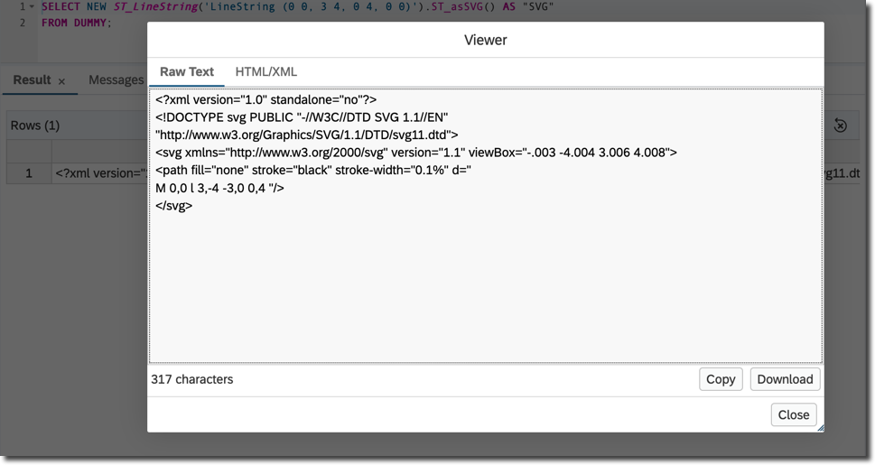
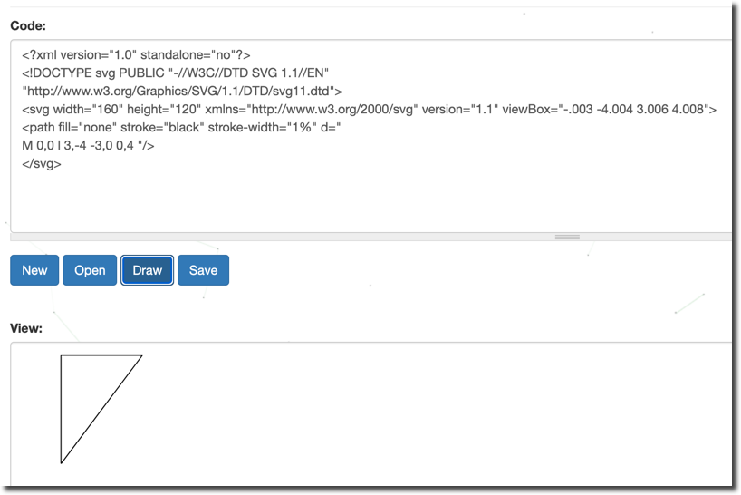
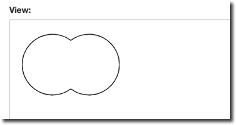
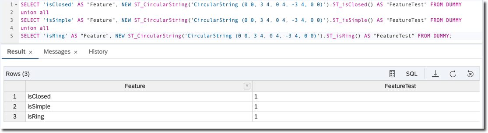
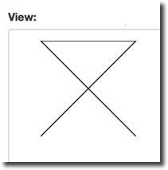
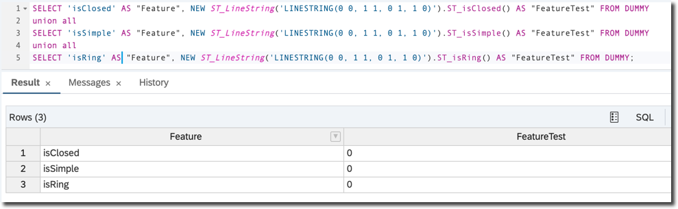
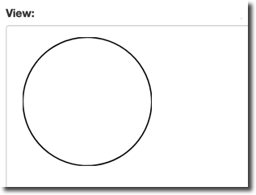
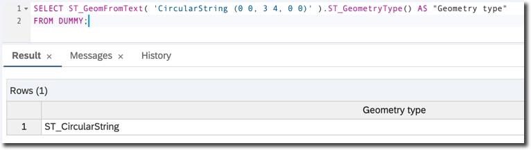

## Prerequisites  
- **Proficiency:** Beginner
- **Tutorials:** [Understand Points in SAP HANA Spatial](hana-spatial-intro1-point)

## Next Steps
- [Understand Polygons in SAP HANA Spatial](hana-spatial-intro3-polygon)

## Details
### You will learn  
You will continue learning the basics of spatial processing now with the __strings__ (also known as __curves__) data type.

---

[ACCORDION-BEGIN [Step 1: ](Create a new line)]

Open the SQL editor of your choice (web or desktop based) connected to your SAP HANA database instance.

Type the following SQL statement.

```sql
SELECT NEW ST_LineString('LineString (0 0, 4 3)').ST_Dimension() AS "LINE_DIM"
FROM "DUMMY";
```

This query instantiates a line in the 2-dimensional Euclidean space and returns its dimensions. In the example above it is a line connecting point `(0, 0)`; i.e. `X=0` and `Y=0`, with a point `(4, 3)`,  i.e. `X=4` and `Y=3`.

The constructor is using __Well-known Text (WKT)__. As explained in the previous tutorial, WKT is a text markup language for representing vector geometry objects defined by the Open Geospatial Consortium (OGC).

Execute the query. The `ST_Dimension()` method will return `1`. In the previous tutorial the same method applied to the point returned `0`.



[DONE]
[ACCORDION-END]

[ACCORDION-BEGIN [Step 2: ](Calculate the length)]

Unlike a point, a line has length. Use the `ST_Length()` method to calculate it.

```sql
SELECT NEW ST_LineString('LineString (0 0, 4 3)').ST_Length() AS "LINE_LENGTH"
FROM "DUMMY";
```

Obviously accordingly to the Pythagorean Theorem the result will be `5`. This proves the famous `3-4-5 Rule` used to get a perfect right angle.



[DONE]
[ACCORDION-END]

[ACCORDION-BEGIN [Step 3: ](Add more points)]

Strings are not just straight lines. The `ST_LineString` type is used to represent a multi-segment curve using straight line segments by adding more control points.

```sql
SELECT NEW ST_LineString('LineString (0 0, 3 4, 0 4, 0 0)').ST_asSVG() AS "SVG"
FROM "DUMMY";
```

The method `ST_asSVG()` returns the spatial object from the query in an XML-based vector image format called a __Scalable Vector Graphics (`SVG`)__. SVG is supported by most of the modern web browsers. Alternatively you can use free online SVG viewers, like [Free Code Format](https://www.freecodeformat.com/svg-editor.php).

Copy the content of the cell with SVG. In the SAP HANA Database Explorer right click on a the cell and choose **View Data** > **Raw Text**.



Here is slightly modified code. It has `width="160" height="120"` added and the default `stroke-width="0.1%"` changed to `stroke-width="1%"`

```xml
<?xml version="1.0" standalone="no"?>
<!DOCTYPE svg PUBLIC "-//W3C//DTD SVG 1.1//EN"
"http://www.w3.org/Graphics/SVG/1.1/DTD/svg11.dtd">
<svg width="160" height="120" xmlns="http://www.w3.org/2000/svg" version="1.1" viewBox="-.003 -4.004 3.006 4.008">
	<path fill="none" stroke="black" stroke-width="1%" d="M 0,0 l 3,-4 -3,0 0,4 "/>
</svg>
```

Opening the SVG code above in a viewer or in a web browser allows you to see a drawn spatial object.



[DONE]
[ACCORDION-END]

[ACCORDION-BEGIN [Step 4: ](Create a circular string)]

The `ST_CircularString` type of strings uses circular line segments (arcs) between control points.

```sql
SELECT NEW ST_CircularString('CircularString (0 0, 3 4, 0 4)').ST_asSVG() AS "SVG"
FROM "DUMMY";
```

The first point is the start point of the segment. The second point is any point on the segment other than the start or end point. The third point is the end point of the segment. Here is an SVG representation of the above statement.


Subsequent segments are defined by two points only (intermediate and end point). The start point is taken to be the end point of the preceding segment.

```sql
SELECT NEW ST_CircularString('CircularString (0 0, 3 4, 0 4, -3 4, 0 0)').ST_asSVG() AS "SVG"
FROM "DUMMY";
```



A string that starts and ends at the same point is **closed**. Above is an example.

Strings can also be characterized by whether they are simple or not. A **simple** means a string that does not cross itself. A **ring** is a simple, closed string. The geometry above is a ring, according to this definition in spatial processing.

[DONE]
[ACCORDION-END]

[ACCORDION-BEGIN [Step 5: ](Check string characteristics)]

All these characteristics can be tested and if needed used as **Spatial Predicates**. Spatial predicates are implemented as member functions that return `0` (false) or `1` (true).

```sql
SELECT 'isClosed' AS "Feature", NEW ST_CircularString('CircularString (0 0, 3 4, 0 4, -3 4, 0 0)').ST_isClosed() AS "FeatureTest" FROM "DUMMY"
union all
SELECT 'isSimple' AS "Feature", NEW ST_CircularString('CircularString (0 0, 3 4, 0 4, -3 4, 0 0)').ST_isSimple() AS "FeatureTest" FROM "DUMMY"
union all
SELECT 'isRing' AS "Feature", NEW ST_CircularString('CircularString (0 0, 3 4, 0 4, -3 4, 0 0)').ST_isRing() AS "FeatureTest" FROM "DUMMY";
```



Now do the same test for another geometry, defined by `ST_LineString('LINESTRING(0 0, 1 1, 0 1, 1 0)')`



```sql
SELECT 'isClosed' AS "Feature", NEW ST_LineString('LINESTRING(0 0, 1 1, 0 1, 1 0)').ST_isClosed() AS "FeatureTest" FROM "DUMMY"
union all
SELECT 'isSimple' AS "Feature", NEW ST_LineString('LINESTRING(0 0, 1 1, 0 1, 1 0)').ST_isSimple() AS "FeatureTest" FROM "DUMMY"
union all
SELECT 'isRing' AS "Feature", NEW ST_LineString('LINESTRING(0 0, 1 1, 0 1, 1 0)').ST_isRing() AS "FeatureTest" FROM "DUMMY";
```



[DONE]
[ACCORDION-END]

[ACCORDION-BEGIN [Step 6: ](Create a circle)]

A `CircularString` with three points can be a complete circle, if the start and end points are coincident. In this case, the intermediate point is the midpoint of the segment.

```sql
SELECT ST_GeomFromText( 'CircularString (0 0, 3 4, 0 0)' ).ST_asSVG() AS "SVG"
FROM "DUMMY";
```



Note this time you did not use a geometry constructor using the `NEW` keyword. Instead you used the method `ST_GeomFromText` that parses a string containing a representation of a geometry and creates a geometry value of the appropriate type.

Use method `ST_GeometryType()` to verify.

```sql
SELECT ST_GeomFromText( 'CircularString (0 0, 3 4, 0 0)' ).ST_GeometryType() AS "Geometry type"
FROM "DUMMY";
```



What is the result of the last SQL statement?

[VALIDATE_1]
[ACCORDION-END]


### Optional
- Review the [SAP HANA Spatial Reference](https://help.sap.com/viewer/bc9e455fe75541b8a248b4c09b086cf5/2020_04_QRC/en-US/434153cebbfe46028b84d91f15bd68fd.html)
