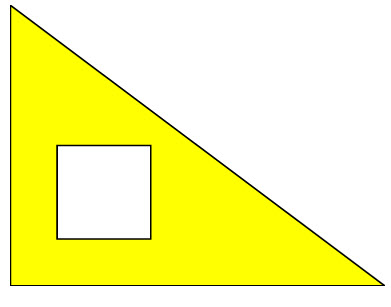
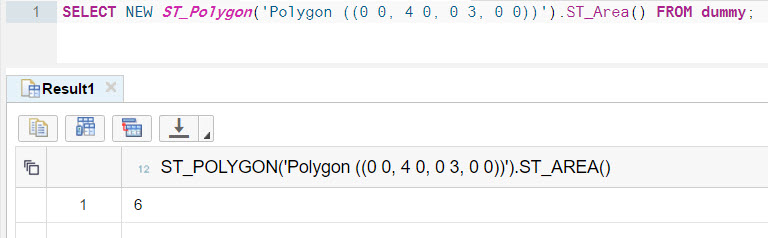
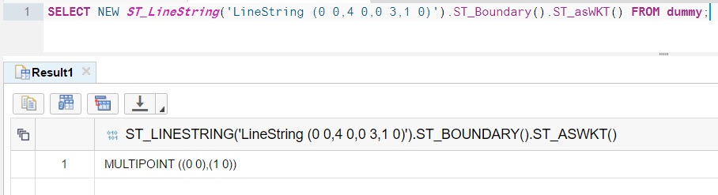
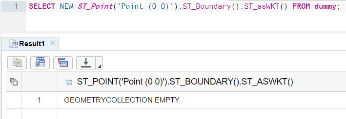
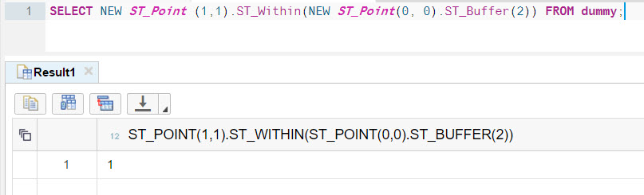

## Prerequisites  
 - **Proficiency:** Beginner
 - **Tutorials:** [Intro to SAP HANA Spatial: Strings](http://www.sap.com/developer/tutorials/hana-spatial-intro2-string.html)

## Next Steps
 - Tables with spatial columns (coming soon), or
 - Select a tutorial from the [Tutorial Navigator](http://www.sap.com/developer/tutorial-navigator.html) or the [Tutorial Catalog](http://www.sap.com/developer/tutorials.html)

## Details
### You will learn  
You will continue learning basics of spatial processing now with ___polygons___ (also known as ___surfaces___) data types.

### Time to Complete
**5 Min**.

---

1. Rings from the previous tutorials, are still strings, i.e. they have length, but no surface. To construct the surface you use ___polygons___. A polygon defines a region of space. A polygon is constructed from one exterior bounding ring that defines the outside of the region and zero or more interior rings which define holes in the region.

2. Open SQL Editor of your choice (web or desktop based) connected to your SAP HANA database instance.

    Type and execute the following SQL statement.
    ```sql
    SELECT NEW ST_Polygon('Polygon ((0 0, 4 0, 0 3, 0 0), (0.5 0.5, 0.5 1.5, 1.5 1.5, 1 0.5, 0.5 0.5))').ST_asSVG() FROM dummy;
    ```
    This query instantiate a surface in the 2-dimensional Euclidean space and returns its dimension. In the example above it is a polygon defined by an external ring with a shape of a triangle connecting points (0, 0), i.e. `X=0` and `Y=0`, with points (4, 0) and (4, 3) and internal ring with a shape of a square. The constructor is using ___WKT___. As explained in the previous tutorial, the Well-known text is a text markup language for representing vector geometry objects defined by the Open Geospatial Consortium (OGC).

    SVG modified to fill a geometry with yellow color `fill="yellow"` to better illustrate the meaning of the external and internal rings of polygons will display this.

    

3. Now execute the following query.

    ```sql
    SELECT NEW ST_Polygon('Polygon ((0 0, 4 0, 0 3, 0 0), (0.5 0.5, 0.5 1.5, 1.5 1.5, 1 0.5, 0.5 0.5))').ST_Dimension() FROM dummy;
    ```

    The `ST_Dimension()` method will return `2`. In the exercise with the point the same method returned `0`, and in the exercise with strings it returned `1`.

4. Differently from the string, the polygon has a surface, and therefore has the area. Use the `ST_Area()` method to calculate it.

    ```sql
    SELECT NEW ST_Polygon('Polygon ((0 0, 4 0, 0 3, 0 0))').ST_Area() FROM dummy;
    ```

    Please note the double round brackets, as this polygon consists of only external ring.

    This statement calculates the area of right triangle (also known as 'right-angled triangle'), with catheti (also known as legs) having lengths of 3 and 4. Obviously area is a half of 3*4 and equal 6.

    

5. Having a polygon you can calculate as well its ___boundary___ using `ST_Boundary()` method.

    Check the boundary of the first polygon from this tutorial, i.e. a triangle with a square inside.

    ```sql
    SELECT NEW ST_Polygon('Polygon ((0 0, 4 0, 0 3, 0 0), (0.5 0.5, 0.5 1.5, 1.5 1.5, 1 0.5, 0.5 0.5))').ST_Boundary().ST_asWKT() FROM dummy;
    ```

    

    The result is a `MultiLineString` containing two `LineStrings`. One representing a triangle and another representing a square.

    `MultiLineString` is another spatial type, which is a collection of line strings. There are two more spatial collection types supported by SAP HANA: `MultiPoint` and `MultiPolygon`. Names are intuitive enough to understand what they represent.

    Strings too have their boundaries, represented by their endpoints, except when they are rings. Rings - curves where the start point is the same as the end point and there are no self-intersections - have no boundaries.

    Check boundaries of a triangle string from the previous query.

    ```sql
    SELECT NEW ST_LineString('LineString (0 0,4 0,0 3,0 0)').ST_Boundary().ST_asWKT() FROM dummy;
    ```

    The result is an empty geometry.

    

    Check boundaries of a multi-segment line, where end points are not the same.

    ```sql
    SELECT NEW ST_LineString('LineString (0 0,4 0,0 3,1 0)').ST_Boundary().ST_asWKT() FROM dummy;
    ```

    The result is a `MultiPoint` collection containing two end points.

    

    Points do not have boundaries.

    

6. Usual requirement in spatial calculations is finding relationships between different geometries, like if one geometry is covered by another geometry, like if some particular point of interest is within city's boundaries.

    `ST_Within()` is one such a method. As with other spatial methods in SAP HANA the result `1` means 'true', and `0` means 'false'.

    ```sql
    SELECT NEW ST_Point (1,1).ST_Within(NEW ST_Polygon('Polygon ((0 0, 4 0, 0 3, 0 0), (0.5 0.5, 0.5 1.5, 1.5 1.5, 1 0.5, 0.5 0.5))')) FROM dummy;
    ```

    Indeed the point (1, 1) is not within ___interior___ of your polygon form the earlier exercise, defined by external ring in the shape of triangle and internal ring in the shape of a square. An area inside a square is the ___exterior___ of this particular geometry.

    

7. To check if a point is within a given disk you use `ST_Boundary()` method defining the circle around an area of a particular distance from a central point.

    ```sql
    SELECT NEW ST_Point (1,1).ST_Within(NEW ST_Point(0, 0).ST_Buffer(2)) FROM dummy;
    ```

    The point (1, 1) is in the circle with center point (0, 0) and the radius of 2.

    

### Optional
- Check SAP HANA Spatial Reference at http://help.sap.com/hana_platform for the complete list of objects and methods

## Next Steps
 - Tables with spatial columns (coming soon), or
 - Select a tutorial from the [Tutorial Navigator](http://www.sap.com/developer/tutorial-navigator.html) or the [Tutorial Catalog](http://www.sap.com/developer/tutorials.html)
