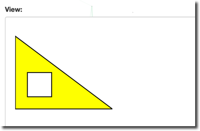
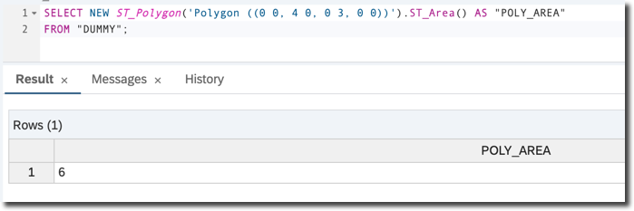
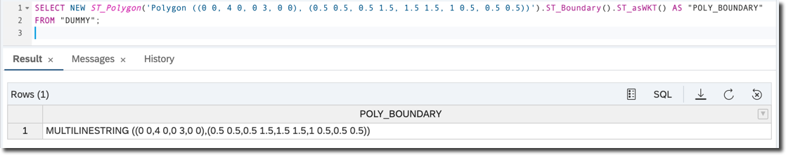
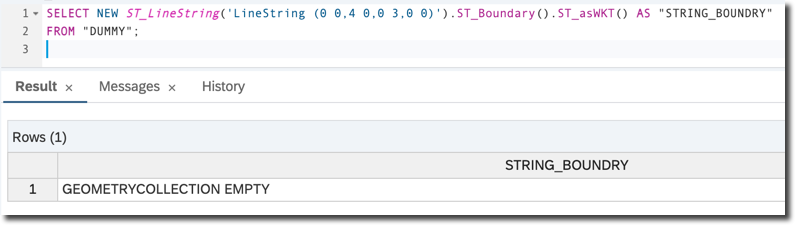
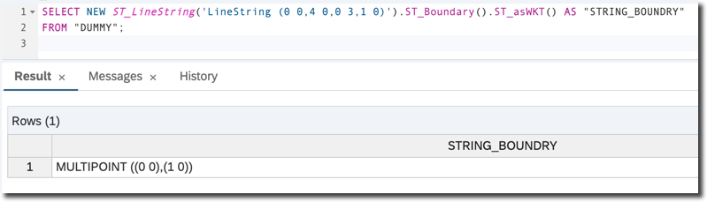
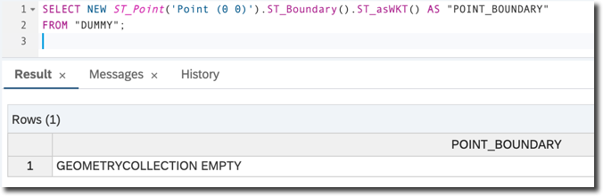
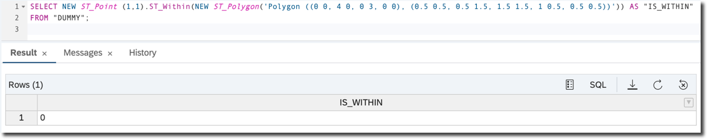
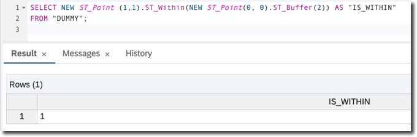

## Prerequisites  
- **Proficiency:** Beginner
- **Tutorials:** [Understand Strings in SAP HANA Spatial](hana-spatial-intro2-string)

## Next Steps
- [Understand Spatial Columns in SAP HANA Spatial](hana-spatial-intro4-columns)

## Details
### You will learn  
You will continue learning basics of spatial processing now with __polygons__ (also known as __surfaces__) data types.

---

[ACCORDION-BEGIN [Step 1: ](Instantiate a surface)]
Rings, from the previous tutorials, are still strings; i.e. they have length, but no surface. To construct the surface you use __polygons__. A polygon defines a region of space. A polygon is constructed from one exterior bounding ring that defines the outside of the region and zero or more interior rings, which define holes in the region.

Open the SQL Editor of your choice (web or desktop based) connected to your SAP HANA database instance.

Type and execute the following SQL statement.

```sql
SELECT NEW ST_Polygon('Polygon ((0 0, 4 0, 0 3, 0 0), (0.5 0.5, 0.5 1.5, 1.5 1.5, 1.5 0.5, 0.5 0.5))').ST_asSVG() AS "SVG"
FROM "DUMMY";
```

This query instantiates a surface in the 2-dimensional Euclidean space and returns its dimensions. In the example above it is a polygon defined by an external ring with the shape of a triangle connecting points `(0, 0)`; i.e., `X=0` and `Y=0`, with points `(4, 0)` and `(4, 3)` and an internal ring with the shape of a square. The constructor is using __Well-known text (WKT)__. As explained in the previous tutorial, WKT is a text markup language for representing vector geometry objects defined by the Open Geospatial Consortium (OGC).

Below is an SVG modified to fill a geometry with a color using `fill="yellow"` to better illustrate the meaning of the external and internal rings of polygons.



[DONE]
[ACCORDION-END]

[ACCORDION-BEGIN [Step 2: ](Get a dimension)]

Now, execute the following query.

```sql
SELECT NEW ST_Polygon('Polygon ((0 0, 4 0, 0 3, 0 0), (0.5 0.5, 0.5 1.5, 1.5 1.5, 1 0.5, 0.5 0.5))').ST_Dimension()  AS "POLY_DIM"
FROM "DUMMY";
```

The `ST_Dimension()` method will return `2`. In the earlier point exercise the same method returned `0`, and in the strings exercise it returned `1`.

[DONE]
[ACCORDION-END]

[ACCORDION-BEGIN [Step 3: ](Get an area)]

Unlike a string, a polygon has a surface, and therefore has an area. Use the `ST_Area()` method to calculate it.

```sql
SELECT NEW ST_Polygon('Polygon ((0 0, 4 0, 0 3, 0 0))').ST_Area() AS "POLY_AREA"
FROM "DUMMY";
```

Please note the double round brackets `((...))` in the definition, as this polygon consists of only an external ring.

This statement calculates the area of right triangle (also known as 'right-angled triangle'), with `catheti` (also known as legs) having lengths of 3 and 4. Obviously the area is half of 3*4 and equals 6.



[DONE]
[ACCORDION-END]

[ACCORDION-BEGIN [Step 4: ](Get a boundary)]

You can calculate the __boundary__ of a polygon using the `ST_Boundary()` method. This method is one of **Transformation Functions**, which take one geometry as an input, and produce another geometry as an output.

Check the boundary of the first polygon from this tutorial; i.e., a triangle with a square inside.

```sql
SELECT NEW ST_Polygon('Polygon ((0 0, 4 0, 0 3, 0 0), (0.5 0.5, 0.5 1.5, 1.5 1.5, 1 0.5, 0.5 0.5))').ST_Boundary().ST_asWKT() AS "POLY_BOUNDARY"
FROM "DUMMY";
```



The result is a `MultiLineString` containing two `LineStrings`, one representing a triangle and the another representing a square.

`MultiLineString` is another spatial type. It is a collection of line strings. There are two more **spatial collection types** supported by SAP HANA: `MultiPoint` and `MultiPolygon`. Their names describe what they represent.

Strings too have their boundaries, represented by their endpoints, except when they are rings. Rings --- curves where the start point is the same as the end point and there are no self-intersections --- have no boundaries.

Now, check the boundaries of a triangle string from the previous query.

```sql
SELECT NEW ST_LineString('LineString (0 0,4 0,0 3,0 0)').ST_Boundary().ST_asWKT() AS "STRING_BOUNDARY"
FROM "DUMMY";
```

The result is an empty geometry.



[DONE]
[ACCORDION-END]

[ACCORDION-BEGIN [Step 5: ](Get boundaries of a multi-segment line)]

Check the boundaries of a multi-segment line, where end points are not the same.

```sql
SELECT NEW ST_LineString('LineString (0 0,4 0,0 3,1 0)').ST_Boundary().ST_asWKT() AS "STRING_BOUNDARY"
FROM "DUMMY";
```

The result is a `MultiPoint` collection containing two end points.



Points do not have boundaries.
```sql
SELECT NEW ST_Point('Point (0 0)').ST_Boundary().ST_asWKT() AS "POINT_BOUNDARY"
FROM "DUMMY";
```



[DONE]
[ACCORDION-END]

[ACCORDION-BEGIN [Step 6: ](Check if one geometry is within another)]

A typical requirement in spatial calculations is to find relationships between different geometries. For example, you may need to determine if one geometry is covered by another geometry; if some particular point of interest is within a city's boundaries, for instance.

`ST_Within()` is a method that will allow you to determine if one geometry is within another. It is one of the **Spatial Predicates** and as other methods from this group returns a result of `1` meaning 'true' or `0` meaning 'false'.

```sql
SELECT NEW ST_Point (1,1).ST_Within(NEW ST_Polygon('Polygon ((0 0, 4 0, 0 3, 0 0), (0.5 0.5, 0.5 1.5, 1.5 1.5, 1 0.5, 0.5 0.5))')) AS "IS_WITHIN"
FROM "DUMMY";
```

Indeed the `point (1, 1)` is not within the ___interior___ of the polygon from an earlier exercise, defined by the external ring in the shape of a triangle and an internal ring in the shape of a square. An area inside a square is an ___exterior___ of this particular geometry.



[DONE]
[ACCORDION-END]

[ACCORDION-BEGIN [Step 7: ](Check if a point is within a given disk)]

To check if a point is within a given [disk](https://en.wikipedia.org/wiki/Disk_%28mathematics%29) you use another transformation functions: `ST_Buffer()`. This method applied to a point defines the circle area of a particular distance from that point.

```sql
SELECT NEW ST_Point (1,1).ST_Within(NEW ST_Point(0, 0).ST_Buffer(2)) AS "IS_WITHIN"
FROM "DUMMY";
```

The point `(1, 1)` is in the circle with the center point of `(0, 0)` and the radius of 2.



[VALIDATE_1]
[ACCORDION-END]


### Optional
- Check the [SAP HANA Spatial Reference](https://help.sap.com/viewer/bc9e455fe75541b8a248b4c09b086cf5/2020_04_QRC/en-US/7a2bd39a787c1014930ebadd6158c998.html)
