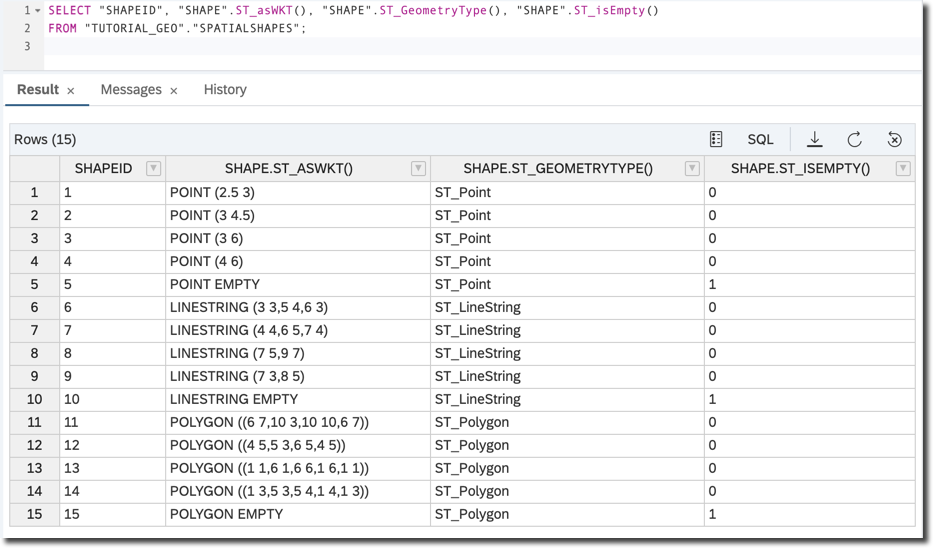
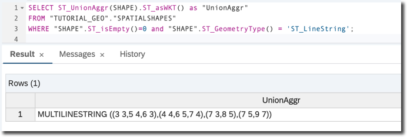
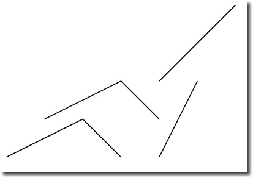
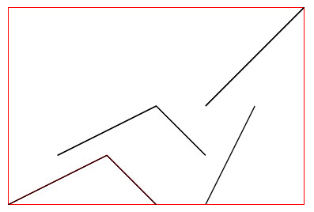

## Prerequisites  
- **Proficiency:** Beginner
- **Tutorials:** [Understand Polygons in SAP HANA Spatial](hana-spatial-intro3-polygon)

## Next Steps
- [Spatial Z and M coordinates](hana-spatial-intro5-z-m-coordinates)

## Details
### You will learn  
In previous tutorials you learned how to create spatial objects and run selected methods to perform some calculations using them. Now it's time to learn how to store, retrieve and process spatial data in SAP HANA tables. In addition, you will learn about the Spatial type hierarchy.

---

[ACCORDION-BEGIN [Step 1: ](Review spatial types)]

The following spatial types can be used in column tables in SAP HANA:

- `ST_POINT`,
- `ST_GEOMETRY`.

> Spatial columns are not supported in SAP HANA row tables.

The column type `ST_GEOMETRY` supports multidimensional spatial data for the following spatial data types: `ST_CircularString`, `ST_GeometryCollection`, `ST_LineString`, `ST_MultiLineString`, `ST_MultiPoint`, `ST_MultiPolygon`, `ST_Point`, and `ST_Polygon`.

`ST_GEOMETRY` is a core component of the SQL Multimedia (`SQL/MM`) standard for storing and accessing geospatial data. `SQL-MM` follows an object-oriented approach. **Geometry** is the overarching type for objects such as points, strings, and polygons. The geometry type is the supertype for all supported spatial data types.

The following diagram is taken from the SAP HANA Spatial Reference Guide and illustrates the hierarchy of the `ST_Geometry` data types:


Object-oriented properties of spatial data types:
- A subtype (or derived type) is more specific than its supertype (or base type).
- A subtype inherits all methods from all supertypes. For example, `ST_Polygon` values can call methods defined for the `ST_Geometry`.
- A value of a subtype can be automatically converted to any of its supertypes. For example, an `ST_Point` value can be used where an `ST_Geometry` parameter is required.
- A column or variable of type `ST_Geometry` can store spatial values of any type.

[DONE]
[ACCORDION-END]

[ACCORDION-BEGIN [Step 2: ](Create a table and load sample data)]

For the purpose of this tutorial, create a schema `TUTORIAL_GEO` or use any other schema in your instance, where you have privileges for creating tables.

```sql
CREATE SCHEMA "TUTORIAL_GEO";
SET SCHEMA "TUTORIAL_GEO";
```

Create and load data into the `SpatialShapes` table. This example is taken from the [SAP HANA Spatial Reference](https://help.sap.com/viewer/bc9e455fe75541b8a248b4c09b086cf5/2020_04_QRC/en-US/f5e84e09dac940968dd517b452a3cd67.html). You can run exercises from the official help as well.

```sql
CREATE COLUMN TABLE SpatialShapes
(
  ShapeID integer,
  shape ST_GEOMETRY
);
```

Insert following sample data.

```sql
-- a set of points
INSERT INTO SpatialShapes VALUES(1,  NEW ST_POINT('POINT(2.5 3.0)'));
INSERT INTO SpatialShapes VALUES(2,  NEW ST_POINT('POINT(3.0 4.5)'));
INSERT INTO SpatialShapes VALUES(3,  NEW ST_POINT('POINT(3.0 6.0)'));
INSERT INTO SpatialShapes VALUES(4,  NEW ST_POINT('POINT(4.0 6.0)'));
INSERT INTO SpatialShapes VALUES(5,  NEW ST_POINT());

-- a set of linestrings
INSERT INTO SpatialShapes VALUES(6,  NEW ST_LINESTRING('LINESTRING(3.0 3.0, 5.0 4.0, 6.0 3.0)'));
INSERT INTO SpatialShapes VALUES(7,  NEW ST_LINESTRING('LINESTRING(4.0 4.0, 6.0 5.0, 7.0 4.0)'));
INSERT INTO SpatialShapes VALUES(8,  NEW ST_LINESTRING('LINESTRING(7.0 5.0, 9.0 7.0)'));
INSERT INTO SpatialShapes VALUES(9,  NEW ST_LINESTRING('LINESTRING(7.0 3.0, 8.0 5.0)'));
INSERT INTO SpatialShapes VALUES(10,  NEW ST_LINESTRING());

-- a set of polygons
INSERT INTO SpatialShapes VALUES(11, NEW ST_POLYGON('POLYGON((6.0 7.0, 10.0 3.0, 10.0 10.0, 6.0 7.0))'));
INSERT INTO SpatialShapes VALUES(12, NEW ST_POLYGON('POLYGON((4.0 5.0, 5.0 3.0, 6.0 5.0, 4.0 5.0))'));
INSERT INTO SpatialShapes VALUES(13, NEW ST_POLYGON('POLYGON((1.0 1.0, 1.0 6.0, 6.0 6.0, 6.0 1.0, 1.0 1.0))'));
INSERT INTO SpatialShapes VALUES(14, NEW ST_POLYGON('POLYGON((1.0 3.0, 1.0 4.0, 5.0 4.0, 5.0 3.0, 1.0 3.0))'));
INSERT INTO SpatialShapes VALUES(15, NEW ST_POLYGON());
```

Now, check the shapes you loaded, including types of geometries and which geometry values represent empty sets.

```sql
SELECT "SHAPEID", "SHAPE".ST_asWKT(), "SHAPE".ST_GeometryType(), "SHAPE".ST_isEmpty()
FROM "TUTORIAL_GEO"."SPATIALSHAPES";
```



[DONE]
[ACCORDION-END]

[ACCORDION-BEGIN [Step 3: ](Geospatial data validation)]

Consider the following example.

```sql
SELECT NEW ST_LINESTRING('LINESTRING(1.0 2.0, 1.0 2.0)').st_IsValid() AS "IS_VALID"
FROM "DUMMY";
```

The result of the query is `0`, meaning the shape is not valid. In this example the beginning and the end points of a single line string cannot are the same.

Now insert this string into the table.

```sql
INSERT INTO SpatialShapes
VALUES(100,  NEW ST_LineString('LINESTRING(1.0 2.0, 1.0 2.0)'));
```

The insert will be successful and the new row with the invalid shape is added to the table. This is because by default there is no additional validation done on spatial columns as can be seen in the view `ST_GEOMETRY_COLUMNS`.

```sql
SELECT "TABLE_NAME", "COLUMN_NAME", "VALIDATION"
FROM "ST_GEOMETRY_COLUMNS"
WHERE "SCHEMA_NAME"='TUTORIAL_GEO' AND "TABLE_NAME"='SPATIALSHAPES';
```

Alter the definition of the table's column to do validation checks now. Check how values are changes in the view `ST_GEOMETRY_COLUMNS`.

```sql
ALTER TABLE "TUTORIAL_GEO"."SPATIALSHAPES" ALTER ("SHAPE" ST_GEOMETRY(0) VALIDATION FULL);
```

Try to insert invalid shape into the column once again.

```sql
INSERT INTO SpatialShapes VALUES(101,  NEW ST_LINESTRING('LINESTRING(1.0 2.0, 1.0 2.0)'));
```

This time you should receive an error message, like following: `spatial error: The geometry is considered invalid by function ST_IsValid, but only valid geometries are allowed for column...`

>Altering column to turn validations on does not do revalidation of already inserted data and applies only to new and modified data.

Remove these test records from the table as they won't be needed in further exercises.

```sql
DELETE FROM "TUTORIAL_GEO"."SPATIALSHAPES" WHERE "SHAPEID" > 15;
```

[DONE]
[ACCORDION-END]

[ACCORDION-BEGIN [Step 4: ](Aggregate shapes from a spatial column using union)]

When you need to combine multiple shapes into one you can use different set operations and aggregation methods.

**Aggregation methods** are executed on spatial columns of tables in SAP HANA.

`ST_UnionAggr()` returns the spatial union of all of the geometries in a column.

```sql
SELECT ST_UnionAggr(SHAPE).ST_asWKT() as "UnionAggr"
FROM "TUTORIAL_GEO"."SPATIALSHAPES"
WHERE "SHAPE".ST_isEmpty()=0 and "SHAPE".ST_GeometryType() = 'ST_LineString';
```



Presented graphically, it looks like the diagram below:



Also note that spatial predicates were used in the query above to select only geometries of type `LineString` type and only those that are not empty.

**Check-your-knowledge exercises**

1. Query the union aggregation of polygons from the table.
2. Query the union aggregation of boundaries of polygons from the table.

[DONE]
[ACCORDION-END]

[ACCORDION-BEGIN [Step 5: ](Additional aggregation methods)]

Two other important **aggregate methods** are:

- `ST_EnvelopeAggr()` which returns the bounding rectangle for all of the geometries in a group,
- `ST_ConvexHullAggr()` which returns the convex hull for all of the geometries in a group, known as "rubber band" method.

Execute this query to best illustrate both types of aggregations. It uses the **set operation method** `ST_Union()` to return the geometry value that represents the point set union of two geometries.

```sql
SELECT
ST_ConvexHullAggr("SHAPE").ST_Boundary().ST_Union(ST_UnionAggr("SHAPE")).ST_asWKT() AS "ConvexHullAggr",
ST_EnvelopeAggr("SHAPE").ST_Boundary().ST_Union(ST_UnionAggr("SHAPE")).ST_asWKT() AS "EnvelopeAggr"
FROM "TUTORIAL_GEO"."SPATIALSHAPES"
WHERE "SHAPE".ST_isEmpty()=0 and "SHAPE".ST_GeometryType() = 'ST_LineString';
```

Please note the use of the `ST_Boundary()` method to convert a polygon (which is a result of the aggregation) into just a curve surrounding the shape, so that the combined geometries are all visible.


Seeing is believing, so here are the graphical outputs (with slightly modified SVG to draw the shapes of the aggregates in red)

The result of `ST_ConvexHullAggr()`:


And the result of `ST_EnvelopeAggr()`:



[VALIDATE_1]
[ACCORDION-END]

### Optional
- Example: [Calculating number π by throwing darts](https://blogs.sap.com/2016/12/14/calculating-number-%cf%80-by-throwing-darts-digitally-in-sap-hana/)
- Check the [SAP HANA Spatial Reference](https://help.sap.com/viewer/bc9e455fe75541b8a248b4c09b086cf5/2020_04_QRC/en-US/85062b6dd79d49e6be32db35e7bfab5a.html)
