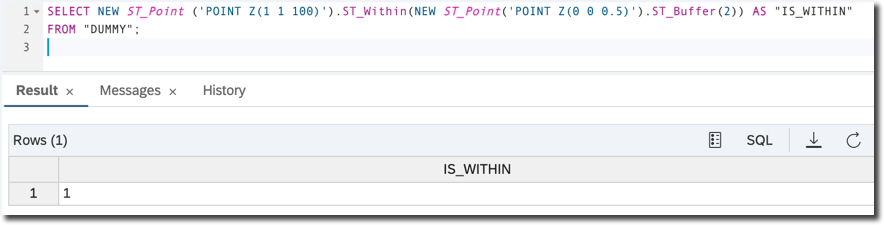

## Prerequisites  
- **Proficiency:** Beginner
 - **Tutorials:** [Understand Spatial Columns in SAP HANA Spatial](hana-spatial-intro4-columns)


## Next Steps
 - [Understand Spatial Reference Systems in SAP HANA Spatial](hana-spatial-intro6-srs)

## Details
### You will learn  
You will learn the basics of multidimensional coordinate systems that introduce Z (3rd dimension) and M (measure) coordinates to geometries' points.

---

[ACCORDION-BEGIN [Step 1: ](Introducing Z and M coordinates)]
All geometries have at least two coordinate dimensions: the X and Y defining 2D coordinates of each point. For geographic spatial reference systems, these are the latitude and longitude of a point.

Geometries can optionally have Z and / or M values associated with each point in the geometry. The **Z** value introduces the third dimension coordinate. The Z value usually is used to indicate the height, or elevation.

The measure value **M** can be used to record additional non-coordinate values at various points within a geometry. The M value is most often used in geometries with the [linear reference system](https://en.wikipedia.org/wiki/Linear_referencing), e.g. where M stores a distance value from a defined starting point.

The following dimension types are supported by SAP HANA:

- 2D dimension (X, Y)
- 2D dimension with measure (X, Y, M)
- 3D dimension (X, Y, Z)
- 3D dimension with measure (X, Y, Z, M)

>Important to note that these Z and M coordinate values can be used to store additional information, but are not considered when computing spatial relations or set operations.

[DONE]
[ACCORDION-END]

[ACCORDION-BEGIN [Step 2: ](Optional coordinates in geometries' constructors)]
In Well-known text (WKT) standard geometries with 3D and / or measure value are designated by "Z" and / or "M" after the geometry type. Below are examples for points.

A point with the third dimension Z of the value 2:
```sql
SELECT NEW ST_Point('POINT Z(0 0 2)').ST_asWKT() AS "POINT_XYZ"
FROM "DUMMY";
```

A point with the measure value M equal 0.5:
```sql
SELECT NEW ST_Point('POINT M(0 0 0.5)').ST_asWKT() AS "POINT_XYM"
FROM "DUMMY";
```

A point with both the third dimension Z and measure M:
```sql
SELECT NEW ST_Point('POINT ZM(0 0 2 0.5)').ST_asWKT() AS "POINT_XYZM"
FROM "DUMMY";
```

The Z and M values can be used with other geometries too.
```sql
SELECT NEW ST_GeometryCollection('GeometryCollection Z(LineString Z(5 10 20, 10 12 25, 15 10 13), Polygon Z((10 -5 4, 15 5 6, 5 5 7, 10 -5 4)), Point Z(10 15 12))').ST_asWKT() AS "GEOM_XYZ"
FROM "DUMMY";
```

[DONE]
[ACCORDION-END]


[ACCORDION-BEGIN [Step 3: ](Storing and retrieving spatial data with Z and M)]
What is important to understand is that Z and M do not change the geometry's dimensionality. The result of each statement below will still be `0` for `ST_Point` objects.
```sql
SELECT NEW ST_Point('POINT Z(0 0 2)').ST_Dimension() AS "Dimensions" FROM "DUMMY";
SELECT NEW ST_Point('POINT M(0 0 0.5)').ST_Dimension() AS "Dimensions" FROM "DUMMY";
SELECT NEW ST_Point('POINT ZM(0 0 2 0.5)').ST_Dimension() AS "Dimensions" FROM "DUMMY";
```

To find the number of coordinates stored within each point of a geometry use the `ST_CoordDim` method. The following values may be returned:

- **2** --- The geometry contains only two coordinates (X and Y),
- **3** --- The geometry contains one additional coordinate (either Z or M) for each point,
- **4** --- The geometry contains two additional coordinates (both Z and M) for each point.

```sql
SELECT NEW ST_LineString('LineString ZM(5 10 20 0, 10 12 25 0, 15 10 13 0)').ST_CoordDim() AS "CoordDims"
FROM "DUMMY";
-- Result is 4
```


Methods similar to retrieving X and Y are used to retrieve the value of either Z or M of geometries:

- `ST_Z()` and `ST_M()` --- only for points,
- `ST_Zmin()`, `ST_Zmax()`, `ST_Mmin()`, `ST_Mmax()` --- for all geometries.

```sql
SELECT NEW ST_LineString('LineString ZM(5 10 20 0, 10 12 25 0, 15 10 13 0)').ST_Zmin() AS "Z_MIN"
FROM "DUMMY";
-- Result is 13

SELECT NEW ST_LineString('LineString ZM(5 10 20 0, 10 12 25 0, 15 10 13 0)').ST_Zmax() AS "Z_MAX"
FROM "DUMMY";
-- Result is 25

SELECT NEW ST_Point('Point ZM(5 10 20 0)').ST_M() AS "M"
FROM "DUMMY";
-- Result is 0
```

[DONE]
[ACCORDION-END]

[ACCORDION-BEGIN [Step 4: ](Processing spatial data with Z and M)]
As mentioned above these additional coordinate Z and M values are used to store and retrieve additional information, but are not considered during spatial computations or set operations.

For example the result of the line string calculation from one of the previous tutorials will still be `5`, and not `13` if Z value of the string's end point is `12`. As a fun fact: `(5, 12, 13)` is another example of the [Pythagorean triple](https://en.wikipedia.org/wiki/Pythagorean_triple), same as `(3, 4, 5)`.

```sql
SELECT NEW ST_LineString('LineString Z(0 0 0, 4 3 12)').ST_Length() AS "StringLength"
FROM "DUMMY";
-- Result is still 5, same as in the following
-- SELECT NEW ST_LineString('LineString (0 0, 4 3)').ST_Length()  AS "StringLength"
-- FROM "DUMMY";
```


Another modified example from the previous tutorial.
```sql
SELECT NEW ST_Point ('POINT Z(1 1 100)').ST_Within(NEW ST_Point('POINT Z(0 0 0.5)').ST_Buffer(2)) AS "WITHIN"
FROM "DUMMY";
-- Result is True as the point (1,1) is still within a buffer around the point (0,0) even though they have different "height" location defined by Z
```



The method `ST_Buffer()` applied to a point with 3 dimensions flattens a calculated geometry, making it 2 dimensional: X and Y only. And the method `ST_Within` does not take Z dimension into consideration.
```sql
SELECT NEW ST_Point('POINT Z(0 0 0.5)').ST_Buffer(2).ST_CoordDim() FROM DUMMY;
-- Result is 2 (coordinates dimensions of an output polygon)
```

[VALIDATE_1]
[ACCORDION-END]

### Optional
- Check the [SAP HANA Spatial Reference](https://help.sap.com/viewer/bc9e455fe75541b8a248b4c09b086cf5/2020_04_QRC/en-US/fe2e0c2e8f51455db165479d54f8890c.html)
