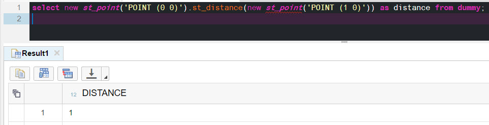
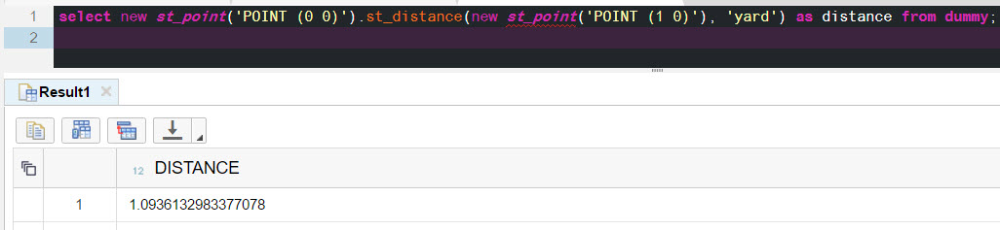
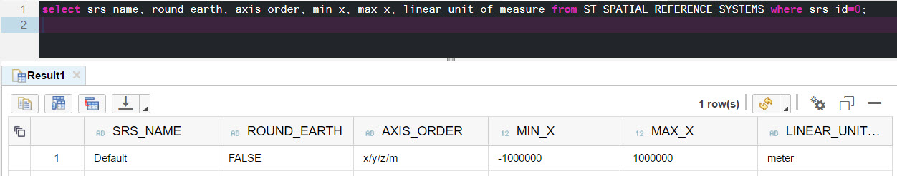
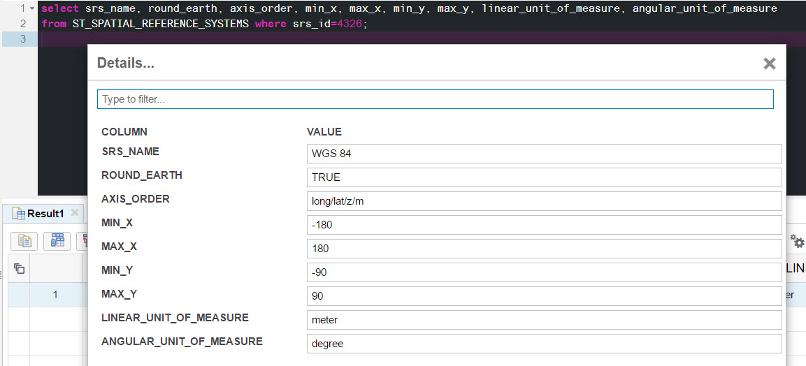
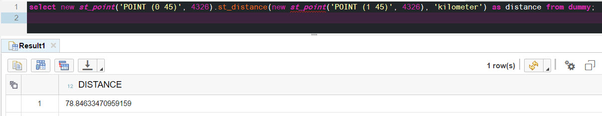

## Prerequisites  
- **Proficiency:** Beginner
 - **Tutorials:** [Z and M coordinates](https://www.sap.com/developer/tutorials/hana-spatial-intro5-z-m-coordinates.html)


## Next Steps
- Introduction to [SAP HANA Spatial methods](https://www.sap.com/developer/groups/hana-aa-spatial-methods.html)

## Details
### You will learn  
You will learn what Spatial Reference Systems and Spatial Units of Measure are, how they are defined and used in SAP HANA.

### Time to Complete
**15 Min**

---

[ACCORDION-BEGIN [Step 1: ](Calculating the distance on the flat surface)]
What is the distance between two points: (0, 0) and (1, 0)?
```sql
select new st_point('POINT (0 0)').st_distance(new st_point('POINT (1 0)')) as distance from dummy;
```

The result is `1`.

`1`, but in what units? In this example the default unit of distance is `meter`, and conversion to other units is possible in some spatial methods. The list of pre-installed units is available in the system view `ST_UNITS_OF_MEASURE`. One of them is `yard`, used in the following example.

```sql
select new st_point('POINT (0 0)').st_distance(new st_point('POINT (1 0)'), 'yard') as distance from dummy;
```



>More units of measures can be manually created or loaded into the SAP HANA using separate Geospatial Metadata Installer. Geospatial Metadata Installer is available for registered customers and partners.

[ACCORDION-END]

[ACCORDION-BEGIN [Step 2: ](Introducing Spatial Reference Systems)]

But what if you want to measure a distance between two geographic point where coordinates are latitude and longitude? Then you need to specify what **Spatial Reference System (`SRS`)** is used for geometries in queries.

A spatial reference system defines, at minimum:
- units of measure of the underlying coordinate system (degrees, meters, and so on),
- maximum and minimum coordinates (also referred to as ___the bounds___),
- whether the data is planar or spheroid,
- projection information for transforming the data to other reference systems.

When not SRS is specified in the query, then the default SRS with id (`SRID`) equal `0` is assumed by SAP HANA. This is the one that was used in previous examples.

Spatial reference system details can be viewed in the `ST_SPATIAL_REFERENCE_SYSTEMS` system view.

Check some of the characteristics of SRS with SRID equal `0`
```sql
select srs_name, round_earth, axis_order, min_x, max_x, linear_unit_of_measure
from ST_SPATIAL_REFERENCE_SYSTEMS where srs_id=0;
```


As you can see it is the `DEFAULT` reference system, with all `x`, `y`, `z` and `m` coordinates. It is based on the flat surface.

[ACCORDION-END]

[ACCORDION-BEGIN [Step 3: ](Calculating the distance on the round Earth)]

The Spatial Reference System that implements geodetic coordinate system of the Global Positioning System (`GPS`), or [`WGS 84`](https://en.wikipedia.org/wiki/World_Geodetic_System#WGS84), has SRID `4326`.
```sql
select srs_name, round_earth, axis_order, min_x, max_x, min_y, max_y, linear_unit_of_measure, angular_unit_of_measure
from ST_SPATIAL_REFERENCE_SYSTEMS where srs_id=4326;
```


This SRS has `degree` defined as the angular unit of measure and boundaries are between -180 to 180 degrees longitude and -90 to 90 degrees latitude.

To calculate a distance of one degree of longitude at the equator in kilometers run this query.
```sql
select new st_point('POINT (0 0)', 4326).st_distance(new st_point('POINT (1 0)', 4326), 'kilometer') as distance from dummy;
```


A distance of one degree of longitude at the 45 degrees latitude should be shorter.
```sql
select new st_point('POINT (0 45)', 4326).st_distance(new st_point('POINT (1 45)', 4326), 'kilometer') as distance from dummy;
```


SRS with id 4326 is the one of many standardized reference systems. Other may have different assumptions regarding the Earth shape, or may define boundaries to cover only selected countries.


[ACCORDION-END]

[ACCORDION-BEGIN [Step 4: ](Defining additional  Spatial Reference Systems)]

More spatial reference systems can be manually created or loaded into the SAP HANA using separate Geospatial Metadata Installer. Geospatial Metadata Installer is available for registered customers and partners.

For now create another popular reference system with `SRID` equal `3857`. It is famous for being used in web maps, and you will use it later in another tutorials and exercises too.

```sql
CREATE SPATIAL REFERENCE SYSTEM "WGS 84 / Pseudo-Mercator"
 IDENTIFIED BY 3857
 DEFINITION 'PROJCS["WGS 84 / Pseudo-Mercator",GEOGCS["WGS 84",DATUM["WGS_1984",SPHEROID["WGS 84",6378137,298.257223563,AUTHORITY["EPSG","7030"]],AUTHORITY["EPSG","6326"]],PRIMEM["Greenwich",0,AUTHORITY["EPSG","8901"]],UNIT["degree",0.0174532925199433,AUTHORITY["EPSG","9122"]],AUTHORITY["EPSG","4326"]],PROJECTION["Mercator_1SP"],PARAMETER["central_meridian",0],PARAMETER["scale_factor",1],PARAMETER["false_easting",0],PARAMETER["false_northing",0],UNIT["metre",1,AUTHORITY["EPSG","9001"]],AXIS["X",EAST],AXIS["Y",NORTH],EXTENSION["PROJ4","+proj=merc +a=6378137 +b=6378137 +lat_ts=0.0 +lon_0=0.0 +x_0=0.0 +y_0=0 +k=1.0 +units=m +nadgrids=@null +wktext  +no_defs"],AUTHORITY["EPSG","3857"]]'
 ORGANIZATION "EPSG" IDENTIFIED BY 3857
 TRANSFORM DEFINITION '+proj=merc +a=6378137 +b=6378137 +lat_ts=0.0 +lon_0=0.0 +x_0=0.0 +y_0=0 +k=1.0 +units=m +nadgrids=@null +wktext  +no_defs'   
 TYPE PLANAR
 COORDINATE X BETWEEN -20037508.342789248 AND 20037508.342789248
 COORDINATE Y BETWEEN -20048966.104014635 AND 20048966.104014624  
 TOLERANCE DEFAULT
 SNAP TO GRID DEFAULT
 POLYGON FORMAT 'EvenOdd'
 STORAGE FORMAT 'Internal';
```

Confused about the whole cryptic notation in the definition? No need to worry for now. All you need to know is that its definition comes from industry registry [EPSG Geodetic Parameter Registry](http://www.epsg-registry.org/) that you can search and download if needed.

And add one more - the one used in the original World Mercator projection.

```sql
CREATE SPATIAL REFERENCE SYSTEM "WGS 84 / World Mercator"
 IDENTIFIED BY 3395
 DEFINITION 'PROJCS["WGS 84 / World Mercator",GEOGCS["WGS 84",DATUM["WGS_1984",SPHEROID["WGS 84",6378137,298.257223563,AUTHORITY["EPSG","7030"]],AUTHORITY["EPSG","6326"]],PRIMEM["Greenwich",0,AUTHORITY["EPSG","8901"]],UNIT["degree",0.0174532925199433,AUTHORITY["EPSG","9122"]],AUTHORITY["EPSG","4326"]],PROJECTION["Mercator_1SP"],PARAMETER["central_meridian",0],PARAMETER["scale_factor",1],PARAMETER["false_easting",0],PARAMETER["false_northing",0],UNIT["metre",1,AUTHORITY["EPSG","9001"]],AXIS["Easting",EAST],AXIS["Northing",NORTH],AUTHORITY["EPSG","3395"]]'
 ORGANIZATION "EPSG" IDENTIFIED BY 3395
 TRANSFORM DEFINITION '+proj=merc +lon_0=0 +k=1 +x_0=0 +y_0=0 +datum=WGS84 +units=m +no_defs '   
 TYPE PLANAR
 COORDINATE X BETWEEN -20037508.342789248 AND 20037508.342789248
 COORDINATE Y BETWEEN -15496570.739723722 AND 18764656.231380586  
 TOLERANCE DEFAULT
 SNAP TO GRID DEFAULT
 POLYGON FORMAT 'EvenOdd'
 STORAGE FORMAT 'Internal';
```

Once SQL statements above are executed successfully you should see these new `SRS` ids in `ST_SPATIAL_REFERENCE_SYSTEMS` view.

[ACCORDION-END]

### Optional
- Example: [ASCII art map of the World](https://blogs.sap.com/2017/02/13/ascii-art-map-of-the-world-using-sap-hana-geospatial-processing/)
- Example: [Tell me where the center of Europe is](https://blogs.sap.com/2017/04/11/sap-hana-tell-me-where-the-center-of-europe-is/)
- Read [SAP HANA Spatial Reference](https://help.sap.com/viewer/cbbbfc20871e4559abfd45a78ad58c02/latest/en-US)
- Read blog [Spatial Reference Systems – Background Knowledge and the use in SAP HANA](https://archive.sap.com/documents/docs/DOC-75363)

## Next Steps
- Introduction to [SAP HANA Spatial methods](https://www.sap.com/developer/groups/hana-aa-spatial-methods.html)
