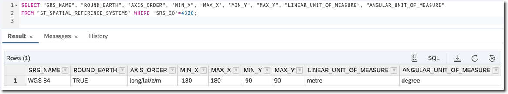

## Prerequisites  
- **Proficiency:** Beginner
 - **Tutorials:** [Understand Z and M coordinates in SAP HANA Spatial](hana-spatial-intro5-z-m-coordinates)


## Next Steps
- Introduction to [SAP HANA Spatial methods](https://developers.sap.com/group.hana-aa-spatial-methods.html)

## Details
### You will learn  
You will learn what Spatial Reference Systems and Spatial Units of Measure are, how they are defined and used in SAP HANA.

---

[ACCORDION-BEGIN [Step 1: ](Calculating the distance on the flat surface)]
What is the distance between two points: `(0, 0)` and `(1, 0)`?

```sql
SELECT NEW ST_Point('POINT (0 0)').ST_Distance(NEW ST_Point('POINT (1 0)')) AS "DISTANCE"
FROM "DUMMY";
```


The result is `1`.

`1`, but in what units? In this example the default unit of distance is `meter`, and conversion to other units is possible in some spatial methods. The list of pre-installed units is available in the system view `ST_UNITS_OF_MEASURE`.

One of them is `yard`, used in the following example.

```sql
SELECT NEW ST_Point('POINT (0 0)').ST_Distance(NEW ST_Point('POINT (1 0)'), 'yard') AS "DISTANCE"
FROM "DUMMY";
```


>All required units of measure are already pre-loaded in SAP HANA Cloud.

>More units of measures can be manually created or loaded into the SAP HANA on-prem using a separate Geospatial Metadata Installer. The Geospatial Metadata Installer is available for registered customers and partners.

[DONE]
[ACCORDION-END]

[ACCORDION-BEGIN [Step 2: ](Introducing Spatial Reference Systems)]

What if you want to measure a distance between two geographic point where coordinates are latitude and longitude on the Earth? In this case you need to specify what **Spatial Reference System (`SRS`)** is used for geometries in queries.

A spatial reference system defines, at minimum:

- units of measure of the underlying coordinate system (degrees, meters, and so on),
- maximum and minimum coordinates (also referred to as __the bounds__),
- whether the data is planar or spheroid,
- projection information for transforming the data to other reference systems.

When not SRS is specified in the query, then the default SRS `SRID` with id equal `0` is assumed by SAP HANA. This was the one used in the previous examples.

Spatial reference system details can be viewed in the `ST_SPATIAL_REFERENCE_SYSTEMS` system view.

Check some of the characteristics of SRS with SRID equal `0`.

```sql
SELECT "SRS_NAME", "ROUND_EARTH", "AXIS_ORDER", "MIN_X", "MAX_X", "LINEAR_UNIT_OF_MEASURE"
FROM "ST_SPATIAL_REFERENCE_SYSTEMS" WHERE "SRS_ID"=0;
```


As you can see it is the `DEFAULT` reference system, with all `x`, `y`, `z` and `m` coordinates. It is based on the flat surface.

[DONE]
[ACCORDION-END]

[ACCORDION-BEGIN [Step 3: ](Calculating the distance on the round Earth)]

The Spatial Reference System that implements geodetic coordinate system of the Global Positioning System (`GPS`), or [`WGS 84`](https://en.wikipedia.org/wiki/World_Geodetic_System#WGS84), has SRID `4326`.

```sql
SELECT "SRS_NAME", "ROUND_EARTH", "AXIS_ORDER", "MIN_X", "MAX_X", "MIN_Y", "MAX_Y", "LINEAR_UNIT_OF_MEASURE", "ANGULAR_UNIT_OF_MEASURE"
FROM "ST_SPATIAL_REFERENCE_SYSTEMS" WHERE "SRS_ID"=4326;
```


This SRS has `degree` defined as the angular unit of measure and boundaries are between -180 to 180 degrees longitude and -90 to 90 degrees latitude.

To calculate a distance of one degree of longitude at the equator in kilometers run this query.

```sql
SELECT NEW ST_Point('POINT (0 0)', 4326).ST_Distance(NEW ST_Point('POINT (1 0)', 4326), 'kilometer') AS "DISTANCE"
FROM "DUMMY";
```


A distance of one degree of longitude at the 45 degrees latitude should be shorter.

```sql
SELECT NEW ST_Point('POINT (0 45)', 4326).ST_Distance(NEW ST_Point('POINT (1 45)', 4326), 'kilometer') AS "DISTANCE"
FROM "DUMMY";
```


SRS with id `4326` is the one of many standardized reference systems. Other may have different assumptions regarding the Earth shape, or may define boundaries to cover only selected countries.

[DONE]
[ACCORDION-END]

[ACCORDION-BEGIN [Step 4: ](Defining additional Spatial Reference Systems)]

More spatial reference systems can be added in SAP HANA Cloud and on-prem SAP HANA 2.0 from SPS05 using `CREATE PREDEFINED SPATIAL REFERENCE SYSTEM IDENTIFIED BY <srs-id>` statement.

For  SAP HANA 2.0 prior to SPS05 more spatial reference systems can be manually created or loaded into the SAP HANA using separate Geospatial Metadata Installer. Geospatial Metadata Installer is available for registered customers and partners.

Let's add the SRS used for the original World Mercator projection.

In SAP HANA Cloud and SAP HANA 2.0 starting from SPS05 execute the following statement.

```sql
CREATE PREDEFINED SPATIAL REFERENCE SYSTEM
 IDENTIFIED BY 3395;
```

In SAP HANA 2.0 prior to SPS05 execute the following statement.

```sql
CREATE SPATIAL REFERENCE SYSTEM "WGS 84 / World Mercator"
 IDENTIFIED BY 3395
 DEFINITION 'PROJCS["WGS 84 / World Mercator",GEOGCS["WGS 84",DATUM["WGS_1984",SPHEROID["WGS 84",6378137,298.257223563,AUTHORITY["EPSG","7030"]],AUTHORITY["EPSG","6326"]],PRIMEM["Greenwich",0,AUTHORITY["EPSG","8901"]],UNIT["degree",0.0174532925199433,AUTHORITY["EPSG","9122"]],AUTHORITY["EPSG","4326"]],PROJECTION["Mercator_1SP"],PARAMETER["central_meridian",0],PARAMETER["scale_factor",1],PARAMETER["false_easting",0],PARAMETER["false_northing",0],UNIT["metre",1,AUTHORITY["EPSG","9001"]],AXIS["Easting",EAST],AXIS["Northing",NORTH],AUTHORITY["EPSG","3395"]]'
 ORGANIZATION "EPSG" IDENTIFIED BY 3395
 TRANSFORM DEFINITION '+proj=merc +lon_0=0 +k=1 +x_0=0 +y_0=0 +datum=WGS84 +units=m +no_defs '   
 TYPE PLANAR
 COORDINATE X BETWEEN -20037508.342789248 AND 20037508.342789248
 COORDINATE Y BETWEEN -15496570.739723722 AND 18764656.231380586  
 TOLERANCE DEFAULT
 SNAP TO GRID DEFAULT
 POLYGON FORMAT 'EvenOdd'
 STORAGE FORMAT 'Internal';
```

Confused about the whole cryptic notation in the definition? No need to worry for now. All you need to know is that its definition comes from industry registry [EPSG Geodetic Parameter Registry](http://www.epsg.org) that you can search and download if needed.

Once SQL statements above are executed successfully you should see these new `SRS` ids in `ST_SPATIAL_REFERENCE_SYSTEMS` view.

What is the numeric id of the Spatial Reference System that implements geodetic coordinate system of the Global Positioning System (`GPS`), known as `WGS 84`?

[VALIDATE_1]
[ACCORDION-END]

### Optional
- Example: [ASCII art map of the World](https://blogs.sap.com/2017/02/13/ascii-art-map-of-the-world-using-sap-hana-geospatial-processing/)
- Example: [Tell me where the center of Europe is](https://blogs.sap.com/2017/04/11/sap-hana-tell-me-where-the-center-of-europe-is/)
- Read blog [Spatial Reference Systems – Background Knowledge and the use in SAP HANA](https://archive.sap.com/documents/docs/DOC-75363)
- Check the [SAP HANA Spatial Reference](https://help.sap.com/viewer/bc9e455fe75541b8a248b4c09b086cf5/2020_04_QRC/en-US/7a2ea357787c101488ecd1b725836f07.html)
