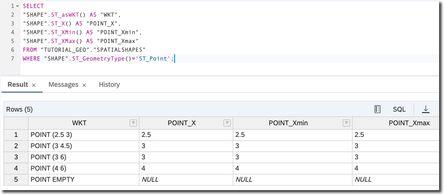
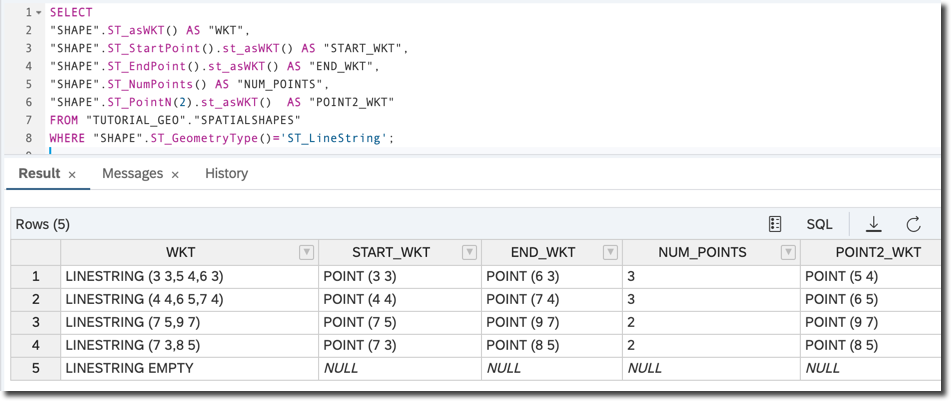
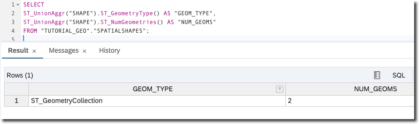
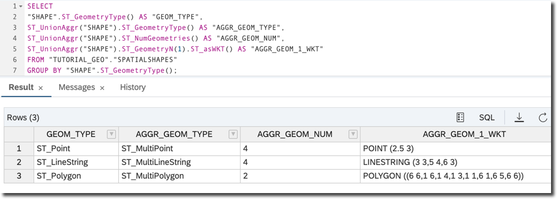

## Prerequisites
 - **Tutorials:** [Introduction to SAP HANA Spatial data types](group.hana-aa-spatial-get-started)
 - You must have the table `"TUTORIAL_GEO"."SPATIALSHAPES"` from previous tutorials already created and loaded in your system to be able to run examples from this tutorial.

## Next Steps
 - [Computation methods](hana-spatial-methods-compute)

## Details
### You will learn  
You will learn about a number of access methods and how to apply them to different geometries.

---

[ACCORDION-BEGIN [Step 1: ](Access methods)]
If you have done previous tutorials, then you must have seen some of the spatial access methods already.

E.g. `ST_Dimension()` returned the dimension of a geometry object and could be applied to a geometry of any type - be it a point or a polygon. `ST_X()` returns the X coordinate of an `ST_POINT` and works with points only.

[DONE]
[ACCORDION-END]

[ACCORDION-BEGIN [Step 2: ](Access methods for all geometries)]
Some other methods that can be applied to all types of geometries are presented below.

`ST_XMin()`, `ST_XMax()`, `ST_YMin()`, `ST_YMax` all retrieve corresponding minimum or maximum values of geometry's coordinates `X` and `Y`. There are similar methods available for coordinates `Z` and `M`.

In case of a point both minimum and maximum values will be the same and equal to the same value as point-only methods retrieving coordinate value, like `ST_X()`.

```sql
SELECT
"SHAPE".ST_asWKT() AS "WKT",
"SHAPE".ST_X() AS "POINT_X",
"SHAPE".ST_XMin() AS "POINT_Xmin",
"SHAPE".ST_XMax() AS "POINT_Xmax"
FROM "TUTORIAL_GEO"."SPATIALSHAPES"
WHERE "SHAPE".ST_GeometryType()='ST_Point';
```



After running the SQL statement above you should notice is that these methods return `NULL` when applied to an empty geometry.

The other access method you used here was `ST_GeometryType()` to check and filter types of geometries.

[DONE]
[ACCORDION-END]

[ACCORDION-BEGIN [Step 3: ](Access methods for line strings)]
You used `ST_GeometryType()` in the previous step as a predicate to select only records for points. Otherwise trying to apply `ST_X()` to a string or polygon would return run-time error during the SQL execution.

There are some access methods that can be used only with line strings. For example:

 - `ST_StartPoint()` and `ST_EndPoint()` to retrieve an `ST_Point` values of the starting and the ending points,
 - `ST_NumPoints()` to get the total number of points; then it can be applied to retrieve Nth point using `ST_PointN()`. Numbering starts from `1` and `ST_PointN()` returns `null` in Nth point does not exist.

```sql
SELECT
"SHAPE".ST_asWKT() AS "WKT",
"SHAPE".ST_StartPoint().st_asWKT() AS "START_WKT",
"SHAPE".ST_EndPoint().st_asWKT() AS "END_WKT",
"SHAPE".ST_NumPoints() AS "NUM_POINTS",
"SHAPE".ST_PointN(2).st_asWKT()  AS "POINT2_WKT"
FROM "TUTORIAL_GEO"."SPATIALSHAPES"
WHERE "SHAPE".ST_GeometryType()='ST_LineString';
```



[DONE]
[ACCORDION-END]

[ACCORDION-BEGIN [Step 4: ](Access methods for collections)]
Similarly to points in strings you can get a number of individual geometries in collections (types `ST_MultiPoint`, `ST_MultiLineString`, `ST_MultiPolygon`) using `ST_NumGeometries()`. And then access each of them using `ST_GeometryN()` method.

```sql
SELECT
ST_UnionAggr("SHAPE").ST_GeometryType() AS "GEOM_TYPE",
ST_UnionAggr("SHAPE").ST_NumGeometries() AS "NUM_GEOMS"
FROM "TUTORIAL_GEO"."SPATIALSHAPES";
```



The query above aggregates all different geometries from the `SPATIALSHAPES` table. The result is `ST_GeometryCollection` with 5 different geometries in it. Some of overlapping polygons got aggregated into new single polygons, so the total number of geometries in the collection is smaller than a number of single geometries in the table.

```sql
SELECT
"SHAPE".ST_GeometryType() AS "GEOM_TYPE",
ST_UnionAggr("SHAPE").ST_GeometryType() AS "AGGR_GEOM_TYPE",
ST_UnionAggr("SHAPE").ST_NumGeometries() AS "AGGR_GEOM_NUM",
ST_UnionAggr("SHAPE").ST_GeometryN(1).ST_asWKT() AS "AGGR_GEOM_1_WKT"
FROM "TUTORIAL_GEO"."SPATIALSHAPES"
GROUP BY "SHAPE".ST_GeometryType();
```



This query now produced 3 different collections. Each of them contains only geometries of the same types thanks to `GROUP BY` statement.

You will learn more about different kinds of spatial aggregations in a separate tutorial.

[VALIDATE_1]
[ACCORDION-END]

### Optional
- You can find all available methods in [SAP HANA Spatial Reference](https://help.sap.com/viewer/bc9e455fe75541b8a248b4c09b086cf5/2020_04_QRC/en-US/7a13f280787c10148dc893063dfed1c4.html).
