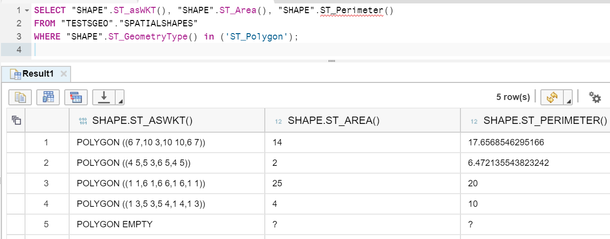
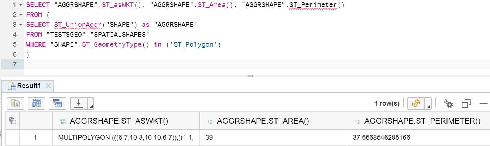
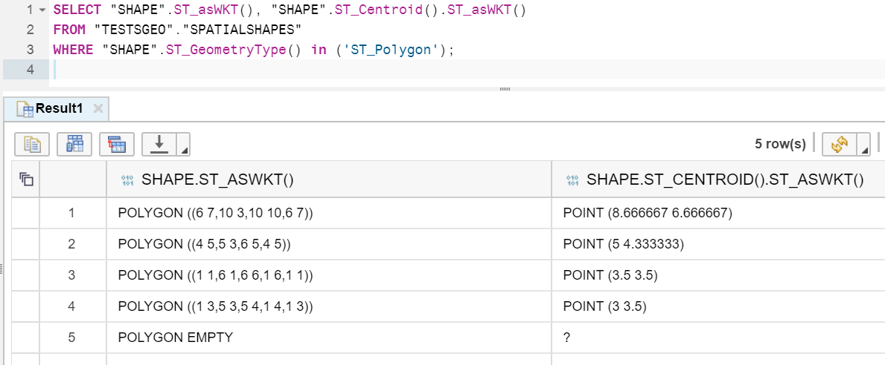
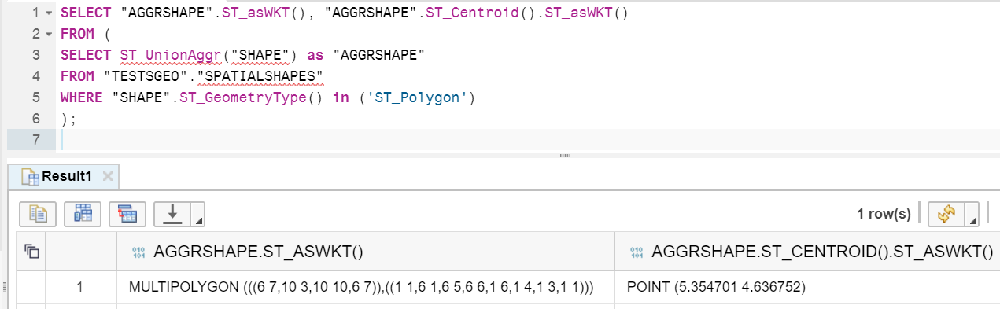
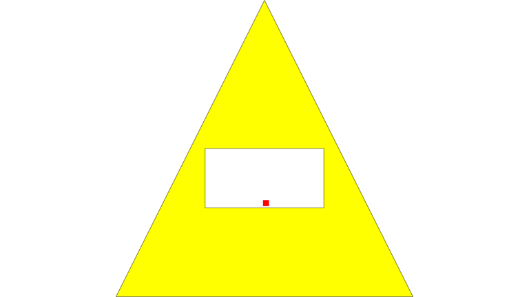
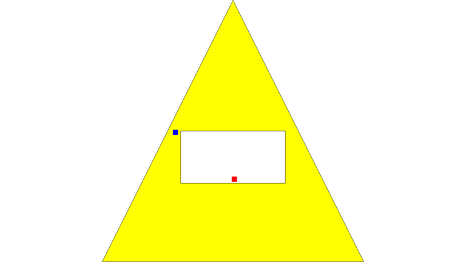

## Prerequisites  
 - **Proficiency:** Beginner
 - **Tutorial:** [Access methods](https://www.sap.com/developer/tutorials/hana-spatial-methods-access.html)

## Next Steps
 - [Transformation methods](https://www.sap.com/developer/tutorials/hana-spatial-methods-transform.html)

## Details
### You will learn  
You will learn about a number of computation methods and how to apply them to different geometries.

>You must have table `"TESTSGEO"."SPATIALSHAPES"` from previous tutorials already created and loaded in your system to be able to run examples from this tutorial.

### Time to Complete
**15 Min**

---

[ACCORDION-BEGIN [Step 1: ](Compute methods)]
If you have done previous tutorials, then you must have seen some of the spatial compute methods already.

E.g. `ST_Length()` calculated the length of the line string, and `ST_Area()` calculated the area of a polygon.

Some other calculate characteristics of geometries, like `ST_IsRing()` and `ST_IsClosed()` in case of strings.

[ACCORDION-END]

[ACCORDION-BEGIN [Step 2: ](Area and perimeter of polygons)]
Polygons have a few more useful methods. They can be applied to a collection of polygons (multi-polygon) as well.

Besides area you can calculate as well perimeter of surfaces. The perimeter of a polygon includes the length of all rings (exterior and interior).

```sql
SELECT "SHAPE".ST_asWKT(), "SHAPE".ST_Area(), "SHAPE".ST_Perimeter()
FROM "TESTSGEO"."SPATIALSHAPES"
WHERE "SHAPE".ST_GeometryType() in ('ST_Polygon');
```



As mentioned, you can calculate area and perimeter of multi-polygons as well. Below is the example of computations of the multi-polygon, which is a result of union aggregation of individual polygons in the table.

```sql
SELECT "AGGRSHAPE".ST_asWKT(), "AGGRSHAPE".ST_Area(), "AGGRSHAPE".ST_Perimeter()
FROM (
SELECT ST_UnionAggr("SHAPE") as "AGGRSHAPE"
FROM "TESTSGEO"."SPATIALSHAPES"
WHERE "SHAPE".ST_GeometryType() in ('ST_Polygon')
)
```



[ACCORDION-END]


[ACCORDION-BEGIN [Step 3: ](Centroid of polygons)]

The method `ST_Centroid()` returns the point that is the mathematical centroid of a polygon or multi-polygon.

```sql
SELECT "SHAPE".ST_asWKT(), "SHAPE".ST_Centroid().ST_asWKT()
FROM "TESTSGEO"."SPATIALSHAPES"
WHERE "SHAPE".ST_GeometryType() in ('ST_Polygon');
```



And another example where all individual polygons are combined into one multi-polygon.

```sql
SELECT "AGGRSHAPE".ST_asWKT(), "AGGRSHAPE".ST_Centroid().ST_asWKT()
FROM (
SELECT ST_UnionAggr("SHAPE") as "AGGRSHAPE"
FROM "TESTSGEO"."SPATIALSHAPES"
WHERE "SHAPE".ST_GeometryType() in ('ST_Polygon')
);
```



[ACCORDION-END]

[ACCORDION-BEGIN [Step 4: ](Point on a surface)]

Centroid of a polygon is not always at the surface of that polygon. Consider the following example.

```sql
SELECT "PolygonWithInnerRing".st_asSVG(),
"PolygonWithInnerRing".st_centroid().st_asSVG()
FROM (
SELECT NEW ST_Polygon('Polygon ((-5 -5, 5 -5, 0 5, -5 -5), (-2 -2, -2 0, 2 0, 2 -2, -2 -2))') as "PolygonWithInnerRing"
FROM dummy
);
```

Slightly modified SVG for better visualization, like the one below:
```xml
<svg xmlns="http://www.w3.org/2000/svg" version="1.1" viewBox="-5.01 -5.01 10.02 10.02">
<path fill="yellow" stroke="black" stroke-width="0.1%" d="
M -5,5 l 10,0 -5,-10 Z
M -2,2 l 0,-2 4,0 0,2 Z
"/>
<rect width="1%" height="1%" stroke="red" stroke-width="1%" x="0" y="1.79365"/>
</svg>
```

shows that the centroid (the red dot) is located inside of the inner ring, and therefore not f the surface of the polygon.



In some cases you will need to have a point (like some sort of marker on the map) that lays somewhere on the surface of a given polygon. That's the purpose of a method `ST_PointOnSurface()`.

Update the example above to include the calculation of the point-on-surface.

```sql
SELECT "PolygonWithInnerRing".ST_asSVG(),
"PolygonWithInnerRing".ST_Centroid().st_asSVG(),
"PolygonWithInnerRing".ST_PointOnSurface().st_asSVG()
FROM (
SELECT NEW ST_Polygon('Polygon ((-5 -5, 5 -5, 0 5, -5 -5), (-2 -2, -2 0, 2 0, 2 -2, -2 -2))') as "PolygonWithInnerRing"
FROM dummy
);
```

Again slightly modify styling of SVG objects, to have the centroid in red and the point-on-surface in blue.

```xml
<svg xmlns="http://www.w3.org/2000/svg" version="1.1" viewBox="-5.01 -5.01 10.02 10.02">
<path fill="yellow" stroke="black" stroke-width="0.1%" d="
M -5,5 l 10,0 -5,-10 Z
M -2,2 l 0,-2 4,0 0,2 Z
"/>
<rect width="1%" height="1%" stroke="red" stroke-width="1%" x="0" y="1.79365"/>
<rect width="1%" height="1%" stroke="blue" stroke-width="1%"  x="-2.25" y="0"/>
</svg>
```

You can see on the visualization that the blue dot is indeed located on the yellow surface.



[ACCORDION-END]

[ACCORDION-BEGIN [Step 5: ](Distance)]

The `ST_Distance` method computes the shortest distance between two geometries.

>This method can only be used with geometries in a round-Earth spatial reference system for point to point calculations.

The statement below will return five geometries from the table `SPATIALSHAPES` that are closest to the point (0,0).

```sql
select top 5
"SHAPEID", "SHAPE".ST_asWKT(),
"SHAPE".ST_Distance(new st_point('POINT (0 0)'))
from "TESTSGEO"."SPATIALSHAPES"
where "SHAPE".st_isEmpty() = 0
order by 3 asc;
```


[ACCORDION-END]

### Optional
- You can find all available methods in [SAP HANA Spatial Reference](https://help.sap.com/viewer/cbbbfc20871e4559abfd45a78ad58c02/latest/en-US/7a13f280787c10148dc893063dfed1c4.html). Make sure you review documentation for the version of SAP HANA you run.


---

## Next Steps
 - [Transformation methods](https://www.sap.com/developer/tutorials/hana-spatial-methods-transform.html)
