## Prerequisites
 - **Tutorial:** [Computation methods](hana-spatial-methods-compute)

## Details
### You will learn  
You will learn about a number of methods to transform geometries into other geometries.

---

[ACCORDION-BEGIN [Step 1: ](Boundary)]
The `ST_Boundary` method returns the boundary of a geometry. Boundary depends on a geometry type and its characteristics.

A point has no boundary and returns the empty geometry. An empty geometry returns `null`.

```sql
SELECT
"SHAPEID",
"SHAPE".ST_asWKT() AS "WKT",
"SHAPE".ST_Boundary().ST_asWKT() AS "BOUNDARY_WKT"
FROM "TUTORIAL_GEO"."SPATIALSHAPES"
WHERE "SHAPE".ST_GeometryType() = 'ST_Point'
ORDER BY 1 ASC;
```

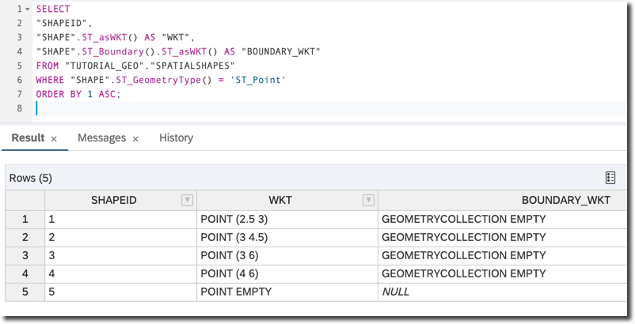

The boundary for line strings is a collection of their end points.

```sql
SELECT
"SHAPEID",
"SHAPE".ST_asWKT() AS "WKT",
"SHAPE".ST_Boundary().ST_asWKT() AS "BOUNDARY_WKT"
FROM "TUTORIAL_GEO"."SPATIALSHAPES"
WHERE "SHAPE".ST_GeometryType() = 'ST_LineString'
ORDER BY 1 ASC;
```

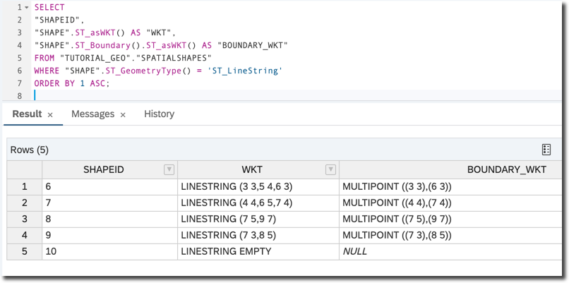

The boundary for multi line strings is a collection of all their end points of individual line strings in the collection.

```sql
SELECT
ST_UnionAggr("SHAPE").ST_asWKT() AS "WKT",
ST_UnionAggr("SHAPE").ST_Boundary().ST_asWKT() AS "BOUNDARY_WKT"
FROM "TUTORIAL_GEO"."SPATIALSHAPES"
WHERE "SHAPE".ST_GeometryType() = 'ST_LineString';
```

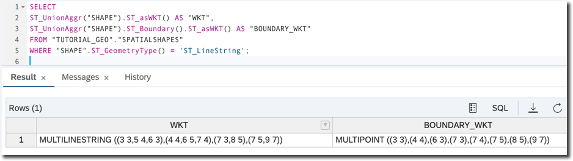

A ring --- a special case of a string where the start point is the same as the end point and there are no self-intersections --- has no boundary.

```sql
SELECT
NEW ST_LineString('LINESTRING (6 7,10 3,10 10,6 7)').ST_Boundary().ST_asWKT() AS "BOUNDARY_WKT"
FROM DUMMY;
```

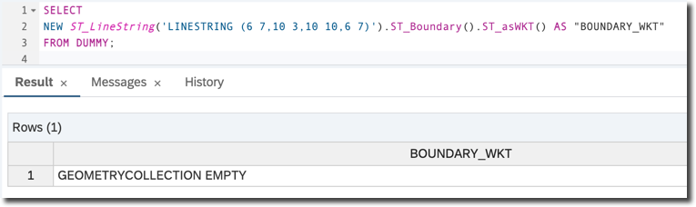

The boundary for a polygon is its outer ring and any inner rings.

```sql
SELECT
"SHAPEID",
"SHAPE".ST_asWKT() AS "WKT",
"SHAPE".ST_Boundary().ST_asWKT() AS "BOUNDARY_WKT"
FROM "TUTORIAL_GEO"."SPATIALSHAPES"
WHERE "SHAPE".ST_GeometryType() = 'ST_Polygon'
ORDER BY 1 ASC;
```

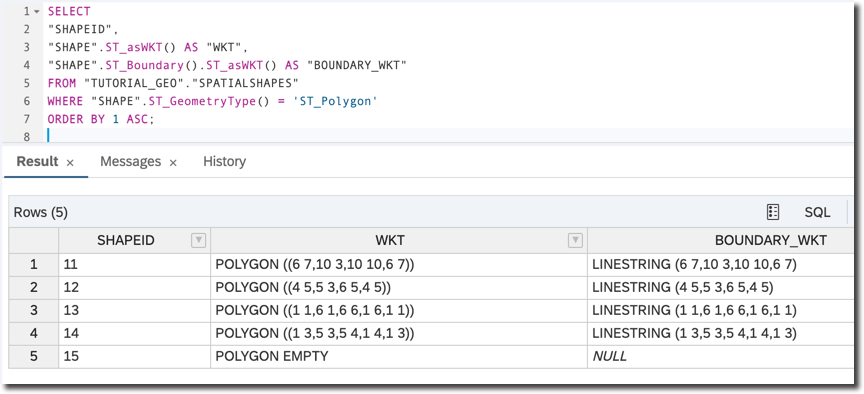

Below is an example for a polygon with the inner ring to illustrate the output containing both the outer and inner rings as a `MULTILINESTRING`.

```sql
SELECT
NEW ST_Polygon('Polygon ((-5 -5, 5 -5, 0 5, -5 -5), (-2 -2, -2 0, 2 0, 2 -2, -2 -2))').ST_Boundary().ST_asWKT()
FROM DUMMY;
```

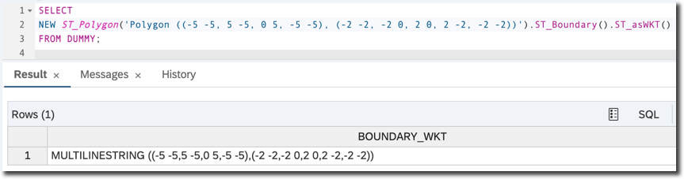

Obviously the length of a boundary is equal to the perimeter of a polygon.

```sql
SELECT
"SHAPEID",
"SHAPE".ST_asWKT() AS "WKT",
"SHAPE".ST_Boundary().ST_Length() AS "BOUND_LENGTH",
"SHAPE".ST_Perimeter() AS "PERIMETER"
FROM "TUTORIAL_GEO"."SPATIALSHAPES"
WHERE "SHAPE".ST_GeometryType() = 'ST_Polygon'
ORDER BY 1 ASC;
```

[DONE]
[ACCORDION-END]

[ACCORDION-BEGIN [Step 2: ](Envelope)]

`ST_Envelope()` method returns the bounding rectangle for a geometry. This method cannot be used with geometries in a round-Earth spatial reference system.

```sql
SELECT
"SHAPEID",
"SHAPE".ST_asWKT() AS "WKT",
"SHAPE".ST_Envelope().ST_asWKT() AS "ENVELOPE_WKT"
FROM "TUTORIAL_GEO"."SPATIALSHAPES"
WHERE "SHAPEID" IN (3, 7, 12)
ORDER BY 1 ASC;
```

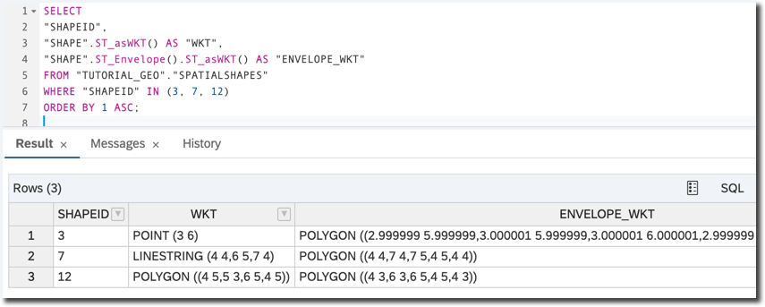

Below are visualizations of boundaries for two geometry types: string (for the shape with `id = 7` from `"TUTORIAL_GEO"."SPATIALSHAPES"`) and polygon (`id = 11`).

```sql
SELECT
ST_asSVGAggr("SHAPE") AS "SHAPES_SGV",
ST_asSVGAggr("ENVELOPE") AS "ENVELOPE_SGV"
FROM
(
SELECT
"SHAPE",
"SHAPE".ST_Envelope() as "ENVELOPE"
FROM "TUTORIAL_GEO"."SPATIALSHAPES"
WHERE "SHAPEID" IN (7, 11)
);
```

Combine returned SVG outputs into one and modify drawing parameters to display initial geometries in red, and envelopes with thicker lines (`stroke-width='0.2%'`) to get SVG like below.

```XML
<?xml version="1.0" standalone="no"?>
<!DOCTYPE svg PUBLIC "-//W3C//DTD SVG 1.1//EN"
"http://www.w3.org/Graphics/SVG/1.1/DTD/svg11.dtd">
<svg xmlns="http://www.w3.org/2000/svg" version="1.1" viewBox="3.9 -10.1 6.2 7.2">
<path fill="none"  stroke='red' stroke-width='0.1%' d="M 4,-4 l 2,-1 1,1 "/>
<path fill='red' stroke='red' stroke-width='0.1%' d="M 6,-7 l 4,4 0,-7 Z"/>

<path fill='none' stroke='black' stroke-width='0.2%' d="M 4,-4 l 3,0 0,-1 -3,0 Z"/>
<path fill='none' stroke='black' stroke-width='0.2%' d="M 6,-3 l 4,0 0,-7 -4,0 Z"/>
</svg>
```

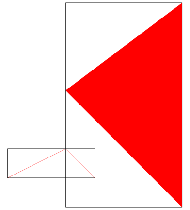

[DONE]
[ACCORDION-END]

[ACCORDION-BEGIN [Step 3: ](Convex hull)]

`ST_ConvexHull` method returns the convex hull of the geometry value.

```sql
SELECT
"SHAPE".ST_GeometryType() AS "GEOM_TYPE",
ST_asSVGAggr("SHAPE") AS "SHAPE", ST_UnionAggr("SHAPE").ST_ConvexHull().ST_asSVG() AS "CONVEXHULL_SGV"
FROM "TUTORIAL_GEO"."SPATIALSHAPES"
GROUP BY "SHAPE".ST_GeometryType();
```

Below is slightly modified SVG to better display original geometries (in red) and the convex hull (in blue).

For points:
```xml
<svg xmlns="http://www.w3.org/2000/svg" version="1.1" viewBox="2.4 -6.1 1.6 3.2">
<rect width="0.5%" height="0.5%" fill='grey' stroke='red' stroke-width='0.1%' x="2.5" y="-3"/>
<rect width="0.5%" height="0.5%" fill='grey' stroke='red' stroke-width='0.1%' x="3" y="-4.5"/>
<rect width="0.5%" height="0.5%" fill='grey' stroke='red' stroke-width='0.1%' x="3" y="-6"/>
<rect width="0.5%" height="0.5%" fill='grey' stroke='red' stroke-width='0.1%' x="4" y="-6"/>

<path fill="none" stroke="blue" stroke-width="0.3%" d="M 2.5,-3 l 1.5,-3 -1,0 Z"/>
</svg>
```

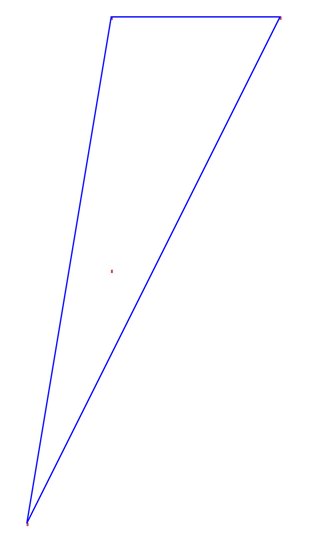

For lines:
```xml
<svg xmlns="http://www.w3.org/2000/svg" version="1.1" viewBox="2.9 -7.1 6.2 4.2">
<path fill="none"  stroke='red' stroke-width='0.5%' d="M 3,-3 l 2,-1 1,1 "/>
<path fill="none"  stroke='red' stroke-width='0.5%' d="M 4,-4 l 2,-1 1,1 "/>
<path fill="none"  stroke='red' stroke-width='0.5%' d="M 7,-5 l 2,-2 "/>
<path fill="none"  stroke='red' stroke-width='0.5%' d="M 7,-3 l 1,-2 "/>

<path fill="none" stroke="blue" stroke-width="0.1%" d="M 7,-3 l 2,-4 -5,3 -1,1 Z"/>
</svg>
```

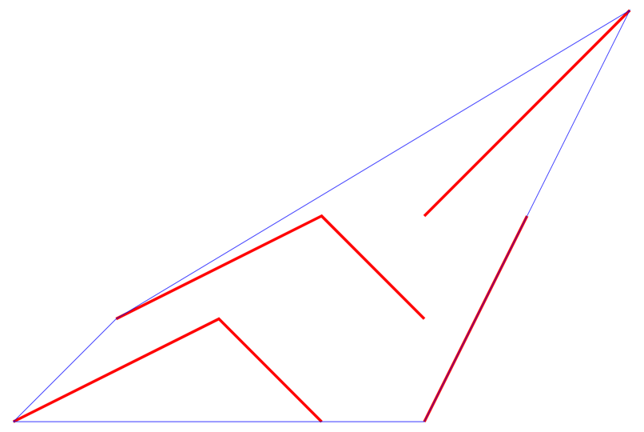

For polygons:
```xml
<svg xmlns="http://www.w3.org/2000/svg" version="1.1" viewBox=".9 -10.1 9.1 9.2">
<path fill='grey' stroke='red' stroke-width='0.5%' opacity="0.75" d="M 6,-7 l 4,4 0,-7 Z"/>
<path fill='grey' stroke='red' stroke-width='0.5%' opacity="0.75" d="M 4,-5 l 1,2 1,-2 Z"/>
<path fill='grey' stroke='red' stroke-width='0.5%' opacity="0.75" d="M 1,-1 l 5,0 0,-5 -5,0 Z"/>
<path fill='grey' stroke='red' stroke-width='0.5%' opacity="0.75" d="M 1,-3 l 4,0 0,-1 -4,0 Z"/>

<path fill="none" stroke="blue" stroke-width="0.1%" d="M 6,-1 l 4,-2 0,-7 -9,4 0,5 Z"/>
</svg>
```


[DONE]
[ACCORDION-END]

[ACCORDION-BEGIN [Step 4: ](Buffer)]
`ST_Buffer` method returns the geometry that represents all points whose distance from any point of an input geometry is less than or equal to a specified distance.

```sql
SELECT
"SHAPEID",
"SHAPE".ST_asWKT() AS "WKT",
"SHAPE".ST_Buffer(0.5).ST_asWKT() AS "BUFFER_WKT"
FROM "TUTORIAL_GEO"."SPATIALSHAPES"
WHERE "SHAPEID" IN (3, 7, 11)
ORDER BY 1 ASC;
```

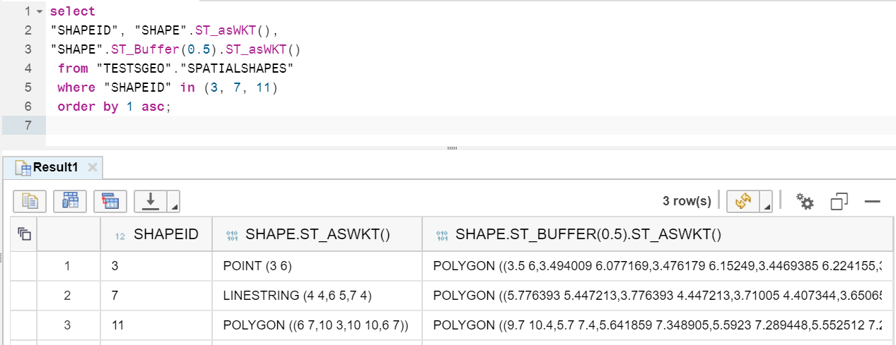

Visualize using the following SQL...

```sql
SELECT
ST_asSVGAggr("SHAPE"),
ST_asSVGAggr("BUFFER")
FROM (
SELECT
"SHAPE",
"SHAPE".ST_Buffer(0.5) AS "BUFFER"
FROM "TUTORIAL_GEO"."SPATIALSHAPES"
WHERE "SHAPEID" IN (3, 7, 11)
);
```

...and modify SVG output for a better visualization.

```xml
<svg xmlns="http://www.w3.org/2000/svg" version="1.1" viewBox="2.4 -10.6 8.1 8.2">
<rect width="0.1%" height="0.1%" fill='grey' stroke='red' stroke-width='0.1%' x="3" y="-6"/>
<path fill="none"  stroke='red' stroke-width='0.1%' d="M 4,-4 l 2,-1 1,1 "/>
<path fill='red' stroke='red' stroke-width='0.1%' d="M 6,-7 l 4,4 0,-7 Z"/>

<path fill='grey' stroke='blue' stroke-width='0.1%' opacity="0.25" d="M 3.5,-6 l -.00599,-.07717 -.01783,-.07532 -.02924,-.07167 -.03995,-.06629 -.04971,-.05933 -.05826,-.05095 -.06543,-.04135 -.07103,-.03076 -.07493,-.01942 -.07702,-.00763 -.01061,-.00011 -.07717,.00599 -.07532,.01783 -.07167,.02924 -.06629,.03995 -.05933,.04971 -.05095,.05826 -.04135,.06543 -.03076,.07103 -.01942,.07493 -.00763,.07702 -.00011,.01061 .00599,.07717 .01783,.07532 .02924,.07167 .03995,.06629 .04971,.05933 .05826,.05095 .06543,.04135 .07103,.03076 .07493,.01942 .07702,.00763 .01061,.00011 .07717,-.00599 .07532,-.01783 .07167,-.02924 .06629,-.03995 .05933,-.04971 .05095,-.05826 .04135,-.06543 .03076,-.07103 .01942,-.07493 .00763,-.07702 Z"/>
<path fill='grey' stroke='blue' stroke-width='0.1%' opacity="0.25" d="M 5.77639,-5.44721 l -2,1 -.06634,.03987 -.0594,.04963 -.05102,.0582 -.04143,.06538 -.03084,.07099 -.01951,.07491 -.00772,.07701 -.00013,.01122 .00599,.07717 .01783,.07532 .02897,.07112 .03987,.06634 .04963,.0594 .0582,.05102 .06538,.04143 .07099,.03084 .07491,.01951 .07701,.00772 .01122,.00013 .07717,-.00599 .07532,-.01783 .07112,-.02897 1.67766,-.83883 .74518,.74517 .0588,.05033 .06587,.04066 .07135,.03 .07512,.01862 .07711,.00681 .0053,.00003 .07717,-.00599 .07532,-.01783 .07167,-.02924 .06629,-.03995 .05933,-.04971 .05096,-.05826 .04134,-.06543 .03076,-.07103 .01942,-.07493 .00763,-.07702 .00011,-.01061 -.00599,-.07717 -.01783,-.07532 -.02924,-.07167 -.03995,-.06629 -.04971,-.05933 -1.00373,-1.00377 -.0588,-.05033 -.06587,-.04066 -.07135,-.03 -.07512,-.01862 -.0771,-.00681 -.00531,-.00003 -.07717,.00599 -.07532,.01783 Z"/>
<path fill='grey' stroke='blue' stroke-width='0.1%' opacity="0.25" d="M 9.7,-10.4 l -4,3 -.05814,.0511 -.04956,.05945 -.03979,.0664 -.02906,.07173 -.01765,.07537 -.0058,.07595 .00599,.07717 .01783,.07532 .02924,.07167 .03995,.06629 .04971,.05934 4.00373,4.00376 .0588,.05033 .06587,.04066 .07135,.02999 .07512,.01863 .07711,.00681 .0053,.00003 .07717,-.00599 .07532,-.01783 .07167,-.02924 .06629,-.03995 .05933,-.04971 .05095,-.05826 .04135,-.06543 .03076,-.07103 .01942,-.07493 .00763,-.07702 .00011,-.01061 0,-7 -.00599,-.07717 -.01783,-.07532 -.02924,-.07167 -.03995,-.06629 -.04971,-.05933 -.05826,-.05095 -.06543,-.04135 -.07103,-.03076 -.07493,-.01942 -.07702,-.00763 -.01061,-.00011 -.07717,.00599 -.07532,.01783 -.07166,.02924 -.0663,.03995 Z"/>
</svg>
```


[VALIDATE_1]
[ACCORDION-END]

### Optional
- You can find all available methods in [SAP HANA Spatial Reference](https://help.sap.com/viewer/bc9e455fe75541b8a248b4c09b086cf5/2020_04_QRC/en-US/7a13f280787c10148dc893063dfed1c4.html).
