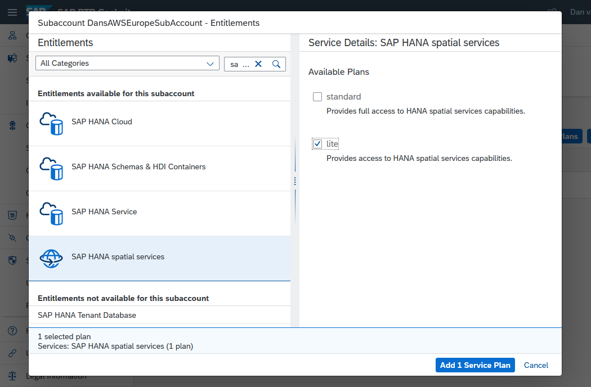

# Access SAP HANA Spatial Service APIs
<!-- description --> Explore select functionality available in SAP HANA Spatial Services  including geocoding, mapping and routing.

## Prerequisites
  - Access to an SAP Business Technology Platform account with the ability to add the SAP HANA Spatial Service
  - A tool such as the REST Client extension for Visual Studio Code enabling the calling of a REST API
  - A development tool such as Visual Studio Code or the SAP Business Application Studio to create Python and Node.js applications

## You will learn
  - How to subscribe to the SAP HANA Spatial Service in the SAP Business Technology Platform
  - How to use the REST API for geocoding, mapping, and routing services
  - How to call these services from a sample program

## Intro
[SAP HANA Spatial Services](https://help.sap.com/docs/SAP_HANA_SPATIAL_SERVICES) provide a unified interface to spatial services that support various back-end service providers such as Here and `Esri`.  These services can be accessed through a REST API and provide support for geocoding, routing, and mapping.  Details of these REST APIs can also be found in the [SAP API Business Hub](https://api.sap.com/search?searchterm=sap%20hana%20spatial%20services&tab=All&refinedBy=true&top=12).


> The video [Access HANA Spatial Services APIs Using Visual Studio Code](https://sapvideoa35699dc5.hana.ondemand.com/?entry_id=1_1gh36cjc) provides a demonstration of accessing the three APIs.

---

### Setup
Full details on the setup can be found at [SAP HANA Spatial Services Onboarding Guide](https://help.sap.com/docs/SAP_HANA_SPATIAL_SERVICES/4e2337c5371a4ac18195cfe751514735/dd6f736b34664a7996b0792cd1f690bb.html).  The following is a brief summary of the required steps.

1. Regions where SAP HANA Spatial Services are available can be found in the [SAP Discovery Center](https://discovery-center.cloud.sap/serviceCatalog/sap-hana-spatial-services?service_plan=lite&region=all&commercialModel=cpea&tab=service_plan).

    

2. After creating a subaccount in one of the regions that offers the SAP HANA Spatial Services, add the entitlement.

    

    >Additional details on adding entitlements can be found at [Add a New Entitlement to Your Subaccount](cp-cf-entitlements-add).

3. Create a service instance.  

    

4. Add a service key to the service which provides the URL and credentials to access the service.

    

    >When creating a service key, a JSON file or parameters section is not needed and can be left empty.

### Get started with the REST Client extension for Visual Studio Code

There are multiple tools that enable making calls to a REST API such as Postman, browser extensions, libraries in programming languages such as [requests](https://realpython.com/api-integration-in-python/#rest-and-python-consuming-apis) in Python or [https](https://nodejs.org/api/https.html) in Node.js.  Feel free to use the tool of your choice.  This tutorial will be using the [REST Client](https://marketplace.visualstudio.com/items?itemName=humao.rest-client) extension for Visual Studio Code.  The following content demonstrates how to make a REST API call in general.

1. If required, download [Visual Studio Code](https://code.visualstudio.com/Download).

2. Create a folder and a text file that will contain REST API calls and open the file with Visual Studio Code.

    ```Shell (Microsoft Windows)
    mkdir %HOMEPATH%\HSSTutorial
    cd %HOMEPATH%\HSSTutorial
    code HSS.http
    ```

3. Paste the following into the opened file and save it.

    ```HTTP
    #Example REST API call
    #From https://stackoverflow.com/questions/5725430/http-test-server-accepting-get-post-requests and
    GET https://httpbin.org/get?firstname=Bob&lastname=Smith

    ###

    #Example REST API call
    #From https://www.twilio.com/blog/2017/08/http-requests-in-node-js.html
    GET https://api.nasa.gov/planetary/apod?api_key=DEMO_KEY

    ###

    #Pet Store
    #From https://petstore.swagger.io/#/pet/findPetsByStatus
    GET https://petstore.swagger.io/v2/pet/findByStatus?status=available

    ###
    ```

    >The # is used as a single line comment character and ### is used to separate REST API calls.

4. Add the REST Client extension from Marketplace after opening the extensions view.

    <!-- border -->

5. Try calling the sample REST APIs by clicking on the blue text `Send Request`.  

    <!-- border -->

    The results should appear in another pane.  An example result is shown below.

    

    Notice that the URL includes the URL parameters `firstname` and `lastname`.  The first parameter is indicated with a `?`, while the subsequent parameters are indicated by an `&`.


### Request a bearer token to enable access to the REST APIs

The following steps are required to create a bearer token that will be used in subsequent steps that make REST API calls.  The bearer token is generated by a login request and can be understood as "give access to the bearer of this token".  Additional details can be found at [User Account and Authorization Service](https://docs.cloudfoundry.org/api/uaa/version/75.7.0/index.html#token) for Cloud Foundry.

1. In the SAP BTP Cockpit, navigate to the previously created SAP HANA Spatial Services instance and select the service key.

    

2. View the created service key.  The next step will require the `uri`, `uaa.url`, `clientid`, and `clientsecret` values.

    

3. Replace the contents of HSS.http file with the contents below.  Highlighted values are to be updated with details from your service key.

    ```HTTP[4, 8, 11, 14 ]
    #REST Client variables -------------------

    #From the uri, last field in the service key
    @uri =
    @oauth = oauth/token?grant_type=client_credentials

    #From the uaa.url field.
    @uaa_url =

    #From the clientid field.  
    @clientid =

    #From the clientsecret field.  
    @clientsecret =

    #Generated by the request bearer token call.  Copy the access_token value from the result without the quotes
    @bearer =

    #Authorization REST API call --------------------

    #Request Bearer Token
    GET {{uaa_url}}/{{oauth}}
    Authorization: Basic {{clientid}}:{{clientsecret}}

    ###
    ```

4. Execute the Request Bearer Token call using the Send Request link.  Copy the returned `access_token` value to the **bearer** variable on line 17 of the file HSS.http.

    


### Geocoding

The following instructions will demonstrate how to provide one or more addresses and generate longitude and latitude values for each address.  Further details are available at [Geocoding API v1](https://help.sap.com/docs/SAP_HANA_SPATIAL_SERVICES/c7837a0d78e24fb5b9f66a058ab9f730/d2309e6309584d6db7b23ba4cacd9af1.html).

1. Add the following to the bottom of HSS.http.

    ```HTTP
    #Geocoding example
    POST {{uri}}/geocoding/v1/geocode
    Authorization: Bearer {{bearer}}
    content-type: application/json

    {
        "credentials": {
            "provider": "Here",
            "api_key": "SAP-KEY"
        },
        "addresses": [
            "445 Wes Graham Way, Waterloo",
            "Seagram Drive, Waterloo"
        ]
    }

    ###
    ```

2. Send the request to use the Here provider to geocode the provided address for the SAP Waterloo Labs office.

    

    A returned value can be verified by entering it into Google Maps as shown below.

    

3. An example of making the REST API call in a Python program is shown below.

    Install the requests module and create and edit a Python file.

    ```Shell
    pip install requests
    code geocode.py
    ```

     Copy the below code into geocode.py.  Highlighted values are to be updated with details from your service key.  Sensitive values could alternatively be read from environment variables.

    ```Python[6, 7, 9]
    #Import your dependencies
    import requests, os, json

    #request a bearer token
    #update uri, oauth_url, and auth values to match values from your service key
    uri = ""
    oauth_url = "" + "/oauth/token?grant_type=client_credentials"
    #Fill in clientID and clientsecret values below
    auth = ("","")
    #A better practice is to access credential values from environment variables
    #auth = os.environ.get('clientid'), os.environ.get('clientsecret'))
    response = requests.post(oauth_url, auth=auth)

    bearer_token = json.loads(response.text)
    #print('Auth token: ', bearer_token)

    #call the geocode REST API
    request_headers = {
        'accept': 'application/json',
        'content-type': 'application/json',
        'authorization': 'Bearer '+ bearer_token.get('access_token')
    }

    json_data = { "credentials": {
            "provider": "Here",
            "api_key": "SAP-KEY"
        },
        "addresses": [
            "445 Wes Graham Way, Waterloo",
            "Seagram Drive, Waterloo"
        ]}

    response = requests.post(uri + "/geocoding/v1/geocode", headers=request_headers, json=json_data)
    geocode_result = json.loads(response.text)
    print(json.dumps(geocode_result, indent=2))
    ```

    ```Shell
    python geocode.py
    ```

    

### Routing

The following instructions will demonstrate how to take two addresses and generate a set of directions between the two addresses.  Further details are available at [Routing API v1](https://help.sap.com/docs/SAP_HANA_SPATIAL_SERVICES/c7837a0d78e24fb5b9f66a058ab9f730/b42fac7d6e3e4d12a32bf4e0b2d262e9.html).

1. Add the following to the bottom of `HSS.http`.

    ```HTTP
    #Routing example
    #geojson result can be viewed on a map at https://geojson.io/#
    POST {{uri}}/routing/v1/route
    Authorization: Bearer {{bearer}}
    content-type: application/json

    {
      "credentials": {
        "provider": "Here",
        "api_key": "SAP-KEY"
      },
      "waypoints": {
        "type": "MultiPoint",
        "coordinates": [
                [
                    -80.55128,
                    43.48032
                ],
                [
                    -80.53434,
                    43.46942
                ]
          ]
      },
      "vehicleType": "pedestrian"
    }

    ###
    ```

2. Send the request to use the Here provider to get route details between the two provided addresses.  The following is the returned `geojson` response.

    

    A few of the returned values are explained below:  

    * `coordinates` is an array of the points that show the route selected.

    * `length` is the distance of the route in meters.

    * `duration` is the time the route will take in seconds.

    In the above example, the route is 2 and 1/2 Kilometers and should take 44 minutes to walk.


3. The returned result can also be shown on a map that accepts `geojson` results as shown below.

    

4. An example of making the REST API call in a Node.js application is shown below.

    Initialize a Node project, install node-fetch and create and edit a JavaScript file.

    ```Shell
    npm init -y
    npm install node-fetch@2
    code route.js
    ```

    Copy the below code into route.js.  Highlighted values are to be updated with details from your service key.  Sensitive values could alternatively be read from environment variables.

    ```JavaScript[3, 4, 6]
    const fetch = require('node-fetch');

    const oauth_url = "" + "/oauth/token?grant_type=client_credentials";
    const uri = "";
    //Fill in clientID and clientsecret values below
    const auth = "Basic " + Buffer.from("" + ":" + "").toString('base64');
    //const auth = "Basic " + Buffer.from(process.env.clientid + ":" + process.env.clientsecret).toString('base64');
    //Note, on Windows, precede | with ^| in the clientid when setting the environment variable

    const outh_headers = {
      "Content-Type": "application/json",
      "Authorization": auth
    }

    var request_headers = {
      "Content-Type": "application/json",
      "authorization": "Bearer "
    }

    const json_data = {
      "credentials": {
        "provider": "Here",
        "api_key": "SAP-KEY"
      },
      "waypoints": {
        "type": "MultiPoint",
        "coordinates": [
          [
            -80.55128,
            43.48032
          ],
          [
            -80.53434,
            43.46942
          ]
        ]
      },
      "vehicleType": "pedestrian"
    }

    //Get the bearer token
    fetch(oauth_url, { method: 'GET', headers: outh_headers })
      .then((res) => {
        return res.json()
      })
      .then((auth_result) => {
        //Add the bearer token to the authorization header
        request_headers.authorization = request_headers.authorization + auth_result.access_token;

        //make a routing request
        fetch(uri + "/routing/v1/route", { method: 'POST', headers: request_headers, body: JSON.stringify(json_data) })
          .then((res) => {
            return res.json()
          })
          .then((routing_result) => {
            console.log(JSON.stringify(routing_result, null, 2));
          });
      });
    ```

    


### Mapping

The following instructions will demonstrate how to use the mapping service to return a map tile.  Further details are available at [Mapping API 1.0](https://help.sap.com/docs/SAP_HANA_SPATIAL_SERVICES/c7837a0d78e24fb5b9f66a058ab9f730/becaeffd263f41228081c3ec2c726101.html).

1. Add the following to the bottom of `HSS.http`.

    ```HTTP
    #Mapping examples
    GET {{uri}}/mapping/v1/here/tiles/maptile/newest/normal.day/4/8/5/256/png
    Authorization: Bearer {{bearer}}

    ###

    GET {{uri}}/mapping/v1/here/tiles/maptile/newest/normal.day/4/4/6/512/png
    Authorization: Bearer {{bearer}}

    ###
    ```

    The parameters used in this example are explained below:  

    * `provider` in this example is Here.

    * `zoom/column/row` these values are further explained at [Here Map Tile](https://developer.here.com/documentation/map-tile/dev_guide/topics/request-constructing.html) documentation.

    * `size` is the pixel size of the map tile such as 256 or 512.

2. Send the requests to use the Here provider to return map tiles.

    

3. A mapping control such as the [SAP Fiori GeoMap](https://sapui5.hana.ondemand.com/sdk/#/api/sap.ui.vbm.GeoMap%23overview) can be used to display multiple map tiles and provide items on the map.  The video [Using the SAP HANA Spatial Services Mapping API in a Fiori App](https://sapvideoa35699dc5.hana.ondemand.com/?entry_id=1_ra527yhr) provides a demonstration of this.


### Knowledge check    


Congratulations! You have now used the HANA Spatial Services to perform geocoding, routing, and mapping.  Upcoming features can be seen on the [SAP Road Map Explorer](https://roadmaps.sap.com/board?range=CURRENT-LAST&PRODUCT=73555000100800001421#Q4%202022).


---
