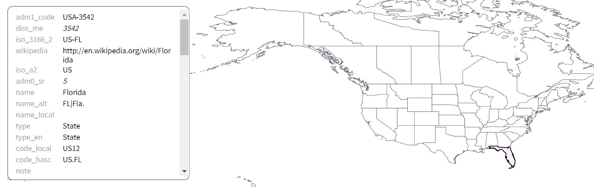
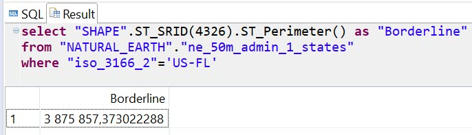
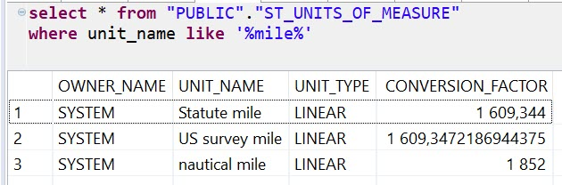
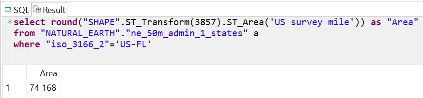
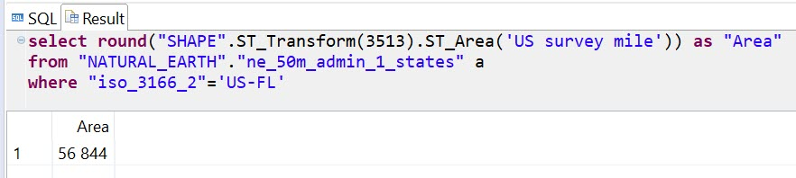
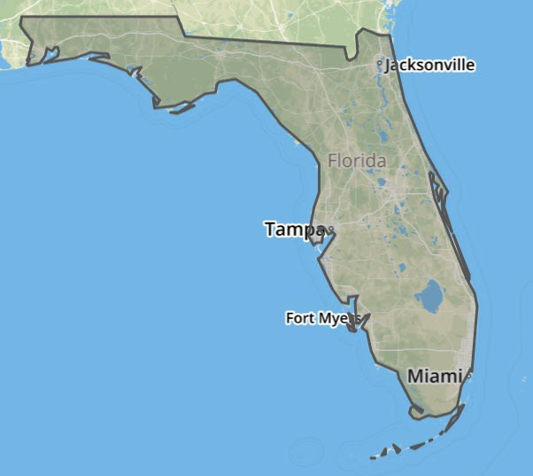
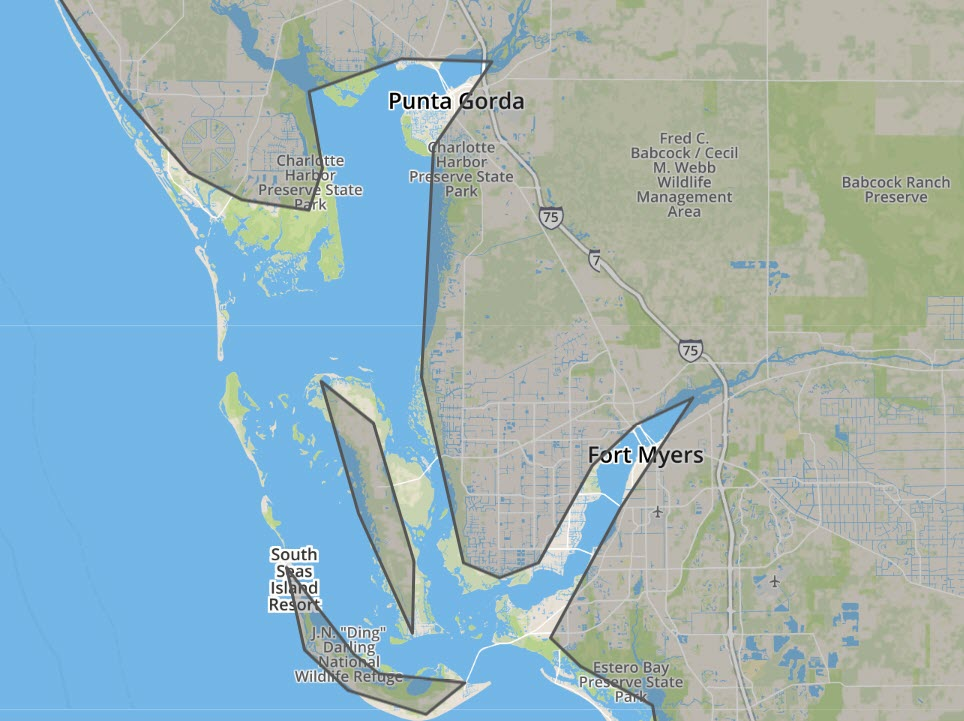
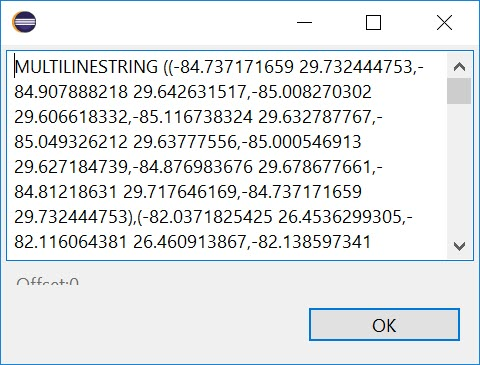
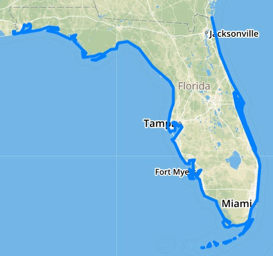
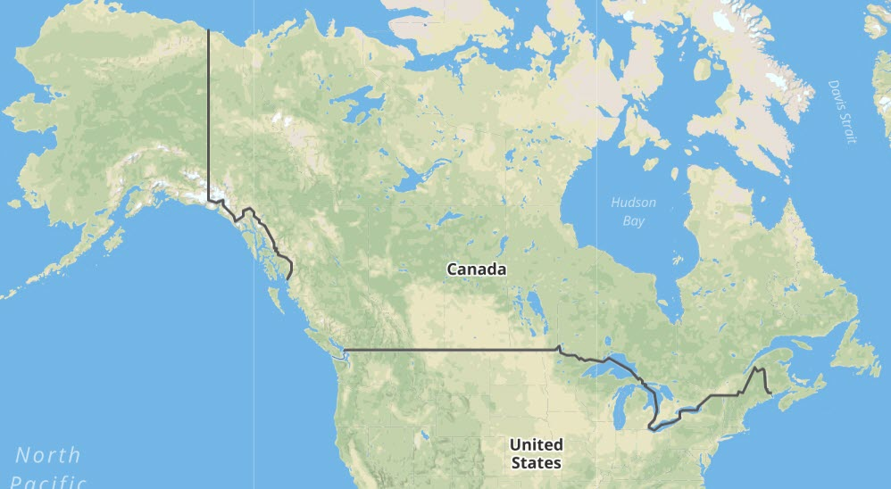

## Prerequisites  
 - **Proficiency:** Beginner

## Details
### You will learn  
  - How to use SAP HANA to analyze data from Shapefiles

### Time to Complete
**5 Min**

---

[ACCORDION-BEGIN [Step 1: ](Natural Earth data)]
Natural Earth website is one of the most popular resources of open geodata.

One of these files -- `Admin 1` (States, provinces) administrative boundaries in scale `1:50m` -- has been imported into `"NATURAL_EARTH"."ne_50m_admin_1_states"` table, but only for the USA and Canada.



Again, geographical shapes of states and provinces are stored in the column `"SHAPE"` with `SRID = 1000004326`, i.e. planar projection.

[ACCORDION-END]

[ACCORDION-BEGIN [Step 2: ](Borderline of Florida)]
Let's take Florida as an example. What is a total length of the state's borderline?

```sql
select "SHAPE".ST_SRID(4326).ST_Perimeter() as "Borderline"
from "NATURAL_EARTH"."ne_50m_admin_1_states"
where "iso_3166_2"='US-FL';
```



> ### What just happened?
>
> 1. You used spatial method `ST_Perimeter()` to calculate the length of the perimeter of a multi-surface.
> 2. Before doing that you converted a shape from a flat plane (as it is stored using SRID `1000004326`) to a shape on the Round Earth model `4326` to produce the most precise result.
> 3. The result `3875857,373022288` is the length in meters, as `meter` is the default linear unit of measure defined for `SRID` = `4326`.

Let's check if you can calculate the perimeter in miles. The table `"PUBLIC"."ST_UNITS_OF_MEASURE"` stores definitions of spatial units of measures, and is a part of the geospatial content in SAP HANA.

```sql
select * from "PUBLIC"."ST_UNITS_OF_MEASURE"
where unit_name like '%mile%';
```



Let's recalculate the borderline in US survey miles, but rounded.

```sql
select round("SHAPE".ST_SRID(4326).ST_Perimeter('US survey mile')) as "Borderline"
from "NATURAL_EARTH"."ne_50m_admin_1_states"
where "iso_3166_2"='US-FL'
```


[ACCORDION-END]


[ACCORDION-BEGIN [Step 3: ](Area of Florida)]

To calculate the area of the geography, you need to convert it to the planar projection. Unfortunately, every projection of Round Earth or its fragments on a flat surface is introducing some distortion.

```sql
select round("SHAPE".ST_Transform(3857).ST_Area('US survey mile')) as "Area"
from "NATURAL_EARTH"."ne_50m_admin_1_states" a
where "iso_3166_2"='US-FL';
```



> ### What just happened?
>
>1. [SRS `3857`](https://epsg.io/3857) is the spatial reference system used by online web maps, like OpenStreetMap, Google Maps, Bing Maps etc.
> 2. It is a projection for the whole globe. And because it is based on the so called Mercator projection, distances are significantly increasing the further from Equator the geography is located.

You need to use a projection with the least distortion for the area you are processing. Local projections are being used for higher precision, like [SRS `3513`](https://epsg.io/3513) for Florida.

```sql
select round("SHAPE".ST_Transform(3513).ST_Area('US survey mile')) as "Area"
from "NATURAL_EARTH"."ne_50m_admin_1_states" a
where "iso_3166_2"='US-FL';
```



Unfortunately, it is still not precise measurement, as the details of shapes loaded from the original file are rather rough. You can see it on the visualizations comparing complete state ...



... to a zoomed area.



[ACCORDION-END]

[ACCORDION-BEGIN [Step 4: ](Coastline of Florida)]
Let's calculate a geometry that is a coastline of Florida. This example shows the use of a spatial set operations and aggregations.

```sql
with "FL_Boarder" as
(select "SHAPE".ST_Boundary() as "SHAPE"
from "NATURAL_EARTH"."ne_50m_admin_1_states" a
where "iso_3166_2"='US-FL'),

"FL_LandBoarder" as
(select ST_unionAggr(b."SHAPE".ST_Intersection(c."SHAPE")) as "SHAPE"
from "NATURAL_EARTH"."ne_50m_admin_1_states" b
join "NATURAL_EARTH"."ne_50m_admin_1_states" c on 1=1
where 'US-FL' <> c."iso_3166_2"
and b."iso_3166_2" = 'US-FL')

select m."SHAPE".ST_Difference(n."SHAPE").st_asWKT()
from
"FL_Boarder" m,
"FL_LandBoarder" n;
```

The result is a collection of string lines ...



... which visualized looks like this.



> ### What just happened?
>
> 1. You used `with` clause in `SELECT` statement to specify an output of subqueries to be stored in two temporary result sets: `"FL_Boarder"` and `"FL_LandBoarder"`.
> 2. For `"FL_Boarder"` you used a `ST_Boundary()` spatial method to return the boundary of the geometry representing the state of Florida.
> 3. For `"FL_LandBoarder"` you used a spatial aggregation `ST_unionAggr()` to calculate the spatial union of all of the borders of Florida with other states on land. Same as in exercise with country borders you used `ST_Intersection()` to calculate line strings representing those land boarders.
> 4. At the end you used a spatial set method `ST_Difference()` to calculate a geometry that represents difference of two geometries above. The spatial difference between a total boundary of Florida and its borders on land gave you the coastline - exactly what we needed to calculate in this step.

[ACCORDION-END]

[ACCORDION-BEGIN [Step 5: ](Calculate US-Canadian border)]
In tables, you only have shapes of states and provinces. Can we calculate the Canada–United States border based on this? Sure, with the help of spatial aggregates and set operations again!

```sql
select ST_UnionAggr(us.shape.ST_Intersection(ca.shape)) as "Border"
from "NATURAL_EARTH"."ne_50m_admin_1_states"  us
join "NATURAL_EARTH"."ne_50m_admin_1_states"  ca
 on 1=1
where us."iso_a2" in ('US') and ca."iso_a2" in ('CA');
```

And visualized.



> ### What just happened?
>
> 1. The query is similar to a subquery from previous step, it is just now you selected only states of the USA for one side of a join and only provinces of Canada for the other side.
> 2. The spatial union aggregation of the intersections of these geometries in the join gave you the total land boarder between two countries.

[ACCORDION-END]

---
