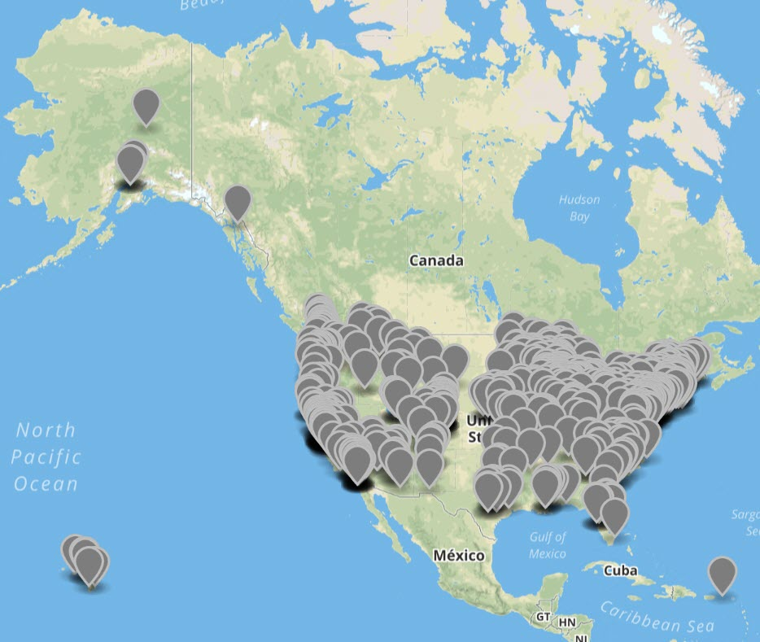
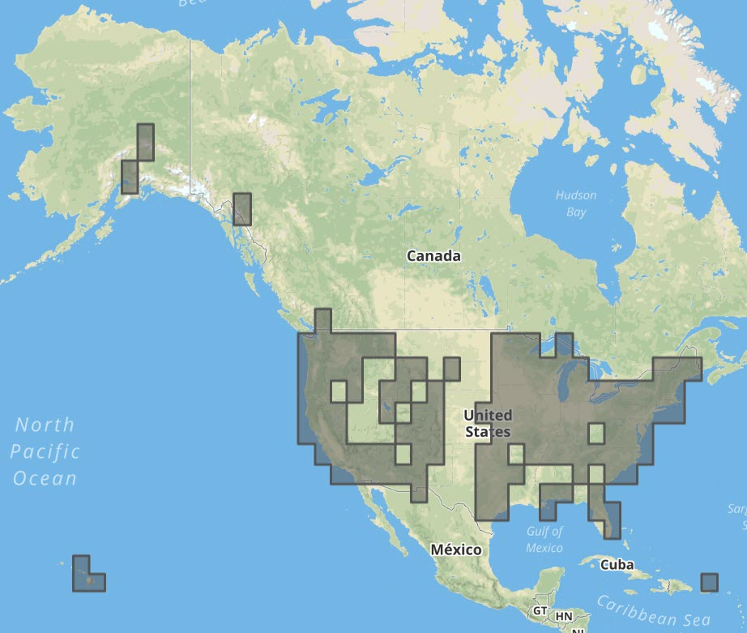
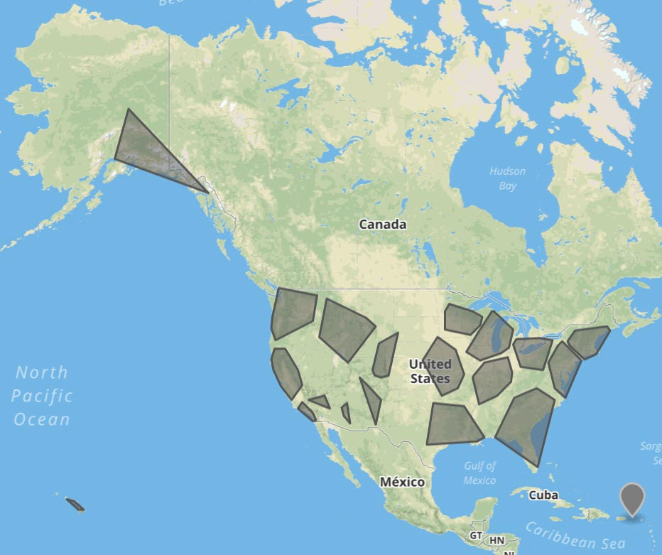
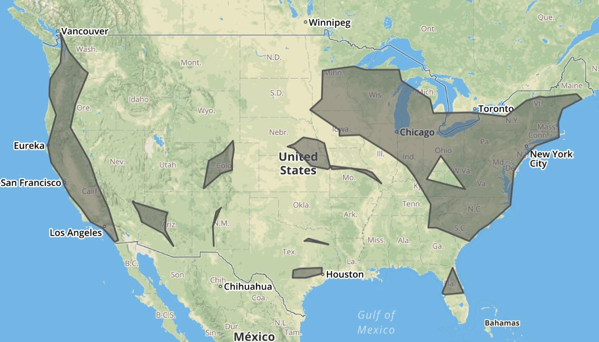
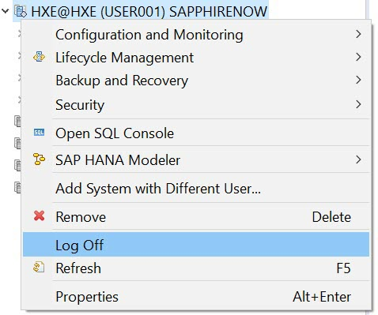

## Prerequisites  
 - **Proficiency:** Beginner

## Details
### You will learn  
 - How to use SAP HANA's spatial clustering to analyze Points of Interest data

### Time to Complete
**5 Min**

---

[ACCORDION-BEGIN [Step 1: ](Check OpenBeerDB data)]
This time you will analyze geographical distribution of points of interest, using data from `OpenBeerDB` data set as an example. This data set is the list of craft breweries, beers, their styles and categories. The data set was last updated in 2011, but is still OK for the tutorial.

Data has been already loaded into tables:

* `"OPENBEERDB"."BREWERIES"` with breweries attributes,
* `"OPENBEERDB"."BREWERIES_GEO"` with latitude and longitude coordinates. These coordinates were geocoded from address data stored in the table `"BREWERIES"`.

The table `"OPENBEERDB"."BREWERIES_GEO"` has already been extended with two columns:

* `"loc_4326"` contains geographical locations in spatial reference system `4326` (GPS coordinates on the Round Earth model),
* `"loc_3857"` contains locations in spatial reference system `3857` (planar projection used on web maps).

An SQL union `"OPENBEERDB"."V_BREWERIES_GEO"` has been created joining both tables.

[ACCORDION-END]

[ACCORDION-BEGIN [Step 2: ](Select breweries from the US)]
The `OpenBeerDB` data set is covering the entire globe. To select only breweries from the US, you will use the `"country"` attribute of the view.

```sql
select ST_UnionAggr("loc_4326").st_asWKT()
from "OPENBEERDB"."V_BREWERIES_GEO"
where "country" = 'United States';
```

Similarly to previous exercises, you can copy the content of the results cell, and then visualize all American breweries at <http://geojson.io> site. Choose **Meta > Load WKT String**. Paste the content into the input field of a dialog box and click **OK**.



>As a bonus exercise, you can try to use geospatial predicate `ST_Within()` joining data with country shapes from `"GEOTECH"."cntry00"` table!

[ACCORDION-END]


[ACCORDION-BEGIN [Step 3: ](Perform the grid clustering)]

SAP HANA Spatial provides spatial clustering using the algorithms grid, k-means, and DBSCAN. Spatial clustering can be performed on a set of geospatial points.

Grid clustering provides a quick and easy way to use clustering. It is useful for providing a first impression. For deeper analysis, you can use the other algorithms.

```sql
select ST_UnionAggr("Envelope").st_asWKT() from
(select ST_CLUSTERID() AS "CID",
	ST_CLUSTERENVELOPE() AS "Envelope",
	COUNT(*) AS "Number of breweries in this cluster"
 from "OPENBEERDB"."V_BREWERIES_GEO"
 where "country" = 'United States'
 GROUP CLUSTER BY "loc_4326"
USING GRID X CELLS 40 Y CELLS 20
order by 3 desc);
```



> ### What just happened?
>
> 1. Clustering functions are supported as a `GROUP CLUSTER BY` clause. In this example the grid clustering is executed as indicated by the key word `GRID` after `USING`.
> 2. In this query no boundaries were defined, so complete Earth's flat projection is divided into 800 cells: 40 West to East (`X CELLS`) and 20 North to South (`Y CELLS`).
> 3. Each cell with cluster points from `"loc_4326"` receives unique `ST_CLUSTERID()` and gets a result envelop shape `ST_CLUSTERENVELOPE()`.
> 4. At the end all envelops are aggregated using `ST_UnionAggr()`, so that you can visualize them at <http://geojson.io> site.

[ACCORDION-END]

[ACCORDION-BEGIN [Step 4: ](Perform the K-Means clustering)]

The K-means algorithm tries to find an assignment of points to cluster, so that the sum of squared distances of the points to the center of the cluster they belong to is minimal.

```sql
select ST_UnionAggr("ConvexHull").ST_asWKT() from
(select ST_CLUSTERID() AS "CID",
	ST_ConvexHullAggr("loc_3857").ST_Transform(4326) AS "ConvexHull",
	COUNT(*) AS "Number of breweries in this cluster"
 from "OPENBEERDB"."V_BREWERIES_GEO"
 where "country" = 'United States'
 GROUP CLUSTER BY "loc_3857"
 USING KMEANS CLUSTERS 20
order by 3 desc);
```



> ### What just happened?
>
> 1. In this example you executed the K-means spatial clustering, as indicated by the key word `KMEANS` after `USING`.
> 2. The algorithm calculated 20 clusters, as defined by `CLUSTERS 20` parameter.
> 3. This algorithm can be executed only on points on a plane, therefore you used data from column `"loc_3857"`.
> 4. But to be able to visualize it, you transformed results to GPS positions using `SRID 4326`.
> 5. This time you used `ST_ConvexHullAggr()` convex hull spatial aggregation, to build non-overlapping shapes of clusters for visualization.
> 6. At the end you aggregated all shapes into one result, so that you can visualize it at <http://geojson.io> site.

[ACCORDION-END]

[ACCORDION-BEGIN [Step 5: ](Perform the DBSCAN clustering)]

DBSCAN is the Density-based spatial clustering of applications with noise. Accordingly to [Wikipedia](https://en.wikipedia.org/wiki/DBSCAN): "DBSCAN is one of the most common clustering algorithms. It is a density-based clustering algorithm: given a set of points in some space, it groups together points that are closely packed together, marking as outliers points that lie alone in low-density regions."

```sql
select st_unionAggr("cluster") from (
select "cluster_id", st_unionAggr("loc_3857").ST_AlphaShape(250000).st_transform(4326) as "cluster"
from (
SELECT
  ST_ClusterID() OVER (CLUSTER BY "loc_3857" USING DBSCAN EPS 250000 MINPTS 9) AS "cluster_id",
  "brewery_id",
  "loc_3857"
FROM "OPENBEERDB"."V_BREWERIES_GEO"
WHERE "country" = 'United States'
ORDER BY 1, "brewery_id"
)
where "cluster_id" <> 0
group by "cluster_id");
```



> ### What just happened?
>
> 1. This time you used DBSCAN spatial clustering `USING DBSCAN` within SQL Window Function as indicated by a key word `OVER`.
> 2. The clustering algorithm in this example calculated cluster ids for all points where there was a minimum of `9` breweries within a maximum distance of `250,000` meters (`250` kilometers) from each other.
> 3. All outliers got assigned the cluster id `0`, so you excluded them from further processing using a `WHERE` clause.
> 4. To best visualize the shape of calculated point sets of each cluster you used `ST_AlphaShape()` method with radius value of `250,000` meters - same as in DBSCAN algorithm.
> 5. At the end you transformed all coordinates to `SRID 4326` and aggregated into a single result to be able to visualize  at <http://geojson.io> site.

[ACCORDION-END]

[ACCORDION-BEGIN [Step 6: ](Log off the system)]

This completes this tutorial series. Please close all your SQL Console windows and log off the system.



Thank you for your time!

[ACCORDION-END]

---
