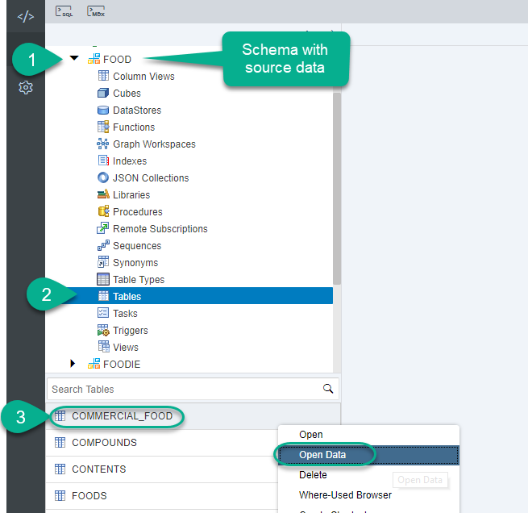
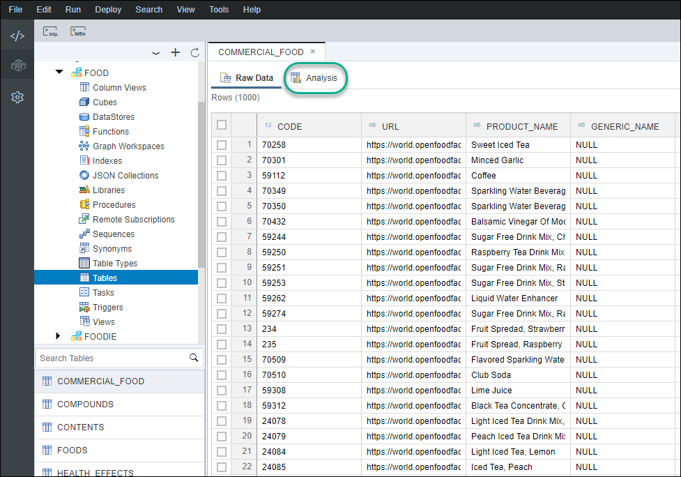
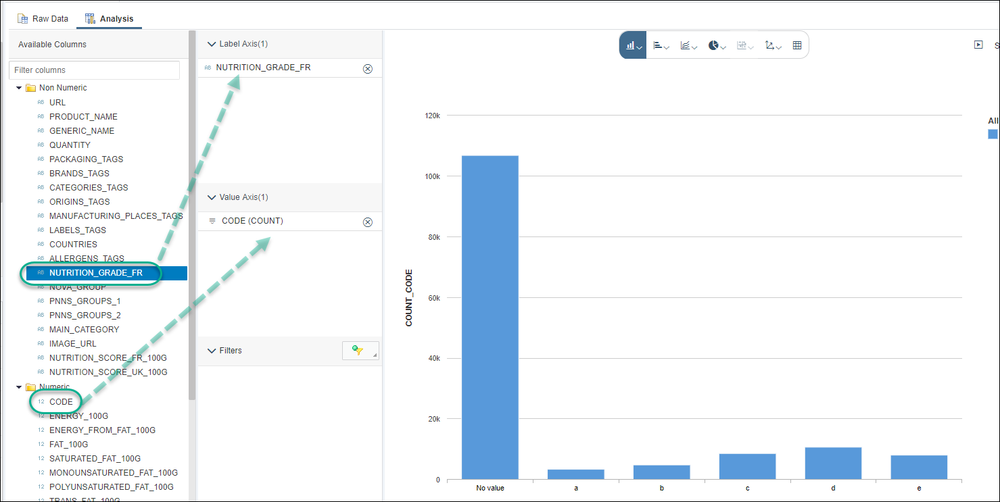
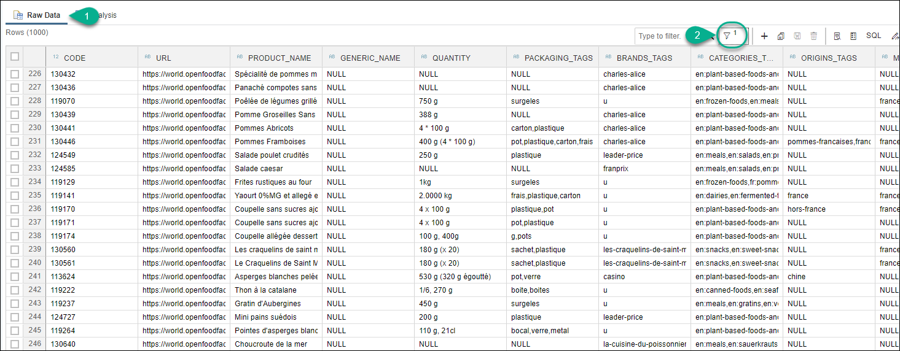
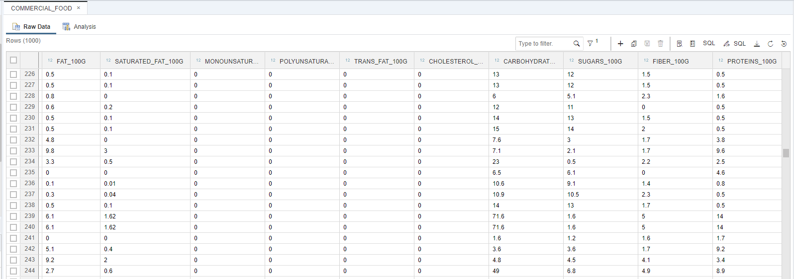
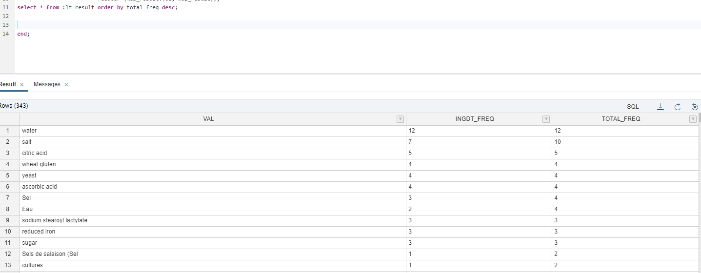
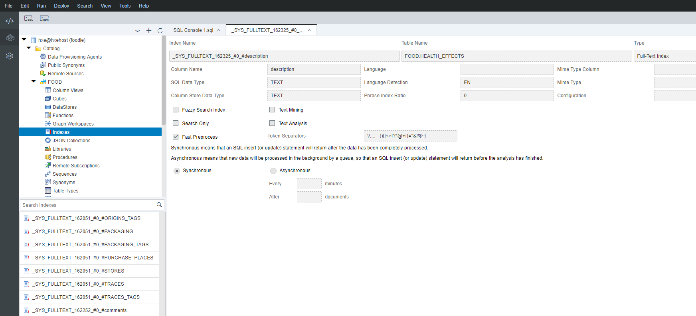
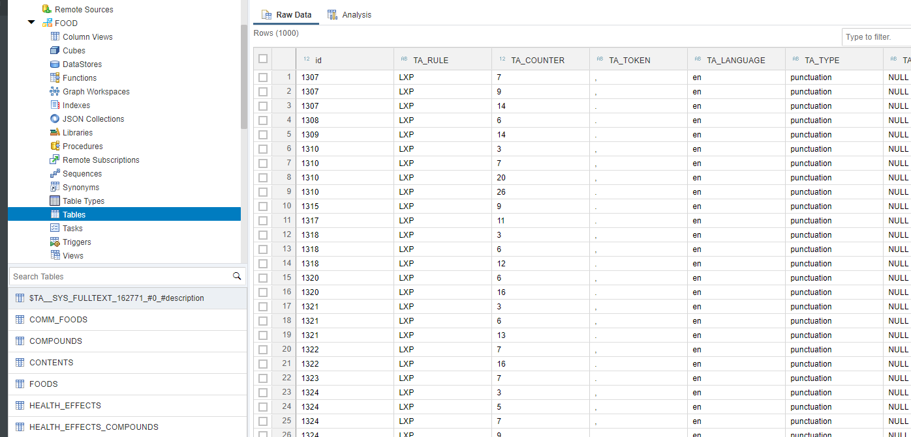
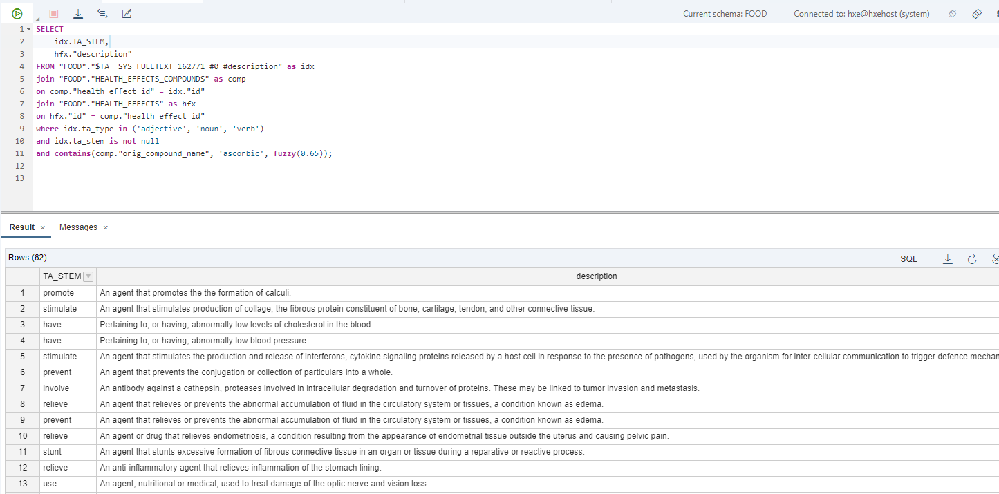

## Prerequisites
 - You are attending a hands-on event with a live instructor
 - The instructor has provided you with log in directions

## Details
### You will learn
  - How to train and run a predictive algorithm
  - How to execute a `MapReduce` operations
  - How to apply basic text mining to unstructured data

**This tutorial can only be completed with a live instructor.**

This tutorial uses two databases obtained from two open sources:
- [`FooDB`](http://foodb.ca/) is the world's largest and most comprehensive resource on food constituents, chemistry and biology. It provides information on both macro-nutrients and micro-nutrients, including many of the constituents that give foods their flavor, color, taste, texture and aroma.
- [Open Food Facts](https://world.openfoodfacts.org/) gathers information and data on food products from around the world.

---

[ACCORDION-BEGIN [Step 1: ](Connect to the database)]

> This tutorial can only be completed with a live instructor.

You will be provided with connection details. Use them to open a browser and log in to SAP Web IDE for SAP HANA.

Navigate to the database explorer


You should see a connection:


You are currently connected with the user **FOODIE**.


[ACCORDION-END]

[ACCORDION-BEGIN [Step 2: ](Explore the existing data)]

Open the schema **FOOD**

Click on tables. Right-click on **`COMM_FOODS`** and choose **Open Data**.



You will see a table with data from packaged foods. Click on the **Analysis** tab.



Drag and drop **`NUTRITION_GRADE_FR`** into the **Label Axis**. Drag and drop **CODE** into the **Value Axis** and change the aggregation into **Count**.



You can see about 20% of the foods have been assigned a nutrition grade based on their ingredients. The rest of the dataset does not have a value assigned for the nutrition grade. The nutrition grade has been assigned based on the nutrients and their proportion.

Return to the **Raw data** tab and use the filter to get foods whose nutrition grade equals `a`.



You will see examples of fruits and vegetables. If you scroll left, you will see each record contains different columns with nutrients.




[ACCORDION-END]


[ACCORDION-BEGIN [Step 3: ](Create a view)]

You will predict and assign a nutrition grade to the foods that do not have one. You will use the foods with a value to train a model.

The algorithm you will use is called [Multi-Class Logistic Regression](https://help.sap.com/viewer/2cfbc5cf2bc14f028cfbe2a2bba60a50/2.0.03/en-US/bc5fe09f584a4cd1a6b6b2176719a07f.html). You will take the normalized values of nutrients as explanatory attributes to model the relation with the nutrition grade (dependent variable).

Open a **SQL** console


Use the following code to create a view for foods that need a nutrition grade assigned:

```sql
set schema foodie;

--DROP view "PAL_FOOD_DATA_SCORE_VIEW";

CREATE VIEW "PAL_FOOD_DATA_SCORE_VIEW" AS
	SELECT
		TO_INT("ID"),
		"ENERGY_100G",
		"ENERGY_FROM_FAT_100G",
		"FAT_100G",
		"SATURATED_FAT_100G",
		"MONOUNSATURATED_FAT_100G",
		"POLYUNSATURATED_FAT_100G",
		"TRANS_FAT_100GCHOLESTEROL_100G",
		"CARBOHYDRATES_100G",
		"SUGARS_100G",
		"FIBER_100G",
		"PROTEINS_100G",
		"SALT_100G",
		"SODIUM_100G",
		"VITAMIN_A_100G",
		"BETA_CAROTENE_100G",
		"VITAMIN_D_100G",
		"VITAMIN_E_100G",
		"VITAMIN_K_100G",
		"VITAMIN_C_100G",
		"VITAMIN_B1_100G",
		"VITAMIN_B2_100G",
		"VITAMIN_PP_100G",
		"POTASSIUM_100G",
		"CHLORIDE_100G",
		"CALCIUM_100G",
		"IRON_100G",
		"COCOA_100G"
	FROM
		"FOOD"."COMM_FOODS"
	WHERE
		NUTRITION_GRADE_FR IS NULL;		


```

Press **F8** or to run.


Use the following code to create a view with the foods that will be used for training


```sql

SET schema foodie;

--DROP VIEW PAL_FOOD_DATA_TRAIN_VIEW;

CREATE VIEW PAL_FOOD_DATA_TRAIN_VIEW AS
SELECT
  TO_INT("ID"),
  "ENERGY_100G",
  "ENERGY_FROM_FAT_100G",
  "FAT_100G",
  "SATURATED_FAT_100G",
  "MONOUNSATURATED_FAT_100G",
  "POLYUNSATURATED_FAT_100G",
  "TRANS_FAT_100GCHOLESTEROL_100G",
  "CARBOHYDRATES_100G",
  "SUGARS_100G",
  "FIBER_100G",
  "PROTEINS_100G",
  "SALT_100G",
  "SODIUM_100G",
  "VITAMIN_A_100G",
  "BETA_CAROTENE_100G",
  "VITAMIN_D_100G",
  "VITAMIN_E_100G",
  "VITAMIN_K_100G",
  "VITAMIN_C_100G",
  "VITAMIN_B1_100G",
  "VITAMIN_B2_100G",
  "VITAMIN_PP_100G",
  "POTASSIUM_100G",
  "CHLORIDE_100G",
  "CALCIUM_100G",
  "IRON_100G",
  "COCOA_100G",
  "NUTRITION_GRADE_FR"
FROM
  "FOOD"."COMM_FOODS"
WHERE
  NUTRITION_GRADE_FR IS NOT NULL;

```

Press **F8** to run.


[ACCORDION-END]

[ACCORDION-BEGIN [Step 4: ](Create structures for training)]

Aside from the values for training, the procedure included in the Predictive Analytics Library in SAP HANA requires a table with parameter as an input.

You can find more details about the parameters and their meaning in the [official SAP Help](https://help.sap.com/viewer/2cfbc5cf2bc14f028cfbe2a2bba60a50/2.0.03/en-US/bc5fe09f584a4cd1a6b6b2176719a07f.html).

Use the following statement to create the input table and populate it with parameters

```sql
SET schema foodie;

--DROP TABLE #PAL_PARAMETER_TBL;
CREATE LOCAL TEMPORARY COLUMN TABLE #PAL_PARAMETER_TBL (
    "PARAM_NAME"   NVARCHAR (256),
    "INT_VALUE"    INTEGER,
    "DOUBLE_VALUE" DOUBLE,
    "STRING_VALUE" NVARCHAR (1000)
);

--DROP TABLE PAL_FOOD_PMML_TBL;
CREATE COLUMN TABLE PAL_FOOD_PMML_TBL (
    "ROW_INDEX" INT,
    "MODEL_CONTENT" NVARCHAR(5000)
);

--DROP TABLE PAL_FOOD_STATISTICS_TBL;
CREATE COLUMN TABLE PAL_FOOD_STATISTICS_TBL (
    "STAT_NAME" NVARCHAR(256),
    "STAT_VALUE" NVARCHAR(1000)
);

--DROP TABLE PAL_FOOD_OPTIMAL_PARAM_TBL;
CREATE COLUMN TABLE PAL_FOOD_OPTIMAL_PARAM_TBL (
    "PARAM_VALUE" NVARCHAR(256),
    "INT_VALUE" INT,
    "DOUBLE_VALUE" DOUBLE,
    "STRING_VALUE" NVARCHAR(1000)
);

--DROP TABLE PAL_FOOD_MODEL_TBL;
CREATE COLUMN TABLE PAL_FOOD_MODEL_TBL (
    "VARIABLE_NAME" NVARCHAR(1000),
    "CLASS" NVARCHAR(100),
    "COEFFICIENT" DOUBLE,
    "Z_SCORE" DOUBLE,
    "P_VALUE" DOUBLE
);

--DROP TABLE PAL_FOOD_RESULT_SCORE_TBL;
CREATE COLUMN TABLE PAL_FOOD_RESULT_SCORE_TBL (
    "CODE" INT,
    "CLASS" NVARCHAR(100),
    "PROBABILITY" DOUBLE
);

--DROP TABLE PAL_FOOD_PLACEHOLDER_TBL;
CREATE COLUMN TABLE PAL_FOOD_PLACEHOLDER_TBL (
    "PARAM_VALUE" NVARCHAR(256),
    "INT_VALUE" INT,
    "DOUBLE_VALUE" DOUBLE,
    "STRING_VALUE" NVARCHAR(1000)
);

TRUNCATE TABLE #PAL_PARAMETER_TBL;
INSERT INTO #PAL_PARAMETER_TBL VALUES ('MAX_ITERATION',100,NULL,NULL);
INSERT INTO #PAL_PARAMETER_TBL VALUES ('PMML_EXPORT',1,NULL,NULL);
INSERT INTO #PAL_PARAMETER_TBL VALUES ('HAS_ID',1,NULL,NULL);  
INSERT INTO #PAL_PARAMETER_TBL VALUES ('DEPENDENT_VARIABLE',NULL,NULL,'NUTRITION_GRADE_FR');
INSERT INTO #PAL_PARAMETER_TBL VALUES ('STANDARDIZE',1,NULL,NULL);
INSERT INTO #PAL_PARAMETER_TBL VALUES ('STAT_INF',0,NULL,NULL);
```


[ACCORDION-END]

[ACCORDION-BEGIN [Step 5: ](Train the model)]

You can now call the training algorithm and check the results

```sql
CALL _SYS_AFL.PAL_MULTICLASS_LOGISTIC_REGRESSION (
	PAL_FOOD_DATA_TRAIN_VIEW,
	#PAL_PARAMETER_TBL,
	PAL_FOOD_MODEL_TBL,
	PAL_FOOD_PMML_TBL,
	PAL_FOOD_STATISTICS_TBL,
	PAL_FOOD_PLACEHOLDER_TBL
) WITH OVERVIEW;

SELECT * FROM PAL_FOOD_MODEL_TBL;
SELECT * FROM PAL_FOOD_STATISTICS_TBL;
```

You can see statistics about the accuracy of the model.


[ACCORDION-END]

[ACCORDION-BEGIN [Step 6: ](Use the model to predict the nutrition score)]

Some steps ago, you created a view with all of the foods without a nutrition score. This view is called `PAL_FOOD_DATA_SCORE_VIEW`.

You will now fill the scores using the prediction model created in the previous step.

```sql

TRUNCATE TABLE #PAL_PARAMETER_TBL;
INSERT INTO #PAL_PARAMETER_TBL VALUES ('VERBOSE_OUTPUT',1,NULL,NULL);

CALL _SYS_AFL.PAL_MULTICLASS_LOGISTIC_REGRESSION_PREDICT  (
	PAL_FOOD_DATA_SCORE_VIEW,
	PAL_FOOD_PMML_TBL,
	#PAL_PARAMETER_TBL,
	PAL_FOOD_RESULT_SCORE_TBL
) WITH OVERVIEW;

SELECT * FROM PAL_FOOD_DATA_SCORE_VIEW;
SELECT * FROM PAL_FOOD_RESULT_SCORE_TBL order by 3 desc;

```


[ACCORDION-END]

[ACCORDION-BEGIN [Step 7: ](Get the most popular ingredients)]

The ingredients for the commercial foods are contained in a text field, separated by a comma.

You now want to find out which ingredients are the most common in foods with the lowest nutrition grades.

You will use the map reduce capabilities to split the ingredients into a separate table and get the most frequent ones.

Paste and execute the following code in a new SQL console. This will take some moments to execute but you can continue to read an explanation of the code in the meantime.

```sql
--drop function "mapper";
create function "mapper" ( in iv_id int, in iv_text nvarchar(5000) )
				returns table (id int, val nvarchar(5000), freq int)
	language sqlscript
	reads sql data as
	begin
	using sqlscript_string as lib;

	declare lt_split_result table(result nvarchar(5000));

	lt_split_result = lib:split_to_table(:iv_text, ',', 5000);
	return select iv_id as id, result as val, count(result) as freq
				from :lt_split_result group by result;

	end;

--drop function "reducer";
create function "reducer"( in iv_val nvarchar(5000),
						   in it_valtab table ( id int, freq int  ) )
				returns table (
					val nvarchar(5000),
					ingdt_freq int,
					total_freq int )
	language sqlscript
	reads sql data as
	begin

	return select :iv_val as val,
				count(distinct(id)) as ingdt_freq,
				sum(freq) as total_freq
				from :it_valtab;

	end;


  do begin

  declare lt_input table(id int, ingredients_text nvarchar(5000));
  declare lt_result table(val nvarchar(5000), ingdt_freq int, total_freq int );

  lt_input = select id, to_nvarchar(INGREDIENTS_TEXT) as ingredients_text from "FOOD"."COMM_FOODS" where NUTRITION_GRADE_FR = 'e' and id < 10000;

  lt_result = map_reduce( :lt_input,
  						"mapper"(:lt_input.id, :lt_input.ingredients_text) group by val as map_result,
  						"reducer"(map_result.val, map_result));
  select * from :lt_result order by total_freq desc;						


  end;

```


> ##  What is going on?
> `MapReduce` is a programming model to split large dataset into parts and process them in parallel, generally in different nodes in a cluster. The parts in the dataset are then reunited into a consistent output.
>  You have created two functions. The first one, `mapper`, takes each list of ingredients from each record, and splits the ingredients into separate records in a table. You are using a reusable library to split text into a table. The function also counts the occurrences of an ingredient within a list. The `MAP_MERGE` operator then merges the results into a single table with the individual ingredient and its original `ID`.
>
> 
> The second function, the reducer, will use each group of ingredient tables for each ID, process all groups and return the total count for the ingredients.
>
> 
>  You can learn more about these examples in this [blog post](https://blogs.sap.com/2018/04/11/sap-hana-2.0-sps-03-new-developer-features-database-development/). Note the input is limited so you can finish on time for this exercise.


[ACCORDION-END]

[ACCORDION-BEGIN [Step 8: ](Perform a fuzzy search)]

You can see `ascorbic acid` amongst the list of popular ingredients in foods with low nutritional score, together with other components that are probably found in other foods such as water, sugar and salt.



You will first look for all compounds related to ascorbic acid. Use the following SQL command which employs a fuzzy search with some tolerance to typos and variations given by the `SCORE()` function

```SQL

select "id", "orig_compound_name", "health_effect_id", "orig_health_effect_name" from "FOOD"."HEALTH_EFFECTS_COMPOUNDS" where contains("orig_compound_name", 'ascorbic', fuzzy(0.65))
```

You will get plenty of results for health effects of ascorbic acid.


[ACCORDION-END]

[ACCORDION-BEGIN [Step 9: ](Explore the text index)]

When the datasets were uploaded into SAP HANA, the text field for the field `DESCRIPTION` in the table `HEALTH_EFFECTS` were created with type `TEXT` and text analysis enabled. This created implicit text indices which you can find in the schema `FOOD`.



You can also see the table with the text analysis:



You will now use the names of health effects linked to `ascorbic acid` to get the most repeated words in the text analysis table form the description in the `HEALTH_EFFECTS` table.

```sql
SELECT
	idx.TA_STEM,
	count(1) as occ
FROM "FOOD"."$TA__SYS_FULLTEXT_162771_#0_#description" as idx
join "FOOD"."HEALTH_EFFECTS_COMPOUNDS" as comp
on comp."health_effect_id" = idx."id"
where idx.ta_type in ('adjective', 'noun', 'verb')
and idx.ta_stem is not null
and contains(comp."orig_compound_name", 'ascorbic', fuzzy(0.65))
group by idx.TA_STEM
order by occ desc;

```


Note that you are using the stems of the words. A slight modification of the previous SQL statement to include the original texts, but remove the aggregation, would show this.



Based on the sentiment in the words produced by the last SQL statement, you can say ascorbic acid, one of the most frequent ingredients in foods with low nutritional score, is a good compound.

After all, ascorbic acid is a nutrient found in vitamin C.


[ACCORDION-END]


---
