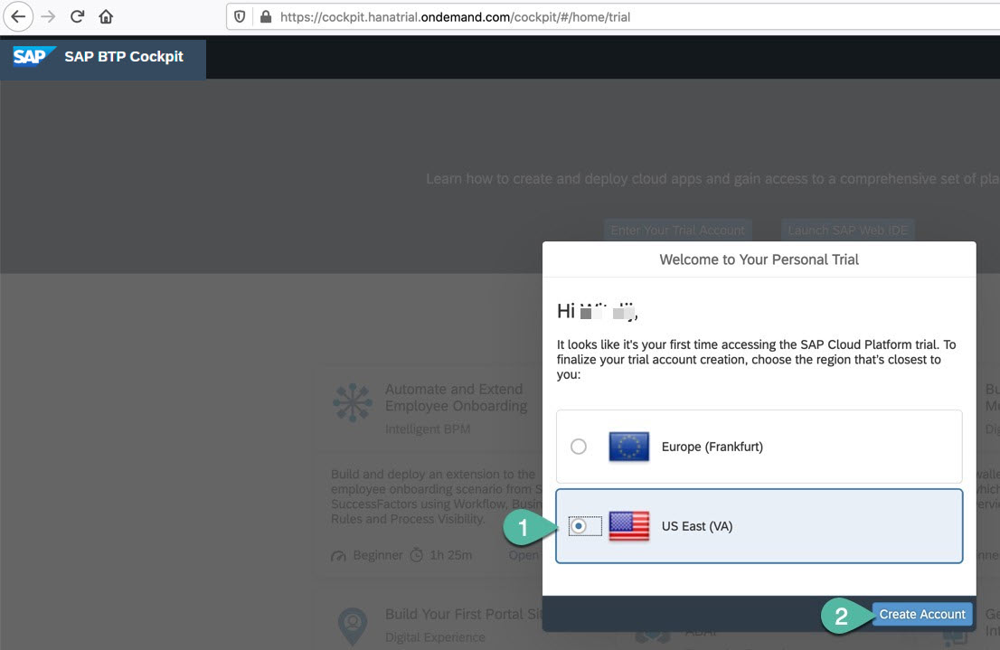

### You will learn
  - How to start with your own free SAP HANA Cloud instance in the trial account of SAP Cloud platform
  - How to leverage SAP Web IDE to use advanced analytics features in SAP HANA, including JSON table, geospatial, graph and text search functions

Ready to explore SAP HANA? As a fun exercise, you can first help our fictional developer, Thomas, work with other developers in the community to create his own database schema on SAP HANA to use text, graph and geospatial processing inside the database.

### Get to know SAP HANA
SAP HANA is a complete database and application development platform. It lets you use advanced data processing capabilities — text, spatial, predictive, and more — to pull insights from all types of data.

By combining in-memory storage with columnar store, data operations are performed faster than in a traditional database with a disk-based storage. SAP HANA is also `translytical`, which means that developers can perform both transactional and analytical operations from the same structure, in real time, and without creating additional copies of the data such as materialized views.

> ### This tutorial is based on an SAP HANA Cloud instance that you get in a free trial account at SAP Cloud Platform.
> If you do not want to use this method, you can check other [available options to download or install SAP HANA, express edition](https://developers.sap.com/topics/hana.html), and corresponding tutorials.

### How do we help Thomas?
Like most developers, Thomas wants to stay on top of the latest technologies. His first step is to get started with free tutorials, like this one. The second step is to connect with other developers and experts in the community to share knowledge and learn together.

Fellow developers from all around the world connect daily to exchange information. And we are going to find out if they share Thomas' interest for SAP HANA and related topics by using **text processing** on their opinions in the community.

Thanks to the multiple engines in SAP HANA, we will also combine text processing with **graph algorithms** to find out how community members are connected.

Finally, we will use the **geospatial capabilities** in SAP HANA to find developers closer to Thomas' location in Munich.

!


---

[ACCORDION-BEGIN [Step 1: ](Log in to the community)]

This tutorial uses validations to track completion and make sure you are all set after finishing important steps.

**Sign in or register** by clicking on the `person` icon in the top right corner. If you're registering for the first time, all you need is an email address or social media account.


Use your email address or social media account.

!

[DONE]
[ACCORDION-END]

[ACCORDION-BEGIN [Step 2: ](Sign up for a trial in SAP Cloud Platform)]

Navigate to the trial landscape for [SAP Cloud Platform](https://hanatrial.ondemand.com).

Follow steps to log in or register for an account. If you need detailed steps, you can [follow this tutorial](hcp-create-trial-account).

!

[DONE]
[ACCORDION-END]

[ACCORDION-BEGIN [Step 3: ](Configure your trial account)]

If you haven't already, you will be prompted to validate your account using a phone number. Complete the validation.


After completing the validation, click **Log On** again and choose your preferred region and **Create Account**.



Once the provisioning is finished, click **Continue**:


From the SAP Cloud Platform entry page, press the `?` icon in the upper right corner. Then press the `Guided Tours` button. Finally select the `Create a SAP HANA Cloud Instance` guided tour.


This guided tour will walk you through the process of navigating to your development space and creating a HANA Cloud Instance. Just one note as you go through this guided tour: Make sure that in the "Advanced Settings" part of the setup (right before you select "Create Instance"), that you select "Allow all IP addresses" in the "Allowed connections" setting. This setting will allow you to develop against your HANA Cloud trial using a variety of external development tools.

After completing the previous step, you should now have a new SAP HANA Cloud instance created in the SAP Cloud Platform.


If you get stuck at any point in this process, there is also this short video you can watch and follow along.

<iframe width="560" height="315" src="https://www.youtube.com/embed/GSNQpfxPuLU" frameborder="0" allow="accelerometer; autoplay; clipboard-write; encrypted-media; gyroscope; picture-in-picture" allowfullscreen></iframe>

Once the SAP HANA Cloud instance is created, take note of the admin user as well as the endpoint (host:port) needed to connect to the database. This will be needed in subsequent tutorials in this tutorial.

Return to the Subaccount level in the SAP Cloud Platform Cockpit. Click on **Entitlements** in the left hand navigation.  Click on **Configure Entitlements**. Then click on **Add Service Plans**.  Search for entitlements with **web** in the name. Choose **SAP Web IDE for HANA development**. Select the **TRIAL (Subscription)** plan.  Press the **Add 1 Service Plan** button.


When the Entitlements dialog closes be sure to press the **Save** button.


Now please choose **Subscriptions** from the left hand menu.  Click on the SAP Web IDE Full-Stack Subscription.


In the subscription detail screen, please press the **Subscribe** button.


Now you can click on **Go to Application** in order to launch the SAP Web IDE Full-Stack.


[DONE]
[ACCORDION-END]


[ACCORDION-BEGIN [Step 4: ](Configure SAP Web IDE)]

1. Once SAP Web IDE opens, access the **Preferences**.

    !

2. Click **Extensions** and enable **SAP HANA Database Development Tools**, if not enabled.

    !

    Click **Save**. When prompted, click **Refresh**.

    

3. After SAP Web IDE has refreshed, click **Cloud Foundry** in **Preferences**.

    

    Choose `US10` as the **API Endpoint** if you chose US East as your Trial region. Choose `EU10` as the **API Endpoint** if you chose Europe as your Trial region.

    

    Enter your credentials for the trial when prompted and **Log on**.

    

    The subaccount and space will populate automatically.

4. Finally, configure the **Database Explorer**. Choose the region matching region `US10` or `EU10` and click **Save**.

    

[DONE]
[ACCORDION-END]


[ACCORDION-BEGIN [Step 5: ](Clone repository)]

You can now clone an existing GitHub repository into your workspace. This repository contains the artifacts to create a schema and a document store and add data into it.

Right-click on **Workspace** and choose **Git > Clone Repository**.


Enter the following URL and click **Clone**.

```URL
https://github.com/SAP-samples/hana-cf-get-started-trial
```


When prompted about ignoring system files, choose **Do it later**.

> At any time if you get stuck, you can view the completed solution in GitHub as well at this URL: [Project Solution](https://github.com/SAP-samples/hana-cf-get-started-trial/tree/solution)

[DONE]
[ACCORDION-END]

[ACCORDION-BEGIN [Step 6: ](Create database artifacts)]

The cloned repository contains files with design-time definitions to create artifacts in the database using the SAP HANA Deployment Infrastructure, or HDI for short. HDI provides a service that enables you to deploy database development artifacts to so-called containers and to build run-time database objects. You can think of HANA container as an isolation that contains a single database schema for all objects.

Artifacts in the current project will be translated into a physical database schema and into a JSON document store.

1. Expand the cloned folder and right-click on the `db` folder, and choose **Build**.

    !

    > ### What's going on?
    > The design-time definitions will be deployed by HANA Deployment Infrastructure - a service layer in SAP HANA.
    >
    > With HDI the physical artifacts will be created and managed by technical users in corresponding container. You would normally only deploy database artifacts into these containers through design-time definitions, as the physical build of database artifacts is the role of HDI.
    >
    > Later in this exercise, you will create some more database objects in the database directly for learning purposes. But the recommendation is to use HDI and build database objects by modeling design-time artifacts and their deployment to HDI containers.

    You will see the build log in the console. Wait until the build has finished successfully.

    

2. Right-click on the `db` module and choose **Open HDI container**.

    

    The database explorer will start loading. If asked to add a database connection, click **No**.

You can see your container with a schema and the table `COMMUNITY`. They were generated from definitions in the cloned repository.

!

[DONE]
[ACCORDION-END]

[ACCORDION-BEGIN [Step 7: ](NoSQL time! Load data into JSON table)]

1. Open an SQL console.

    

2. Paste the following statements to insert new JSON documents into your table and run  the statements.

    > The statements may be marked with errors by the editor. You can ignore the errors.

    ```SQL
    insert into "COMMUNITY" (DATA)  values('{"name" : "Sol" , "hint" :"I love using SAP HANA to develop applications", "learns_from" :"Sam", "office" :"Toronto", "tenure" :17, "geolocation" : "Point( -79.380186 43.647944 )" }');
    insert into "COMMUNITY" (DATA) values('{"name" :"Sam", "hint" :"I like developing in different languages and SQLScript", "learns_from" :"Sol", "office" :"Walldorf", "tenure" :3, "geolocation" : "Point( 8.636789 49.29487 )" }');
    insert into "COMMUNITY" (DATA) values('{"name" :"Jose", "hint" :"I use SAP Cloud platform to deploy cloud-native applications", "learns_from" :"Sol", "office" :"Palo Alto", "tenure" :5, "geolocation" : "Point( -122.146603 37.398989 )" }');
    insert into "COMMUNITY" (DATA) values('{"name" :"Charlotte", "hint" :"Developing apps with SAP HANA has been a game changer. I used to need several databases, now I only need one", "learns_from" :"Sam", "office" :"Australia", "tenure" :6, "geolocation" : "Point( 151.209092 -33.834509 )" }');
    insert into "COMMUNITY" (DATA) values('{"name" :"Maria", "hint" :"I am a coder. In my country, we say developing with SAP HANA is muito legal", "learns_from" :"Charlotte", "office" :"Sao Leopoldo", "tenure" :3, "geolocation" : "Point( -51.148393 -29.796256 )" }');
    insert into "COMMUNITY" (DATA) values('{"name" :"Wei", "hint" :"System administrator here, excited to learn you technologies", "learns_from" :"Sam", "office" :"Beijing", "tenure" :12, "geolocation" : "Point( 121.601862 31.20235 )" }');
    insert into "COMMUNITY" (DATA) values('{"name" :"Hiroshi", "hint" :"I developed many applications with both HANA and SQL Anywhere. I like both", "learns_from" :"Sol", "office" :"Fukuoka", "tenure" :8, "geolocation" : "Point( 130.399091 33.592314 )" }');
    insert into "COMMUNITY" (DATA) values('{"name" :"Saanvi", "hint" :"Developing apps from bangalore to the world", "learns_from" :"Sol", "office" :"Bangalore", "tenure" :7, "geolocation" : "Point( 77.637116 12.972402 )" }');
    insert into "COMMUNITY" (DATA) values('{"name" :"Rick", "hint" :"My team plays with databases regularly. HANA is one of the favorites", "learns_from" :"Maria", "office" :"Irving", "tenure" :11, "geolocation" : "Point( -96.938460 32.873744 )" }');
    insert into "COMMUNITY" (DATA) values('{"name" :"Ann", "hint" :"I like meeting other fellow coders", "learns_from" :"Casey", "office" :"San Ramon", "tenure" :1, "geolocation" : "Point( -121.961661 37.766586 )" }');
    insert into "COMMUNITY" (DATA) values('{"name" :"Hugo", "hint" :"I had never developed such cool apps before", "learns_from" :"Maria", "office" :"Monterrey", "tenure" :2, "geolocation" : "Point( -100.353643 25.64757 )" }');
    insert into "COMMUNITY" (DATA) values('{"name" :"Sofia", "hint" :"I connected SAP Analytics Cloud to HANA", "learns_from" :"Hiroshi", "office" :"Copenhagen", "tenure" :1, "geolocation" : "Point( 12.589387 55.710640 )" }');
    insert into "COMMUNITY" (DATA) values('{"name" :"Muhammed", "hint" :"I used to prefer Excel spreadsheets but Lumira changed that for me", "learns_from" :"Charlotte", "office" :"Ra anana", "tenure" :11, "geolocation" : "Point( 34.882402 32.201905 )" }');
    ```

    You should get success messages as in the following example:

    

    > ### What's going on?

    > Tables with JSON columns allow you to store all of the information related to the same record in the same document. These documents do not have a predefined format or number of fields like a typical relational table.
    >
    > This is particularly useful when relationships across documents are not too relevant and data structure needs to be flexible. For example, data for user accounts where fields like the phone number may not be entered and may not be stored at all. In this same scenario, there is no need for foreign keys and relations between the user records.
    >
    > This type of database is also referred to as `NoSQL` because it stores Not-only Structured data. SAP HANA uses SQL for CRUD operations in JSON columns.
    >


2. The following statement demonstrates a use of the JSON Object Expression in the `select` statement. Run this statement to complete the validation below:

    ```SQL
    SELECT *
    	FROM JSON_TABLE(COMMUNITY.DATA, '$'
    	COLUMNS
        (
            LOCATION NVARCHAR(200) PATH '$.office',
            NAME NVARCHAR(200) PATH '$.name'
        )
    	) AS JT where NAME = 'Maria'
    ```

    > You can clear the statements before entering new ones in SQL console (recommended).
    > Alternatively select (highlight) the statements you want to execute.

[VALIDATE_1]
[ACCORDION-END]

[ACCORDION-BEGIN [Step 8: ](SQL time! Select experienced community members)]

Free resources, like this tutorial, are a great way to get started. People in the community with more experience are often willing to help you on your learning journey. For our developer, Thomas, choosing people with more experience means that he can get up to speed quickly.

You will select people whose experience is 2 years or more. You'll also need to move those records into a columnar table so that you can perform advanced analytics that are only available in the columnar store.

1. Create the columnar table first by returning to the SAP Web IDE editor view and creating a file named `DEVS.hdbtable` in the `db/src` folder.

    Here is the content for this file.

    ```SQL
    column table "DEVS"(
      "DEVNAME" nvarchar(100) PRIMARY KEY,
      "LEARNS_FROM" nvarchar(100),
      "HINT_TEXT" nvarchar(1000),
      "CITY" nvarchar(100),
      "LON_LAT" nvarchar(200)
    )
    ```

    > ### Note `column` table definition in the statement
    > SAP HANA creates columnar tables by default. The `column` keyword is optional, but is used in the example to remind about the native column-based storage of tables in SAP HANA.
    >

2. Save you content and right-click on the `db` folder, and choose **Build > Build**.

    Upon completion of the build, return to the database explorer view of your HDI container. You should see the new table listed under `TABLES`:

    

3. Insert the data from the documents store into the columnar table, filtering out community members with tenure below 1 year:

    ```SQL
    insert into DEVS
    SELECT NAME, LEARNS_FROM, HINT, OFFICE, GEOLOCATION
    	FROM JSON_TABLE(COMMUNITY.DATA, '$'
    	COLUMNS
        (
            LOCATION NVARCHAR(200) PATH '$.office',
            NAME NVARCHAR(200) PATH '$.name',
            LEARNS_FROM NVARCHAR(200) PATH '$.learns_from',
            HINT NVARCHAR(200) PATH '$.hint',
            OFFICE NVARCHAR(200) PATH '$.office',
            GEOLOCATION NVARCHAR(200) PATH '$.geolocation',
            TENURE NVARCHAR(30) PATH '$.tenure'
        )
    	) AS JT where to_bigint(TENURE) > 1
    ```

4. Count the inserted records in the new columnar table:

    ```SQL
    select count(*) from "DEVS";
    ```

Insert the result of the previous SQL command in the box below to complete the following validation:

[VALIDATE_2]
[ACCORDION-END]

[ACCORDION-BEGIN [Step 9: ](Use text search to find developers who can help)]

There are plenty of different ways to work with SAP HANA. Some developers are interested in its analytics, some keep it running smoothly through system and database administration, and others use it to create data-driven applications. In order to help Thomas, you'll need to look for people who like to develop applications.

You'll use a `contains` text search to find out who has said anything related to developing applications.

```SQL
select DEVNAME, TO_NVARCHAR(HINT_TEXT) as "testimony", LEARNS_FROM
from DEVS
where contains(HINT_TEXT, '%develop%')
```

!

You will use these results to create a table (as a new `hdbtable` artifact as you did earlier) to show who learns from whom. This table will be used to create a graph workspace.

Create it using the following syntax in a new `hdbtable` file -- remember to build your `db` module again:

```SQL
column table LEARNING_RELATION(
	ID int NOT NULL UNIQUE GENERATED ALWAYS AS IDENTITY (START WITH 10 INCREMENT BY 1),
	SOURCE nvarchar(100) NOT NULL,
	TARGET nvarchar(100) NOT NULL
)
```

Insert the records into the new table:

```SQL
insert into LEARNING_RELATION
(SOURCE, TARGET)
select LEARNS_FROM, DEVNAME
from DEVS
```

How many records were inserted into the new table?

[VALIDATE_3]
[ACCORDION-END]

[ACCORDION-BEGIN [Step 10: ](Use graph to find out who learns from whom)]

Now that you have a table populated with learning relationships and expert developers in the community, you can find out how these people are related to each other. One of the ways to represent a network of people is by using a graph database.

In SAP HANA, graphs are represented by vertices (in this example, developers) and edges (the connections between them, taken from the field `LEARNS_FROM`).


> Find more information about the graph data model in the [SAP HANA reference](https://help.sap.com/viewer/f381aa9c4b99457fb3c6b53a2fd29c02/latest/en-US).

Create a graph workspace to define a graph in terms of tables and columns by returning to the SAP Web IDE editor and creating a file with the extension `hdbgraphworkspace`:

```SQL
graph workspace HANA_GRAPH
  edge table LEARNING_RELATION
    source column SOURCE
    target column TARGET
    key column ID
  vertex table DEVS
    key column DEVNAME
```

You can preview the graph by navigating into **Graph Workspaces**, selecting the graph you have just created and choosing **View Graph**.


Here's the graph:


[DONE]
[ACCORDION-END]

[ACCORDION-BEGIN [Step 11: ](Find the closest geographical location)]

So far, you've found the most connected developers with two or more years of experience, plus an interest in developing applications. Now find out who is closest to Thomas, so that they can meet him at the next community event.

Thomas is located in Munich, Germany. The geolocation of the city is:

|-|-|
|Longitude|`11.57548`|
|Latitude |`48.13702`|


Use the following query to calculate distance to Thomas' location:

```SQL
select DEVNAME,
round(st_geomFromText('Point( 11.57548 48.13702 )', 4326).st_distance(st_geomFromtext(LON_LAT, 4326), 'kilometer'),0) as DISTANCE_KM
from DEVS
where contains(HINT_TEXT, '%develop%')
order by DISTANCE_KM
```

[VALIDATE_5]
[ACCORDION-END]

[ACCORDION-BEGIN [Step 12: ](Keep building your skills)]

Congratulations on helping Thomas find and collaborate with other developers!

If you are ready to explore more features with your own local copy of SAP HANA, you can also download SAP HANA, express edition. SAP HANA, express editions is **free** up to 32 GB of RAM, **even for productive use**. You can:

  -  [Register for a free download](https://www.sap.com/cmp/td/sap-hana-express-edition.html)

Or you can continue to use the free SAP HANA Cloud trial as a part of your overall SAP Cloud Platform trial.

Here's how you can get started with any developer-focused topic in SAP HANA and more:

-   **SAP Developer Center**: You'll find plenty of free downloads and tutorials to help you with different topics on [developers.sap.com](http://developers.sap.com). You can learn new topics like [geospatial](group.hana-aa-spatial-get-started), working with the various [HANA client interfaces](mission.hana-cloud-clients) or switch to a full SAP HANA, express edition, image with XS Advanced, to [create cloud native applications with micro-services](mission.xsa-get-started).
-   **The community**: Fellow developers write about their experiences and recommendations in [blog posts](https://blogs.sap.com/), and many are willing to answer your questions [in the Q&A](https://answers.sap.com).
-   **Community events**: You can also check out [events](https://community.sap.com/events) closest to you in order to meet other developers.


[DONE]
[ACCORDION-END]


---
