## Prerequisites  
You need a HANA account. Pick one of the following:
- [Get a free account in HANA Cloud Platform](https://account.hanatrial.ondemand.com/register)
- [Set up an account on Amazon AWS or Microsoft Azure](http://go.sap.com/developer/tutorials/hana-setup-cloud.html)

## Next Steps
[Hello Data! Access your first Data from a native SAP HANA Application using the SAP HANA Web-based Development Workbench](http://go.sap.com/developer/tutorials/hana-data-access-authorizations.html)

## Details
### You will learn  
1. How to use the SAP HANA Web-based Development Workbench.
2. How to develop a simple server-side application.
3. How to publish and run an application.

### Time to Compete
Beginners might take **10-15 minutes** to execute this tutorial.

> ### Information
>The full application build in this tutorial can be found [in this GitHub repository](https://github.com/SAP/cloud-hana-helloworld/).

###  Using HANA Cloud Platform
Each Trial HANA instance comes with the HANA Web-based Development Workbench. The workbench allows you to develop on HANA without the need to set up a local development environment.

Login to the [HANA Cloud Cockpit](https://account.hanatrial.ondemand.com/cockpit) with your free developer edition account.
Choose Databases & Schemas. You will need to create your new instance, to do this simple give it a name, enable web access and of course give a password. This password you will need to remember as it is the password for your SYSTEM user and how you will be able to access the server.

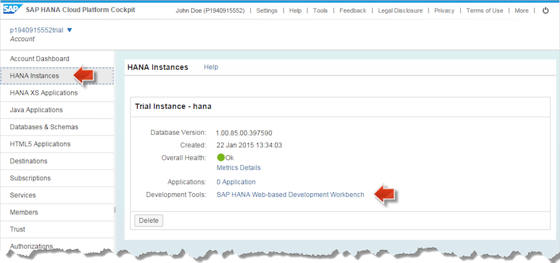

Once you begin the creation process, you will be redirected to an events tab.

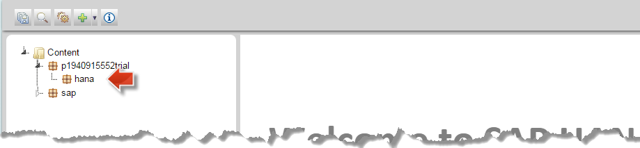

Remember the instance runs for a limited time, so if you have to come back later you may need to restart it.

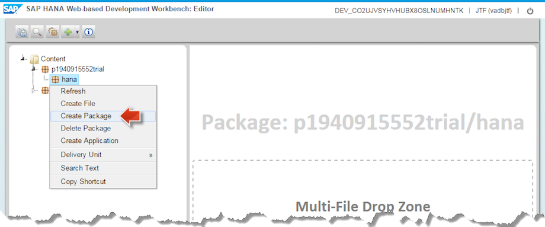

Just click start to restart it. Also note it’s only valid for 30 days.

#### 2 more steps before we hit the editor

You'll need to click on the "Admin Cockpit" first to trigger the authorizations you will need going forward.

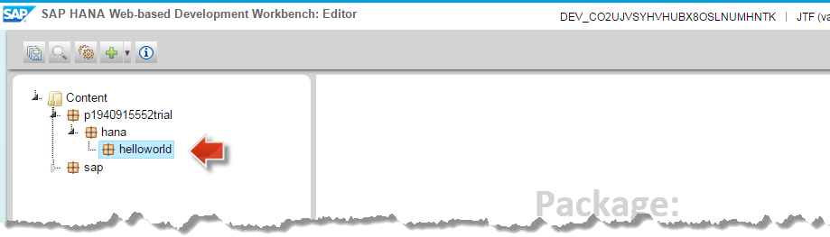

Once your authorizations have applied, you should then select the "Manage Roles and Users".

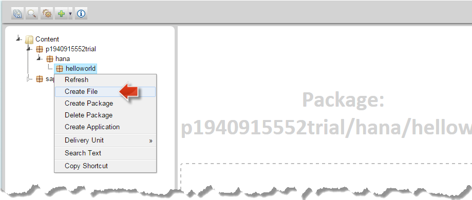

Here you can create a new user, this is recommended so you do not risk the "SYSTEM" user.

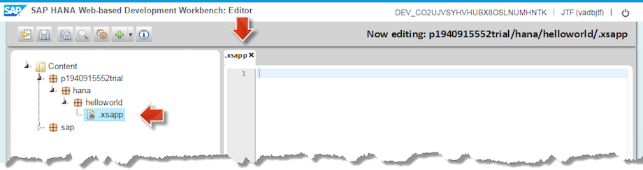

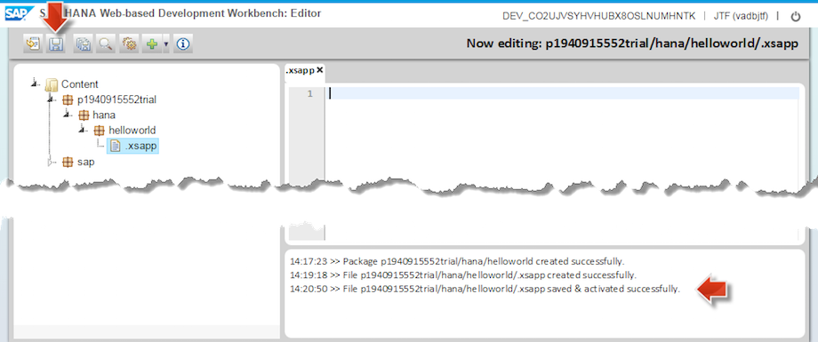

Now simply apply new roles to the user to give this user the appropriate authorizations to begin developing.


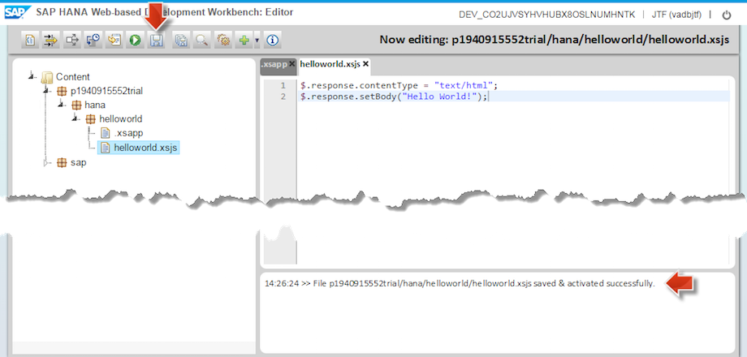

With that completed we can now log into the "SAP HANA Web Based Development Workbench"

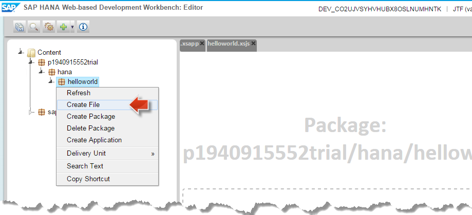

You are now in the Editor and can immediately start developing in HANA.

#### Using HANA on Amazon AWS or Microsoft Azure
Access the web page of your HANA server using the IP address of your server. Enter the address ```http://XXX.XXX.XXX.XXX``` to the address bar of your browser. (Replace ```XXX.XXX.XXX.XXX``` with the IP address of your server.)

On the web page, there is a link in the middle column for **Web-Based Development Workbench**. Click this link to start the workbench.

###  Create Package for the Hello World Application
The first step to start developing a SAP HANA application with SAP HANA Web-based Development Workbench is to create a new package for the application.

Here we will create a package called `codejam`, Right-Click on the content folder on the left, and enter the package details.


Now you have a package that is waiting for your code, now we will Right-Click on the ```codejam``` package and choose ```Create Application```

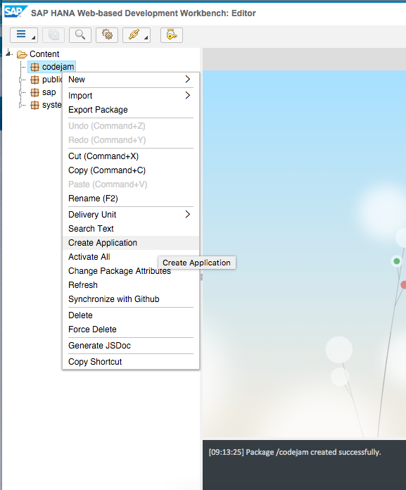

This step will generate 3 files, the `.xsapp`, `.xsaccess` and an `index.html`.

###  Now Create the "Hello World" Application
Now is the time to actually create some application code. In SAP HANA XS application code essentially is JavaScript code provided in .xsjs files. Now such a file will be created.

Open the context menu of the ```helloworld``` package by right-clicking on the name and choose Create File. Enter ```helloworld.xsjs``` as file name and save with Enter:

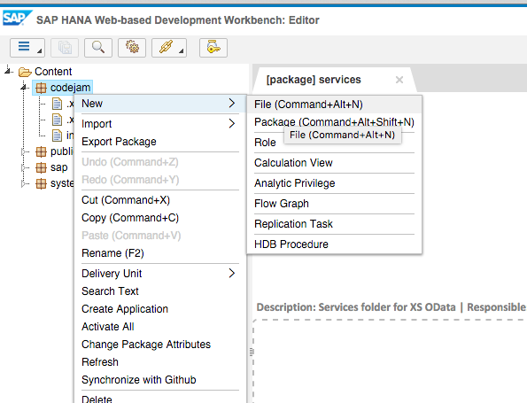

The new empty file is now open in the Editor:

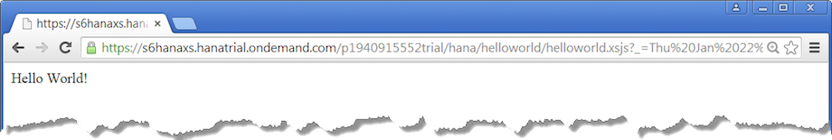

Copy and paste this code to the just created ```helloworld.xsjs``` file:

```js
$.response.contentType = "text/html";
$.response.setBody("Hello World!");
```

Save the file using the Save button or by pressing ```ctrl+s```. Again, the successful save is confirmed in the console.

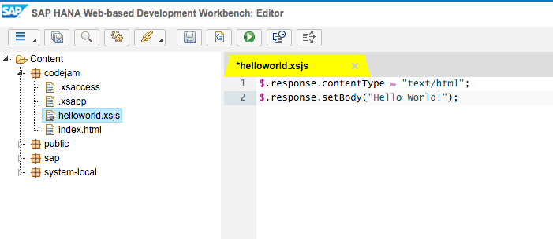

###  Deploy, Run and Test the Application
Now the application is ready to be tested. As you are developing with the SAP HANA Web-based Development Workbench the application is already deployed and activated to your SAP HANA Trial Instance. So you can immediately continue to test it:

Select the ```helloworld.xsjs``` file to enable the Run on Server in the toolbar. Then click the Run on Server button:

The application will open in your browser and greet you with Hello World:

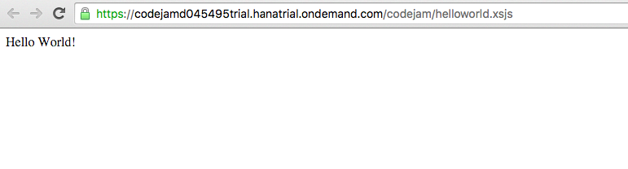

Congratulations: You just have your first own native SAP HANA application running on SAP HANA Cloud Platform!

### Related information
[SAP HANA Development Information - official documentation](http://help.sap.com/hana_platform#section6)


## Next Steps
Make your very first steps to access data on HANA. This tutorial will write a native HANA application, using the Web-based Development Workbench.

[Hello Data! Access your first Data from a native SAP HANA Application using the SAP HANA Web-based Development Workbench](http://go.sap.com/developer/tutorials/hana-data-access-authorizations.html)
