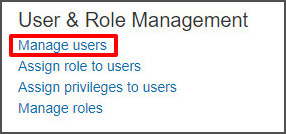
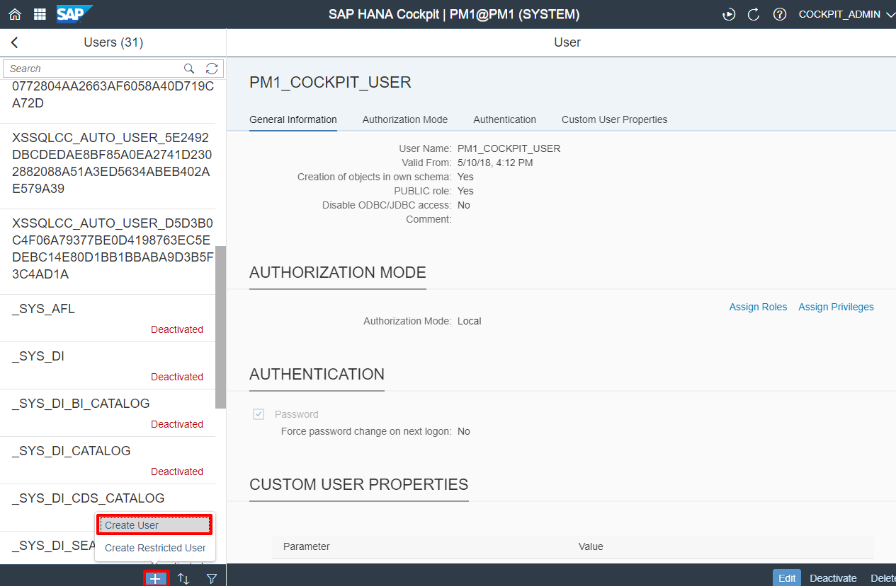
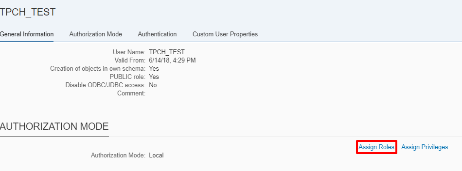
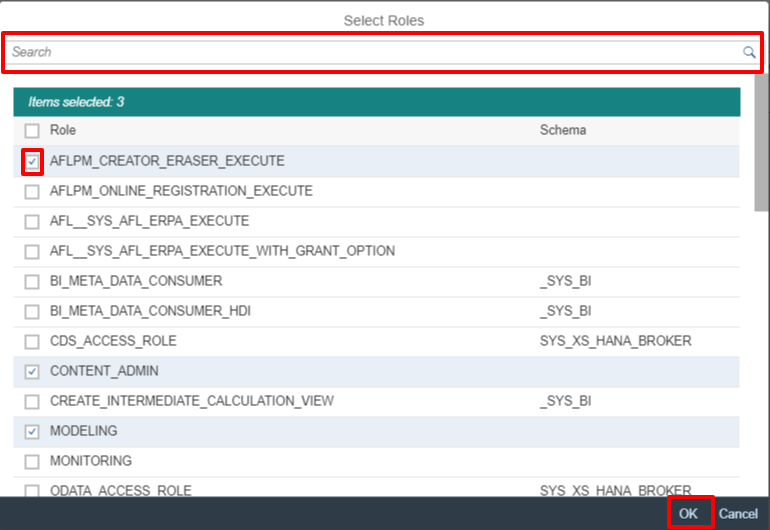
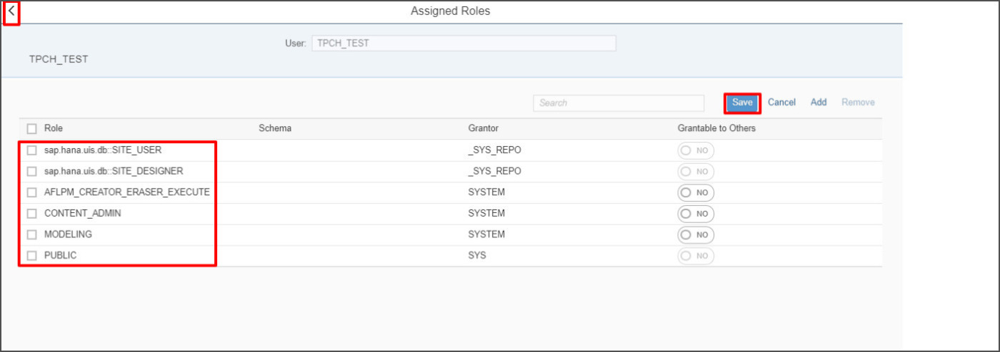
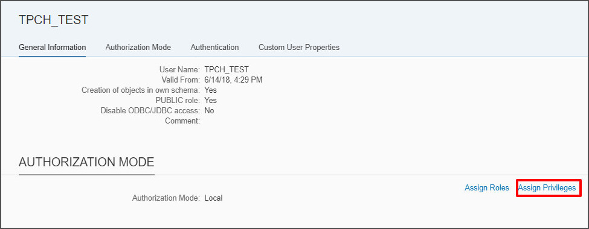

## Prerequisites  
 - **Proficiency:** Beginner
 - **System:** Access to an SAP HANA 2.0 system with the optional SAP HANA dynamic tiering component installed.
 - **Credentials:** Connection details to initially connect to the tenant database as the tenant `SYSTEM` user.
 - **Access** Access to SAP HANA cockpit for the SAP HANA system that data tiering is running on and which you will be working with.

## Details
### You will learn  
* How to create users in the database (and to create the TPCH schema used throughout the guide).
* How to assign roles and privileges (permissions) to users.

### Time to Complete
**10 Min**

---

[ACCORDION-BEGIN [Step 1: ](Create the TPCH user)]
We will begin by creating a new user which we will use throughout the tutorial. To do so, we must use HANA Cockpit. Login to HANA Cockpit, click the **Resources** link at the top, and select the appropriate resource, which should be a SAP HANA Tenant Database.

Scroll to the **User and Role Management** section, and click the **Manage Users** link.

At the bottom left, click the blue "+" button and select **Create User**.

In the new window, enter `TPCH` as the username, and select **password** for *Authentication Mechanism*, and type in a password. The password requirement is at least one capital letter, one lowercase letter, and one digit. Select **No** for *Force password change on next login* and keep the other options as default.

> Remember the password as you will need it to login as the TPCH user.

Click the **Save** button at the bottom-right to add the user.

[DONE]

[ACCORDION-END]

[ACCORDION-BEGIN [Step 2: ](Assign roles and privileges to the TPCH user)]
Once the TPCH user is created, you will be redirected to a screen featuring this new user. Under **Authorization Mode**, click **Assign Roles**.

Click **Edit**, followed by **add** on the new window. Here, you can assign roles to the TPCH user. Search and assign **all** the following roles by clicking the checkbox beside them. Hit **OK** when you are done.
* `AFLPM_CREATOR_ERASER_EXECUTE`
* `CONTENT_ADMIN`
* `MODELING`
* `sap.hana.uis.db::SITE_DESIGNER`
* `sap.hana.uis.db::SITE_USER`

Confirm you have added all the roles, and hit **Save** followed by the back arrow.

Next, we will add the required privileges by clicking the **Assign Privileges** link under the **Authorization Mode** heading (same as before).

Follow the same steps as you did for assigning roles, and assign **all** of the following privileges:
* `EXTENDED STORAGE ADMIN`
* `IMPORT`
* `CATALOG READ`

[DONE]

[ACCORDION-END]

[ACCORDION-BEGIN [Step 3: ](Additional information)]
We will use this `TPCH` user through the tutorial. In the following tutorial, we will create extended storage to get started with dynamic tiering.

[VALIDATE_1]

[ACCORDION-END]

---
