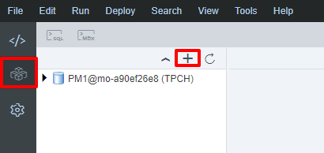
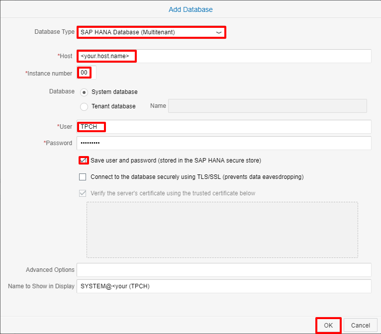
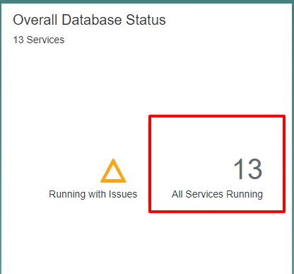
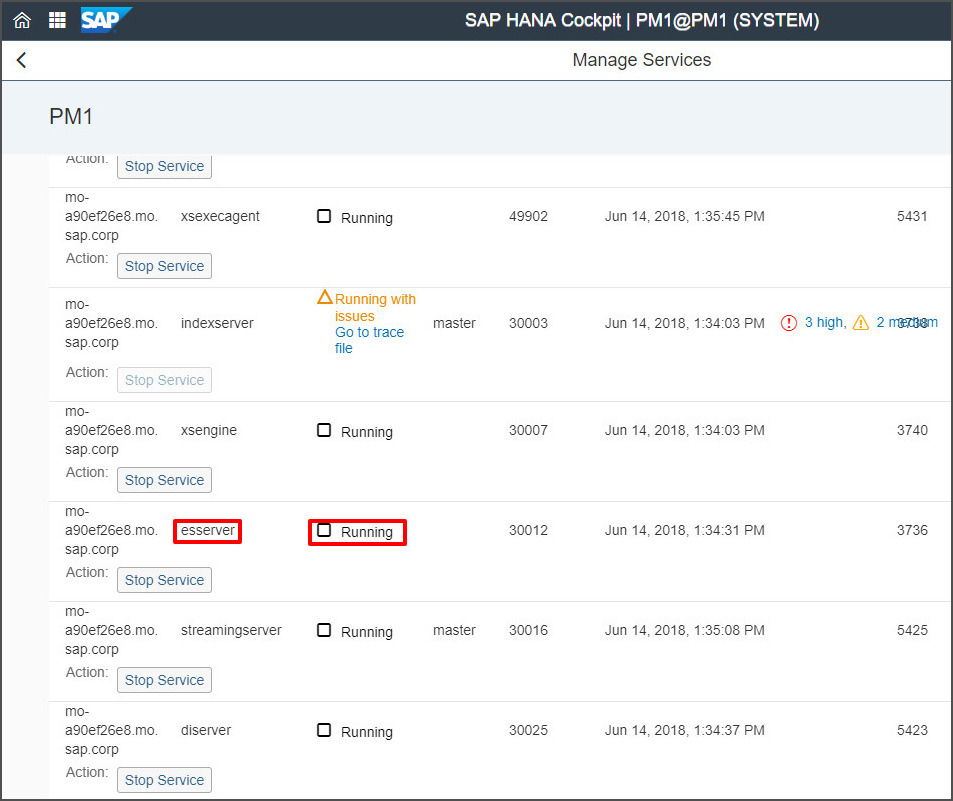
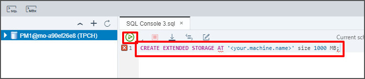

## Prerequisites  
 - **Proficiency:** Beginner
 - **System** Access to SAP Web IDE for the HANA System you are working with.
 - **Tutorials:** [Create a New User and Assign Permissions](https://developers.sap.com/tutorials/hana-webide-dt-getting-started-1.html)

## Next Steps
 - **Tutorials:** [Create Tables and Import Data](https://developers.sap.com/tutorials/hana-webide-dt-getting-started-3.html)

## Details
### You will learn  
* How to connect to a SAP HANA database.
* How to verify the status of SAP HANA dynamic tiering.
* How to create extended storage for the dynamic tiering host.

### Time to Complete
**15 Min**

---

[ACCORDION-BEGIN [Step 1: ](Connect to a SAP HANA database)]
Open and login to Web IDE. You should be greeted to a blank-looking screen. Click on the Database Explorer tab on the left, and click the "+" button in the new panel.



1. In the new window, select **SAP HANA Database (Multitenant)** as the database type.
2. Enter the **host name** and **instance number** of your HANA instance.
3. Login with the appropriate credentials for the **TPCH** user we created.
4. Check the **save user and password** box so you won't have to re-enter your credentials when re-connecting to the system.
5. Click OK to add the database.



[DONE]

[ACCORDION-END]

[ACCORDION-BEGIN [Step 2: ](Verify extended storage status)]
To verify extended storage status, we will be using SAP HANA cockpit. Login to SAP HANA cockpit, click the *Resources* link at the top, and select the appropriate resource, which should be the tenant database in the HANA System you are working with.


In the *Overall Database Status* tile (at the top), click on the area indicating the running services.



A *Manage Services* window should pop up. Scroll down to the `esserver` service to see its status. If what you see is:

* Empty and/or the "SAP HANA dynamic tiering" line does not exist, it probably means that dynamic tiering is not installed. Please install and register dynamic tiering before proceeding.
* Status of "Errors" with a red circle. It might mean that dynamic tiering is not running. Please restart the dynamic tiering process before proceeding.
* Status of "Installed but not running yet" with a yellow triangle, then proceed to Create Extended Storage section below.
* Status of "Running" with a green box, then you are all set and can skip the rest of this tutorial section by scrolling to the bottom of this lesson and clicking the link to part 3.



[VALIDATE_1]

[ACCORDION-END]

[ACCORDION-BEGIN [Step 3: ](Create extended storage)]
In Web IDE, right click on the database you are working with, and select *Open SQL Console* or use the shortcut *Ctrl + Alt + C*.


In the SQL console, paste the following script:
```SQL
CREATE EXTENDED STORAGE AT '<your.machine.name>' size 1000 MB;
```
Replace "<your.machine.name>" with the host name of the machine where the dynamic tiering component is installed.

> This script will create 1 GB of `dbspace`. This is small for DT (warm store) which can scale up to handle 100 TB of data, but 1 GB is sufficient for tutorial purposes.



Execute the script using the green play button. It will create the extended storage `dbspace` for SAP HANA dynamic tiering. Repeat step 2 to verify that extended storage is setup successfully.

[DONE]

[ACCORDION-END]

[ACCORDION-BEGIN [Step 4: ](Additional information)]
The `CREATE EXTENDED STORAGE` statement creates the warm store and the required `dbspaces`. A `dbspace` is a logical name for a container of files used to store the dynamic tiering table data and related objects. `Dbspaces` are specialized to manage specific types of data. Types of `dbspaces` used by dynamic tiering include `ES_SYSTEM`, `ES_USER`, `ES_DELTA` etc. Creating the extended storage `dbspace` is a prerequisite to creating extended tables.

[DONE]

[ACCORDION-END]

